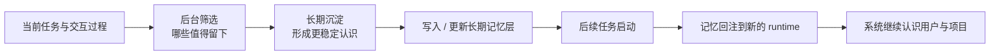
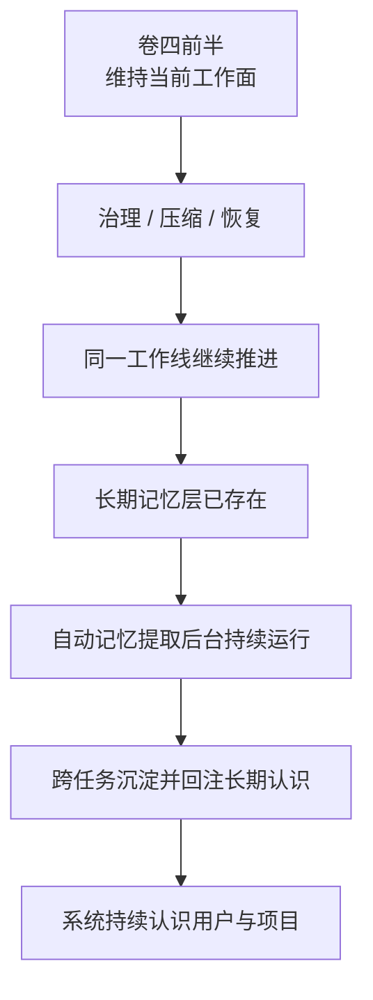

# 卷四 12｜为什么自动记忆提取不是小功能，而是系统持续性的后台 runtime

## 导读

- **所属卷**：卷四：上下文与状态怎么维持系统持续工作
- **卷内位置**：12 / 12
- **在长期记忆组中的位置**：04 / 04
- **上一篇**：[卷四 11｜MEMORY.md / memdir 为什么不是普通文件，而是正式长期记忆层](./11-why-memory-md-and-memdir-are-a-formal-long-term-memory-layer.md)
- **下一篇**：无；这是长期记忆组收口篇

到上一篇为止，长期记忆组已经完成了三步：拆掉 memory ≠ context 的误解、拆开三层连续性容器、把 `MEMORY.md` / memdir 立成正式长期记忆层。

这一篇只再往前推进一步：**自动记忆提取补上的从来不是“记笔记更方便”这件小事，而是“系统怎样在后台持续筛选、沉淀、回注，让它对用户与项目的认识可以跨任务不断延续”。**

## 这篇要回答的问题

> **为什么自动记忆提取不是“顺手存点笔记”的便利功能，而是 Claude Code 持续性架构里必须存在的一条后台运行链？**

先给本篇结论：

> **自动记忆提取的本质，不是替用户多存一份记录，而是在后台持续做筛选、沉淀、回注，让长期记忆从静态载体变成持续参与 runtime 的动态层；Claude Code 也因此不只会维持当前工作面，还会跨任务持续认识用户与项目。**

## 先把最短判断摆出来：没有自动提取，长期记忆更像人工外挂

如果长期记忆只能靠用户手工维护，它当然仍然有价值，但它更像一种外挂层：

- 用户自己决定什么时候写
- 用户自己决定写什么
- 用户自己决定哪些内容值得保留
- 系统主要扮演“读入已有笔记”的角色

这种模式能说明长期记忆**存在**，却还不足以说明长期记忆已经成为系统持续性的正式一半。因为系统并没有持续地主动经营这层认识，它更像在需要时借用一份外部说明。

一旦自动记忆提取成立，情况就不一样了。系统开始自己承担三个持续动作：

1. **筛选**：不是所有发生过的内容都值得留下。
2. **沉淀**：被留下的不是原始流水，而是更稳定的长期认识。
3. **回注**：这些认识之后还会重新进入新的运行时，影响后续任务怎么开始、怎么理解、怎么继续。

只要这三步连起来，长期记忆就不再只是“那里有一份文件”，而是“后台一直有一条链在维护系统对用户和项目的认识”。

## 自动记忆提取真正补上的，不是记录能力，而是认识连续性

这里最容易犯的错，是把自动提取理解成自动存档。

自动存档解决的是：

- 过去别丢
- 资料可追溯
- 以后还能翻回来

但这些更接近 transcript 或档案层的问题。

自动记忆提取解决的则是另一类问题：

- 过去发生的事情里，哪些已经足够稳定，值得跨任务留下
- 用户习惯、项目约束、偏好和长期事实里，哪些应该成为之后工作的默认前提
- 系统怎样避免每次换任务时都像第一次认识这个人、第一次进入这个项目

所以它并不是“自动帮你做会议纪要”，而是：

> **系统在后台持续判断，什么会变成以后仍然有用的长期认识。**

这一步一旦成立，Claude Code 的持续性就从“当前工作线能续上”继续抬高到“换了任务后仍然认得出来”。

## 用一张图把这条后台链压出来

这张图最重要的地方有两个。

第一，它把自动记忆提取放在**后台连续链**里，而不是某个 turn 结束后的装饰动作里。第二，它说明长期记忆的价值不在 C 或 D 单点，而在 **B → C → D → F** 整条链闭环：

- 只筛选不回注，长期记忆会变成冷存储
- 只回注不筛选，长期记忆会被噪音塞满
- 只写入不沉淀，长期记忆会退化成另一份原始记录

所以自动记忆提取不是一个按钮，而是一条必须持续运转的后台 runtime。

## 为什么这件事必须在后台持续发生，而不是偶尔做一次

因为用户和项目不是静态对象，任务也不是单段完成。

同一个用户会不断暴露新的偏好、习惯、约束和工作风格；同一个项目会不断出现新的边界、决策、术语、约定和历史包袱。系统如果只在某个固定时刻“记一次”，很快就会出现两个问题：

- 记住的是过期认识
- 漏掉的是后来真正重要的稳定事实

也就是说，长期记忆不是“建立一次就完工”的设施，而更像一层持续维护的认识面。自动记忆提取之所以必须后台化，是因为它面对的对象本身就在变化。

把它压成一句最短的话就是：

> **当前工作面的连续性，可以靠一次次续接维持；长期认识的连续性，则必须靠后台不断更新。**

这也是为什么本篇要把“自动记忆提取”收口成 runtime，而不是 feature。feature 更像一次性触发；runtime 则意味着系统一直背着这份职责在跑。

## 这一组最后补上的，是“怎么把认识接下去”

卷四前八篇更偏向解释：当前工作线为什么不会一轮即散、当前可工作的上下文面怎样被组织、历史变长后怎样治理、压缩、恢复、续接。它们回答的都是：**当前工作怎么继续。**

而长期记忆组四篇连起来，补的是另一半：系统不只要维持当前工作面，还要保留对用户与项目的长期认识；这些认识不只要有载体，还要能被后台持续生成、更新，并带回后续 runtime。

所以本篇收口后的卷四总判断，应该从单层连续性升级成双层连续性：

1. **工作连续性**：让同一条工作线还能继续干。
2. **认识连续性**：让系统跨任务还认得这个人和这个项目。

自动记忆提取补上的，就是第二层连续性的后台机制。

## 自动提取一旦成立，长期记忆就从“可用资料”变成“运行中的系统能力”

这是本篇最关键的一句中间判断。

只要长期记忆还停留在“有资料可读”，它就更像资源；只要自动提取开始持续运转，长期记忆就会变成能力。因为此时系统不只是拥有内容，而是拥有了：

- 持续识别长期价值的能力
- 持续更新长期认识的能力
- 持续把这些认识带回新任务的能力

这三种能力合在一起，才构成“系统持续认识用户与项目”。

也因此，自动提取真正改变的不是存储形式，而是系统形态：Claude Code 不再只是把一个个任务做完，而是在任务之间持续积累可复用认识。

## 这篇先不把它扩成完整 automation 子系统

到了这里，读者很自然会继续追问触发、调度、冲突和治理细节。但本篇不往那个方向膨胀，因为一旦全面展开，文章就会迅速偏成“自动化子系统设计说明”。

这里要守住的只有一个更高层判断：

> **自动记忆提取之所以重要，不在于它有多少调度细节，而在于它把长期记忆从静态对象层推进成了后台运行层。**

同样地，后台 runtime 并不意味着无边界乱记；相反，正因为它是后台持续链，它才更需要被边界与治理约束。但这篇只点到这里，不把全部策略分支写成白皮书。

## 用一张总图把卷四的收口结构画出来

这张图想留下的不是“卷四后面多了一个新 feature”，而是：卷四到这里，系统持续性终于完整了一圈。

- 前半圈在处理**当前工作还能不能继续**
- 后半圈在处理**跨任务认识还能不能继续**

没有前者，系统会在当前工作里失焦；没有后者，系统每换任务都要重新认识对象。Claude Code 想成为持续工作者，两半都不能少。

## 边界：这篇不再展开什么

### 1. 不再重讲三层记忆分工

第二篇已经把 working memory、transcript、long-term memory 拆开。本篇只讨论长期记忆怎样从对象层走向后台 runtime，不回头再做一次分层教学。

### 2. 不把它扩成完整 automation / control plane 总论

本篇承认后台链存在，但不把触发器、调度器、冲突合并、监控指标全部写完。这里要的是架构判断，不是子系统规格书。

### 3. 不细讲所有安全策略分支

本篇只点到“后台持续链一定需要治理边界”，不在这里展开全部权限、作用域、污染控制和回滚策略。

## 一句话收口

> **自动记忆提取不是顺手帮用户记笔记，而是在后台持续做筛选、沉淀、回注，让长期记忆不断回到新的 runtime；它补上的不是便利性，而是 Claude Code 跨任务持续认识用户与项目的系统能力。**
