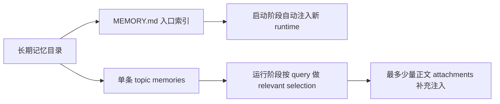

# 卷四 13｜长期记忆是按什么边界回注到新 runtime 的

## 导读

- **所属卷**：卷四：上下文与状态怎么维持系统持续工作
- **卷内位置**：13 / 13
- **在长期记忆组中的位置**：05 / 05
- **上一篇**：[卷四 12｜为什么自动记忆提取不是小功能，而是系统持续性的后台 runtime](./12-why-automatic-memory-extraction-is-a-background-runtime-for-system-continuity.md)
- **下一篇**：无；这是长期记忆组当前实现判定篇

上一篇把长期记忆收口成了一条后台 runtime：系统会持续筛选、沉淀、回注长期认识。但如果文章停在这里，读者还是会自然多问一步：**这些长期记忆，后来到底是怎么回到新的运行时里的？**

很多人会下意识想成一种“整库回灌”模型：只要新 session 启动，系统就把 memory 全量正文重新塞回去。可从当前代码能证到的实现看，Claude Code 走的不是这条路。

它更像两段式回注：

1. **启动阶段**，先把 `MEMORY.md` 这种入口索引放进当前 runtime；
2. **运行阶段**，再根据当前 query，从 memdir 里挑出少量相关记忆正文补充注入。

这意味着长期记忆并不是“新会话一开就全量回灌”，而是**先给入口，再按相关性少量补正文**。

## 这篇要回答的问题

> **Claude Code 的长期记忆，是按什么边界回注到一个新的 runtime 里的？**

先给结论：

> **从当前代码看，Claude Code 默认自动回注的不是整个 memory 正文库，而是 `MEMORY.md` 入口索引；单条记忆正文只会在运行阶段按 query 做 relevant selection 后，最多少量补充注入。相关性至少受三类边界约束：作用域边界、长期价值边界、当前任务相关性边界。**

## 先把最短判断钉住

如果只记一句话，可以记成：

> **新 runtime 先拿到的是长期记忆的索引入口，不是全文仓库；正文只有在当前任务真的需要时，才会被相关性选择器少量带回。**

这句话对应的，正是代码里的两段不同链路：

- 一条在 `src/context.ts` / `src/utils/claudemd.ts`，负责启动期的记忆入口注入；
- 一条在 `src/utils/attachments.ts` / `src/memdir/findRelevantMemories.ts`，负责运行期的 relevant memories 补充注入。

## 先看启动阶段：自动进入新 runtime 的，首先是 `MEMORY.md` 入口索引

这一层最关键的证据在 `src/context.ts`。

`getUserContext()` 会调用：

1. `getMemoryFiles()`
2. `filterInjectedMemoryFiles(...)`
3. `getClaudeMds(...)`

然后把结果作为 `claudeMd` 放进 user context，一起预置到会话前缀里。

也就是说，**启动阶段确实存在一条“自动注入长期记忆”的链**。但接下来要看，注入的到底是什么。

### 证据一：`getMemoryFiles()` 并不会把整个 memdir 全扫进来

在 `src/utils/claudemd.ts` 里，`getMemoryFiles()` 前面会收集 Managed / User / Project / Local 等记忆文件；而到了 auto memory 这块，它做的是：

- 通过 `getAutoMemEntrypoint()` 定位入口文件；
- 调用 `safelyReadMemoryFileAsync(getAutoMemEntrypoint(), 'AutoMem')`；
- 读到后把这个 entrypoint 加入结果集。

这里的关键是：**它读的是 entrypoint，也就是 `MEMORY.md`，不是把 memdir 里所有 topic files 全都并入 `getMemoryFiles()`。**

这个判断还能从另一处反证：`scanMemoryFiles()` 在 `src/memdir/memoryScan.ts` 里专门扫描 memory 目录下的 `.md` 文件时，明确排除了 `basename(f) !== 'MEMORY.md'`。这说明代码里从一开始就把两类对象拆开了：

- `MEMORY.md` 作为入口索引；
- 其他单条记忆文件作为后续候选正文。

### 证据二：`MEMORY.md` 被明确当成 index，而不是正文承载体

`src/memdir/memdir.ts` 里 `buildMemoryLines()` 的说明写得很直白：

- `Step 2 — add a pointer to that file in MEMORY.md`
- ``MEMORY.md is an index, not a memory``
- ``Never write memory content directly into MEMORY.md``
- ``MEMORY.md is always loaded into your conversation context``

这几句连起来，已经把启动阶段的对象形态说死了：

1. `MEMORY.md` 是入口索引；
2. 单条 memory 正文应该在各自独立文件里；
3. 自动进入 conversation context 的是这个索引。

再往下一步，`truncateEntrypointContent()` 还专门对 `MEMORY.md` 做行数和字节截断，警告里甚至明确说：

> keep index entries to one line under ~200 chars; move detail into topic files

这其实更进一步证明：**系统预设的启动注入对象，就是一个紧凑索引，而不是把详细正文全塞进 prompt。**

### 证据三：`getClaudeMds()` 注入的是读到的 memory files 内容，而 auto-memory 侧默认读到的就是 entrypoint

`getClaudeMds()` 会把 `memoryFiles` 里的内容包装成：

- `Contents of ...`
- 然后拼进统一的 memory instruction prompt

而在当前默认路径下，auto-memory 侧被放进 `memoryFiles` 的正是 `getAutoMemEntrypoint()` 读到的 `MEMORY.md`。所以新 runtime 自动拿到的，是**入口索引文本**，不是所有 memory topic files 的正文合集。

## 所以第一层边界已经很明确：不是“新 session 启动就全量回灌所有 memory 正文”

到这里，可以先把最容易误解的判断直接钉住：

> **从当前代码证据看，Claude Code 并不会在新 session 启动时把 memdir 下所有长期记忆正文全量回灌进 runtime。默认自动进来的，是 `MEMORY.md` 入口索引。**

这件事非常关键，因为它说明长期记忆回注不是“把历史认识整库抬回模型”，而是先把一层可导航的入口重新带回当前工作面。

## 再看运行阶段：单条记忆正文是按 query 做 relevant selection 后少量补充注入

如果启动阶段只有索引，那单条记忆正文什么时候回来？

答案在 `src/utils/attachments.ts` 和 `src/memdir/findRelevantMemories.ts`。

### 证据一：正文补充走的是 attachment 链，而不是启动时的全量预装

`src/utils/attachments.ts` 里有一条很明确的链：

- `startRelevantMemoryPrefetch(...)`
- `getRelevantMemoryAttachments(...)`
- `findRelevantMemories(...)`
- `readMemoriesForSurfacing(...)`
- 最后返回 `{ type: 'relevant_memories', memories }`

这说明相关记忆正文的进入方式，不是启动期统一塞进 system/user context，而是**在运行阶段以 attachment 形式补充进来**。

### 证据二：`findRelevantMemories()` 明确排除了 `MEMORY.md`

`findRelevantMemories()` 的注释写得非常关键：

- “Find memory files relevant to a query”
- “Returns ... the most relevant memories (up to 5)”
- “Excludes `MEMORY.md` (already loaded in system prompt)”

这里其实把整套回注逻辑分层写死了：

- `MEMORY.md` 已经在前面那层里了；
- relevant selector 处理的是其他 memory files；
- 而且不是全选，是 `up to 5`。

也就是说，**正文补充不是索引再打一遍，而是在索引之外，按 query 从候选记忆文件里再挑最多 5 条。**

### 证据三：真正注入前还会再次限量读取

就算进入 relevant 选择流程，被选中的正文也不是无限制塞进去。

`readMemoriesForSurfacing()` 会对每条记忆做：

- `MAX_MEMORY_LINES`
- `MAX_MEMORY_BYTES = 4096`
- 超限就附一个 truncation note

并且附件整体也有会话总量节流。`attachments.ts` 里相关注释直接写了：

- 5 × 4KB 作为单轮聚合边界；
- session 累积字节达到阈值后就停止 prefetch；
- 已经 surfacing 过的内容会被去重。

这说明 relevant-memory 注入在实现上是**严格的少量、限长、去重、按轮补充**，而不是“找到相关就把整篇库往里倒”。

## 用一张图把“索引注入”和“正文补注”拆开

```mermaid
flowchart TD
    A[新 session / 新 runtime 建立] --> B[getUserContext]
    B --> C[getMemoryFiles]
    C --> D[getAutoMemEntrypoint -> MEMORY.md]
    D --> E[getClaudeMds 注入入口索引]
    E --> F[当前任务继续推进]
    F --> G[startRelevantMemoryPrefetch]
    G --> H[findRelevantMemories(query)]
    H --> I[最多挑少量单条记忆正文]
    I --> J[relevant_memories attachments 注入]
```

这张图最重要的地方，是把两种“回注”彻底拆开：

- **启动阶段的索引注入**：把 `MEMORY.md` 带回来，让新 runtime 重新获得长期记忆入口；
- **运行阶段的正文补充注入**：根据当前 query，少量带回真正相关的单条记忆文件。

如果不把这两段分开，读者就很容易把“长期记忆可回注”误听成“所有 memory 正文会在 session 启动时整体回灌”。

## 相关性到底按什么边界选？当前代码至少能证到三层

用户要求这里必须讲清的一点，是 relevant selection 不是玄学召回，而是至少受几类边界约束。按当前代码能证到的层次，至少可以落到三类。

## 第一类边界：作用域边界

这层边界，当前能从两组代码看出来。

### 1）路径与目录先限定了候选集合

`src/memdir/paths.ts` 里，auto memory 默认落在：

- `<memoryBase>/projects/<sanitized-git-root>/memory/`

而 `getAutoMemBase()` 又优先用 canonical git root。也就是说，**项目边界先决定了你进入哪个 memory 目录。**

这不是一个小细节。因为 relevant selection 根本不是对“全世界记忆”做搜索，而是先在当前项目对应的 auto-memory 目录里找候选。

### 2）特殊作用域还会进一步隔离目录

`attachments.ts` 里的 `getRelevantMemoryAttachments()` 还写得更具体：

- 如果输入里 @ 提到了 agent，就只搜索该 agent 的 memory dir；
- 否则才搜索默认 auto-memory dir。

注释原文甚至直接写了：`search only its memory dir (isolation)`。

这说明 relevant recall 不是单一大池，而是**先按作用域切候选池，再做相关性选择**。

### 3）memory type 本身也在表达作用域/适用边界

`src/memdir/memoryTypes.ts` 给 memory 规定了 `user / feedback / project / reference` 四类，并且在 combined 模式里还明确写出 private / team 的 scope 规则。哪怕当前 `findRelevantMemories()` 本身没有直接读取一个独立 `scope` 字段，`scanMemoryFiles()` 仍会读 frontmatter 里的 `type`，并把 `[type] filename: description` 交给选择器。

所以当前能稳妥说的是：**作用域边界至少通过“目录候选池 + 类型语义”两层影响 relevant recall。**

## 第二类边界：长期价值边界

并不是所有可写进 markdown 的东西都能变成 relevant memory 候选。长期价值边界主要来自 `src/memdir/memdir.ts` 与 `src/memdir/memoryTypes.ts` 对“什么算 memory”的定义。

### 1）记忆类型被限制在四类长期认识上

`memoryTypes.ts` 开头就写了：memory 只保存**不能从当前项目状态直接推导出来**的上下文。像 code patterns、architecture、git history、file structure 这些都不该存成 memory。

### 2）`WHAT_NOT_TO_SAVE_SECTION` 明确排除了短期和可导出信息

这里直接排除了：

- 代码模式和路径结构；
- git history；
- debugging fix recipes；
- 已经在 `CLAUDE.md` 里的东西；
- `Ephemeral task details: in-progress work, temporary state, current conversation context`。

这就说明能进入长期记忆层的，不是“当前对话里一切出现过的东西”，而是**经过长期价值过滤后仍然值得跨任务保留的认识**。

换句话说，relevant selection 的候选集本身就已经被长期价值边界预筛过一轮了。

## 第三类边界：当前任务相关性边界

这是 `findRelevantMemories()` 最直接在做的事。

### 1）选择器的输入就是当前 query

`findRelevantMemories(query, memoryDir, signal, recentTools, alreadySurfaced)` 的第一个参数就是 query。它先调用 `scanMemoryFiles()` 扫描候选 headers，再把这些 headers 交给 `selectRelevantMemories()`。

### 2）选择依据不是全文 embedding，而是 filename + description + 当前 query

`scanMemoryFiles()` 只读每个 memory 文件前 30 行附近的 frontmatter，抽出：

- `filename`
- `description`
- `type`
- `mtimeMs`

然后 `formatMemoryManifest()` 会把它们格式化成：

- `[type] filename (timestamp): description`

再把这份 manifest 连同 `Query: ...` 一起交给 side-query 模型做选择。

因此当前代码能证实的是：**query-time 选择的直接依据，是候选记忆的文件名、描述、类型、时间信息，与当前 query 的匹配关系。**

### 3）选择器被要求“只选明确有用的，最多 5 条”

`SELECT_MEMORIES_SYSTEM_PROMPT` 里要求很明确：

- up to 5
- only include memories that you are certain will be helpful
- if unsure, do not include it
- if none clearly useful, return empty list

这套约束直接把 relevant recall 定位成“保守式少量召回”，不是“只要沾边都拿进来”。

### 4）最近成功使用过的工具文档还会被压制

同一个 prompt 还加了一条：如果最近已经在使用某些工具，就不要再优先选这些工具的 usage reference / API documentation memory，除非那条 memory 讲的是 warnings、gotchas、known issues。

这说明当前任务相关性不是纯关键词匹配，而是还会结合**当前工作态势**做噪音抑制。

## 这也解释了为什么“索引 + 少量正文”比“全量回灌”更像实现上的正确解

从实现角度看，这套设计其实很自然。

如果每次新 runtime 都把所有长期记忆正文全量回灌，会立刻遇到三个问题：

1. prompt 负担失控；
2. 和记忆本身的长期价值层混在一起，当前工作面会被噪音淹没；
3. 项目、agent、团队、个人等不同作用域也很难保持干净隔离。

而当前代码选择的是另一条路：

- **先用 `MEMORY.md` 保留导航入口和总体轮廓；**
- **再用 relevant selection 按 query 把真正需要的少量正文补进来。**

这正对应了一种更像 runtime 的设计：不是把长期记忆作为静态全量背景，而是把它作为**可按边界、按时机、按当前任务逐步回注**的层。

## 这里有一个必须说明的实现边界：当前代码里存在“跳过索引注入”的 feature-gated 分支

为了不把结论说过头，这里要把一个边界明确标出来。

在 `src/utils/claudemd.ts` 里，`filterInjectedMemoryFiles()` 会在 feature flag `tengu_moth_copse` 打开时，过滤掉 `AutoMem` 和 `TeamMem`，注释写的是：

> the `MEMORY.md` index is no longer injected into the system prompt

与此同时，`attachments.ts` 里的 `startRelevantMemoryPrefetch()` 也正是用同一个 flag 打开 relevant-memory prefetch。

所以当前代码能证到的最稳妥说法是：

- **默认主路径下**，新 runtime 自动进入的是 `MEMORY.md` 入口索引；
- **但代码里已经存在一个 feature-gated 变体**，会关闭索引注入，转而更依赖 relevant-memory attachment prefetch。

也就是说，本文讲的是**当前默认实现判定**，不是说代码库里完全不存在别的实验分支。

## 当前还能证到哪一层，不能硬说到哪一层

这里还要把“已经证实”和“还不能完全证死”的层次分开。

### 已经能证实的

1. **新 session 启动时不会全量回灌所有 memory 正文。**
   - `getMemoryFiles()` 读的是 `getAutoMemEntrypoint()`，不是整个 memdir。 
2. **默认自动进入 runtime 的是 `MEMORY.md` 入口索引。**
   - `buildMemoryLines()` / `getClaudeMds()` / `getUserContext()` 这条链能证实。 
3. **单条记忆正文是在运行阶段按 query 做少量补充注入。**
   - `findRelevantMemories()` + `readMemoriesForSurfacing()` + `relevant_memories` attachments 能证实。 
4. **相关性至少受作用域、长期价值、当前任务相关性三层边界约束。**
   - 目录/类型/保存规则/query selector 这几层都能落到代码。 

### 还不能完全证死的

1. **相关性排序的内部判分细节。**
   - 当前只能看到 selector prompt 和输入 manifest，看不到模型内部到底怎样权衡 filename、description、type、mtime。 
2. **“作用域”是否在 selector 内部被显式建模。**
   - 当前能证到目录候选池隔离与 type 语义影响，但 `findRelevantMemories()` 本身并没有独立 `scope` 字段。 
3. **默认路径在未来版本是否会被 relevant-prefetch 方案完全替代。**
   - 因为 `tengu_moth_copse` 已经显示出一条实验性替代路径。 

## 用一张总图收口



这张图真正想留下的判断是：**长期记忆回注不是一次性的整库恢复，而是分两段、按边界发生。**

- 第一段保住“系统重新知道去哪找长期认识”；
- 第二段保住“当前任务真正需要的那几条认识再回来”。

## 一句话收口

> **从当前代码看，Claude Code 把长期记忆回注做成了“启动期注入 `MEMORY.md` 索引 + 运行期按 query 少量补充相关正文”的两段式机制；它依赖的不是全量回灌，而是作用域、长期价值与当前任务相关性这三类边界。**
