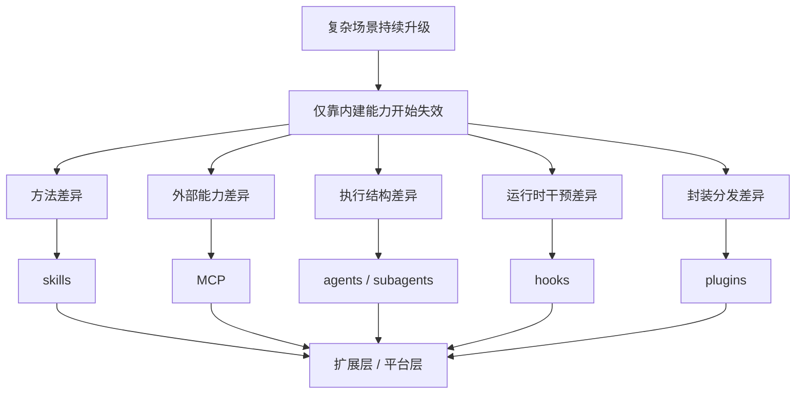

# 卷五 01｜为什么复杂场景会逼 Claude Code 长出扩展层

## 导读

- **所属卷**：卷五：扩展层与平台对象
- **卷内位置**：01 / 25
- **上一篇**：无
- **下一篇**：[卷五 02｜为什么 Claude Code 选择把扩展权交给用户](./02-why-claude-code-chooses-to-hand-extension-power-to-users.md)

这一篇不是对象总览，也不是开放平台宣言。它只先回答卷五的起点问题：

> **为什么复杂场景会逼 Claude Code 长出扩展层，而不是继续靠内建能力越堆越多来解决？**

卷五后面当然会分别讲 skills、MCP、agents / subagents、hooks、plugins，但在拆对象之前，得先把那股共同压力看清。

如果共同压力没立住，后面的对象很容易被写成名词表；共同压力一旦立住，后面的对象就会显出各自是在替系统分担哪一种复杂性。

## 先给结论

### 结论一：复杂场景不是边缘情况，而是 Claude Code 必须长期面对的常态

只要 Claude Code 进入真实工作，它面对的就不再是少数固定题型，而是会持续变形的现场：

- 不同项目有不同代码结构、交付流程和审查边界
- 不同团队有不同协作角色、验收方式和权限习惯
- 不同组织接的外部系统、知识系统、资源系统完全不同
- 同一任务走到一半，还会冒出新的能力缺口、新的执行分支和新的约束条件

这意味着 Claude Code 不能只回答“我现在会什么”，还得回答：

> **当现场继续变、继续长、继续分叉时，系统怎么继续长能力。**

### 结论二：内建能力再强，也覆盖不了复杂场景里的方法差异、能力差异、执行结构差异和运行时差异

内建能力当然重要。没有基本工具池、权限系统、上下文治理和主执行链，后面的扩展都无从谈起。

但内建能力有天然上限。产品团队可以把高频共性做好，却不可能提前预装完所有局部现实：

- 每个团队的做事方法
- 每个组织的外部系统
- 每类长任务的执行者结构
- 每条 runtime 链上的观察点、阻断点、注入点
- 更完整的封装、安装、治理和复用单元

所以复杂场景最后逼出来的，不是“再多加几个功能”这么简单，而是：

> **系统必须长出一层专门负责继续接入新方法、新能力、新执行者、新接缝和新封装的结构。**

### 结论三：扩展层不是补丁层，而是 Claude Code 开始平台化的地方

卷五后面那五类对象，看起来像五个栏目，其实是在承受五种不同压力：

- **skills**：承受“用户方法怎么进入系统”的压力
- **MCP**：承受“系统外部能力源怎么进入系统”的压力
- **agents / subagents**：承受“更多执行者怎么进入系统”的压力
- **hooks**：承受“运行时接缝怎么进入系统”的压力
- **plugins**：承受“更完整封装与分发怎么进入系统”的压力

所以扩展层不是零散附加能力，而是 Claude Code 从“会执行的系统”往“可持续长能力的平台”迈出的第一层结构。

## 先把卷五总图立住

这张图只想先说明一件事：

> **卷五不是从对象出发，而是从系统压力出发。**

skills、MCP、agents、hooks、plugins 不是平铺的功能项，而是系统在不同压力点上长出来的五种正式回答。

## 为什么卷三、卷四之后，系统一定会走到卷五

### 第一，能执行，不等于能适应

卷三重点解决的是：Claude Code 怎样把模型意图落到真实执行链上。工具怎么接入、动作怎么发生、结果怎么回流，这些都在那一卷里逐步立住了。

但“能执行”只说明系统会做事，还没说明它能不能面对新现场。

一个系统可以很会执行，却只会执行它原本认识的那几套能力。复杂场景真正加压的地方，不是让它把旧能力用得更勤，而是逼它面对：

- 新的方法
- 新的能力来源
- 新的执行者结构
- 新的运行时约束

于是系统必须继续往前长。

### 第二，能持续工作，不等于能持续扩展

卷四已经把另一件关键事情讲清了：Claude Code 不只是一次性问答，它能把 runtime 维持住，能接入外部能力，也能在关键事件点留下 hooks，还能把 plugin 做成统一扩展单元。

但卷四的主重心，仍然更偏向“这些东西怎样进入 runtime”。

卷五要追问的是更高一层的问题：

> **为什么 runtime 最终非得长出这一整层对象不可？**

也就是说，卷四更像在看接入链，卷五更像在看平台压力。

### 第三，复杂任务会把“系统之外的部分”持续逼进系统内部

简单任务很多时候只要：

- 一组内建工具
- 一段当前上下文
- 一个主执行者

复杂任务很快就不够了。它会逼系统面对下面这些要求：

- 某团队自己的工作方法要不要固定接进来
- 某企业自己的系统和资源要不要正式接进来
- 某段任务要不要切给另一个执行者
- 某些关键节点要不要强制检查、阻断、补上下文
- 一整组扩展能力要不要打包成正式交付对象

这些要求有个共同点：

> **它们都已经超出“再多加几个内建功能”能优雅解决的范围。**

这时，扩展层就不再是可选美化，而是系统必须长出来的第二组织层。

## 复杂场景到底复杂在哪

### 1. 复杂在“怎么做”本身并不统一

真实工作里，用户最有价值的往往不是某条单独指令，而是：

- 某类任务该怎么拆
- 哪些步骤必须先做
- 哪些风险需要提前兜住
- 什么结果才算完成

这就是方法层复杂性。

卷一 skills 线已经讲得很清楚：skill 在 Claude Code 里不是一段长 prompt，而是会被装成结构化 command、再由 `SkillTool` 接入 runtime 的能力单元。换句话说，系统已经在为“方法组织”留正式入口。

这说明光有动作原语还不够，系统还得让方法本身能够接入。

### 2. 复杂在能力来源不只在系统内部

卷四 MCP 线已经给出很清楚的源码感觉：Claude Code 不是把外部 server 直接裸塞给模型，而是走配置归并、连接、拉取 tools / prompts / resources，再翻译成内部能力对象。

这背后说明的是另一种复杂性：

> **很多关键能力天然就在系统外部。**

你不可能把所有企业系统、远程资源、知识接口、文档源都提前内建进产品本体。于是系统必须承认“能力源”会在外面，并为外部能力源进入 runtime 留出稳定接入层。

### 3. 复杂在一个执行者常常不够

卷一 AgentTool 那条线已经说明：agent 不是“再开一个对话框”，而是任务委派、执行环境、工具池和生命周期管理的总入口之一。

这意味着复杂任务不只是动作变多，而是执行结构本身开始分叉：

- 某段工作该不该委派
- 委派给谁
- 要不要 fork 出 worker
- 结果怎样回流主线

于是系统不只是在长能力，也是在长执行者谱系。

### 4. 复杂在 runtime 还需要正式接缝

卷四 hooks 线立住了另一个判断：hooks 不是附带脚本，而是事件驱动的运行时编排层。它们卡在 PreToolUse、PostToolUse、SessionStart、Permission 等关键事件点上，能继续、阻断、补上下文、改写输入输出。

这说明很多复杂场景要的，不只是“多一个功能”，而是：

> **在 runtime 链条的关键部位，系统得允许正式干预。**

如果没有这一层接缝，前面那些能力对象再多，也很难在复杂现场里被可靠治理。

### 5. 复杂在扩展内容最终还要被打包、治理和分发

卷四 plugin 线已经把这层讲得很透：plugin 不是 hooks 的壳，也不是扩展目录的别名，而是 commands、agents、skills、hooks、MCP / LSP、settings 的统一能力包与治理包。

这说明复杂场景最终还会提出第五种压力：

- 这些扩展内容能不能作为一个正式单元存在
- 能不能统一启停、校验、安装、更新、治理
- 能不能形成更成熟的分发与复用对象

这时，系统需要的就不再只是“接进来”，而是“把接进来的东西收成稳定单元”。

## 从源码抓手看，扩展层为什么已经不是抽象口号

这一篇虽然不拆细节，但卷五起手不能空讲，所以至少要保住几个源码抓手。

### 抓手一：`SkillTool` 说明 Claude Code 已经把“方法组织”做成 runtime 正式对象

卷一《SkillTool 是把 skill 接进 runtime 的桥》已经把桥位立得很清楚：skill 会走统一入口，被判断 inline 还是 fork，必要时还会接到 Agent 路径上。

这说明系统不是只会提供动作，还会把方法当对象处理。

### 抓手二：`AgentTool` / `runAgent` 说明 Claude Code 已经把“更多执行者”做成系统能力

AgentTool 不是开分身，而是任务委派原语。这里出现的已经不是一个会话小技巧，而是新执行者的装配、隔离、调度与回流问题。

这说明系统正在从单执行者结构往多执行者结构长。

### 抓手三：`mcp` 目录说明 Claude Code 已经承认“能力源在系统外部”

卷四 MCP 总入口那篇保住的最关键判断是：MCP server 会被翻译成 Tool / Command / Resource 能力包，再进入 runtime。

这不是给外部接口开后门，而是在正式建设外部能力总线。

### 抓手四：`hooks` 目录说明 Claude Code 已经承认 runtime 必须留接缝

hooks 的存在本身就在说明：很多复杂性不是“多一条动作”能解决的，而需要在关键生命周期事件上允许观察、限制、注入和改写。

### 抓手五：`plugins` 目录说明 Claude Code 已经承认扩展需要统一封装层

plugin 的 loader、policy、validation、install / update / marketplace 这些设计，说明系统不是想临时拼几个扩展点，而是要把扩展对象收成更成熟的平台单元。

把这五个抓手并排放回来看，就能得到这一篇最重要的判断：

> **扩展层不是哲学命题，而是源码里已经显形的一层系统结构。**

## 所以后面五类对象各自代表什么系统压力

这一段要先点到，但不提前偷吃后文正文。

### skills 代表“方法组织压力”

如果方法只能停留在用户脑子里或临时聊天里，系统每次都得重新猜。skills 这条线就是在替系统接住“怎么做”的复杂性。

### MCP 代表“外部能力源压力”

如果能力都得靠内建，系统很快就会被封死。MCP 这条线是在替系统接住“能力不只在内部”的现实。

### agents / subagents 代表“执行者扩张压力”

任务一大、分支一多、上下文一厚，单执行者结构会越来越吃力。agent 主轴是在替系统接住“谁来做”的复杂性。

### hooks 代表“runtime 编排压力”

复杂现场不仅要做成事，还要在关键位置观察、约束、介入。hooks 这条线是在替系统接住“什么时候能干预”的复杂性。

### plugins 代表“封装与分发压力”

扩展一旦不是个人手工 hack，而是要治理、复用、分发，就需要更高一级封装层。plugins 这条线是在替系统接住“怎样把扩展收成正式单元”的复杂性。

## 这一篇不展开什么

### 1. 不提前讲清每类对象的详细边界

那是第 03 篇的任务。这里先立系统压力，不把对象总地图正文偷写完。

### 2. 不展开各对象内部 call chain

skills、MCP、Agent 主轴、hooks、plugins 都会在后文逐组细拆，这里只保住起点判断和源码抓手。

### 3. 不转去讲命令入口、产品界面和卷六问题

卷五先立扩展层与平台对象，入口与整合层留给卷六。

## 和前后文的边界

### 它承接前四卷

卷一、卷三、卷四分别把 runtime、执行链、外部能力与接缝讲出了轮廓；卷五第一篇不再补局部，而是把这些局部重新收束成一个更大的系统问题：

> **复杂场景为什么会逼 Claude Code 长出扩展层。**

### 它导向第 02 篇

当我们承认扩展层是必然结果，下一步自然会变成另一个问题：

> **既然扩展不可避免，为什么 Claude Code 选择把扩展权交给用户，而不是继续把一切都押在官方内建上？**

这就是第 02 篇要回答的事。

## 一句话收口

> **复杂场景会逼 Claude Code 长出扩展层，因为真实工作不是固定题库，而是持续变形的现场：方法会变、能力源会变、执行结构会变、runtime 干预点会变、封装与分发形态也会变；内建能力只能覆盖共性，无法穷尽这些现场差异，所以系统只能把“继续长能力”正式做成一层结构，而这层结构就是卷五要讲的扩展层。**
