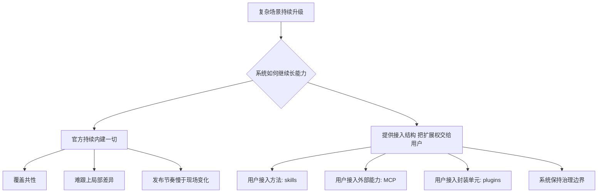

# 卷五 02｜为什么 Claude Code 选择把扩展权交给用户

## 导读

- **所属卷**：卷五：扩展层与平台对象
- **卷内位置**：02 / 24
- **上一篇**：[卷五 01｜为什么复杂场景会逼 Claude Code 长出扩展层](./01-why-complex-scenarios-force-claude-code-to-grow-an-extension-layer.md)
- **下一篇**：[卷五 03｜skills / MCP / agents / subagents / hooks / plugins 是怎样接入 Claude Code 的](./03-how-skills-mcp-agents-subagents-hooks-and-plugins-enter-claude-code.md)

第 01 篇已经把卷五的起点压力立住了：复杂场景会逼系统长出扩展层。

但扩展层出现以后，系统还有两条完全不同的路可走：

- 一条路是继续把扩展权握在官方手里，尽量靠产品团队不断内建
- 另一条路是把扩展权正式交给用户，让用户把自己的方法、能力、结构和封装接进来

Claude Code 选择的是后者。

这一篇就只回答一个问题：

> **为什么 Claude Code 不走“官方无限内建”的路，而选择把扩展权交给用户？**

## 先给结论

### 结论一：因为复杂场景的差异首先发生在现场，最先知道缺什么的人正是用户

产品团队当然能持续补强通用能力，但复杂场景真正痛的地方，往往不是“缺一项大家都缺的共性功能”，而是“这个现场现在就差一块只有当事人才知道的东西”。

用户最先知道：

- 这个团队真正按什么流程推进工作
- 这个组织必须接哪些内部系统和资源
- 这个任务该怎样拆、怎样验收、怎样回流
- 哪些约束是本地必须守住的

如果扩展权始终只握在官方手里，就会出现一个很别扭的结构：

> **最知道缺什么的人，没有权力把缺的东西正式接进系统。**

Claude Code 把扩展权交给用户，本质上是在消除这个结构性滞后。

### 结论二：因为产品真正该内建的，不是所有局部能力，而是“让差异可以被表达”的接入结构

复杂场景里有无限多局部现实。产品团队如果试图一个个内建，最后只会得到一个越来越重、越来越慢、越来越难维护的封闭系统。

Claude Code 的选择更像平台式选择：

- 官方负责把 runtime、边界、接入对象和治理层做稳
- 用户负责把自己的现实差异接进来

也就是说，真正该被内建的，不是所有扩展内容，而是：

> **方法怎么接、外部能力怎么接、执行结构怎么接、运行时干预怎么接、封装怎么接。**

### 结论三：所谓“把扩展权交给用户”，不是开放口号，而是把扩展权落实到一组具体对象上

这篇不能只喊“开放给用户”，必须点清楚：用户扩展权到底落在什么对象上。

至少落在这几类正式对象上：

- **skills**：让用户把方法、流程、角色结构接进来
- **MCP**：让用户把外部能力源与资源系统接进来
- **plugins**：让用户把多类扩展能力收成统一封装单元

第 03 篇会把总地图讲清，第 12-24 篇还会继续展开 agent、hooks 等对象；但就“为什么扩展权交给用户”这个问题来说，至少要先保住一条底线：

> **用户扩展权不是抽象权限，而是会落实到一组 runtime 里真的存在的对象接口上。**

## 先画出两条分岔路

这张图想说的不是“官方不好、用户更好”，而是：

> **面对复杂场景，中心化内建和平台化接入是两种完全不同的增长方式。**

Claude Code 选的是第二种。

## 为什么“继续靠官方无限内建”会遇到天花板

### 第一，官方能做的是共性，不是全部局部现实

产品团队最适合做的，是那些所有人都反复用到、而且适合统一抽象的东西：

- 基础执行链
- 工具调用框架
- 上下文治理
- 权限系统
- 统一扩展边界

这些都是平台底座，应当由官方承担。

但复杂场景里最难、也最值钱的那部分，常常并不属于共性层，而属于局部现实：

- 某公司自己的审批链
- 某团队自己的写作和评审方法
- 某项目自己的验证习惯
- 某组织自己的一组资源入口

这些东西不是不重要，恰恰是太重要、太现场、太多变，才不可能全部由中心化团队预装完。

### 第二，现场变化速度快过产品发布速度

复杂场景不是静态集合，而是不断长出新差异。

如果每出现一种新方法、新资源、新系统接入需求，都得等官方：

- 理解问题
- 排优先级
- 做设计
- 发版本

那么系统的适应速度就天然落后于现场变化速度。

而用户就在现场。

把扩展权交给用户，本质上是在把能力生长速度重新拉回现场，而不是让所有变化都排队等官方版本。

### 第三，官方越想包办一切，系统越容易变成巨大的内建堆叠物

只靠内建往前跑，会越来越像下面这种结构：

- 每多一种场景，就往本体里塞一层能力
- 每多一种差异，就再加一组开关和特殊逻辑
- 每多一种局部需求，就让产品本体继续膨胀

最后得到的不是强平台，而是沉重产品。

Claude Code 走另一条路：把差异正式外化，让平台本体重点负责结构、边界和治理，让内容增长更多发生在平台对象之上。

## “把扩展权交给用户”具体是把什么交出去

这一段必须说具体，不然很容易写成空话。

### 1. 把方法组织权交出去：skills

skills 这条线，对应的是“怎么做”进入系统。

卷一《SkillTool 是把 skill 接进 runtime 的桥》以及《skills 篇结语：skill 不是提示词而是能力单元》已经把这个判断立得很稳：skill 不是一段随意提示词，而是会被编译成结构化 command，再由 `SkillTool` 接进 runtime 的方法单元。

这意味着用户可以把下面这些东西正式编进系统：

- 任务拆分方式
- 流程步骤
- 角色化表达方式
- 验收标准
- 哪些时候该 inline，哪些时候该 fork

所以第一种被交出去的扩展权，不是“加功能”的权，而是：

> **把自己的工作方法稳定接入系统的权。**

### 2. 把外部能力接入权交出去：MCP

卷四《为什么在 Claude Code 里 CLI 加 skill 往往比铺太多 MCP 更实用》虽然主要在讲边界判断，但反过来也说明了一件事：Claude Code 已经正式承认“系统外部能力源”是 runtime 的一等问题。

卷四 MCP 总入口那篇更进一步说明：外部 server 会被归并、连接、拉取 tools / prompts / resources，再翻译成内部可消费的能力包。

这就意味着用户可以决定：

- 哪些外部系统该被接进来
- 哪些能力该暴露给当前 runtime
- 哪些资源应该成为当前工作链的一部分

这不是让用户乱接，而是把“系统外部能力如何正式接入”这件事交到用户手里。

### 3. 把统一封装权交出去：plugins

卷四 plugin 线已经把第三种权力也讲出来了：plugin 不是单一扩展点，而是 commands、agents、skills、hooks、MCP / LSP、settings 的统一能力包与治理包。

这意味着用户拿到的不只是“接一个局部能力”的权力，还包括：

- 把多类扩展能力收成一个单元
- 统一安装、启停、治理和分发
- 让扩展从本地手工 hack 升级为正式对象

也就是说，用户扩展权并不止于“我能写点东西”，还包括：

> **我能把扩展内容收成正式封装单元。**

## 为什么这不是“把问题甩给用户”

这件事最容易被误解，所以必须说清。

### 第一，交出去的是扩展内容权，不是基础责任

Claude Code 并没有把一切都扔给用户。官方仍然牢牢负责：

- 执行链
- 工具 runtime
- 权限与安全边界
- 上下文治理
- 扩展对象的接入结构
- 生命周期与治理能力

如果这些底座没立住，用户扩展只会变成更大的混乱。

所以正确理解不是“官方退出”，而是：

- 官方负责底座与边界
- 用户负责把现场差异接进来

### 第二，不给正式扩展权，用户也会扩展，只是方式更混乱

如果系统不给正式对象，用户一样会想办法扩展，只不过会退化成下面这些做法：

- 到处复制 prompt
- 手工拼命令
- 临时脚本横飞
- 靠记忆维持流程
- 靠聊天上下文临时传递规则

这类扩展不是没有，而是更隐蔽、更难治理、更难复用。

把扩展权正式交出去，反而能把这些零散做法收回到可见、可控、可治理的对象层里。

### 第三，平台真正交付的是“表达差异的空间”

复杂场景之所以复杂，就是因为现实本来不统一。

封闭产品的做法，是尽量要求现实去配合产品；平台型产品的做法，则是承认现实差异，并给这些差异留下正式入口。

Claude Code 走的是后一条路。

所以它交给用户的，不是“自己想办法吧”，而是：

> **你可以在我定义好的结构里，把自己的现实差异正式接进来。**

## 从旧文与源码抓手看，这个选择为什么已经不是空判断

### 抓手一：skills 线已经说明“方法权”被正式对象化了

只要看过 `SkillTool`、`loadSkillsDir` 和整条 skill 线，就很难再把 skill 理解成提示词装饰。它是方法单元，是 command 体系的一部分，也是 runtime 能正式调用的对象。

这说明 Claude Code 已经在把“用户怎么做事”正式收编进系统。

### 抓手二：MCP 线已经说明“外部能力权”被正式对象化了

MCP 不是外挂目录，而是被配置归并、连接管理、能力翻译、结果治理的一整层结构。

这说明 Claude Code 并不是偶尔允许用户接外部工具，而是已经把“用户把外部能力源接进来”做成平台能力。

### 抓手三：plugin 线已经说明“封装权”也被正式对象化了

plugin 的 loader、validation、policy、enable / disable、install / update、marketplace 这些部件，说明系统不是允许用户写点散装配置，而是允许用户把扩展做成正式治理对象。

把这三条放在一起看，就能得到这篇最重要的判断：

> **Claude Code 不是口头上把扩展权交给用户，而是已经把这份权力落成了方法对象、能力对象和封装对象。**

## 这一篇在卷五总线里到底立住了什么

### 第一，它把第 01 篇的“复杂场景压力”继续推进成了“平台分工选择”

第 01 篇只是说：复杂场景会逼出扩展层。

第 02 篇则进一步说：

> **扩展层一旦出现，最合理的增长方式不是官方继续无限内建，而是官方做结构，用户接现场。**

### 第二，它让后面的对象组不再像平白冒出来的名词

到了这里，skills、MCP、plugins 这些对象就不再只是“系统里有这玩意”，而是分别对应：

- 用户接入方法的权力
- 用户接入外部能力的权力
- 用户把扩展收成正式单元的权力

这样第 03 篇再画总地图时，图后面就有了明确前提。

## 这篇不展开什么

### 1. 不把 03 的对象接入总地图细讲完

这里先点清扩展权落在哪些对象上，但不提前把对象之间的 runtime 接入关系全部讲完。

### 2. 不展开具体对象正文

skills、MCP、plugins 各自的内部机制会在后面单独展开，这里只保住“为什么这些对象必须交到用户侧”的总体判断。

### 3. 不把它写成开放平台宣言

这篇不是价值观口号，而是结构性选择分析。

## 和前后文的边界

### 它承接第 01 篇

第 01 篇说明扩展层为什么必然出现；第 02 篇继续说明，扩展层为什么会把扩展权推向用户这一侧。

### 它导向第 03 篇

当“复杂场景逼出扩展层”和“扩展权交给用户”这两步都站稳之后，下一步就自然变成：

> **这些扩展权到底是通过哪些对象、以什么接入路径进入 Claude Code runtime 的？**

这就是第 03 篇。

## 一句话收口

> **Claude Code 选择把扩展权交给用户，不是因为官方不想继续做产品，而是因为复杂场景的差异首先发生在现场：最先知道缺什么的人正是用户；所以平台真正该内建的不是所有局部能力，而是让用户把自己的方法、外部能力和扩展封装正式编进 runtime 的对象结构与治理边界。**
