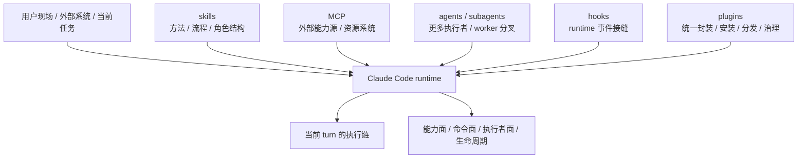
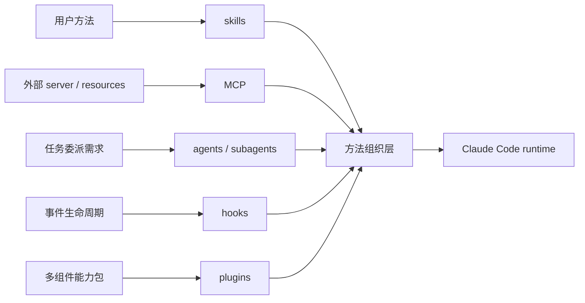

# 卷五 03｜skills / MCP / agents / subagents / hooks / plugins 是怎样接入 Claude Code 的

## 导读

- **所属卷**：卷五：扩展层与平台对象
- **卷内位置**：03 / 24
- **上一篇**：[卷五 02｜为什么 Claude Code 选择把扩展权交给用户](./02-why-claude-code-chooses-to-hand-extension-power-to-users.md)
- **下一篇**：[卷五 04｜为什么 skills 不是“长 prompt”那么简单](./04-why-skills-are-more-than-long-prompts.md)

第 01 篇已经立住：复杂场景会逼系统长出扩展层。

第 02 篇已经立住：这层扩展权最终会交到用户侧，而不是继续只靠官方无限内建。

那下一步就不能再停在抽象判断上了。读者自然会继续问：

> **这些扩展权到底是通过什么对象、以什么路径接进 Claude Code runtime 的？**

这一篇的任务，就是先给卷五立一张统一接入总地图。

它不负责把每条对象线的正文讲完，只负责回答两件事：

1. **这些对象都在接入 runtime，但接入的位置和职责不一样**
2. **正因为接入位置不同，它们不能被混成一个“扩展大桶”**

## 先给结论

### 结论一：这些对象不是并排功能栏目，而是一组以不同方式进入 runtime 的平台对象

如果只看表层产品感受，skills、MCP、agents、hooks、plugins 很容易像几个平级栏目。

但从源码导向来看，它们更像五种不同的接入路径：

- **skills** 接入工作方式
- **MCP** 接入系统外部能力源
- **agents / subagents** 接入更多执行者与协作结构
- **hooks** 接入 runtime 关键接缝
- **plugins** 接入更高一级的统一封装层

所以卷五后面不是对象百科，而是平台对象谱系。

### 结论二：这些对象都在扩展 Claude Code，但扩展的“层”不同

这是第 03 篇最需要防混的地方。

如果只说“都是扩展”，那你很快就会分不清：

- skill 和 plugin 到底差在哪
- MCP 和普通 tool 到底差在哪
- agent 和 skill 到底差在哪
- hook 为什么不是另一种 plugin

更稳的判断应该是：

> **它们都在扩展 Claude Code，但扩展的是不同层：方法层、能力源层、执行者层、接缝层、封装层。**

### 结论三：卷五后半所有对象组，都应该挂回一张统一 runtime 关系图

这一篇最重要的工作，不是定义术语，而是给后面 04-24 篇准备一张骨架图。

后面的 skills 组、MCP 组、Agent 主轴、hooks 组、plugins 组，都应该能挂回这张图上去理解。没有这张图，后文很容易越写越像散装介绍。

## 先把卷五对象接入总地图画出来

这张图先不求细，只求把一个事实钉住：

> **这些对象不是在 runtime 外面飘着，而是以不同路径进入同一套 runtime。**

## 再画一张更具体的接入位置图

这张图的重点不是“都能接”，而是“各自接入的东西根本不同”。

下面逐一把这五条线的位置说清楚。

## 一、skills 是怎样接入 Claude Code 的

### 它接入的首先不是动作原语，而是工作方式

卷一 `SkillTool` 那条线已经把技能对象的大方向讲出来了：skill 会被发现、被解析、被统一成 prompt command，再由 `SkillTool` 接进执行体系。必要时它还会 inline 展开，或者 fork 到 agent 路径上。

这说明 skills 在总地图里的第一职责，不是给系统再多一个动作，而是：

> **把用户的方法、流程和角色结构正式编进系统。**

所以 skills 接入的不是“某个外部服务”，而是“怎么做这件事”的组织方式。

### 它在总图里更靠近方法组织层

换句话说，skills 负责回答的是：

- 这一类任务该怎么拆
- 哪些步骤优先
- 哪些约束不能忘
- 哪些结果才算完成

它当然可能调用工具，也可能进一步接上 agent，但那是后续动作；它在卷五总图里的第一位置，是**方法组织层入口**。

### 旧文与源码抓手

- 旧文锚点：`docs/guidebook/volume-1/15-skilltool-bridge.md`
- 关键源码入口：`cc/src/tools/SkillTool/`

只要保住这两个抓手，就不会把 skill 写成“长一点的 prompt”这么浅。

## 二、MCP 是怎样接入 Claude Code 的

### 它接入的是系统外部能力源与资源系统

卷四 MCP 总入口已经给出很清楚的链路感觉：外部 server 并不会直接裸露给模型，而是先经过配置归并、连接管理、tools / prompts / resources 拉取，再被翻译成 Claude Code 自己能消费的能力包。

这说明 MCP 在总地图里的位置很明确：

> **它不是方法组织层，也不是执行者层，而是外部能力源接入层。**

### 它让 Claude Code 的能力面不只来自自身本体

MCP 接进来的，典型包括：

- 外部工具
- 外部 prompts / commands
- 外部 resources
- 更广的外部能力节点

所以它回答的是：

- 系统外部的能力怎样进入当前 runtime
- 哪些资源怎样变成当前工作链可用的对象

### 旧文与源码抓手

- 旧文锚点：`docs/guidebook/volume-4/01-mcp-runtime-entry.md`
- 关键源码入口：`cc/src/mcp/`

有了这两个抓手，就能稳稳防住一个常见跑偏：别把 MCP 只写成“多了一批远程工具”。

## 三、agents / subagents 是怎样接入 Claude Code 的

### 它接入的是更多执行者，而不是更多动作

卷一 `AgentTool` 那篇已经把这条线说得很清楚：AgentTool 不是“再开一个对话”，而是任务委派、角色选择、工具池装配、执行环境与生命周期管理的入口。

这意味着 agent 这条线接入的不是动作能力，也不是方法模板，而是：

> **新的工作承担者。**

复杂任务一大，系统面临的就不只是“做什么”，还包括“谁来做、谁来接这一段、结果怎么回流”。这就是 agent 线在总图里的位置。

### 为什么第 03 篇必须把 subagent 放回 agent 主轴内部

这里必须先立卷内边界：

> **subagent 不是和 skills / MCP / hooks / plugins 平级的另一类对象，它是 agent 主轴继续往后长出来的 worker 形态。**

也就是说：

- agent 主线前半段讲“更多执行者怎样成立”
- 后半段讲“主执行者怎样继续切出 subagent / worker，并保持可控回流”

所以在总图里，最稳的写法不是把 subagent 单独拉成一类，而是写成：

- **agents / subagents：执行者结构接入层**

### 旧文与源码抓手

- 旧文锚点：`docs/guidebook/volume-1/10-agenttool.md`
- 关键源码入口：`cc/src/tools/AgentTool/`

这能帮后面的 Agent 主轴始终挂回“执行者层”而不是写成哲学文。

## 四、hooks 是怎样接入 Claude Code 的

### 它接入的是 runtime 接缝，而不是能力对象本身

卷四 hooks 总入口最该保住的判断是：hooks 不是普通脚本回调，而是事件驱动的运行时编排层。它们卡在 SessionStart、UserPromptSubmit、PreToolUse、PostToolUse、Permission 等关键事件点上。

这说明 hooks 在总图里接入的，并不是某个独立能力对象，而是：

> **runtime 在不同阶段留出来的正式干预接缝。**

### 它解决的不是“多会一点”，而是“在哪些位置允许观察、限制和改写”

所以 hooks 和前面三条线的差异非常大：

- skill 关心“怎么做”
- MCP 关心“接什么外部能力”
- agent 关心“谁来做”
- hook 关心“运行到哪一步时允许怎样干预”

这就是它在卷五总图里必须独立成层的原因。

### 旧文与源码抓手

- 旧文锚点：`docs/guidebook/volume-4/06-hooks-runtime-entry.md`
- 关键源码入口：`cc/src/hooks/`

只要保住这个抓手，就不会把 hooks 写成“另一种自动化脚本”。

## 五、plugins 是怎样接入 Claude Code 的

### 它接入的是更高一级的统一封装层

卷四 plugin 能力面那篇已经把位置讲得很稳：plugin 不是 hooks 的壳，也不是某个单独扩展点的别名，而是 commands、agents、skills、hooks、MCP / LSP、settings 的统一能力包和治理包。

所以 plugin 在总图里的位置，不是“又一类局部能力”，而是：

> **把前面这些扩展内容进一步收成正式封装、安装、启停、分发与治理单元。**

### 它为什么不是所有扩展对象的总称

这点必须先切干净。

如果把 plugin 写成所有扩展对象的总称，后面的层级就会立刻塌掉。更稳的分层应该是：

- skills / MCP / agents / hooks：分别把不同东西接进 runtime
- plugins：把这些扩展内容组织成更成熟的封装对象

也就是说，plugin 不是大桶名词，而是**更高一级的封装层**。

### 旧文与源码抓手

- 旧文锚点：`docs/guidebook/volume-4/10-plugin-capability-surface.md`
- 关键源码入口：`cc/src/plugins/`

这个抓手能稳住 plugin 的平台层位置，避免把它写成“装扩展的地方”。

## 把五类对象压回一张职责图

如果把上面的解释再压缩一次，可以得到卷五后半最重要的一张职责图：

### 第一层：方法组织层
- skills

### 第二层：外部能力源层
- MCP

### 第三层：执行者结构层
- agents / subagents

### 第四层：运行时接缝层
- hooks

### 第五层：统一封装层
- plugins

这不是严格的软件分层图，但它是卷五最重要的一张写作骨架图。

它帮助读者在后文里始终记住：

> **这些对象不是并排功能点，而是在不同方向上把 Claude Code 从“会执行的系统”继续推成“可持续长能力的平台”。**

## 为什么这些对象不能混成一个“扩展大桶”

### 第一，因为一混写，边界就会立刻消失

如果只说“都是扩展 Claude Code 的东西”，虽然不算错，但解释力几乎为零。你很快就会分不清：

- 工作方式和能力源的区别
- 执行者和方法模块的区别
- 接缝和封装层的区别

卷五后面之所以还要分组写，正是为了把这些边界重新切稳。

### 第二，因为它们解决的问题不是同一个问题

这几类对象虽然都在扩展系统，但各自回答的问题完全不同：

- skill 回答“怎么做”怎样进入系统
- MCP 回答“外部能力从哪来”怎样进入系统
- agent 回答“谁来承担这段工作”怎样进入系统
- hook 回答“runtime 关键节点哪里允许干预”
- plugin 回答“这些扩展怎样收成正式交付单元”

问题不同，接入层就不同，自然不能混成一个对象大桶。

### 第三，因为卷五真正要建立的是平台对象谱系，而不是名词索引

第 03 篇最大的价值，不是解释得最全，而是让读者在后文带着一张稳定地图继续往下读：

- 看到 skill，知道它挂在方法组织层
- 看到 MCP，知道它挂在外部能力源层
- 看到 agent，知道它挂在执行者层
- 看到 hook，知道它挂在接缝层
- 看到 plugin，知道它挂在统一封装层

只有这样，后面的 22 篇才会越写越清，而不是越写越糊。

## 从源码感觉看，这些对象为什么都算“接入 runtime”

这一篇虽然不拆 call chain，但还得保住一点源码证据感。

### skills：由 `SkillTool` 接入统一执行链

skill 不是停在磁盘文件上，而是会被发现、装成 command、进入 Tool runtime。这已经说明它是正式 runtime 对象。

### MCP：由配置、连接、翻译链进入当前能力面

MCP server 不是文档概念，而是会被翻译成 Tool / Command / Resource 包，再进入 runtime 的动态能力面。

### agents / subagents：由 `AgentTool` / `runAgent` 接入任务委派链

agent 不是 UI 名词，而是 runtime 里的任务执行体。subagent 则是这个执行者体系里的 worker 分叉形式。

### hooks：由事件类型和 hook runtime 接入主循环控制面

hook 不是工具库，而是会影响继续 / 停止 / 注入 / 改写的正式干预接口。

### plugins：由 loader、policy、lifecycle 接入扩展治理面

plugin 不是扩展目录，而是统一能力包和治理包，会进入安装、启停、校验、来源追踪与分发体系。

把这五条并排放在一起，就能保住一句很关键的话：

> **卷五后半讲的不是五种“外围功能”，而是五种已经进入 runtime 的平台对象。**

## 这篇不展开什么

### 1. 不把 skills / MCP / Agent 主轴 / hooks / plugins 的正文细节提前讲完

这篇只立接入总图，不吃掉后文各组任务。

### 2. 不把 Agent 主轴后半段 worker / fork 细节讲完

这里只先把 subagent 放回 agent 主轴，不展开 fork 继承、回流与职责边界。

### 3. 不转去讲命令入口、产品界面和卷六整合层

卷五先把 runtime 接入总图立稳。

## 和前后文的边界

### 它承接第 02 篇

第 02 篇说明为什么扩展权会交给用户。第 03 篇进一步说明：这份扩展权不是抽象许可，而是会落在一组正式对象上，并以不同路径进入 runtime。

### 它导向第 04 篇以及后续各组

从第 04 篇开始，卷五就不再讲总地图，而要按固定顺序逐组展开：

> **skills → MCP → Agent 主轴 → hooks → plugins**

后面每一组的任务，都是把这张总地图上的一个层次讲清。

## 一句话收口

> **skills、MCP、agents / subagents、hooks、plugins 不是并排功能点，而是一组以不同方式接入 Claude Code runtime 的平台对象：skills 接入工作方式，MCP 接入外部能力源，agents / subagents 接入更多执行者，hooks 接入运行时接缝，plugins 接入更高一级的统一封装层；正因为它们接入的是不同层，卷五后半才必须分组把它们逐一讲清。**
