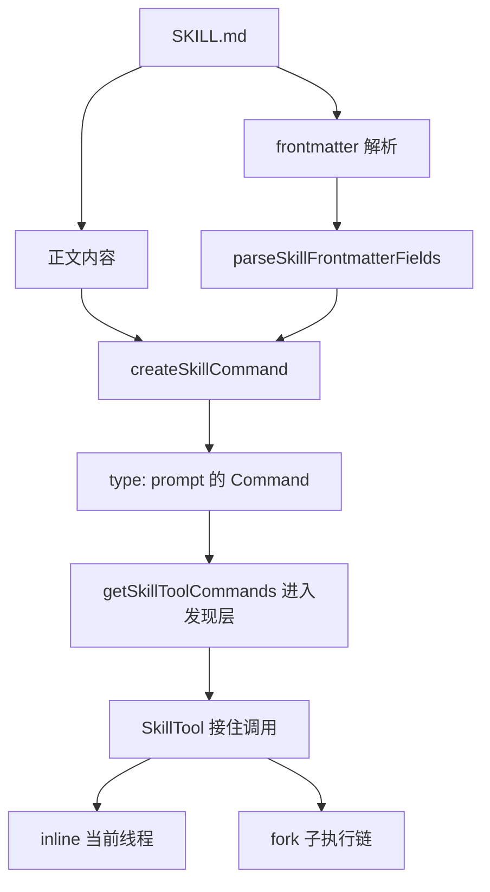

# 卷五 04｜为什么 skills 不是“长 prompt”那么简单

## 导读

- **所属卷**：卷五：外部扩展与多代理能力
- **卷内位置**：04 / 25
- **上一篇**：[卷五 03｜skills / MCP / agents / subagents / hooks / plugins 是怎样接入 Claude Code 的](./03-how-skills-mcp-agents-subagents-hooks-and-plugins-enter-claude-code.md)
- **下一篇**：[卷五 05｜skills 是怎样把用户经验、流程和角色结构接进 Claude Code 的](./05-how-skills-bring-user-experience-workflows-and-roles-into-claude-code.md)

## 这篇要回答的问题

skills 组真正的前置澄清，不是字段表，也不是写法手册，而是先把一个误解拆掉：

> **skill 当然会给模型增加提示内容，但它在 Claude Code 里绝不只是“更长一点的 prompt”。**

如果把 skill 理解成长 prompt，后面会连续犯三种错：

- 把 skill 写成文案资产，而不是 runtime 对象
- 把 frontmatter 当注释，而不是运行时声明
- 把 skill / tool / agent 的分工压成一个模糊大桶

所以第 04 篇要先立住一句话：

> **prompt 只是材料，skill 是带着发现、约束、调用语义进入系统的能力单元。**

## 旧文章锚点

这篇主要回收三篇旧文，但只拿它们当素材仓，不反过来决定新骨架：

- `docs/guidebook/volume-1/21-skill-frontmatter-fields.md`
  - 提供 frontmatter 字段表，提醒我们 skill 顶部声明远不止 `name + description`
- `docs/guidebook/volume-1/23-good-runtime-skill.md`
  - 提供“好 skill 先看运行边界，不先看文笔”的判断
- `docs/guidebook/volume-1/27-skills-conclusion.md`
  - 提供“skill 不是 markdown，而是能力单元”的收束口径

## 源码锚点

这篇只抓两处最关键源码：

- `cc/src/skills/loadSkillsDir.ts`
  - `parseSkillFrontmatterFields(...)` 会把 `allowed-tools`、`when_to_use`、`context`、`agent`、`effort`、`hooks` 等字段解析成 runtime 字段
  - `createSkillCommand(...)` 最终返回的是 `type: 'prompt'` 的 `Command`
- `cc/src/tools/SkillTool/SkillTool.ts`
  - SkillTool 不只是展示技能文档，而是会真正接住 skill 调用，并按 inline / fork 分流

## 先给结论

### 结论一：长 prompt 只有内容层，skill 至少有定义层、发现层、调用层

长 prompt 的重点是“这一轮对模型说什么”。

skill 的重点则至少分三层：

1. **定义层**：markdown + frontmatter 被解析成系统对象
2. **发现层**：`description` / `when_to_use` / `disableModelInvocation` 等信息决定它能否进入技能面
3. **调用层**：SkillTool 真正接住调用，再决定 inline 还是 fork

只要这三层存在，skill 就已经不是单纯文本补丁。

### 结论二：frontmatter 不是修辞补丁，而是 skill 的运行时接口

`loadSkillsDir.ts` 里，系统会解析：

- `allowed-tools`
- `when_to_use`
- `disable-model-invocation`
- `user-invocable`
- `context`
- `agent`
- `effort`
- `hooks`
- `shell`

这些都不是“让文档更漂亮”的信息，而是会进入对象字段、影响执行行为的声明。

所以第 04 篇最关键的一刀，就是把 skill 从“文案”切回“对象”。

### 结论三：skill 真正增加的不是字数，而是系统地位

长 prompt 可以很长，也可以把步骤写得很细。

但它通常没有这些系统属性：

- 不会先被系统登记成可发现能力
- 不会天然带上权限和上下文语义
- 不会进入 SkillTool 的统一调用面
- 不会自动拥有 inline / fork 两条执行路由

所以 skill 的差异从来不是“多写几段”，而是“进入了 Claude Code 的能力面”。

## 主证据链：为什么它不是长 prompt

### 证据一：`parseSkillFrontmatterFields(...)` 说明 skill 先被当作接口声明处理

在 `loadSkillsDir.ts` 里，系统先解析 frontmatter，再把这些字段收进返回结构：

- `allowedTools`
- `whenToUse`
- `disableModelInvocation`
- `userInvocable`
- `hooks`
- `executionContext`
- `agent`
- `effort`
- `shell`

这一步的含义非常直接：

> skill 的顶部声明不是注释，而是 runtime 准备读取的接口面。

如果它只是长 prompt，系统根本不需要先把这些东西拆成独立字段。

### 证据二：`createSkillCommand(...)` 说明 skill 会被编译成 `type: 'prompt'` 的 Command

同一个文件里，`createSkillCommand(...)` 最终构造出的不是“文档条目”，而是一个正式命令对象：

- `type: 'prompt'`
- `name`
- `description`
- `allowedTools`
- `whenToUse`
- `context`
- `agent`
- `effort`
- `hooks`
- `skillRoot`
- `getPromptForCommand(...)`

这说明 skill 并不是“有人需要时读一下 markdown”，而是先被编译成系统可调用对象。

### 证据三：`getSkillToolCommands(...)` 说明 skill 还要再过一层“能否被模型发现”的筛选

`SkillTool.ts` 里有一段很关键的筛选逻辑：

- 只保留 `type === 'prompt'`
- 排除 `disableModelInvocation`
- 同时要求来自 `skills / bundled / commands_DEPRECATED` 等合法来源
- 对 plugin / MCP prompt 还要求 `hasUserSpecifiedDescription || whenToUse`

这说明 skill 不只是“存在就行”，还要进入**发现层**。

换句话说：

> Claude Code 不只是存 skill，而是在决定“哪些 skill 应该出现在模型可用能力面里”。

### 证据四：SkillTool 会真正接住 skill 调用，而不是只把正文贴进去

在 `SkillTool.ts` 里，assistant 调用 skill 后，系统会：

1. `findCommand(...)` 找到目标 skill
2. `recordSkillUsage(...)` 记录使用
3. 若 `context === 'fork'`，走 `executeForkedSkill(...)`
4. 否则走 `processPromptSlashCommand(...)` 处理 inline 路径
5. 再把 `allowedTools`、`model`、`effort` 这些影响挂回上下文

这已经不是“我给你追加一段文案”的层级，而是完整的 tool runtime 接入动作。

## mermaid 主图：skill 从 markdown 到 runtime 对象

这张图想强调的只有一件事：

> skill 不是“正文变长”，而是“定义被 runtime 吃进去”。

## 为什么“长 prompt”这个说法会误导整组文章

### 误导一：会把第 05 篇写轻

第 05 篇真正要讲的是：skills 把用户经验、流程和角色结构接进 Claude Code。

如果还把 skill 当长 prompt，就会误以为那只是“把经验写下来”。

其实系统里发生的是：

- 经验被写成定义
- 定义进入能力面
- 能力被正式调用

### 误导二：会把第 06 篇写成“文档展开过程”

第 06 篇真正的问题不是“markdown 怎么展开”，而是 SkillTool / skills runtime 怎样接进执行链。

这个问题只有在 skill 已经被看成对象时才讲得通。

### 误导三：会把第 08 篇边界全部压扁

一旦你把 skill 看成长 prompt，就很容易说：

- tool 是短一点的 skill
- skill 是高一点的 tool
- agent 是重一点的 skill

这三种说法都不成立，因为它们把层级抹平了。

## 这篇不展开什么

- **不展开** 用户经验、流程、角色结构是怎样进入系统的——那是第 05 篇
- **不展开** SkillTool 的完整执行链——那是第 06 篇
- **不展开** 好 skill 的 runtime 判准——那是第 07 篇
- **不展开** skill / tool / agent 的最终边界——那是第 08 篇

## 一句话收口

> **skills 不是“更长一点的 prompt”，因为 Claude Code 会先把它解析成带有 `when_to_use`、`allowed-tools`、`context`、`agent` 等语义的 runtime 对象，再把它纳入 SkillTool 的发现与调用链；变化的不是字数，而是它被系统当成了一项正式能力。**
