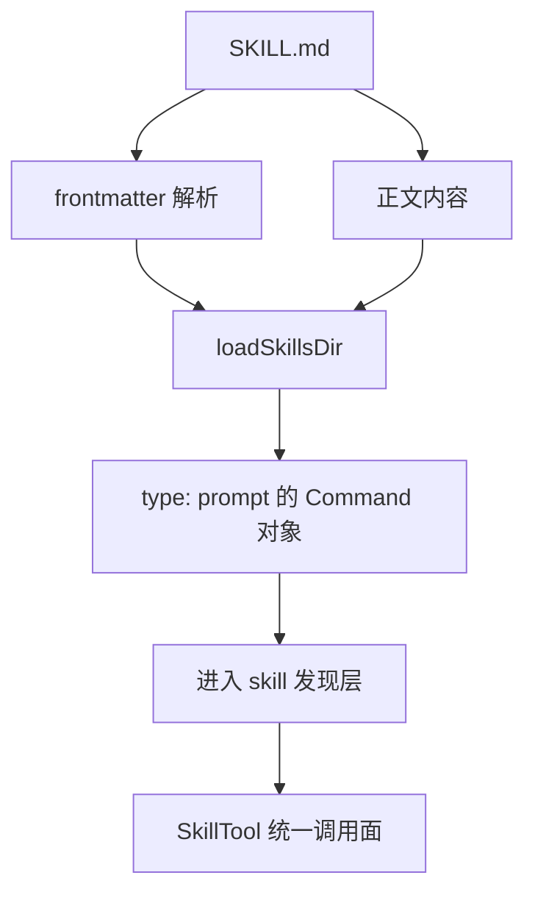

# 卷五 04｜Skill 不是长 prompt，而是 Claude Code 的方法单元

## 导读

- **所属卷**：卷五：外部扩展与多代理能力
- **卷内位置**：04 / 25
- **上一篇**：[卷五 03｜skills / MCP / agents / subagents / hooks / plugins 是怎样接入 Claude Code 的](./03-how-skills-mcp-agents-subagents-hooks-and-plugins-enter-claude-code.md)
- **下一篇**：[卷五 05｜为什么 Skill 能让 Claude Code 从“会做”变成“稳定会做”](./05-how-skills-bring-user-experience-workflows-and-roles-into-claude-code.md)

一看到 `SKILL.md`，很多人最自然的理解就是：

- 一段更长的 prompt
- 一套写得更规范的提示词模板
- 一个以后可以重复粘贴的 prompt 收藏夹

这个理解不算全错，但远远不够。

因为只要你把 skill 理解成“长 prompt”，后面几篇几乎都会读歪：

- 你会把 frontmatter 当成注释
- 你会把 SkillTool 当成文档展开器
- 你会把 skill / tool / agent 看成同一层级上不同轻重的东西

而源码给出的答案不是这样。

> **prompt 是一次性输入，skill 是 Claude Code 可发现、可调用、可复用的方法单元。**

先把差别压成一张最短对照表：

| 对象 | 在系统里的位置 |
|---|---|
| 长 prompt | 当前轮的一次性文本输入 |
| skill | 先被解析、登记，再进入发现与调用链的方法单元 |
| 关键差别 | 不是“文本更长”，而是“被系统当成能力对象对待” |

第 04 篇只回答一件事：**skill 在系统里到底是什么。**

第 05 篇才继续回答另一件事：**为什么 skill 会让 Claude Code 从“会做”变成“稳定会做”。**

---

## 为什么“skill = 长 prompt”这个理解会误导后面整组文章

如果只是从使用表面看，skill 确实会给模型增加一段额外文本。

所以很多人自然会觉得：

> skill 不就是把 prompt 写进一个文件，再让系统帮你在需要时展开吗？

问题就在这里。

这个说法只抓住了 skill 的**内容层**，却漏掉了另外三层更关键的东西：

1. 它是怎么被系统识别的
2. 它是怎么进入模型可见能力面的
3. 它是怎么进入统一调用链的

一旦漏掉这三层，skill 就会被看扁成“更长一点的文本补丁”。

而 Claude Code 源码里真正成立的是另一件事：

> **skill 不是“贴给模型看的长文本”，而是“先被系统编译、再被系统发现、最后被系统调用”的方法对象。**

这就是第 04 篇要解决的核心误解。

---

## 第一层：如果 skill 只是长 prompt，系统根本不需要先解析 frontmatter

先看 `loadSkillsDir.ts`。

如果 skill 只是普通长 prompt，系统最简单的做法应该是：

- 读出 `SKILL.md`
- 把正文在调用时贴进上下文
- 结束

但实际不是这样。

Claude Code 会先解析 frontmatter，把里面很多字段拆成独立的 runtime 信息。哪怕不把字段表全展开，只看方向也已经很清楚：

- `description`
- `when_to_use`
- `allowed-tools`
- `context`
- `agent`
- `effort`
- `hooks`

这些都不是“让 markdown 更整齐”的修辞补丁，而是系统接下来要拿去判断和执行的对象属性。

这一步本身就说明：

> **skill 顶上的 frontmatter 不是文案说明，而是运行时声明。**

这也是为什么卷一那条线后来必须专门把 frontmatter 从字段手册推进到“运行时接口”去讲。

如果你把它只理解成长 prompt，这一步根本就解释不通。

---

## 第二层：skill 不是直接以文档身份进入系统，而是先被编译成 command 对象

第 04 篇最关键的源码证据，其实是 `loadSkillsDir.ts` 里这条方向：

> **skill 最终不是以 markdown 文档身份进入系统，而是会被编译成 `type: 'prompt'` 的 command-like 对象。**

这件事为什么这么重要？

因为它意味着 skill 和普通 prompt 的地位完全不一样。

### 普通 prompt 更像什么

普通 prompt 更像一次性输入：

- 这轮给模型补一点上下文
- 这轮告诉它怎么做
- 这轮结束后，它也就跟着这一轮结束了

### skill 更像什么

skill 更像一个会先被系统登记的能力对象：

- 有自己的 `name`
- 有自己的 `description`
- 有自己的调用语义
- 有自己的运行时约束
- 有自己的 prompt 生成方式

也就是说，skill 不是“文档内容被引用一次”，而是：

> **系统先把它变成一个可被发现、可被调用的方法对象。**

这一层不立住，后面 05 为什么说它承接的是用户方法、06 为什么说它能进入 inline / fork、07 为什么说它有好坏之分，都会失去地基。

---

## 第三层：skill 还有发现层，而长 prompt 通常没有

“长 prompt”这个理解还有一个大问题：它默认你已经决定要用什么文本了。

但 skill 不一样。它在真正被调用前，系统还要先决定：

- 这个 skill 是什么
- 什么场景下该想起它
- 它能不能进入当前任务的候选能力面

这也是为什么 `description`、`when_to_use` 这些字段重要。它们不是给人看的装饰，而是在支撑发现层。

所以 skill 至少同时具有三层：

- **定义层**：`SKILL.md` 被解析成对象
- **发现层**：系统决定哪些 skill 进入模型可见能力面
- **调用层**：真正需要时，再由 SkillTool 把它接进执行链

普通长 prompt 通常只活在最后一步：我已经决定要说什么，然后把它贴进去；而 skill 在那之前就已经被系统组织起来了。

---

## 第四层：SkillTool 不是“读文档器”，而是方法单元的统一调用面

再看 `SkillTool.ts`，你会发现另一件很关键的事。

如果 skill 只是长 prompt，那 SkillTool 最像的应该是：

- 找到对应文件
- 读出内容
- 塞进当前上下文

但实际它承担的是更中层的角色。

卷一 15 那篇把这件事说得很清楚：SkillTool 真正接的是一整套东西——

- skills / commands 发现
- frontmatter 解析后的对象属性
- allowed tools
- inline / fork 分流
- 以及和 agent runtime 的连接

这意味着 SkillTool 的职责不是“读文档”，而是：

> **把方法单元接进统一 runtime。**

也就是说，它更像一个桥位，而不是一个展开器。

这一步特别关键，因为它把 skill 从“文本资产”重新拉回到了“系统能力”。

所以如果有人问：为什么 skill 不是长 prompt？

我会给一个非常直接的回答：

> **因为长 prompt 只是在当前轮里多说几句话，而 skill 还要先被系统注册、被系统发现、再通过 SkillTool 进入统一调用链。**

变化的不是字数，而是它被系统对待的方式。

---

## mermaid 主图：skill 从 markdown 到方法对象

这张图只想表达一件事：

> **skill 不是“正文变长”，而是“markdown 被系统吃进来，变成方法对象”。**

---

## 为什么这一步必须放在 skills 组最前面

skills 组后面还要继续讲：

- 第 05 篇：为什么 skill 会让 Claude Code 从“会做”变成“稳定会做”
- 第 06 篇：skill 在源码里怎么跑起来
- 第 07 篇：什么样的 skill 才真的好用
- 第 08 篇：什么时候该用 skill，什么时候该用 tool / agent / MCP

如果第 04 篇没有先把“skill ≠ 长 prompt”切开，后面会连续发生三种误读：

### 误读 1：把第 05 篇读轻
你会以为第 05 篇只是在讲“怎么把 prompt 复用得更顺”，而不是在讲为什么 skill 能稳定化用户方法。

### 误读 2：把第 06 篇读扁
你会以为第 06 篇只是在讲“文档怎么展开”，而不是在讲 skill 为什么能进入 inline / fork 执行链。

### 误读 3：把第 08 篇读糊
你会很容易把 tool、skill、agent 看成同一层级，只是轻重不同。

所以第 04 篇的职责不是展开全部机制，而是先立住一句最硬的话：

> **prompt 是一次性输入，skill 是 Claude Code 可发现、可调用、可复用的方法单元。**

这句话如果站稳，后面的五篇才有坡度。

---

## 这篇不展开什么

- **不展开** skill 为什么会直接提升稳定性——那是第 05 篇
- **不展开** SkillTool 的完整执行链——那是第 06 篇
- **不展开** 什么样的 skill 才算好 skill——那是第 07 篇
- **不展开** skill / tool / agent / MCP 的实际选层问题——那是第 08 篇

第 04 篇只做一件事：

> **先把 skill 从“长 prompt”这个误解里救出来。**

---

## 一句话收口

> **Skill 不是长 prompt，因为长 prompt 只活在当前轮的内容层，而 skill 会先被解析 frontmatter、编译成 `type: 'prompt'` 的方法对象、进入发现层，再由 SkillTool 接进统一调用链；变化的不是文本长度，而是它第一次成了 Claude Code runtime 里的正式能力单元。**
