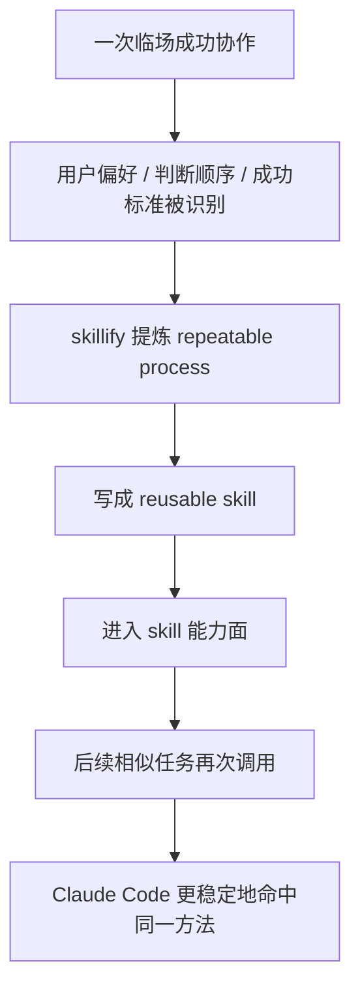

# 卷五 05｜为什么 Skill 能让 Claude Code 从“会做”变成“稳定会做”

## 导读

- **所属卷**：卷五：外部扩展与多代理能力
- **卷内位置**：05 / 24
- **上一篇**：[卷五 04｜Skill 不是长 prompt，而是 Claude Code 的方法单元](./04-why-skills-are-more-than-long-prompts.md)
- **下一篇**：[卷五 06｜Skill 在源码里怎么跑起来：从 SKILL.md 到 inline / fork](./06-how-skilltool-and-skills-runtime-enter-the-execution-chain.md)

Claude Code 明明已经会对话、会调工具、会按要求产出结果了，为什么系统里还要专门长出一层 skill？

如果只把 skill 理解成“把 prompt 存起来以后重复用”，这个问题很难回答。因为那样看，skill 最多只是方便，不像系统里必须存在的一层。

但从真实使用体验和 `skillify.ts` 这条官方样板线看，答案不是这样。

> **skill 的价值，不是让 Claude Code 多一个能力点，而是把它从“有时会做”推进到“能稳定复用地做”。**

第 05 篇要解释的也正是这一点：Claude Code 通过 skill 接进系统的，不是某段文本，而是用户反复验证过的做事方法。没有 skill 时，很多任务也能完成，但它们常常依赖这次上下文刚好完整、用户刚好把要求说透、模型刚好没有跑偏；有了 skill，系统才开始有条件把一次成功的方法，抬升成之后还能继续命中的方法。

---

## 没有 skill 时，Claude Code 的高质量协作为什么容易停留在一次性成功

很多人第一次用 Claude Code 时都会有一种体验：

- 某次任务做得特别顺
- 结果也很好
- 但下一次做类似任务时，又开始飘

这不是因为 Claude Code 完全不会做，而是因为很多高质量协作，默认依赖三件很脆弱的东西。

### 1. 用户偏好停留在当前会话里

比如：

- 先给结论，再展开动作
- 不要写空话
- 更看重结构，不看重花哨表达
- 哪些地方一定要保守，哪些地方可以自动推进

这些东西如果只停留在当前对话里，本质上还是临场约束。

这次说清了，模型能照着走；下次上下文换了，就可能重新漂回默认行为。

### 2. 流程顺序和成功标准没有被对象化

很多任务真正值钱的，不是最后产出那段文字，而是：

- 先判断什么
- 再检查什么
- 哪一步不能跳
- 什么算完成
- 什么算只是看起来像完成

如果这些只存在于本轮会话的自然推进里，那它就还是一次性协作，不是可复用方法。

### 3. 角色分工只存在于当场安排里

有些任务顺，是因为当场做对了角色分工：

- 哪一步留在主线程
- 哪一步适合独立执行
- 哪一步要人工确认
- 哪一步应该切出去单独跑

如果这套分工只是当场口头安排，下次并不会自动继承。

所以没有 skill 时，Claude Code 经常不是“做不出来”，而是：

> **它缺少一层把用户工作方式稳定挂回系统的能力。**

---

## 为什么 `skillify` 是这一篇最关键的源码证据

这篇最关键的源码锚点不是 `loadSkillsDir.ts`，而是 `skillify.ts`。

原因很简单：

`loadSkillsDir.ts` 更能证明 skill 在系统里是怎么成立的；
但 `skillify.ts` 更能证明 Claude Code 官方认为 skill **应该承接什么**。

而这正是第 05 篇的问题核心。

`skillify` 一上来就把任务定义成：

> `You are capturing this session's repeatable process as a reusable skill.`

这句话很重。

因为它没有说：

- 保存这次 prompt
- 记录这次输出
- 存档这次对话

它说的是：

> **把这次会话里可重复的流程，捕捉成一个可复用的 skill。**

这等于直接宣布了 skill 的系统角色：

- skill 不是留痕工具
- skill 不是答案仓库
- skill 是把一次成功协作提炼成未来还能再跑的方法对象

这已经不是“文本管理”了，而是“方法沉淀”。

---

## `skillify` 真正在采集的，不是文案，而是方法结构

如果继续往下看 `skillify.ts` 的提问结构，会发现它真正逼模型补齐的，全是方法层信息：

- inputs / parameters
- distinct steps
- success artifacts / criteria
- user corrections
- tools / permissions needed
- agents used
- 哪些步骤可以并行
- 哪些步骤需要 human checkpoint

这组字段非常说明问题。

### 它为什么不是在收集“文本素材”

因为这套问题根本不关心：

- 某句话写得漂不漂亮
- 这次回答语气像不像某个作者
- 某个例子是不是刚好说得很顺

它关心的是另一层：

- 这个任务的输入是什么
- 这个流程分几步
- 每一步怎样才算成功
- 哪些约束必须保留
- 需要哪些工具和权限
- 哪些地方要交给别的执行者

这已经是标准的方法单元骨架了。

所以我觉得 `skillify` 最值钱的地方，不是“它会自动生成一个 skill 文件”，而是：

> **它把“什么样的成功流程值得被沉淀成 skill”定义出来了。**

---

## skill 接进系统的，首先不是答案，而是方法

这一点必须单独讲透。

因为很多人一听“沉淀经验”，脑子里想到的还是保存结果。

但 skill 真正保存的不是“这次最后说了什么”，而是“这类事以后该怎么做”。

### 答案是什么

答案更像一次性交付：

- 一篇改好的文章
- 一次排查后的结论
- 一版整理后的结构
- 一个已经落地的结果文件

这些东西当然有价值，但它们的价值主要属于这一次任务。

### 方法是什么

方法保存的是：

- 先判断什么
- 再做什么
- 哪些约束不能丢
- 哪些结果才算完成
- 哪些情况应该停下来
- 哪些工作适合切给独立执行者

这类东西才具有“下次还能继续用”的性质。

而 skill 承接的正是这一层。

所以第 05 篇最应该立住的一句话，不是“skill 很方便”，而是：

> **skill 把用户反复验证过的做事方式，从一次任务里的临场配合，压成了以后还能再次调用的方法对象。**

---

## 为什么 skill 改变的是稳定性，而不只是便利性

如果把 skill 理解成一个方便功能，很容易低估它。因为“便利性”听起来像少打几句字、少复制一段 prompt、少解释一次背景；这些当然成立，但都没有打到问题核心。

skill 更大的价值是，它在修复几类很具体的失效模式：

| 没有 skill 时容易怎么失效 | 为什么会失效 | 写进 skill 之后如何改善 |
|---|---|---|
| 用户偏好容易丢 | 偏好只存在于当前对话 | 相似任务更容易命中同一做法 |
| 步骤顺序容易漂 | 流程靠临场推进，没有被显式化 | 更少漏步骤，也更少随手换顺序 |
| 完成条件容易模糊 | “写完了”不等于“完成了” | success criteria 被保留下来，更容易知道什么时候该停 |
| 主线程 / 独立执行的分工反复重做 | 角色结构只在当场口头安排 | tool、fork、agent 选择能和方法一起沉淀 |

所以这里真正被提升的不是“使用是否省事”，而是：

> **下次遇到类似任务时，Claude Code 还能不能沿着同一条正确方法继续做对。**

---

## 经验、流程、角色结构，分别是怎么被压进 skill 的

第 05 篇标题里有三个词：

- 用户经验
- 工作流
- 角色结构

这三个词如果只是并列摆出来，会显得很虚。它们必须分别落地。

### 1. 经验：把判断顺序和常见误区压进去

经验不是一句“我更喜欢这样”。

真正有价值的经验通常是：

- 哪个判断要先做
- 哪个坑最容易踩
- 哪种解释方式读者更容易误会
- 哪一步最容易偷懒，但其实不能跳

这些东西一旦被写进 skill，就不再只是使用者脑中的暗知识。

它会变成方法的一部分。

### 2. 流程：把动作顺序、成功标准和停顿点压进去

工作流不是“列一个步骤清单”这么简单。

真正能被系统复用的流程，至少要包括：

- 先做什么，后做什么
- 哪些步骤是必须的
- 哪些例外需要改道
- 什么算成功
- 什么情况下必须停下来确认

这也是 `skillify` 为什么反复追问 success criteria、artifacts 和 checkpoint。

因为没有这些，流程就只是建议，不是可复用工作单元。

### 3. 角色结构：把谁留在主线程、谁适合独立执行压进去

这是第 05 篇里最容易写虚的一块，但也是卷五里最重要的一块。

Claude Code 的 skill 不只是在说“怎么做”，它还可能在暗含：

- 这一步适合 inline
- 这一步适合 fork
- 这类任务更适合交给独立执行者
- 主线程应该保留哪些判断权

也就是说，skill 虽然不是执行者本体，但它已经能把执行分工带进系统。

这正是后面 agent 主轴要接着往下展开的坡度。

---

## 为什么这一篇必须把 skill 立成卷五 skills 组的锚点

卷五不是对象百科，而是在讲扩展层怎样成立。

如果第 05 篇只写成“skills 能复用 prompt”，那这组文章的重心就会直接塌掉。因为那样一来，skills 组读起来只是在讲一种更高级的写 prompt 方式，而不是在讲扩展层为什么会改变 Claude Code 的能力结构。

第 05 篇必须多立住一步：

> **skill 让用户自己的判断框架、执行顺序、角色分工和完成标准，第一次能以对象形式稳定进入系统。**

这样一来，skill 就不再只是便利层，而成了卷五里理解“能力定制”最关键的一步：系统不只是多接几个外部能力，它开始允许用户把自己的工作方法也接进来。

---

## mermaid 主图：从临场成功到稳定复用

这张图最想表达的不是“skill 会被保存”，而是：

> **一次成功的方法，从偶然协作，变成了后续任务可以反复调用的稳定方法。**

---

## 一句话收口

> **Skill 之所以重要，不是因为它让 Claude Code 多了一种写 prompt 的方式，而是因为它把用户长期积累的经验判断、工作流结构和角色分工，从一次会话里的临场配合，压成了系统以后还能再次调起的方法对象；Claude Code 不是因为多了 skill 才能做事，而是因为有了 skill，才更可能稳定把事做对。**
