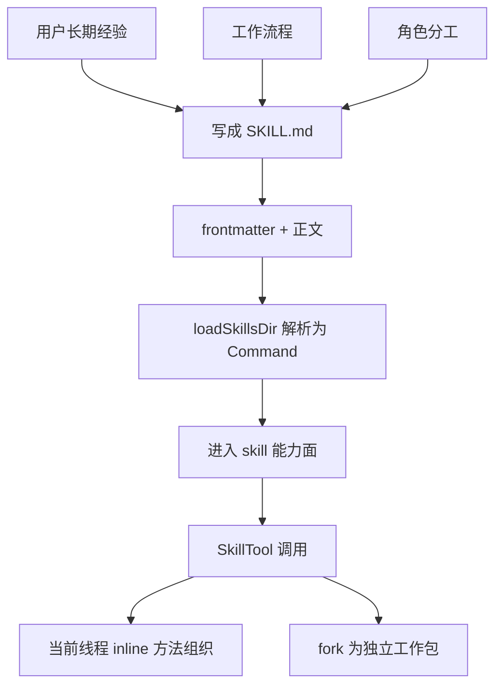

# 卷五 05｜skills 是怎样把用户经验、流程和角色结构接进 Claude Code 的

## 导读

- **所属卷**：卷五：外部扩展与多代理能力
- **卷内位置**：05 / 25
- **上一篇**：[卷五 04｜为什么 skills 不是“长 prompt”那么简单](./04-why-skills-are-more-than-long-prompts.md)
- **下一篇**：[卷五 06｜SkillTool / skills runtime 是怎样接进执行链的](./06-how-skilltool-and-skills-runtime-enter-the-execution-chain.md)

## 这篇要回答的问题

skills 组的锚点，不是字段表，也不是调用链，而是先回答：

> **Claude Code 到底通过 skill 接进来了什么？**

我的答案是：

> **它接进来的首先不是某段漂亮提示词，而是用户长期积累的做事方法。**

这些方法通常包括三层：

- **经验**：哪些判断先做，哪些误区先避开
- **流程**：先做什么，再做什么，什么情况下停下来
- **角色结构**：哪些步骤留在主线程，哪些步骤适合交给独立执行者

如果第 05 篇立不住，skills 组就会被写成“提示词复用组”；而执行说明明确要求它必须被立成**能力定制重轴**。

## 旧文章锚点

这篇主要回收三篇旧文：

- `docs/guidebook/volume-1/24-skillify.md`
  - 提供官方样板：Claude Code 如何把一次成功 session 抽成可复用 skill
- `docs/guidebook/volume-1/23-good-runtime-skill.md`
  - 提供“好 skill 是工作流单元，不是散文 prompt”的判断
- `docs/guidebook/volume-1/27-skills-conclusion.md`
  - 提供“skill 承接的是可复用方法”的总收束

## 源码锚点

这篇重点抓三处：

- `cc/src/skills/loadSkillsDir.ts`
  - skill 会被解析成 `description`、`whenToUse`、`allowedTools`、`context`、`agent` 等对象字段
- `cc/src/tools/SkillTool/SkillTool.ts`
  - skill 被调用后，不是当说明文读一遍，而是进入统一 skill 调用面
- `cc/src/skills/bundled/skillify.ts`
  - 这是最强的证据：官方自己把一次 session 抽象成 skill 时，要求收集 inputs、steps、success criteria、tools、agents、human checkpoint

## 先给结论

### 结论一：skill 接进系统的，是用户的做事方法，而不是某次会话的答案

答案是一次性的。

方法才值得沉淀。

用户真正想长期保留下来的，通常不是：

- 某句措辞
- 某次润色
- 某次偶然成功的输出

而是：

- 这类问题该怎么判断
- 先做什么再做什么
- 哪些硬约束必须守
- 什么结果才算完成

skill 承接的正是这一层。

### 结论二：skill 把临场经验，压成了可反复调起的方法组织单元

如果没有 skills，很多高质量协作也能发生，但常常依赖：

- 当前上下文正好完整
- 用户再次重复偏好
- 模型这次正好没忘记流程

这类协作不稳定。

skill 的价值在于，它把“这次做对了”的经验，抬升成以后还能被调用的对象。

### 结论三：skill 进入的是方法组织层，不是底层动作原语层

Read、Edit、Bash 这类对象解决的是“能做什么动作”。

skill 解决的是：

- 这些动作该按什么顺序被使用
- 什么约束要先声明
- 哪一步要人工确认
- 哪一步更适合单独切出去跑

所以它进入 Claude Code 的位置，不是动作层，而是**方法组织层**。

## 主证据链：用户经验 / 流程 / 角色结构怎样被压成 skill

### 证据一：`skillify.ts` 明确把 skill 视为“repeatable process”

`skillify` 开头第一句就不是“capture a prompt”，而是：

- `You are capturing this session's repeatable process as a reusable skill.`

这个措辞很关键。

官方不是在让模型回顾会话，而是在让模型抽出：

> 哪一部分是以后还能稳定重跑的流程。

这说明 skill 天生指向“方法沉淀”，而不是“文本收藏”。

### 证据二：`skillify` 第一步要求抽的全是流程信息，不是文案信息

它要求先分析：

- repeatable process
- inputs / parameters
- distinct steps
- success artifacts / criteria
- user corrections
- tools and permissions needed
- agents used

这组字段特别说明问题：

- 有 **输入**，说明这不是一次性答案
- 有 **步骤**，说明这不是单句 prompt
- 有 **成功标准**，说明它要进入工作流
- 有 **tools / permissions**，说明它要接入动作面
- 有 **agents used**，说明它会碰到角色结构

换句话说，官方自己就在告诉我们：

> skill 是把一次协作里的经验、流程和角色配置抽成未来可复用单元。

### 证据三：`skillify` 的访谈结构，实际上在把隐性经验显性化

`skillify` 要求四轮访谈：

1. 高层目标和成功标准
2. 高层步骤、参数、inline / fork、保存位置
3. 逐步拆 artifacts / success / checkpoint / execution / rules
4. 触发条件与 gotchas

这四轮访谈不是为了把 prompt 写长，而是为了把用户脑子里的隐性方法拆清。

尤其第三轮很关键，它会问：

- 这一步产出什么 artifact
- 什么证明它成功
- 要不要 human checkpoint
- 能不能并行
- 应该 Direct、Task agent 还是 Teammate

这一轮其实已经把“经验—流程—角色结构”全收进来了。

### 证据四：`loadSkillsDir.ts` 说明这些方法最终会被编译进对象字段

在 `parseSkillFrontmatterFields(...)` 里，系统会把：

- `when_to_use`
- `allowed-tools`
- `context`
- `agent`
- `effort`
- `hooks`

解析成对象属性。

也就是说，用户方法不是停留在文字层，而是进入了对象定义层。

用户原本口头反复强调的东西，比如：

- 什么时候该触发
- 需要哪些权限
- 要不要 fork
- 用什么 agent

最后都能被写成系统可以复用的运行时语义。

### 证据五：SkillTool 把这些方法单元真正挂进当前能力面

`SkillTool.ts` 不只是“把技能内容展示给模型”。

它会：

- 找到对应 skill
- 记录 skill usage
- 判断是否走 fork
- inline 路径下把消息与上下文修改挂回当前线程
- fork 路径下交给子执行链继续跑

也就是说，用户方法一旦写成 skill，就不再只是“文档里的一套经验”，而是当前 turn 真能调用的方法单元。

## mermaid 主图：用户方法进入系统的转化图

这张图的重点不在“skill 会不会展开”，而在：

> 用户自己的工作方式，第一次被稳定压成了 Claude Code 能调用的对象。

## 为什么第 05 篇必须把“角色结构”也提前提出来

这里只提到角色结构，但不展开 agent 主轴正文。

原因很简单：从 `skillify` 的访谈设计看，官方已经在问：

- 该 inline 还是 fork
- 该 Direct、Task agent 还是 Teammate

这说明有些 skill 承接的已经不只是“当前线程怎么做”，而是：

- 哪一段应交给独立执行者
- 哪一段仍由主线程保留控制

所以第 05 篇必须先把坡度铺出来：

> skill 虽然不是执行者本体，但它确实可以把角色结构接进系统。

这正是后面 Agent 主轴要展开的前梯。

## 这篇不展开什么

- **不展开** SkillTool / runtime 的完整执行链——那是第 06 篇
- **不展开** 什么样的 skill 才算好 skill——那是第 07 篇
- **不展开** skill / tool / agent 的终局边界——那是第 08 篇

## 一句话收口

> **skills 把用户长期积累的经验判断、工作流程和角色分工，从一次会话里的临场配合，压成了 Claude Code 可发现、可调用、可复用的方法组织单元；它真正接进系统的不是文本内容，而是用户自己的做事方式。**
