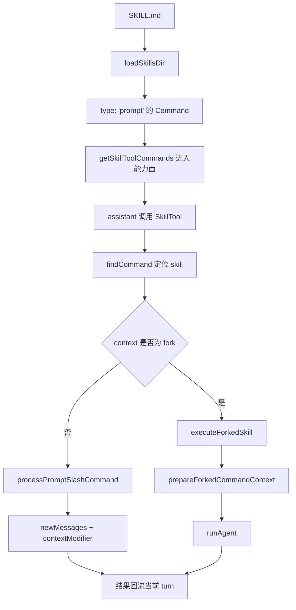

# 卷五 06｜Skill 在源码里怎么跑起来：从 SKILL.md 到 inline / fork

## 导读

- **所属卷**：卷五：外部扩展与多代理能力
- **卷内位置**：06 / 24
- **上一篇**：[卷五 05｜为什么 Skill 能让 Claude Code 从“会做”变成“稳定会做”](./05-how-skills-bring-user-experience-workflows-and-roles-into-claude-code.md)
- **下一篇**：[卷五 07｜什么样的 Skill 才真的好用：从 runtime 约束反推设计原则](./07-what-makes-a-good-runtime-skill.md)

第 05 篇已经立住：skill 接进来的不是答案，而是用户方法。

那第 06 篇要继续回答更硬的问题：

> **这种“方法进入系统”不是比喻，它在 Claude Code 里到底怎么被跑起来？**

如果这里只说“系统会展开一个 skill”，其实还是什么都没解释。真正关键的是：

- skill 先怎么从 `SKILL.md` 变成系统对象
- 哪些 skill 能进入模型可见能力面
- assistant 调用 SkillTool 之后，系统究竟做了什么
- 为什么有的 skill inline，有的 skill 会 fork
- fork 之后，为什么最后会接到 `runAgent(...)`

所以这篇不只是讲一条调用链，而是要把一件事讲实：

> **skill 的强，不在于能展开文本，而在于它能组织执行。**

---

## 先把主链压成一张图

先看全链路，后面细节就不会散。

先把 6 个源码节点和各自职责记住：

| 节点 | 它负责什么 |
|---|---|
| `loadSkillsDir` | 把 `SKILL.md` 编译成 command 对象 |
| `getSkillToolCommands(...)` | 决定哪些 skill 能进入当前能力面 |
| `findCommand(...)` | 在 command 集合里定位当前 skill |
| `command.context === 'fork'` | 决定走 inline 还是 fork |
| `processPromptSlashCommand(...)` | 承接 inline 路径，修改当前线程工作方式 |
| `prepareForkedCommandContext(...)` + `runAgent(...)` | 承接 fork 路径，把 skill 变成独立工作包并真正跑起来 |

这就是第 06 篇最该让读者带走的主骨架。

---

## 第一步：`loadSkillsDir.ts` 先把 `SKILL.md` 编译成对象

执行链的起点不在 SkillTool，而在 `loadSkillsDir.ts`。

因为对系统来说，磁盘上的 `SKILL.md` 还不是可执行对象。系统真正要消费的是一类被整理过的结构。

卷一 16 那篇已经把这个定义层讲得很清楚：Claude Code 不会把 skill 当成普通 markdown 文档，而是会把它压成一类 `type: 'prompt'` 的 command。

这一层最关键的意义是：

- `SKILL.md` 的正文不再只是文章正文
- frontmatter 不再只是说明信息
- skill 最后会变成一个有 `name`、`description`、`whenToUse`、`allowedTools`、`context`、`agent`、`effort` 等字段的运行时对象

也就是说，执行链真正的第一步不是“读 markdown”，而是：

> **把 skill 编译成系统后面真能继续消费的 command 对象。**

如果没有这一步，后面的 SkillTool 根本没有可调用目标。

---

## 第二步：不是所有 skill 都会直接进入模型可见能力面

很多人容易忽略一个中间层：**发现层**。

在直觉里，好像 skill 只要存在，就天然会被模型看到。但源码不是这么设计的。

`SkillTool.ts` 这条线里，真正给模型准备 skill 候选集合时，还要先经过一层筛选。你可以把它理解成：

> **系统先决定，哪些 skill 有资格出现在当前可见能力面里。**

这一步为什么重要？

因为它说明 skill 调用不是“文件存在 → 直接可用”，而是：

- 先有定义层对象
- 再过发现层筛选
- 然后才进入调用层

这也是为什么：

- `description` 重要
- `when_to_use` 重要
- `disableModelInvocation` 这类语义重要

因为这些都不只是写给人看，而是在影响 skill 能不能以候选方法的形式被系统想起来。

所以第 06 篇必须先把这个前置步骤讲清：

> **skill 进入执行链之前，先要进入能力面；而进入能力面，本身就是执行链的一部分。**

---

## 第三步：assistant 调用的不是某个文件，而是 SkillTool 里的一个方法对象

真正到 tool use 那一步时，assistant 调用的表面上是：

- `skill`
- `args`

但底层不是“去读某个 skill 文件”。

SkillTool 会先做几件事：

1. 拿到全量 commands 集合
2. 用 `findCommand(...)` 找到当前 skill 对应的对象
3. 记录 usage
4. 判断这个 skill 是 inline 还是 fork

这一步的意义非常大。

因为它把 skill 从“静态内容”彻底拉回到了“可调用对象”：

- assistant 调的不是文档
- assistant 调的是 command 对象
- SkillTool 负责把这个对象接到后续执行路径上

卷一 17 那篇说得很准：SkillTool 不是技能阅读器，而是 skill 进入执行层的总入口。

这句话放到卷五里，仍然成立。

---

## 第四步：inline 路径不是“多贴一段文本”，而是修改当前线程的工作方式

skill 如果不是 fork，就会走 inline 路径。

这里最容易被误解的地方是：很多人会把 inline 理解成“把 skill 内容塞回当前上下文”。这当然是结果的一部分，但如果只看到这里，就还是把 skill 看轻了。

真正的关键在于，inline 路径不仅会带回一段内容，还会一起带回：

- `newMessages`
- `allowedTools`
- `model`
- `effort`
- 以及后续 `contextModifier(...)` 要修改的运行时信息

也就是说，inline skill 并不是给当前线程补一段说明书，而是：

> **在当前线程里临时重写这段工作的组织方式。**

这才是 inline 真正的分量。

如果它只是“多一段 prompt”，那系统根本不需要把 allowed tools、model、effort 这些东西一起挂回来。

所以第 06 篇讲 inline 时，最应该让读者记住的一句话是：

> **inline skill 修改的不是字数，而是当前 turn 的工作组织方式。**

---

## 第五步：`command.context === 'fork'` 是真正的分叉判定点

skill 更强的那部分，其实体现在 fork 路径上。

真正让执行链分叉的，不是抽象判断，而是一个很具体的对象字段：

- `command.context === 'fork'`

一旦这个条件成立，SkillTool 就不会再把它当成“当前线程里展开一段内容”的问题，而是会明确进入：

- `executeForkedSkill(...)`
- `prepareForkedCommandContext(...)`

这说明什么？

说明 Claude Code 对这类 skill 的理解已经不是：

- 把方法提示给当前 agent

而是：

- **把这套方法先整理成一个独立工作包，再交给独立执行链去跑**

这就是为什么我会说：

> **fork 不是“再开一个黑盒”，而是把 skill 从方法说明升级成执行组织。**

卷一 18 那篇把 `forkedAgent.ts` 的位置说得很准：它是 skill 接入 agent 执行层的胶水层。

也就是说，SkillTool 真正做的不是“替 skill 执行”，而是：

- 判断该不该分叉
- 如果分叉，就把它包装成 agent runtime 真能接住的那种工作包

这条线一讲清，skill 和 agent 的关系也就开始清楚了：

- skill 负责组织方法
- agent runtime 负责承接执行

---

## 第六步：`prepareForkedCommandContext(...)` 真正做的是预装配，不是简单转发

fork 路径里最容易被低估的，是 `prepareForkedCommandContext(...)` 这一层。

如果只看表面，会觉得它像个中间函数；但它实际上在做 skill 进入 agent runtime 前最关键的预装配：

- 执行 `command.getPromptForCommand(...)`
- 生成 skill prompt 内容
- 处理 `allowedTools`
- 选择 `command.agent ?? 'general-purpose'` 作为 baseAgent
- 组装 `promptMessages`

这一步非常关键，因为它说明：

> **fork skill 不是把“skill 名字”丢给 agent，而是先把 skill 整理成一个完整工作包，再交给 agent。**

这也是为什么 `forkedAgent.ts` 在 skill 线里必须占一篇：

- SkillTool 只决定走 fork
- 真正把 fork 变成可执行 sidechain 的，是这层胶水逻辑

所以第 06 篇在这里必须明确：

- 不是 SkillTool 一步跑完 fork
- 不是 agent 自己去理解原始 `SKILL.md`
- 而是中间这层先把 skill 重写成 agent 真能接的执行上下文

---

## 第七步：fork skill 最终正式接到 `runAgent(...)`

第 06 篇最不能漏的一句，就是这句：

> **skill 的 fork 路径不是另一套执行系统，而是会正式接到 `runAgent(...)` 主干。**

这句话一旦不讲，读者就会很容易脑补出两套平行世界：

- skill 有 skill 的执行世界
- agent 有 agent 的执行世界
- 两者只是偶尔搭一下桥

实际源码不是这样。

至少在 fork skill 这条线上，关系非常明确：

- skill 先被定义成 command 对象
- SkillTool 决定它该 fork
- `prepareForkedCommandContext(...)` 把它整理成独立工作包
- `runAgent(...)` 真正把这个工作包跑起来

这意味着 skills runtime 和 agent runtime 在这里是正式接上的。

而这件事的重要性，不只是“多知道一条调用链”，而是它会直接影响后面两篇：

- 第 07 篇为什么要强调好 skill 的执行边界
- 第 08 篇为什么能把 skill 和 agent 切成不同层，而不是同一层轻重不同的东西

因为到这里，关系已经很清楚了：

> **skill 可以决定工作怎么组织，但真正承接执行生命周期的，仍然是 agent runtime。**

---

## 第八步：无论 inline 还是 fork，结果最后都要回流当前 turn

第 06 篇最后还必须把“回流”讲清楚。

因为如果只讲进链和分流，不讲回流，skill 就会像一条旁路。

但它其实不是。

无论 skill 是：

- inline 进当前线程
- 还是 fork 到独立执行链

最后都要回到当前 turn：

- inline 通过 `newMessages` 和 `contextModifier(...)` 回到主线程
- fork 通过结果提取和 tool result 回到当前线程

所以完整链路不是：

- 发现 → 调用 → 执行

而是：

- **发现 → 调用 → 分流 → 回流**

这条“回流”很重要。因为它说明 skill 不是绕开主循环干活，而是：

> **在主循环内部，以不同执行组织方式完成一段工作，然后把结果重新挂回当前 turn。**

这才是它作为 runtime 能力成立的方式。

---

## 这篇真正要让读者带走什么

第 06 篇最后最该留下来的，不是函数目录，而是三句话：

1. **skill 先是对象，后才进入执行链**
2. **inline 改的是当前线程的工作方式，不只是文本内容**
3. **fork 最终会正式接到 `runAgent(...)`，说明 skill 进入的是执行组织层，而不是文本层**

只要这三句站稳，这篇就完成了自己的职责。

---

## 这篇不展开什么

- **不展开** 为什么 skill 会让 Claude Code 更稳定——那是第 05 篇
- **不展开** 什么样的 skill 才写得好——那是第 07 篇
- **不展开** skill / tool / agent / MCP 的选层问题——那是第 08 篇
- **不展开** `runAgent.ts` 更细的 agent 主干装配——那是后面 agent 主轴要继续展开的部分

第 06 篇只做一件事：

> **把 skill 从对象，正式接到执行链。**

---

## 一句话收口

> **skill 进入 Claude Code 执行链的真实主证据链是：`loadSkillsDir` 先把 `SKILL.md` 编译成 `type: 'prompt'` 的 command 对象，`getSkillToolCommands(...)` 再把合格 skill 纳入当前能力面，assistant 通过 SkillTool 调用后按 inline / fork 分流；其中 inline 会修改当前线程的工作组织方式，fork 则经过 `prepareForkedCommandContext(...)` 正式接到 `runAgent(...)`，最后再把结果回流当前 turn。**
