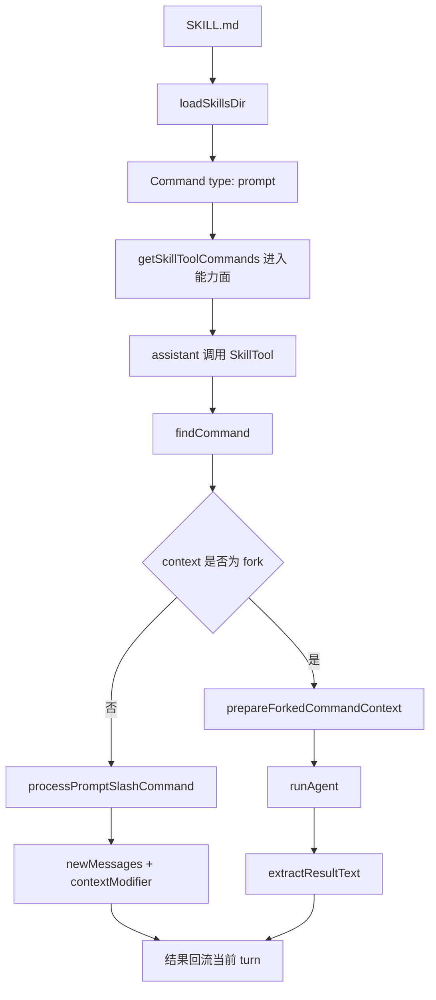

# 卷五 06｜SkillTool / skills runtime 是怎样接进执行链的

## 导读

- **所属卷**：卷五：外部扩展与多代理能力
- **卷内位置**：06 / 25
- **上一篇**：[卷五 05｜skills 是怎样把用户经验、流程和角色结构接进 Claude Code 的](./05-how-skills-bring-user-experience-workflows-and-roles-into-claude-code.md)
- **下一篇**：[卷五 07｜什么样的 skill 才算好的 runtime skill](./07-what-makes-a-good-runtime-skill.md)

## 这篇要回答的问题

第 05 篇已经立住：skills 接进来的是用户方法。

第 06 篇要继续回答更硬的问题：

> **这种“方法进入系统”不是比喻，它究竟怎样接进 Claude Code 的执行链？**

这篇必须把主证据链写实：

> **skill 被发现 → 进入能力面 → assistant 调用 SkillTool → SkillTool 按 inline / fork 分流 → 结果回流当前 turn。**

## 旧文章锚点

这篇回收三篇旧文：

- `docs/guidebook/volume-1/15-skilltool-bridge.md`
  - 提供 SkillTool 是桥位而不是文档阅读器的旧判断
- `docs/guidebook/volume-1/17-skilltool-execution-entry.md`
  - 提供 skill 真正进入执行链时的入口视角
- `docs/guidebook/volume-1/16-loadskillsdir.md`
  - 提供 skill 会先被编译成对象，而不是直接按 markdown 运行

## 源码锚点

这篇必须抓四处源码：

- `cc/src/skills/loadSkillsDir.ts`
- `cc/src/tools/SkillTool/SkillTool.ts`
- `cc/src/utils/forkedAgent.ts`
- `cc/src/tools/AgentTool/runAgent.ts`

## 先给结论

### 结论一：skill 先被编译成对象，才可能进入执行链

在磁盘上，用户看到的是 `SKILL.md`。

但在 runtime 里，系统真正处理的是：

- `type: 'prompt'` 的 Command
- 带 `allowedTools` / `whenToUse` / `context` / `agent` / `effort` / `hooks`
- 有 `getPromptForCommand(...)` 的能力对象

所以 skill 真正进入执行链的第一步，不是“读 markdown”，而是“把 skill 编译成对象”。

### 结论二：SkillTool 不是阅读器，而是方法组织层的执行入口

SkillTool 做的事不是把文档贴给模型看，而是：

- 匹配 skill
- 判断执行路径
- 把 skill 内容和 runtime 约束装进当前 turn
- 必要时切 fork，让它进入子执行链

所以 SkillTool 是**方法组织层进入执行链的桥位**。

### 结论三：inline / fork 两条路径同时存在，说明 skill 进入的不是文本层，而是执行组织层

如果 skill 只是长 prompt，一条 inline 路径就够了。

但 Claude Code 明确给它保留了：

- **inline**：在当前线程展开并修改上下文
- **fork**：把 skill 包装成独立工作包，交给子执行链

这说明 skill 在系统里被理解成“怎样组织执行”，而不是“给模型补几段字”。

## 主证据链：skill 怎样接进执行链

### 第一步：`loadSkillsDir.ts` 把 skill 变成 Command

`createSkillCommand(...)` 返回的关键字段包括：

- `type: 'prompt'`
- `name`
- `description`
- `allowedTools`
- `whenToUse`
- `context`
- `agent`
- `effort`
- `hooks`
- `getPromptForCommand(...)`

这一步的意义是：

> skill 先被装成统一对象，才能进入统一能力面。

如果没有这一步，SkillTool 根本没有可调用目标。

### 第二步：`getSkillToolCommands(...)` 只把合格 skill 放进模型可见能力面

`SkillTool.ts` 里，`getSkillToolCommands(...)` 只保留：

- `type === 'prompt'`
- 非 builtin
- 未被 `disableModelInvocation` 禁掉
- 同时满足来源和描述 / `whenToUse` 条件

这一步特别关键，因为它说明：

> 不是所有 prompt-like 对象都能进 skill 能力面，系统会先筛一遍。

也就是说，skill 被“发现”本身就是执行链前置步骤，而不是事后附带效果。

### 第三步：assistant 调用 SkillTool，SkillTool 再去 `findCommand(...)`

真正到 tool use 时，`SkillTool.ts` 会：

1. `getAllCommands(context)` 拿全量 prompt commands
2. `findCommand(commandName, commands)` 定位 skill
3. `recordSkillUsage(commandName)` 记录使用
4. 检查 `command.context === 'fork'` 还是 inline

这一步意味着：

> assistant 不是直接“读某个 skill 文件”，而是通过 SkillTool 调一个命令对象。

### 第四步：inline 路径走 `processPromptSlashCommand(...)`

如果不是 fork，SkillTool 会动态导入：

- `processPromptSlashCommand(...)`

然后拿到：

- `processedCommand.messages`
- `allowedTools`
- `model`
- `effort`

接着再把这些东西回注到当前 turn：

- 返回 `newMessages`
- 在 `contextModifier(...)` 里追加 `alwaysAllowRules.command`
- 覆盖 `mainLoopModel`
- 覆盖 `effortValue`

这里非常有证据感：

> inline skill 不只是“多了一段文本”，而是连上下文权限、模型、effort 都一起修改了。

### 第五步：fork 路径走 `executeForkedSkill(...)`

如果 `command.context === 'fork'`，SkillTool 会直接进入：

- `executeForkedSkill(...)`

而这个函数内部又会调用：

- `prepareForkedCommandContext(...)`

在 `forkedAgent.ts` 里，这个准备过程会：

- 执行 `command.getPromptForCommand(args, context)`
- 把 skill prompt 拼成 `skillContent`
- 解析 `allowedTools`
- 用 `createGetAppStateWithAllowedTools(...)` 改造权限上下文
- 选择 `command.agent ?? 'general-purpose'` 作为 baseAgent
- 把 `skillContent` 包成首条 `promptMessages`

这说明 fork skill 不是“再开一个匿名黑盒”，而是：

> 把 skill 先整理成一个完整工作包，再交给 agent runtime 去跑。

### 第六步：fork skill 最终进入 `runAgent(...)`

`executeForkedSkill(...)` 准备好上下文后，会直接：

- 调 `runAgent({...})`

这里第 06 篇必须点明：

> skill 的 fork 路径不是另一套执行系统，而是和 AgentTool 共用 `runAgent(...)` 主干。

也就是说，skills runtime 和 agent runtime 在这里正式接上。

### 第七步：结果回流当前 turn

无论 inline 还是 fork，最终都要回到当前 turn：

- inline：通过 `newMessages` 和 `contextModifier(...)` 回到当前线程
- fork：通过 `extractResultText(...)` 收束成结果，再作为 SkillTool 的 tool result 回流

所以 skill 的调用不是一条旁路，而是完整的**进链—分流—回流**。

## mermaid 主图：SkillTool 接入执行链主图

这张图要保住两点：

- **inline / fork 两条路径都要出现**
- **fork 最终要接到 `runAgent(...)`**

## 为什么第 06 篇必须讲出 SkillTool 和 AgentTool / runAgent 的连接

因为只要不把这段连接写出来，读者就会误以为：

- skill 有自己的执行世界
- agent 有自己的执行世界
- 两者只是松散并列

实际源码不是这样。

至少在 fork skill 这里，路径非常明确：

- skill 负责组织工作包
- agent runtime 负责把这包工作跑完

这正是第 08 篇切 skill / agent 边界时最重要的前提。

## 这篇不展开什么

- **不展开** 什么样的 skill 才写得好——那是第 07 篇
- **不展开** skill / tool / agent 的最终边界——那是第 08 篇
- **不抢写** agent 主轴里的 runAgent 细部装配线——那是第 14 篇以后

## 一句话收口

> **skill 进入 Claude Code 执行链的主证据链是：`loadSkillsDir` 先把 `SKILL.md` 编译成 `Command`，SkillTool 再把它纳入当前能力面并接住调用，随后按 inline / fork 分流；其中 fork 路径会经过 `prepareForkedCommandContext(...)` 进入 `runAgent(...)`，最后再把结果回流当前 turn。**
