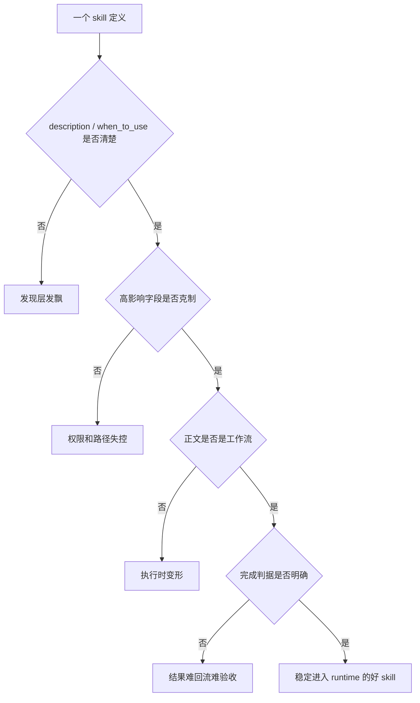

# 卷五 07｜什么样的 skill 才算好的 runtime skill

## 导读

- **所属卷**：卷五：外部扩展与多代理能力
- **卷内位置**：07 / 25
- **上一篇**：[卷五 06｜SkillTool / skills runtime 是怎样接进执行链的](./06-how-skilltool-and-skills-runtime-enter-the-execution-chain.md)
- **下一篇**：[卷五 08｜skill、tool、agent 三者的边界到底是什么](./08-boundaries-between-skill-tool-and-agent.md)

## 这篇要回答的问题

前两篇已经说明：

- skills 接进来的是用户方法
- skills 会被正式装进执行链

那第 07 篇要继续回答：

> **什么样的 skill 才配得上这个 runtime 位置？**

这篇不能写成“写作 checklist”，必须从 runtime 视角给判准。

## 旧文章锚点

这篇主要回收：

- `docs/guidebook/volume-1/23-good-runtime-skill.md`
- `docs/guidebook/volume-1/24-skillify.md`
- `docs/guidebook/volume-1/21-skill-frontmatter-fields.md`

旧文给出的材料可以压成一句话：

> 好 skill 的核心不是 prompt 文笔，而是能否稳定进入、稳定发现、稳定执行、稳定收束。

## 源码锚点

这篇的源码抓手有三处：

- `cc/src/skills/loadSkillsDir.ts`
- `cc/src/tools/SkillTool/SkillTool.ts`
- `cc/src/skills/bundled/skillify.ts`

## 先给结论

### 结论一：好的 runtime skill，先看职责是否单一稳定

skill 一旦进入 runtime，就不该是“万能方法包”。

好的 skill 必须能回答清楚：

- 它解决什么问题
- 它不解决什么问题
- 它应该在什么节点进入
- 它完成后交回什么结果

### 结论二：好的 runtime skill，先看能不能被系统稳定发现，再看写得漂不漂亮

写得很华丽，但 `description` / `when_to_use` 模糊，系统发现不稳，这种 skill 仍然不算好 skill。

Claude Code 这里的“好”，首先是 runtime 好用，不是阅读体验好看。

### 结论三：好的 runtime skill，必须把执行影响控制在必要范围内

权限、fork、model、effort、hooks、paths 这些字段都会真实改变行为。

所以好 skill 的共同气质不是“功能全”，而是：

> **边界清、权限窄、路径稳、完成判据明确。**

## runtime 视角下的五条判准

### 判准一：可发现性稳定

源码里，skill 要进入 `getSkillToolCommands(...)`，至少要满足：

- `type === 'prompt'`
- 非 builtin
- 未被 `disableModelInvocation` 禁掉
- 同时满足来源与描述 / `whenToUse` 条件

这意味着第一条判准不是“正文多丰富”，而是：

> **系统能不能在正确场景下稳定把它当作 skill。**

所以好 skill 的 `description` / `when_to_use` 必须足够区分：

- 不泛
- 不虚
- 不和相邻 skill 重叠得太厉害

否则它在发现层就已经输了。

### 判准二：执行边界清楚

`loadSkillsDir.ts` 会把 `context`、`agent`、`allowedTools`、`effort`、`hooks` 等字段解析成行为声明。

这说明一份 skill 只要把这些字段写上，就已经在改 runtime。

所以好的 skill 必须守住两点：

- **只声明必要字段**
- **每个字段都能回答“为什么一定要改运行行为”**

举例说：

- 能 inline 就别动不动 `context: fork`
- 能最小权限，就别先把工具给胖
- 不需要换模型，就别乱写 `model` / `effort`

### 判准三：正文能直接转成工作流

SkillTool inline 路径最终要把 skill 内容转成当前线程可消费消息；fork 路径则要把 skill prompt 包成独立工作包。

不管哪条路径，都要求正文具备工作流结构：

- 目标
- 步骤
- 约束
- 输出要求
- 例外处理

如果正文更像散文、感想、产品说明书，那它进入 runtime 后就容易变形。

### 判准四：完成判据明确

`skillify.ts` 之所以反复问 `success artifacts / criteria`，不是为了写得更正式，而是因为没有完成判据，执行链就不知道什么时候该停。

所以好 skill 至少要让系统感知到：

- 这一步成功的标志是什么
- 最终交付物是什么
- 哪些风险必须显式保留

没有这层，skill 更像建议，不像可稳定调用的工作单元。

### 判准五：重复使用时不变形

真正的 runtime 标准不在第一次，而在第 N 次。

好 skill 要经得起：

- 换任务材料
- 换上下文密度
- 换相邻对象
- 换一次略有偏差的用户说法

还能守住职责，不乱吞相邻篇职责，不乱抢 agent 或 tool 的工作。

## 主证据链：为什么这些判准来自 runtime，而不是来自审美

### 证据一：发现层本身就在筛好坏

`getSkillToolCommands(...)` 和相关筛选逻辑已经说明：

- 发现条件模糊
- 描述不清
- 调用语义不足

都会直接影响它能否进入模型可见能力面。

这不是写作偏好，而是运行现实。

### 证据二：frontmatter 不是注释，所以“克制”是 runtime 要求

`parseSkillFrontmatterFields(...)` 解析的每个高影响字段都会进入对象属性。

于是“是不是写上 fork / hooks / model / effort / allowed-tools”就不再是排版问题，而是执行设计问题。

### 证据三：`skillify` 官方样板把好 skill 的骨架直接写出来了

`skillify` 要求每个 skill 至少要补齐：

- inputs
- goal
- steps
- success criteria
- execution
- artifacts
- human checkpoint
- rules

这套结构恰好说明：

> 官方对“好 skill”的理解，本质上是一个可执行、可停顿、可验收、可复用的 workflow 单元。

### 证据四：SkillTool 两条路径都在惩罚“写得飘”的 skill

- inline 路径会把 skill 内容直接压回当前线程
- fork 路径会把 skill 内容打包成独立工作包

这两条路径都要求正文足够结构化。

如果正文只有理念没有动作，或者只有宏大原则没有停止条件，它在两条路径里都会发飘。

## mermaid 主图：坏 skill / 好 skill 的 runtime 分岔图

这张图想表达的重点是：

> 好 skill 不是靠“多写点”赢的，而是靠每一层都不掉链子。

## 第 07 篇在组内的职责

第 07 篇必须只做一件事：

> 给出 runtime 视角下的好 skill 判准。

它不能越界去讲：

- 第 06 篇的完整执行链
- 第 08 篇的 skill / tool / agent 边界总收口

但它必须替第 08 篇把一个前提立稳：

> 不是所有 skill 都同样成立，只有守住 runtime 判准的 skill 才站得住。

## 一句话收口

> **好的 runtime skill，不是写得最花的 prompt，而是一个可发现性稳定、执行边界清楚、运行影响克制、正文可直接转成工作流、完成判据明确，并且能在重复使用中持续不变形的方法组织单元。**
