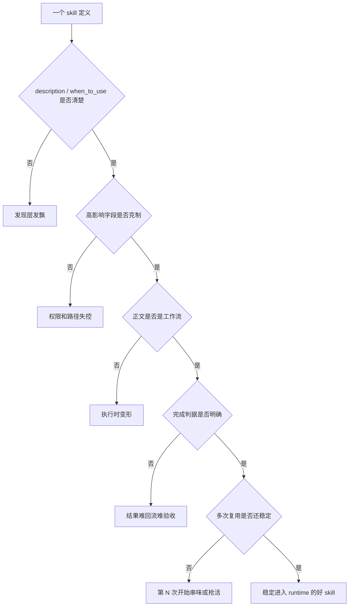

# 卷五 07｜什么样的 Skill 才真的好用：从 runtime 约束反推设计原则

## 导读

- **所属卷**：卷五：外部扩展与多代理能力
- **卷内位置**：07 / 24
- **上一篇**：[卷五 06｜Skill 在源码里怎么跑起来：从 SKILL.md 到 inline / fork](./06-how-skilltool-and-skills-runtime-enter-the-execution-chain.md)
- **下一篇**：[卷五 08｜什么时候该用 Skill，什么时候该用 tool / agent / MCP](./08-boundaries-between-skill-tool-and-agent.md)

前面三篇已经把 skills 组最重要的地基搭起来了：

- 第 04 篇说清了：skill 不是长 prompt，而是方法单元
- 第 05 篇说清了：skill 为什么会让 Claude Code 从“会做”变成“稳定会做”
- 第 06 篇说清了：skill 在源码里怎样进入执行链

所以第 07 篇不再解释 skill 是什么，也不再重走执行链；它只回答一件事：

> **什么样的 skill 进入 runtime 之后不会变形。**

那接下来更现实的问题就是：

> **既然 skill 会真的进入 runtime，什么样的 skill 才算好 skill？**

这个问题如果只从写作角度回答，很容易变成“怎么写得更像一个完整文档”。

但 Claude Code 这套系统真正关心的不是这个。

> **好 skill 不是写得最花的 prompt，而是能稳定被发现、稳定被执行、稳定不变形的方法单元。**

所以第 07 篇不是写作技巧文，而是 runtime 判准篇。

---

## 先把判准压成一张图

先把全篇最重要的 5 条判准压成一张图：

再把 5 条判准直接列平：

| 判准 | 对应的 runtime 环节 | 失效后会发生什么 |
|---|---|---|
| 1. 职责单一稳定 | 复用与命中阶段 | 第 N 次开始串味、抢相邻能力的活 |
| 2. 发现稳定 | 发现 / 候选阶段 | 系统根本想不起它，或总在错误场景触发 |
| 3. 运行影响克制 | 进入执行链之前 | 权限、路径、模型切换失控 |
| 4. 正文是工作流 | inline / fork 执行阶段 | 模型临场补全，步骤变形、输出发飘 |
| 5. 完成判据明确 | 结果回流与验收阶段 | 回来一个“差不多”，但没人知道算不算完成 |

这 5 条不是审美建议，而是 runtime 约束反推出来的判断标准。

---

## 第一条：好 skill 先看职责是否单一稳定

很多 skill 一写坏，问题不是句子难看，而是职责发胖。

比如一种很常见的坏味道是：

- 既想负责分析
- 又想负责执行
- 还想顺手负责收尾和发布
- 最后再兼顾异常处理、读者解释、格式整理

这种 skill 乍看很全，但在 runtime 里通常会越来越不稳。因为系统和模型很难判断：

- 它到底最该在哪个节点出现
- 它的完成边界到底在哪
- 它是不是已经开始抢相邻 skill、tool 或 agent 的活

所以第一个判准很朴素：

> **一个好 skill，先要能回答清楚“它解决什么问题，也不解决什么问题”。**

卷一 23 那篇已经把这个方向说得很明确：好 skill 的第一标准不是内容丰富，而是进入 runtime 之后不变形。

换句话说，真正危险的不是“写得不够全”，而是：

- 什么都想包
- 看起来什么都能做
- 一进执行链就开始串味

所以判断一个 skill 的第一眼，不该先看它写得多完整，而应该先问：

- 这是一个单一稳定的方法单元吗？
- 它有没有明显的边界？
- 它和邻近 skill 的职责会不会重叠到互相抢活？

如果这一关都过不了，后面写得再漂亮，runtime 里也不会稳。

---

## 第二条：好 skill 要先被稳定发现，而不是写得很热闹

很多人写 skill，最容易忽略的不是正文，而是 `description` 和 `when_to_use`。

但从 Claude Code 的发现层逻辑看，这反而是最容易把 skill 写坏的一层。

因为 skill 能不能被模型在对的时候想起来，并不是靠“全文写得很详细”，而是首先靠简介层能不能站住。

卷一 29 那篇已经把这个问题拆得很清楚：

- `description` 决定这是什么
- `when_to_use` 决定什么时候该想起它

对自动发现来说，后者往往更关键。

### 什么叫发现不稳定

最典型的坏写法通常像：

- 帮助处理复杂任务
- 用于高质量分析和执行
- 适用于需要细致处理的问题

这类描述的问题不在于语法，而在于它几乎没有分辨率。系统很难知道：

- 这和别的 skill 的区别是什么
- 到底什么场景该想起它
- 它到底是在处理哪一类任务

所以第二条判准应该写得非常硬：

> **好 skill 不是“描述看起来完整”，而是系统能在正确场景下稳定把它当作候选方法。**

这也是为什么：

- `description` 要有区分度
- `when_to_use` 要写具体触发场景
- 两者宁可窄一点，也不要泛一点

否则这个 skill 可能根本不是“执行不好”，而是在进入执行链之前就已经输了。

---

## 第三条：高影响字段要克制，不要把 frontmatter 写成愿望清单

frontmatter 一旦被系统消费，它就不再是备注区，而是行为声明区。

这是很多人第一次写 skill 时最容易低估的地方。

卷一 23 里已经讲得很重了：

> **frontmatter 应该像接口声明，不应该像愿望清单。**

这句话在卷五里仍然成立，而且更该强调。

因为现在我们已经知道这些字段会真实改变运行行为：

- `allowed-tools`
- `context`
- `agent`
- `model`
- `effort`
- `hooks`

这些东西一旦写上，就不是“以后也许会用到”，而是在真的改变 skill 怎样进入执行链。

### 常见坏味道 1：无脑 `context: fork`

很多 skill 一上来就想 fork，看起来像更强，其实经常是在逃避边界设计。

如果当前线程就能稳稳完成，硬切 fork 只会带来：

- 不必要的执行分叉
- 更重的工作包
- 更复杂的回流路径

所以一个好 skill 默认应该先问：

> **这件事真的必须交给独立执行链吗？**

而不是默认“分出去更高级”。

### 常见坏味道 2：权限和模型声明发胖

另一种很常见的坏味道是：

- `allowed-tools` 先给一大堆
- `model` 先切
- `effort` 先拉高

看起来像“功能很强”，但实际代价是：

- 权限边界更糊
- skill 的真实职责更难辨认
- 也更容易和别的 skill 串线

所以第三条判准其实可以压成一句很简单的话：

> **好 skill 的共同气质不是“配置很全”，而是“只改那些真的必须改的运行行为”。**

---

## 第四条：正文必须是工作流，不是散文

这是我觉得最容易被忽略、但实际最致命的一条。

很多 skill 坏，不是坏在 frontmatter，而是坏在正文。

因为一旦 skill 进入 runtime，它的正文不是留给人慢慢看的说明书，而是会直接进入模型执行上下文的动作框架。

所以正文最怕的，不是写短，而是写飘。

### 什么叫正文写飘了

常见症状通常有这些：

- 目标、背景、原则、例外、案例全搅在一起
- 很多抽象口号
- 有很多“你应该”“你最好”“通常建议”
- 但就是没有明确动作顺序

这种东西给人看可能还算完整，给模型执行却很容易变形。

因为模型拿到的不是：

- 明确目标
- 明确步骤
- 明确边界
- 明确输出
- 明确异常处理

而是一团看起来很专业、实际却不够可执行的说明。

所以第四条判准必须写得很硬：

> **正文必须更像工作流，而不是更像散文。**

最短的正反例可以这样看：

### 坏写法

> 请认真分析当前任务，充分理解用户真正意图，保持高质量、结构化、专业化表达，必要时灵活调整处理方式。

### 好写法

> 1. 先确认任务目标和输入材料是否齐全。  
> 2. 若缺关键输入，先明确缺口，不继续执行后续步骤。  
> 3. 按既定顺序完成 A → B → C。  
> 4. 输出时必须包含结论、关键证据和未解决风险。  
> 5. 若结果达不到 success criteria，明确标记为未完成，而不是勉强收尾。

两者最大的区别不是“第二个更长”，而是第二个能直接转成动作顺序。

也就是说，一个好 skill 的正文至少应该让模型感知到：

- 这件事的目标是什么
- 步骤是什么
- 哪些约束不能越界
- 最后交什么结果
- 出现例外时怎么处理

否则它可能是一篇不错的说明文，但不是一个稳的 runtime skill。

---

## 第五条：完成判据必须明确，不然回流就会发虚

第 06 篇已经讲过：skill 的执行不是旁路，最后都要回流当前 turn。

那第 07 篇必须继续补上一个问题：

> **如果一个 skill 连“什么时候算完成”都没写清，它回来的到底是什么？**

这也是为什么 `skillify.ts` 会反复追问：

- success artifacts / criteria
- outputs
- human checkpoint

它关心的不是形式完整，而是：

- 这件事成功的标志是什么
- 最终该交付什么
- 哪些风险必须显式保留
- 哪些情况应该停下来让人确认

如果这些没有被写进 skill，最常见的问题就是：

- 模型觉得“差不多了”
- 用户却觉得“根本没做完”
- 结果回流回来了，但没有形成稳定闭环

所以第五条判准非常关键：

> **一个好 skill，不只是把工作跑起来，还得让系统知道什么时候该停、该交什么结果。**

这条不清楚，再强的 skill 也很容易在验收时发虚。

---

## 为什么这 5 条判准不是审美建议，而是 runtime 约束反推出来的

到这里其实可以把逻辑收一下。

这 5 条判准之所以成立，不是因为“这样写更优雅”，而是因为 Claude Code 的 skill 会真的被系统拿去：

- 发现
- 筛选
- 调用
- inline / fork 分流
- 回流结果

所以每一条都直接对应一个运行环节：

| runtime 环节 | 它反推出的判准 |
|---|---|
| 发现层要决定是否想起它 | `description` / `when_to_use` 要稳定 |
| 前置对象定义会影响运行行为 | 高影响字段必须克制 |
| inline / fork 都会把正文拿去执行 | 正文必须是工作流 |
| 最终结果要回流当前 turn | 完成判据必须明确 |
| 相似任务会反复命中它 | 职责必须单一稳定 |

这也就是为什么我会说：

> **好 skill 的标准首先是 runtime 上站得住，其次才是写起来像不像一篇好文档。**

---

## 常见坏味道清单：一眼就该警惕什么

为了让这篇更像判准篇，我把最该警惕的坏味道直接列平：

### 1. 万能 skill
什么都想包，结果什么都不稳。

### 2. `description` / `when_to_use` 写虚
写了等于没写，发现层先发飘。

### 3. 无脑 `context: fork`
还没判断是否真需要分叉，就先把执行链切重了。

### 4. 权限和模型声明发胖
看起来很强，实际是在模糊边界。

### 5. 正文只有理念没有动作
人看着热闹，模型拿到后却不知道怎么干。

### 6. 没有 success criteria
任务跑完了，但没人知道这算不算真的完成。

这几种坏味道，不需要全中，只要中两三条，这个 skill 的 runtime 质量通常就已经开始发虚了。

---

## 这篇不展开什么

- **不展开** 第 06 篇那条完整执行链——这里默认读者已经知道 skill 怎么进执行链
- **不展开** 第 08 篇的选层问题——这里不讨论什么时候该改成 tool / agent / MCP
- **不展开** 具体项目里的每一份现成 skill 示例——这里讲的是判准，不是样例库

第 07 篇只做一件事：

> **给出 runtime 视角下，什么样的 skill 才算真的站得住。**

---

## 一句话收口

> **好 skill 不是写得最花的 prompt，而是一个职责单一、发现稳定、运行影响克制、正文能直接转成工作流、完成判据明确，并且在重复使用中仍然不变形的方法单元；它首先必须在 Claude Code runtime 里站得住，然后才谈得上写得好不好看。**
