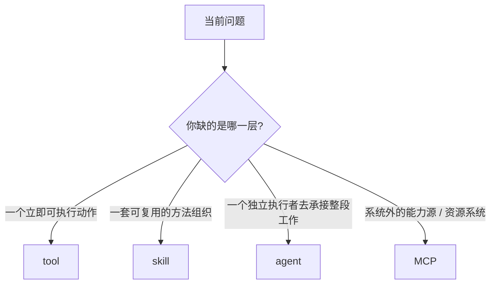

# 卷五 08｜什么时候该用 Skill，什么时候该用 tool / agent / MCP

## 导读

- **所属卷**：卷五：外部扩展与多代理能力
- **卷内位置**：08 / 25
- **上一篇**：[卷五 07｜什么样的 Skill 才真的好用：从 runtime 约束反推设计原则](./07-what-makes-a-good-runtime-skill.md)
- **下一篇**：[卷五 09｜为什么 MCP 不是“多了一批远程工具”](./09-why-mcp-is-not-just-more-remote-tools.md)

到这里，skills 组已经把三件事讲清了：

- skill 不是长 prompt，而是方法单元
- skill 为什么会让 Claude Code 从“会做”变成“稳定会做”
- skill 在源码里怎么进入执行链，以及什么样的 skill 才真正站得住

那最后还差一件事必须收口：

> **实际工作里，什么时候该用 skill，什么时候该直接用 tool、agent，或者干脆该上 MCP？**

如果这里不切稳，前面几篇就算都写对了，读者一落地还是会反复犯三种错：

- 把 tool 用成 workflow
- 把 skill 写成半成品 agent
- 把本该接 MCP 的能力硬写成 skill

所以第 08 篇不是纯定义篇，而是 **选层决策篇**。

---

## 先把决策图压出来

先不要急着记定义，先记这张图：

这就是第 08 篇最想替读者建立的判断框架。

再压成一张平表：

| 你当前真正缺的是什么 | 更该选什么 |
|---|---|
| 一个立即可执行动作 | tool |
| 一套可复用方法 | skill |
| 一个独立执行者 | agent |
| 一个系统外能力源 / 资源系统入口 | MCP |

这四者都能进入 runtime，但它们解决的不是同一类问题。

先用一个最小真实案例把这张图落地：

| 同一个“处理故障单”的需求，问题真正卡在哪 | 更该选什么 |
|---|---|
| 只是去读日志、搜错误、改一行配置 | tool |
| 每次都要按固定顺序排查：先看日志、再看配置、最后给结论 | skill |
| 故障排查已经长到需要一个独立执行者持续调查和回报 | agent |
| 关键数据根本不在本地，而在外部工单 / 监控 / 资源系统里 | MCP |

---

## 第一层：tool 解决的是“现在能做什么动作”

tool 是这四层里最底的一层。

它最关心的是：

- 输入是什么
- 执行动作是什么
- 返回结果是什么

比如：

- 读文件
- 搜索文本
- 改文件
- 跑命令
- 请求一个外部动作

这些都是动作原语。

tool 的问题始终是：

> **当前这一轮，现在能直接做什么动作？**

所以如果你面对的是一个局部、清晰、单次即可完成的动作，最自然的选择通常就是 tool。

### 什么时候只用 tool 就够了

- 只是读一个文件
- 只是跑一次命令
- 只是改一段文本
- 只是调一次外部接口

这时候你缺的不是方法层，也不是执行者层，而只是动作层。

这也是为什么把 tool 用成 workflow，通常会出问题：

- 你会反复手工拼动作顺序
- 你会在每轮临时决定边界
- 你会把本该沉淀的方法层工作，硬压在动作层上反复重做

所以第一条最该记住的判断是：

> **tool 负责动作，不负责替你组织方法。**

---

## 第二层：skill 解决的是“这些动作该怎么组织成稳定方法”

skill 比 tool 高一层，但它高出来的不是“更强动作”，而是“方法组织”。

也就是说，skill 真正负责的是：

- 哪些步骤先做
- 哪些约束先声明
- 哪些工具该怎样搭配
- 哪些情况要停下来
- 最后交什么结果

所以 skill 适合的不是“一个动作”，而是一段会反复出现的做法。

### 什么时候更该用 skill

- 你已经发现这类任务会不断重复
- 真正值钱的是步骤顺序和边界，而不是某个单独动作
- 用户偏好、成功标准、停顿点需要稳定保留下来
- 同类任务总在反复重讲“该怎么做”

这时候 skill 的意义就很明确：

> **它把一组动作从临场拼装，变成可反复调用的方法单元。**

所以 skill 和 tool 不是“高级版 / 低级版”的关系，而是：

- tool 提供动作原语
- skill 负责把这些动作组织成方法

这就是为什么前面几篇一直强调：skill 是方法单元，不是动作原语。

---

## 第三层：agent 解决的是“谁来承担这段工作”

再往上一层，就是 agent。

这里最容易混淆的地方是：

- skill 也能组织工作
- 为什么还需要 agent？

卷一 30 已经把这个问题讲得很准：

> **skill 更像能力包，agent 更像执行体。**

skill 负责的是“该怎么做”，agent 负责的是：

- 这段工作由谁来承接
- 它带哪些工具池
- 它能不能继续分叉出更多执行者
- 它怎么管理上下文、生命周期和结果回流

所以 agent 适合的不是“给模型一个方法提示”，而是：

> **把一整段工作正式委派给一个独立执行主体。**

### 什么时候更该用 agent

- 这段工作已经大到不适合留在主线程里
- 需要独立工具池和独立上下文去跑
- 需要它自己跑回合，而不只是照一个工作流往下做
- 需要进一步分叉 worker 或独立处理长链任务

这时候，如果还硬写成一个 skill，常见结果就是：

- skill 越写越胖
- `context: fork` 成为默认设置
- skill 开始承担本该由执行者承担的生命周期工作

所以第三条最该记住的判断是：

> **skill 负责方法，agent 负责执行者。**

这两者会相接，但不是一回事。

---

## 第四层：MCP 解决的是“怎样把系统外能力接进来”

前面三层都还主要在系统内部打转：

- tool 是内部动作面
- skill 是内部方法层
- agent 是内部执行者层

MCP 不一样。

MCP 真正解决的是：

> **怎样把系统外的能力源和资源系统，稳定接进 Claude Code runtime。**

这也是为什么卷四那条线一直强调：MCP 不是“多了一批远程工具”那么简单。

它更像：

- 一个把外部 server 接进来的入口
- 一个让外部资源系统可见的能力层
- 一个把系统外动作面长期暴露给 runtime 的标准化方式

### 什么时候更该用 MCP

可以直接用 3 个问题来判断：

1. 这个能力是不是本来就在 Claude Code runtime 外？
2. 它是不是值得长期、标准化暴露，而不是一次性临时调用？
3. 它是不是一个外部能力源 / 资源系统，而不只是本地命令调用？

如果这三个问题大多是“是”，那就更该考虑 MCP。

反过来，如果你已经有：

- 稳定本地 CLI
- 明确方法流程
- 缺的主要是“怎么用它”的方法层组织

那往往更适合 `CLI + skill`，而不是把它再 MCP 化。

所以 MCP 解决的问题，不是“这组动作怎么组织”，而是：

> **这个能力本来不在系统里，怎么把它正式接进来。**

这就是它和 skill 的根本区别。

---

## 最容易搞混的两组误用：skill 不是高级 tool，也不是轻量 agent

这两种误判最常见，而且都来自同一个问题：把“动作”“方法”“执行者”三层压成了一层。

| 误判 | 为什么看起来像 | 实际差别是什么 | 真正的代价 |
|---|---|---|---|
| 把 skill 当高级 tool | skill 也能调工具、产出结果 | tool 负责动作，skill 负责把动作组织成方法 | 你会在动作层反复手工拼 workflow |
| 把 skill 当轻量 agent | skill 可以 fork、指定 agent、接到 `runAgent(...)` | skill 决定怎么组织工作，agent 决定谁来承担工作 | 你会把本该由执行者承担的生命周期工作硬塞回 skill |

所以第 08 篇最想保住的一句判断还是：

> **tool 解决动作，skill 解决方法，agent 解决执行者。**

---

## 最实用的一层：什么时候该用 CLI + skill，而不是直接上 MCP

第 08 篇最值得落地的一刀，其实不只是 skill / tool / agent，还包括 skill 和 MCP 的现实分工。

卷四 03 已经把这个问题讲得很清楚：

> **在很多真实使用场景里，`CLI + skill` 反而比“铺很多 MCP”更实用。**

为什么？

因为 skill 和 MCP 虽然都能帮助 Claude Code 扩能力，但它们的成本结构不一样。

### `CLI + skill` 更适合什么

- 你已经有稳定 CLI
- 真正缺的是一套使用方法
- 你不需要把这个能力长期暴露成系统外动作面
- 你更在意低常驻成本和方法层沉淀

### MCP 更适合什么

- 你要接的是系统外能力源 / 资源系统
- 这个能力值得长期暴露给 runtime
- 它不是一次方法说明，而是一整类正式外部能力入口

所以现实里的判断经常是：

- **已有硬能力接口（CLI） + 缺方法组织** → 更适合 `CLI + skill`
- **缺正式的系统外能力接入层** → 更适合 MCP

这也是为什么第 08 篇不能只讲抽象边界，而要给这种真实选层情境。

---

## 最后压成 4 个读者决策题

如果你不想背定义，至少记住这 4 个问题：

### 1. 我现在缺的是一个动作，还是一套方法？
- 缺动作：先想 tool
- 缺方法：先想 skill

### 2. 我现在缺的是方法，还是一个独立执行者？
- 缺方法：skill
- 缺独立执行者：agent

### 3. 我现在缺的是系统内组织，还是系统外能力？
- 系统内组织：skill / agent
- 系统外能力：MCP

### 4. 我现在是在重复拼 workflow，还是该把 workflow 沉淀下来？
- 反复临场拼：说明该考虑 skill
- 已经胖到需要独立承接：说明该考虑 agent
- 本质是外部能力没接进来：说明该考虑 MCP

这 4 个问题一旦记住，实际工作里的选层错误会立刻少很多。

---

## 这篇不展开什么

- **不展开** Agent 主轴后面更细的 runAgent / subagent 细节
- **不展开** MCP 三篇的正式接入链
- **不展开** hooks / plugins 在卷五后半的层级位置

第 08 篇只做一件事：

> **把 skill、tool、agent、MCP 放回同一张决策图里，让读者知道以后怎么选。**

---

## 一句话收口

> **tool 解决动作，skill 解决方法，agent 解决执行者，MCP 解决系统外能力源；真正会用 Claude Code，关键不只是会调用某个对象，而是能在当前问题上选对抽象层——否则你不是在动作层硬拼 workflow，就是在方法层硬扮执行者，或者把本该正式接入的外部能力，错误地压成了一段 skill。**
