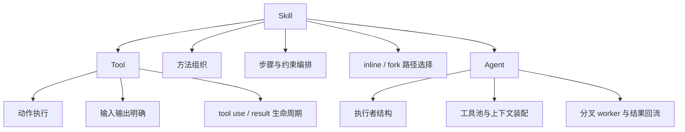

# 卷五 08｜skill、tool、agent 三者的边界到底是什么

## 导读

- **所属卷**：卷五：外部扩展与多代理能力
- **卷内位置**：08 / 25
- **上一篇**：[卷五 07｜什么样的 skill 才算好的 runtime skill](./07-what-makes-a-good-runtime-skill.md)
- **下一篇**：[卷五 09｜为什么 MCP 不是“多了一批远程工具”](./09-why-mcp-is-not-just-more-remote-tools.md)

## 这篇要回答的问题

skills 组到这里必须收一个边界：

> **tool、skill、agent 分别是什么层级，它们为什么不能互相压扁成一类东西？**

如果这里不切稳，后面进入 MCP 和 Agent 主轴就会串线：

- 把 tool 当成轻量 skill
- 把 skill 当成轻量 agent
- 把 agent 当成高级 tool

这三种说法都不对。

## 旧文章锚点

这篇主要回收：

- `docs/guidebook/volume-1/30-skill-vs-agent.md`
- `docs/guidebook/volume-1/15-skilltool-bridge.md`
- `docs/guidebook/volume-1/10-agenttool.md`

旧文给出的材料，放到卷五里可以压成一句总判断：

> **tool 负责动作执行，skill 负责方法组织，agent 负责执行者结构。**

## 源码锚点

这篇主要抓四个抓手：

- `cc/src/tools/SkillTool/SkillTool.ts`
- `cc/src/tools/AgentTool/runAgent.ts`
- `cc/src/utils/forkedAgent.ts`
- `cc/src/commands.ts`

## 先给结论

### 结论一：tool 解决“能做什么动作”

tool 的核心是动作能力本身：

- 读文件
- 改文本
- 跑命令
- 请求外部能力

它最关心的是输入、执行和结果。

### 结论二：skill 解决“这些能力该怎么被组织起来”

skill 并不亲自定义动作原语。

它主要负责：

- 哪些步骤先做
- 哪些约束先声明
- 哪些工具该怎样搭配
- 哪些情况该切 fork
- 交回什么样的结果

所以它位于方法组织层。

### 结论三：agent 解决“谁来承担这段工作，以及执行者如何继续分叉”

agent 的核心不是某一个动作，也不是某一套方法，而是：

- 当前由哪个执行者工作
- 这个执行者有哪些工具和上下文
- 是否需要更多执行者
- 结果怎样回流

所以它位于执行者结构层。

## 主证据链：三者为什么不是一回事

### 证据一：tool 是最底层动作入口

虽然这篇不重讲卷三工具主链，但 Claude Code 的工具对象天然长成“可直接执行”的样子：

- 有 schema
- 有输入
- 有结果
- 有 tool use / tool result 生命周期

它回答的始终是：

> 当前 turn 现在能直接做什么动作。

这和 skill / agent 的问题都不是一个层级。

### 证据二：skill 在 `commands.ts` / `loadSkillsDir.ts` 这一侧先被当成 prompt command

`commands.ts` 里，skills 会和 bundled skills、plugin skills 一起进入 commands 集合；而 SkillTool 面向的又是这类 `type === 'prompt'` 的对象。

这说明 skill 的第一身份不是“执行者”，而是：

> 一个可被发现、可被调用、可生成 prompt 内容的方法对象。

换句话说，skill 首先是**能力组织对象**，不是执行主体。

### 证据三：SkillTool 说明 skill 可以调用 tool，但自己不是 tool

`SkillTool.ts` 里，skill 被调用之后会：

- 走 inline 路径，把消息和运行时修饰注入当前线程
- 或走 fork 路径，先准备 skill prompt、allowed tools、agent，再交给子执行链

这说明 skill 当然会碰到工具和权限，但它自己的职责仍然是：

- 组织动作
- 编排步骤
- 包装工作包

它不是直接替代某个工具动作。

### 证据四：fork skill 说明 skill 可以触发 agent，但自己不是 agent

这是第 08 篇最关键的源码证据。

在 `SkillTool.ts` 里，若 `command.context === 'fork'`，会走 `executeForkedSkill(...)`；而这个函数又会在 `forkedAgent.ts` 中：

- 生成 `skillContent`
- 选 `command.agent ?? 'general-purpose'`
- 组装 `promptMessages`
- 最终调用 `runAgent(...)`

这条链路非常说明问题：

> skill 可以把一段工作组织成独立工作包，但真正承接这个工作包的执行主体仍然是 agent runtime。

所以 skill 能触发 agent，不等于 skill 自己就是 agent。

### 证据五：`runAgent.ts` 说明 agent 的重心是执行者装配

`runAgent.ts` 做的事情明显属于执行者结构层：

- 解析 agent 的工具池
- 装配 agent-specific options
- 初始化 agent 专属 MCP servers
- 注册 hooks
- 建立上下文和消息流
- 管理执行回合与结果回流

这些都不是 skill 的主语。

skill 可以影响“怎么做”，但 agent 才是“谁来做、怎么继续长出更多执行者”的主轴。

## mermaid 主图：skill / tool / agent 三层边界图

这张图要表达的是：

- skill 会向下碰到 tool
- skill 会向上碰到 agent
- 但它自己始终站在中间层

## 为什么 skill 不能被压成“高级 tool”

因为 tool 做的是动作本身，skill 做的是动作之间的关系。

两者最少有三层不同：

1. **tool 直接执行，skill 组织执行**
2. **tool 的完成通常是局部动作完成，skill 的完成更像一段工作流闭环**
3. **tool 不负责方法论，skill 天生就带方法组织**

## 为什么 skill 也不能被压成“轻量 agent”

因为 agent 关心的是执行者装配和协作，skill 关心的是给执行者一套工作方法。

即便某个 skill 会：

- `context: fork`
- 指定 `agent`
- 最后进入 `runAgent(...)`

它也只是把工作包交给执行者，而不是自己变成执行者本体。

## 这篇在组内为什么必须最后写

因为只有前面三件事先成立，这篇边界才能切稳：

- 第 05 篇先立住 skill 接进来的是用户方法
- 第 06 篇先立住 skill 如何进执行链
- 第 07 篇先立住什么样的 skill 才站得住

到这一步，第 08 篇才能收边界，而不是空讲术语。

同时它也为下一组留坡度：

- skill 不负责外部能力源接入，那是 MCP
- skill 不负责执行者主轴，那是 agent 主轴

## 一句话收口

> **tool 是动作执行层，skill 是方法组织层，agent 是执行者结构层；skill 可以调用 tool，也可能触发 agent 路径，但它本身既不是动作原语，也不是执行者本体，而是把动作能力与执行责任编排成稳定工作方法的中间层。**
