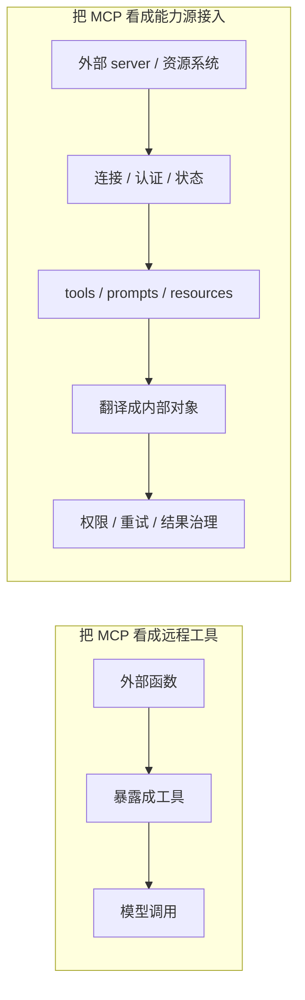

# 卷五 09｜为什么 MCP 不是“多了一批远程工具”

## 导读

- **所属卷**：卷五：扩展层与平台对象
- **卷内位置**：09 / 24
- **上一篇**：[卷五 08｜skill、tool、agent 三者的边界到底是什么](./08-boundaries-between-skill-tool-and-agent.md)
- **下一篇**：[卷五 10｜Claude Code 是怎样通过 MCP 接入外部能力源和资源系统的](./10-how-claude-code-uses-mcp-to-connect-external-capabilities-and-resource-systems.md)

MCP 组的第一个任务，不是立刻把接入链讲完，而是先拆掉一个太容易滑进去的误解：

> **MCP 不只是让 Claude Code 多接了一批远程工具。**

这个误解之所以常见，不是因为它完全错，而是因为它只看见了表面最显眼的一层：tool name 变多了，工具面好像扩容了。

但从卷四旧文保留下来的源码证据看，Claude Code 对 MCP 的处理远比“远程工具扩容”重得多。它处理的是：

- 外部节点怎样被识别
- 连接和认证状态怎样维持
- resources 怎样进入工作面
- 外部工具怎样被翻译进统一工具语义
- 外部能力怎样继续接受权限和结果治理

只要把这些都放回来，MCP 的真实层级就会显出来：

> **它是外部能力源与资源系统的接入层，而不是远程工具清单。**

## 先给结论

### 结论一：远程工具只是 MCP 最容易看见的外壳，不是它的完整对象身份

你当然可以说 MCP 会带来一批新工具，这没错。

但如果只留下这一句，读者会误以为：

- MCP 只是把 tool 放到远端
- 系统只是在工具列表里多了几个名字
- Claude Code 主要做的就是 RPC 转发

这些都太薄。

### 结论二：MCP 比“远程工具”更高一级，因为它接的是能力源和资源系统

卷四旧文最重要的证据，是 Claude Code 会从 MCP server 拉取：

- tools
- prompts
- resources

这已经说明它面对的不是孤立动作，而是一块外部能力面。尤其 resource 的存在，直接把 MCP 从“动作扩容”抬高成了“资源系统接入”。

### 结论三：MCP 还带着连接、认证和权限问题进入 runtime

一个普通“多几个工具”的想象，通常不会自带：

- `needs-auth`
- connection state
- URL elicitation retry
- result transform / process
- channel allowlist / relay gate

可这些在卷四旧文里都是主链而不是补丁。这说明 Claude Code 不是在接几个远程函数，而是在接**系统外能力节点**。

## 这篇的证据抓手

### 旧文章素材锚点

- `docs/guidebook/volume-4/01-mcp-runtime-entry.md`
- `docs/guidebook/volume-4/02-mcptool-call-chain.md`
- `docs/guidebook/volume-4/05-mcp-permission-boundary.md`

### 必读源码锚点

- `cc/src/mcp/`
- `cc/src/tools/MCPTool/`

这篇不需要把第 10 篇那条完整接入链重写一遍，但必须拿这些锚点证明：MCP 的对象级别高于“远程工具列表”。

## 先把主图立住：远程工具模型 vs 能力源接入模型

这张图的作用就是先打掉一个偷懒理解：

> **“远程工具”模型只看见调用动作；“能力源接入”模型才看见了 runtime 要接住的整块外部对象。**

## 一、为什么“多了一批远程工具”这个说法不够

### 1. 因为它只看见动作，不看见对象来源

卷四 `02-mcptool-call-chain.md` 明确写到，Claude Code 会把外部 tool 映射成自己的 `Tool` 抽象，并用统一格式命名，比如 `mcp__<server>__<tool>`。

这件事说明的，不只是“工具被规范命名”，而是 Claude Code 在强调：

- 这个动作来自哪里
- 它属于哪个外部 server
- 它不是内建工具的一次简单复制

如果只是普通远程工具扩容，系统没必要把“来源”编码进工具身份；而 Claude Code 明显把来源当成一等信息。

### 2. 因为它只看见调用，不看见资源进入工作面

卷四 `01-mcp-runtime-entry.md` 里，Claude Code 不只列 tools，还列 resources。这个证据非常硬。

一旦 resources 被正式拉进来，MCP 的角色就不可能再被压成“动作扩容”。因为它接进来的不仅是：

- 你能做什么

还包括：

- 你能从外部系统里读到什么
- 什么材料可以变成当前任务上下文

这已经是资源系统接入，而不是远程函数目录。

### 3. 因为它只看见能调，不看见节点状态

卷四的 MCP 旧文一直在强调连接、认证和状态迁移：

- `connected`
- `failed`
- `needs-auth`
- `pending`
- `disabled`

这些状态说明 Claude Code 面对的是一个外部能力节点，而不是调用时才临时碰一下的远端函数。

如果只是“多几个工具”，大多数系统不会给它们设计这么完整的状态机；Claude Code 会，说明它接的是活节点。

## 二、resources 为什么能一锤定音地证明 MCP 不只是工具扩容

这是第 09 篇最值得单拎出来的一点。

### tool 解决的是动作暴露

外部系统的某个能力，当然可以表现为一个 tool。比如查、搜、改、建，这些都可以被包装成动作入口。

### resource 解决的是材料暴露

但 resource 不一样。它不是“让模型多做一步”，而是“让模型能从系统外读进来一块材料世界”。

旧文里已经明确写到：

- Claude Code 会通过 `resources/list` 获取资源
- resource 会被翻译为资源工具或资源对象
- 某些资源会进入 attachment / message 语义
- 资源会被当作当前 turn 的工作材料，而不仅是工具返回值

只要这些成立，MCP 的身份就变了：

> **它不是远程动作柜子，而是外部动作面 + 外部材料面的统一接入层。**

## 三、认证状态机也说明 MCP 是能力节点，不是工具集合

第 09 篇不需要细拆 `performMCPOAuthFlow` 或 token 刷新细节，但必须利用卷四 `04-mcp-auth-state-machine.md` 留下来的判断：

> **`needs-auth` 是正式状态，不是报错文案。**

这句话为什么重要？因为它意味着 Claude Code 正在管理的，不是“某个工具这次调失败了”，而是“某个外部能力节点当前没有合法身份进入 runtime”。

这两者差别很大：

- 工具失败是一次调用问题
- 节点 needs-auth 是对象状态问题

一旦 Claude Code 选择了后者，MCP 的对象级别就已经超过“远程工具”。

## 四、统一权限边界也说明 Claude Code 接的是外部能力，不是裸 RPC

卷四 `05-mcp-permission-boundary.md` 给出了另一条很硬的证据：外部能力接进来以后，还要再过 Claude Code 的统一工具权限闸门，有些高风险入口还会额外过 allowlist / relay gate。

这说明 Claude Code 的真实路径不是：

- 接入 → 直接可用

而更像：

- 接入 → 翻译为 Tool → 进入统一 permission pipeline → 必要时再过额外信任边界

这种设计不会出现在“只是多几把远程工具”的轻模型里。它只会出现在这样一种更重的对象模型里：

> **系统正在认真治理来自外部世界的能力。**

## 五、为什么第 09 篇必须先把这个误解拆掉

因为如果不拆，后面两篇都会滑坡。

### 第 10 篇会被写轻

它本来该讲“外部能力源与资源系统怎样进入 runtime”，结果会被写成“远程工具接线图”。

### 第 11 篇会切不稳边界

如果你脑子里始终只剩“远程工具”，那 MCP 和 skills / hooks / plugins 的关系就会越来越糊：

- skill 看起来像“本地化的 MCP”
- hook 看起来像“给 MCP 加点回调”
- plugin 看起来像“把几个 MCP 打个包”

这些都不对。

所以第 09 篇的任务非常明确：

> **先把 MCP 从“远程工具扩容”这个浅理解里救出来。**

## 六、把这篇压回卷五对象地图

卷五 03 已经给过对象总图：

- skills 站在方法组织层
- MCP 站在外部能力源接入层
- agents / subagents 站在执行者结构层
- hooks 站在运行时接缝层
- plugins 站在统一封装层

第 09 篇的职责，就是防止 MCP 在读者脑中从“外部能力源接入层”塌回“多几个 tool”。

它不是要把第 10 篇写完，而是先把入口抬高一层。

## 这篇不展开什么

### 1. 不把完整接入链讲完

那是第 10 篇的任务。

### 2. 不把 auth / permissions 的细节正文展开完

这里只把它们当作证据，用来证明 MCP 的对象级别。

### 3. 不提前把和 skills / hooks / plugins 的边界切完

那是第 11 篇的任务。

## 一句话收口

> **MCP 不是“多了一批远程工具”，因为 Claude Code 接住的不是若干个远端动作名，而是一整块带来源、连接状态、认证状态、resources、统一工具语义和权限治理的外部能力面；远程工具只是它最表层的表现，外部能力源与资源系统接入才是它在卷五里的真实层级。**
