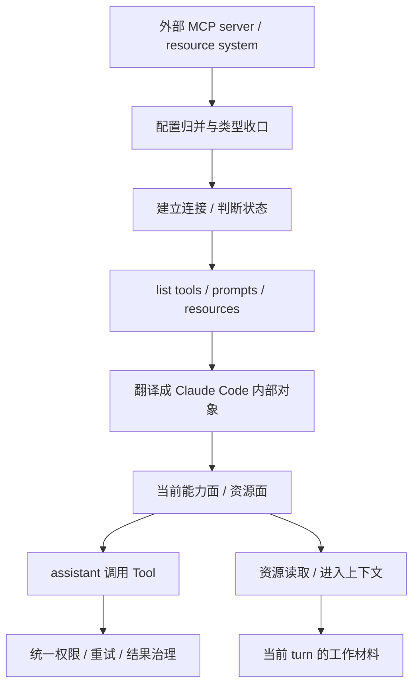

# 卷五 10｜Claude Code 是怎样通过 MCP 接入外部能力源和资源系统的

## 导读

- **所属卷**：卷五：扩展层与平台对象
- **卷内位置**：10 / 25
- **上一篇**：[卷五 09｜为什么 MCP 不是“多了一批远程工具”](./09-why-mcp-is-not-just-more-remote-tools.md)
- **下一篇**：[卷五 11｜MCP 和 skills / hooks / plugins 分别是什么关系](./11-how-mcp-relates-to-skills-hooks-and-plugins.md)

这一篇是 MCP 组的锚点篇。

它不回答“怎么配置一个 server”，也不回答“协议字段长什么样”，而是要先把主线钉住：

> **Claude Code 不是把外部 server 直接裸露给模型，而是通过一条 MCP 接入链，把系统外的能力源和资源系统翻译成 runtime 里可见、可调用、可治理的正式对象。**

如果这一条主线没立住，后面的 09 会滑回“远程工具扩容”，11 也会写成对象混桶。

## 先给结论

### 结论一：MCP 接进来的不是单个远程动作，而是一整块外部能力面

从卷四旧文的源码链看，Claude Code 面对 MCP server 时，看的不是“这里有个 API 可以调一下”，而是：

- 这是不是一个可接入的外部能力节点
- 它当前是否可连接、可认证
- 它暴露了哪些 tools / prompts / resources
- 这些东西怎样被翻译进 Claude Code 自己的 runtime

所以 MCP 组真正要讲的，不是“远程工具”，而是**外部能力源**。

### 结论二：Claude Code 通过 MCP 接住了两类东西：动作面和资源面

卷四 `01-mcp-runtime-entry.md` 里最重要的一条判断，是 Claude Code 接住的不是只有 tools，还包括 prompts / commands / resources。

这意味着外部世界进入系统时，并不只是一批“可执行动作”，还包括：

- 可读取、可浏览、可引用的资源对象
- 可进入当前工作面的上下文材料
- 需要被持续连接和治理的外部节点

所以第 10 篇必须把 **resource system** 明确写出来，不能只剩 tool call。

### 结论三：MCP 的关键，不是“连上去”，而是“收编进 runtime”

Claude Code 真正做的事，是把外部 server 先纳入自己的接入秩序，再纳入自己的工具语义、资源语义和权限秩序。

这条线更像：

> **外部 server 暴露能力 → Claude Code 识别并连接 → 拉取 tools / prompts / resources → 翻译成内部对象 → 进入当前能力面与执行链。**

## 这篇的证据抓手

### 旧文章素材锚点

- `docs/guidebook/volume-4/01-mcp-runtime-entry.md`
- `docs/guidebook/volume-4/02-mcptool-call-chain.md`
- `docs/guidebook/volume-4/04-mcp-auth-state-machine.md`

### 必读源码锚点

- `cc/src/mcp/`
- `cc/src/tools/MCPTool/`
- `cc/src/resources/`

虽然当前仓库里不带完整源码树，但卷四旧文已经把关键文件链路抽出来了，足够支撑这一篇的主证据链：

- 配置与类型收口：`types.ts`、`config.ts`
- 连接与状态：`client.ts`、`MCPConnectionManager.tsx`
- 工具收编：`fetchToolsForClient(...)`、`MCPTool.call(...)`
- 认证回路：`auth.ts`、`McpAuthTool.ts`
- 资源进入上下文：`resources/list`、资源工具与 attachment 语义

## 先把主图立住：MCP 接入外部能力源主链

这张图对应的核心意思是：

> **MCP 在 Claude Code 里不是一根裸连线，而是一条从外部能力节点到内部 runtime 对象的收编链。**

## 一、第一步不是调用，而是先把外部 server 收成 Claude Code 能处理的对象

卷四入口篇最值得保住的一个源码感觉，是 Claude Code 先做了配置归并和类型收口。

旧文里反复提到：不同 transport、不同来源、不同 scope 的 server，不会直接各玩各的，而是先被收成统一配置对象，再进入连接管理。

这一步的重要性在于，它把“系统外面有很多散的 server”变成了“runtime 可管理的一组外部能力节点”。

也就是说，MCP 真正的起点不是 `callTool`，而是：

- 先定义它是谁
- 先定义它从哪来
- 先定义它现在是什么状态

没有这一步，后面的连接、认证、权限、资源暴露都立不住。

## 二、第二步要处理的是连接状态，不是静态可用性

这一点是第 10 篇必须保住的源码证据感。

在卷四 `04-mcp-auth-state-machine.md` 里，MCP server 被明确写成有生命周期状态的对象，而不是“配置好了就等于能用”。旧文给出的典型状态包括：

- `connected`
- `failed`
- `needs-auth`
- `pending`
- `disabled`

这非常关键。它说明 Claude Code 不是把外部能力看成静态附录，而是看成 runtime 里的活节点。

所以 Claude Code 接 MCP 时，实际在处理的是：

- 这个节点现在是否可达
- 它是否处在合法身份状态
- 是否需要跳入重新认证
- 未来一段时间是否应该跳过无意义重连

这已经不是“多一个远程工具”能概括的复杂度了。

## 三、第三步才是拉取外部能力面：tools / prompts / resources

卷四 `01-mcp-runtime-entry.md` 里最关键的一句话，是 Claude Code 会从 server 拉取：

- tools
- prompts
- resources

这一步决定了第 10 篇的正文必须把 **resources** 写成主角之一，而不是顺手一提。

### tools 进入的是动作面

这是最容易理解的一层：外部系统暴露出的操作，被翻译成 Claude Code 可见的工具对象。

### resources 进入的是工作材料面

这一层更重要，也更容易被漏掉。

资源进入系统之后，不只是“多了个可以调用的函数”，而是多了一类可以：

- 读取
- 挂到上下文里
- 被持续引用
- 被当作当前任务材料消费

的对象。

这也是为什么卷五卡片要求第 10 篇必须写“外部能力源和资源系统”，不是只写 capability。

### prompts / commands 则说明它不是单纯 RPC 暴露

旧文还明确写到 prompts / commands 会一起进入系统。这进一步说明 Claude Code 面对 MCP server 时，接住的是一个完整能力面，而不是单一动作接口。

## 四、第四步：把外部能力翻译成 Claude Code 自己的工具语义

这一步的源码抓手主要来自 `02-mcptool-call-chain.md`。

那里最重要的判断不是“能调到远端”，而是：

> **Claude Code 会先把 MCP tool 编译进自己的 `Tool` 抽象，再让它进入统一工具执行链。**

旧文里给出的关键节点包括：

- `fetchToolsForClient(...)`
- `MCPTool.call(...)`
- `ensureConnectedClient(...)`
- `callMCPToolWithUrlElicitationRetry(...)`
- `callMCPTool(...)`
- `transformMCPResult(...)`
- `processMCPResult(...)`

这条链说明，Claude Code 并没有把外部能力原样塞给模型，而是把它收编进自己的工具运行时：

- 统一命名
- 统一权限入口
- 统一错误处理
- 统一结果整形
- 统一输出语义

所以从 runtime 视角看，MCP 不只是“能连外面”，而是“把外面的动作翻译成 Claude Code 自己能管的动作”。

## 五、资源为什么比工具更能说明 MCP 是能力源接入层

第 09 篇会专门解释“为什么 MCP 不是多几把远程工具”，但第 10 篇这里已经可以先把最硬的一点钉住：

> **resource 的存在，直接证明 MCP 不是单纯的动作扩容。**

因为 resource 不是“帮你做一个动作”，而是“把系统外的一部分材料世界正式引进当前工作面”。

在卷四旧文里，MCP resource 被写成能够：

- 通过 `resources/list` 被发现
- 被翻译为 `ServerResource[]` 或资源工具
- 在 attachment / message 语义里进入上下文
- 作为当前任务材料被消费，而不只是一次工具输出

这层一旦看到，MCP 的系统地位就会上升：

- tool 是动作入口
- resource 是材料入口
- MCP 则是这两者共同的外部接入层

## 六、认证状态机说明 Claude Code 接的是“外部节点”，不是“远程函数”

第 10 篇不需要展开认证状态机细节，但必须借它证明一件事：Claude Code 面对的对象不是远程函数，而是外部能力节点。

原因很简单。只有在你把 MCP server 看成一个外部节点时，下面这些设计才合理：

- `needs-auth` 作为正式状态
- 认证失败后缓存状态，跳过无意义重连
- 注入 `authenticate` 一类能力帮助恢复
- 在 401、session expired 时把节点从 connected 打回 needs-auth

如果它只是一个 RPC wrapper，这些设计都太重；但如果它是外部能力源接入层，这些设计就完全合理。

## 七、MCP 进入执行链后，还要继续接受 Claude Code 的治理

这也是第 10 篇必须比旧废稿更硬的一点。

外部能力一旦被接进来，并没有结束。它只是从“外部散点”变成了“系统内对象”，接下来还要继续接受运行时治理：

- 权限判断
- 连接可用性判断
- 认证恢复
- 调用重试与人机补偿
- 结果转译与上下文收口

换句话说，Claude Code 做的不是“接进来就放养”，而是：

> **先接，再翻译，再治理。**

这条链，才是第 10 篇真正的主证据链。

## 八、把第 10 篇压回卷五对象地图里

放回卷五总图，MCP 在这里回答的是：

- **外面有什么能力源** 能正式接进来
- **外面有什么资源系统** 能进入当前工作面
- **这些外部对象** 怎样变成 runtime 里的工具、资源与可治理节点

所以它的层级位置很明确：

> **MCP 站在外部能力源接入层，而不是方法层、执行者层、运行时接缝层或封装层。**

这句话必须在第 10 篇先立住，第 11 篇才好做边界收口。

## 这篇不展开什么

### 1. 不把 09 的“反误解任务”重写一遍

这里重点不是反驳“远程工具”，而是正面立主链。

### 2. 不把 11 的边界收口提前讲完

这里只确认 MCP 的站位，不展开它和 skills / hooks / plugins 的完整边界分工。

### 3. 不细拆所有 auth / permission / result 处理实现

这些是主证据链的支撑，不是本篇唯一正文。

## 一句话收口

> **Claude Code 通过 MCP 接进来的，不是一批裸露给模型的远程接口，而是一整层可被配置、连接、认证、发现、翻译和治理的外部能力源与资源系统：server 先被收成 runtime 可管理的节点，再把 tools / prompts / resources 拉进来，最后翻译成 Claude Code 自己的工具语义与资源语义，进入当前能力面和执行链。**
