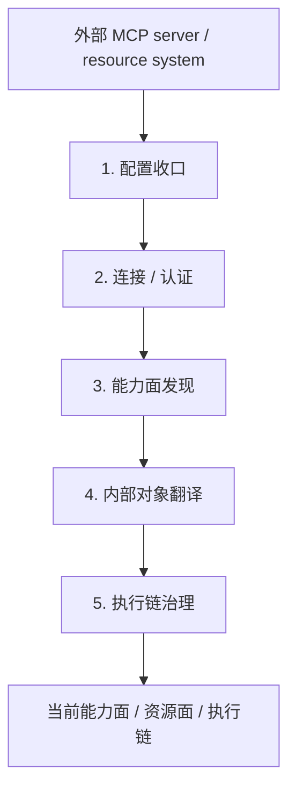

# 卷五 10｜Claude Code 是怎样通过 MCP 接入外部能力源和资源系统的

## 导读

- **所属卷**：卷五：扩展层与平台对象
- **卷内位置**：10 / 25
- **上一篇**：[卷五 09｜为什么 MCP 不是“多了一批远程工具”](./09-why-mcp-is-not-just-more-remote-tools.md)
- **下一篇**：[卷五 11｜MCP 和 skills / hooks / plugins 分别是什么关系](./11-how-mcp-relates-to-skills-hooks-and-plugins.md)

第 09 篇已经先把一个误解拆掉了：MCP 不是远程工具扩容。

那第 10 篇就不再继续证明它“不是谁”，而是直接回答更硬的问题：

> **Claude Code 到底怎样把系统外的 MCP server、tools、prompts、resources，正式接进自己的 runtime？**

这一篇是 MCP 组的锚点篇。

它不回答：
- 怎么配置一个 server
- 协议字段长什么样
- 某个具体 MCP server 的产品能力

它只回答一件事：

> **外部能力节点是怎样被收进 Claude Code，变成 runtime 里可见、可调用、可治理的正式对象的。**

所以这篇最重要的不是再讲“它不只是远程工具”，而是把主链钉稳。

---

## 先把 5 步主链钉死

MCP 接入在 Claude Code 里，不是一根“连上就能用”的直线，而是 5 个阶段。

把这 5 步再压成一张标准表：

| 阶段 | 它在做什么 | 产出是什么 |
|---|---|---|
| 1. 配置收口 | 把不同来源、不同 transport 的 server 收成统一可管理配置 | runtime 可识别的外部节点配置 |
| 2. 连接 / 认证 | 判断 server 当前是否 connected / failed / needs-auth | 有状态的能力节点 |
| 3. 能力面发现 | 拉取 tools / prompts / resources | 外部动作面与资源面 |
| 4. 内部对象翻译 | 把外部暴露对象映射成 Claude Code 自己的 Tool / Command / Resource 语义 | 内部 runtime 可消费对象 |
| 5. 执行链治理 | 把调用、认证恢复、重试、结果整形、权限判断收进统一链路 | 可调用、可治理、可回收的执行对象 |

这张表就是第 10 篇的主骨架。

如果读者最后只记住这一张表，这篇就已经立住了。

---

## 先把几个最关键的对象名钉住

为了避免后面术语漂掉，这里先把几个对象一次定义清楚：

### `server / node`
指系统外那个 MCP 能力节点。

也就是说，它不是单个动作，而是一整块外部能力来源。

### `tool`
指这个外部节点暴露出的动作入口。

它解决的是：
- 你能做什么动作

### `resource`
指这个外部节点暴露出的资源对象或材料入口。

它解决的是：
- 你能把什么外部材料引进当前工作面

### `internal object`
指 Claude Code 在 runtime 里真正消费的内部对象。

也就是说，外部 server 暴露出来的东西，不会原样直接丢给模型，而会先被翻译成 Claude Code 自己的对象语义。

把这四个词钉住之后，后面的 5 步主链就会清楚很多。

---

## 第一步：配置收口——先把外部 server 变成可管理节点

MCP 接入的起点，不是 `callTool`，而是配置收口。

卷四 `01-mcp-runtime-entry.md` 已经把这件事讲得很清楚：Claude Code 不会让不同 transport、不同来源、不同 scope 的 server 各玩各的，而是先把它们统一收成标准配置对象。

这一层最重要的意义不是“读配置文件”，而是：

> **把系统外面很多散的 server，收成 runtime 真能管理的一组能力节点。**

也就是说，Claude Code 先要知道：

- 这个节点是谁
- 它从哪来
- 它该怎么连
- 它现在处在哪种配置范围内

如果这一步没有先做，后面的：
- 连接
- 认证
- 去重
- policy 过滤
- enterprise 接管

都立不住。

所以第 10 篇一开始就必须讲清：

> **MCP 先进入的不是调用层，而是配置与对象定义层。**

---

## 第二步：连接 / 认证——Claude Code 接的是活节点，不是静态附录

配置收口之后，下一步不是“已经可用了”，而是要进入连接和认证阶段。

这一步最关键的证据来自卷四 `04-mcp-auth-state-machine.md`：Claude Code 明确把 MCP server 当作有生命周期状态的对象，而不是“配置好了就能调”的静态附录。

典型状态包括：

- `connected`
- `failed`
- `needs-auth`
- `pending`
- `disabled`

这一步很重要，因为它说明：

> **Claude Code 面对的不是一个远程函数，而是一个当前可能可达、也可能不可达，可能已认证、也可能 needs-auth 的外部能力节点。**

这就是为什么 MCP 接入在 Claude Code 里天然会长出：

- 连接状态
- 认证恢复
- needs-auth 缓存
- session expired 后的状态迁移

如果它只是“多几把远程工具”，这些设计都会显得太重；但如果它接的是外部节点，这些设计就非常自然。

所以第二步最应该记住的一句话是：

> **MCP server 在 Claude Code 里是活节点，不是静态外挂。**

---

## 第三步：能力面发现——Claude Code 拉进来的不只是 tool，还有 prompts / resources

连接成立之后，才进入能力面发现。

这一步是第 10 篇最不能写轻的地方。

卷四入口篇已经明确留下了三类对象：

- tools
- prompts
- resources

如果这里只写 tools，第 10 篇就会直接塌回“远程工具接线图”。

### tools 进入的是动作面

这层最直观：外部节点暴露的操作，会变成 Claude Code 可见的动作入口。

也就是说，MCP server 不只是“连上了”，而是开始把自己的动作面暴露给 runtime。

### resources 进入的是工作材料面

这层更关键。

resource 不是“再多一个函数”，而是：

- 外部系统里可读取的材料
- 可以被拉进当前上下文的工作对象
- 能被引用、挂接、消费的资源面

也就是说，MCP 在这里接进来的不仅是：
- 你能做什么

还包括：
- 你能读到什么
- 什么外部材料能进入当前任务

这就是为什么第 10 篇标题必须写“外部能力源和资源系统”，不能只写 capability。

### prompts / commands 说明它不只是在暴露动作

prompts / commands 的存在，说明外部节点暴露的不是只有动作入口，还包括：

- 可被系统枚举的提示/命令对象
- 可继续翻译成 Claude Code 自己 command 语义的上层能力

所以第三步回答的是：

> **外部节点到底暴露了什么。**

它暴露的是：
- tool
- prompt / command
- resource

也就是一整块外部能力面。

---

## 第四步：内部对象翻译——Claude Code 最终把这些东西当成什么来消费

这是第 10 篇的主菜。

因为“发现”还不等于“纳入 runtime”。真正关键的是：Claude Code 会把这些外部暴露对象，翻译成自己内部真正能消费的对象语义。

卷四 `02-mcptool-call-chain.md` 给出的链路已经很清楚：

- `fetchToolsForClient(...)`
- `MCPTool.call(...)`
- `ensureConnectedClient(...)`
- `callMCPToolWithUrlElicitationRetry(...)`
- `callMCPTool(...)`
- `transformMCPResult(...)`
- `processMCPResult(...)`

这里最关键的判断不是“它能调到远端”，而是：

> **Claude Code 会先把 MCP tool 编译进自己的 `Tool` 抽象，再让它进入统一工具执行链。**

这意味着外部能力不是原样透给模型，而是会经过一层内部对象翻译：

- 统一命名
- 统一输入 / 输出语义
- 统一权限入口
- 统一错误处理
- 统一结果整形

同样，resource 也不是“远端附件列表”，而是会变成当前 runtime 可以理解和消费的资源对象。

所以第四步最该让读者记住的是：

> **MCP 接入不是把外部世界原样搬进来，而是先把外部世界翻译成 Claude Code 自己能管的对象。**

这就是“收编进 runtime”的真正含义。

---

## 第五步：执行链治理——接进来之后，还要继续被 Claude Code 自己的 runtime 管

很多人会觉得：

- 接进来了
- 也翻译成内部对象了
- 那 MCP 这条线应该就结束了

但 Claude Code 不是这么处理的。

第 10 篇最后一步必须讲清：

> **MCP 真正成立，不在于“接进来”，而在于“接进来以后还继续接受 Claude Code 自己的治理”。**

也就是说，进入执行链之后，它还要继续受这些东西约束：

- 权限判断
- 连接可用性判断
- 认证恢复
- 调用重试与人机补偿
- 结果转译与上下文收口

这条线非常重要，因为它说明 Claude Code 做的不是：

- 接入 → 放养

而是：

- **接入 → 翻译 → 治理**

这也正是为什么 MCP 在卷五里必须被写成“外部能力源接入层”，而不是“远程工具配置功能”。

因为一个真正的接入层，最后一定会有治理。

---

## 这一篇在 MCP 组里的职责

到这里，第 10 篇的职责已经很清楚了。

它必须做的是：

- 把 5 步主链钉死
- 把对象术语一次性定义清楚
- 把资源面和动作面一起写进 runtime
- 把“接进来以后如何继续被治理”收清楚

所以第 10 篇真正负责的是：

> **解释 MCP 怎样把外部能力接进 runtime。**

而第 11 篇才继续回答另一件事：

> **MCP 和 skills / hooks / plugins 的系统边界到底在哪里。**

---

## 这篇不展开什么

- **不重做** 第 09 篇的反误解任务
- **不提前吃掉** 第 11 篇的边界收口
- **不细拆完** 所有 auth / permission / result transform 细部实现

第 10 篇只做一件事：

> **把 MCP 作为外部能力源接入层的主链写稳。**

---

## 一句话收口

> **Claude Code 通过 MCP 接进来的，不是一批裸露给模型的远程接口，而是一整层可被配置、连接、认证、发现、翻译和治理的外部能力源与资源系统：server 先被收成 runtime 可管理节点，再把 tools / prompts / resources 拉进来，翻译成 Claude Code 自己的内部对象，最后进入当前能力面、资源面与执行链，并继续接受统一治理。**
