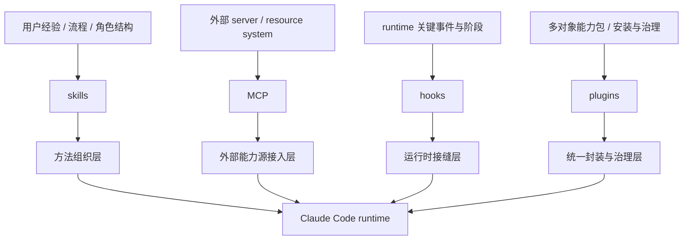

# 卷五 11｜MCP 和 skills / hooks / plugins 分别是什么关系

## 导读

- **所属卷**：卷五：扩展层与平台对象
- **卷内位置**：11 / 25
- **上一篇**：[卷五 10｜Claude Code 是怎样通过 MCP 接入外部能力源和资源系统的](./10-how-claude-code-uses-mcp-to-connect-external-capabilities-and-resource-systems.md)
- **下一篇**：待后续回合衔接 Agent 主轴

MCP 组前两篇已经做了两件事：

- 第 09 篇先拆掉“远程工具扩容”的浅理解
- 第 10 篇把 MCP 立成了外部能力源与资源系统的接入主线

到了第 11 篇，就不能继续给 MCP 加细节了。现在最要紧的是**收边界**。

因为只要这里不切稳，卷五后面几组就会互相串线：

- skills 被写成“本地版 MCP”
- hooks 被写成“围着 MCP 转的回调层”
- plugins 被写成“把 MCP 打包起来的壳”

这些都不对。

所以第 11 篇真正要回答的是：

> **MCP 和 skills / hooks / plugins 分别站在什么层级，各自解决什么问题？**

## 先给结论

### 结论一：MCP 解决的是外部能力源接入，不是工作方法组织

skills 回答的是“这类事该怎么做”；MCP 回答的是“系统外面有什么能力和资源能正式接进来”。

前者属于方法组织层，后者属于外部能力源接入层。

### 结论二：MCP 解决的是外部能力进入系统，不是 runtime 在哪里开放干预接缝

hooks 关心的是运行时节点和干预位置：什么时候能观察、插手、改写。MCP 关心的则是外部能力节点怎样进入当前工作面。

前者是接缝层，后者是能力源层。

### 结论三：MCP 也不是 plugins 的上位词；plugins 关心的是统一封装与治理

plugin 可以承载 MCP，但 plugin 不等于 MCP。

MCP 讲的是接入一种外部能力关系；plugin 讲的是把 skills / hooks / MCP 等内容收成可安装、可治理、可分发的完整单元。

## 这篇的证据抓手

### 旧文章素材锚点

- `docs/guidebook/volume-4/03-cli-plus-skill-vs-many-mcp.md`
- `docs/guidebook/volume-4/05-mcp-permission-boundary.md`
- `docs/guidebook/volume-4/15-plugin-conclusion.md`

### 必读源码锚点

- `cc/src/mcp/`
- `cc/src/hooks/`
- `cc/src/plugins/`
- `cc/src/skills/`

第 11 篇不要求像第 10 篇那样细拆 call chain，但必须保住足够清楚的源码感觉：

- skills 有自己的发现、加载、调用入口
- MCP 有自己的配置、连接、工具/资源翻译入口
- hooks 有自己的事件接缝与 hook runtime
- plugins 有自己的 loader、schema、attachment、distribution 线

只要这些入口是分开的，这几类对象就不可能被混成一类。

## 先把主图立住：MCP / skills / hooks / plugins 边界图

这张图最重要的作用，是把四个对象放回**不同入口、不同职责、不同层级**。

## 一、MCP 和 skills：一个接外部能力，一个组织做事方法

### skills 关心的是“这类事怎么做”

skills 这一组前面已经立住：它们把用户经验、流程和角色结构编进 Claude Code，让系统知道：

- 该按什么顺序做
- 哪些约束要先守住
- 什么结果才算完成
- 什么时候该 inline，什么时候该切执行位置

这是一种方法组织能力。

### MCP 关心的是“外面有什么正式能力能进来”

MCP 不回答工作流怎么组织。它回答的是：

- 哪个外部系统能接进来
- 它暴露了哪些 tools / resources
- 这些外部对象怎样进入当前工作面

这是一种能力源接入能力。

### 两者可以协作，但不能混

卷四 `03-cli-plus-skill-vs-many-mcp.md` 给了第 11 篇一个很好用的判断：skill 更像低常驻成本的方法模块，MCP 更像高能力密度、也更重的外部动作面。

所以更稳的关系是：

- **skill 决定怎么组织一类工作**
- **MCP 提供某些这类工作需要调用的外部能力**

也就是说，skill 可以使用 MCP，但 skill 不是 MCP 的另一种写法。

## 二、MCP 和 hooks：一个把能力接进来，一个决定 runtime 哪里能插手

### hooks 不解决“接什么”，而解决“在哪插手”

hooks 这一组之后会展开，但第 11 篇必须先把边界切干净：hooks 的核心不是能力来源，而是 runtime 在哪些关键阶段开放：

- 观察
- 注入
- 干预
- 改写

所以 hooks 面向的是事件接缝。

### MCP 不解决接缝，而解决外部能力进入工作面

MCP 的问题始终更靠外部世界：

- 能不能连上这个外部节点
- 它带来了哪些动作与资源
- 它怎样继续处在统一权限和结果治理之下

所以最短的切法是：

> **MCP 解决“接什么能力进来”，hooks 解决“runtime 在哪里允许插手”。**

### 为什么不能把 hooks 写成 MCP 的附属层

因为即使没有任何 MCP，hooks 也仍然成立。Claude Code 依然需要在 session start、tool use、permission 等关键节点暴露结构化接缝。

反过来，即使没有 hooks，MCP 也依然要处理外部 server、resources、auth、tool translation。

两者可以协作，但不是主从关系。

## 三、MCP 和 plugins：一个是接入对象，一个是封装对象

### plugin 不是“更大一点的 MCP”

这是第 11 篇必须先切掉的误会。

很多人看到 plugin 能包含 MCP server，就容易顺手把 plugin 理解成“把一些 MCP 打包起来的东西”。

但卷四 plugin 线保住的主判断不是这个。plugin 的重点是：

- loader
- schema / policy
- attachment points
- install / distribution
- 来源、启停和治理

所以 plugin 关心的是更高一级的封装与治理。

### MCP 可以成为 plugin 的内容之一，但不等于 plugin 本身

更准确的关系是：

- MCP 是外部能力源接入对象
- plugin 是统一扩展封装单元

前者回答“系统外能力怎么进来”，后者回答“多种扩展内容怎样被封成一个可安装、可治理、可分发的能力包”。

### 为什么这一点对后文很重要

因为如果把 plugin 写成 MCP 的上位词，后面的 plugins 组三篇会立刻变成空壳：它们本来该讲的封装、分发、复用成熟度，就会被提前冲掉。

所以第 11 篇必须把这条边界先收住。

## 四、为什么第 11 篇不能越界去吃 hooks / plugins 正文

卡片已经明确要求：这篇只能把边界切干净，不能把 hooks / plugins 的正文展开完。

原因也很简单。第 11 篇是 MCP 组的边界收口篇，不是后两组的锚点篇。

所以这里要做的是：

- 把层级切清
- 把误解拆掉
- 给后面两组留出展开空间

而不是提前把 hooks 的事件类型、plugin 的 loader / marketplace 全讲完。

## 五、把四者压成一张最短分工表

不画表格，只压成四句话：

- **skills**：把用户经验、流程和角色结构组织成方法单元
- **MCP**：把外部能力源和资源系统正式接进 runtime
- **hooks**：在运行时关键节点开放观察、注入和干预接缝
- **plugins**：把多种扩展内容封装成可安装、可治理、可分发的统一单元

这四句如果稳住，卷五后面几组就不容易串线。

## 六、为什么源代码入口本身就能证明它们不是一类对象

第 11 篇虽然不细拆源码，但可以利用入口差异保住一个很强的证据感：

- skills 走的是发现、加载、`SkillTool` 调用链
- MCP 走的是配置、连接、`MCPTool`、resources 翻译链
- hooks 走的是 runtime event / hook 执行链
- plugins 走的是 loader、schema、attachment、distribution 链

如果它们只是同一种对象的不同叫法，就不会有这么清楚的入口分化。

恰恰因为它们各自站在不同层，Claude Code 才要给它们不同的 runtime 接入路径。

## 这篇不展开什么

### 1. 不重讲第 09 / 10 篇

第 11 篇不再完整重论“为什么不是远程工具”，也不再完整重讲接入链。

### 2. 不提前吃 hooks 正文

这里只切层级，不展开各种 hook 类型与事件位置。

### 3. 不提前吃 plugins 正文

这里只说明 plugin 是封装与治理层，不展开完整 loader / schema / marketplace 主线。

## 一句话收口

> **MCP 在卷五里解决的是系统外能力源与资源系统怎样正式进入 Claude Code runtime；它不负责像 skills 那样组织工作方法，不负责像 hooks 那样提供运行时接缝，也不负责像 plugins 那样承担统一封装、安装和治理，所以它必须被稳稳放在“外部能力源接入层”，而不是一个什么都能往里装的中间万能对象。**
