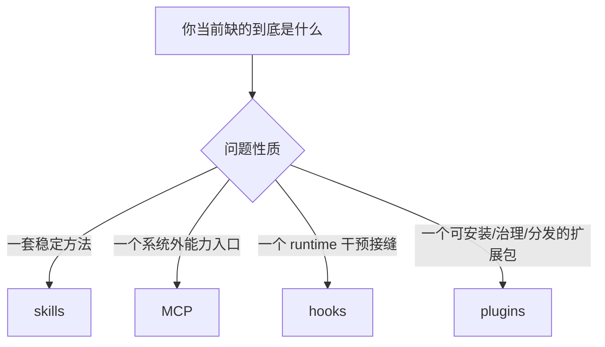

# 卷五 11｜MCP 和 skills / hooks / plugins 分别是什么关系

## 导读

- **所属卷**：卷五：扩展层与平台对象
- **卷内位置**：11 / 24
- **上一篇**：[卷五 10｜Claude Code 是怎样通过 MCP 接入外部能力源和资源系统的](./10-how-claude-code-uses-mcp-to-connect-external-capabilities-and-resource-systems.md)
- **下一篇**：[卷五 12｜Claude Code 里的 agent，跟 tool 不是一回事](./12-why-agent-is-not-just-another-tool.md)

到第 11 篇，MCP 组已经把两件事讲清了：

- 第 09 篇先拆掉了“远程工具扩容”的浅理解
- 第 10 篇已经把 MCP 立成了外部能力源与资源系统的接入主线

那现在最要紧的，就不是继续给 MCP 加细节，而是收边界。

因为如果这里不切稳，卷五后面几组就会立刻串线：

- skills 被写成“本地版 MCP”
- hooks 被写成“围着 MCP 转的回调层”
- plugins 被写成“把 MCP 打包起来的壳”

这些都不对。

所以第 11 篇不再解释 MCP 怎么接入 runtime，而只回答一件事：

> **先别问它们分别是什么，先问你现在缺的是方法、外部能力入口、runtime 接缝，还是可安装扩展包。**

也就是说，第 11 篇的任务不是再多讲对象关系，而是给读者一把真正能用的**边界裁决尺子**。

---

## 先把边界决策图压出来

先不要急着看定义，先看判断框架：

再压成一张最短决策表：

| 你当前真正缺的是什么 | 更该看哪层 |
|---|---|
| 一套做事方法、一段工作流程 | skills |
| 一个系统外能力源 / 资源系统入口 | MCP |
| 一个在运行时节点插手、观察、改写的接缝 | hooks |
| 一个统一安装、治理、分发的扩展封装单元 | plugins |

如果读者最后只记住这一张表，第 11 篇就已经成立。

---

## 先用一个真实判断场景把这张表落地

还是拿一个最容易混的现实需求来举例：

### 场景：团队想让 Claude Code 和飞书一起工作

这里有四种完全不同的问题：

| 真正的问题 | 更该选什么 |
|---|---|
| 想教 Claude Code 遇到飞书相关任务时按固定步骤处理 | skill |
| 想让 Claude Code 正式访问飞书里的外部数据和动作 | MCP |
| 想在某些 runtime 节点自动插入检查或改写逻辑 | hook |
| 想把“飞书相关 skill + MCP + hook + 配置”打成一个可安装能力包 | plugin |

这张表最重要的价值是让读者意识到：

> **“都和飞书有关”不等于“都该落在同一层”。**

真正该判断的，不是你在接哪个产品，而是你到底在解决哪一类系统问题。

---

## 第一组边界：MCP 和 skills

这组是最容易混的，因为两者都会让 Claude Code“变强”。

但它们强的方式不是一回事。

### skills 回答的是：这类事该怎么做

skills 组前面已经立住：它们把用户经验、流程和角色结构编进 Claude Code，让系统知道：

- 该按什么顺序做
- 哪些约束要先守住
- 什么结果才算完成
- 什么时候该 inline，什么时候该切执行位置

所以 skills 站在的是：

> **方法组织层。**

### MCP 回答的是：外面有什么正式能力能进来

MCP 不回答工作流怎么组织。

它回答的是：

- 哪个外部系统能接进来
- 它暴露了哪些 tools / prompts / resources
- 这些外部对象怎样进入当前工作面

所以 MCP 站在的是：

> **外部能力源接入层。**

### 一句最短裁决

> **skill 决定怎么做，MCP 决定能接什么外部能力进来。**

### 什么时候容易误判

最常见的误判是：

- 看到某个任务要调用外部系统
- 就觉得这一定是 MCP 的问题

但很多时候你真正缺的不是外部接入，而是：

- 一套怎么使用已有能力的稳定方法

这就是为什么卷四 `03-cli-plus-skill-vs-many-mcp.md` 那篇很关键。

如果你已经有：

- 稳定本地 CLI
- 足够可信的本地执行环境
- 缺的主要是“怎么用它”的方法组织

那更适合的是：

> **CLI + skill**

而不是一上来就做 MCP。

### 一句更实战的切法

- **skill**：解决方法，不解决外部能力入口
- **MCP**：解决外部能力入口，不解决工作方法
- **什么时候该选它**：缺方法 → skill；缺系统外正式入口 → MCP

---

## 第二组边界：MCP 和 hooks

这组也容易被写混，因为两者都和 runtime 有关系。

但它们关心的不是同一层 runtime。

### hooks 回答的是：runtime 在哪里允许你插手

hooks 的核心不是能力来源，而是运行时接缝。

它关心的是：

- 哪些关键节点可观察
- 哪些关键节点可注入
- 哪些关键节点允许干预和改写

也就是说，hooks 解决的是：

> **runtime 在哪里开放了结构化插手点。**

### MCP 回答的是：什么外部能力能进入当前工作面

MCP 的问题始终更靠外部世界：

- 能不能连上这个外部节点
- 它带来了哪些动作与资源
- 它怎样继续处在统一权限和结果治理之下

所以最短的切法是：

> **MCP 解决“接什么进来”，hooks 解决“进来以后 runtime 在哪里允许插手”。**

### 为什么 hooks 不是 MCP 的附属层

因为就算没有任何 MCP，hooks 也仍然成立。

Claude Code 依然需要在：
- session start
- tool use
- permission
- stop / finish

这些关键节点暴露结构化接缝。

反过来，即使没有 hooks，MCP 也依然要处理：
- 外部 server
- resources
- auth
- tool translation

所以两者可以协作，但不是主从关系。

### 一句更实战的切法

- **hooks**：解决 runtime 在哪里开放插手点，不解决能力来源
- **MCP**：解决能力来源，不解决 runtime 接缝
- **什么时候该选它**：缺可插手节点 → hooks；缺系统外能力入口 → MCP

---

## 第三组边界：MCP 和 plugins

这组如果不切稳，后面的 plugins 组会直接被写空。

### plugin 不是“更大一点的 MCP”

很多人看到 plugin 能包含 MCP server，就会自然滑到一个判断：

> plugin 不就是把一些 MCP 打成一个包吗？

这个理解不完全错，但远远不够。

卷四 `15-plugin-conclusion.md` 保住的主判断不是“它能装很多东西”，而是：plugin 已经在做：

- loader
- schema / policy
- attachment points
- install / distribution
- 来源、启停和治理

所以 plugin 关心的不是某一种接入关系，而是：

> **怎样把多种扩展内容收成一个统一封装、统一安装、统一治理、统一分发的单元。**

### MCP 是接入对象，plugin 是封装对象

更准确的关系是：

- MCP 是外部能力源接入对象
- plugin 是统一扩展封装单元

前者回答：
- 系统外能力怎么进来

后者回答：
- 多种扩展内容怎样被封成一个可安装、可治理、可分发的能力包

### 三种最容易混的情况

这里最值得直接给出裁决句：

#### 1. 什么时候只是 MCP 配置
- 你只是接一个外部能力源
- 重点是接入，不是打包
- 不需要统一安装 / 分发 / 治理壳

#### 2. 什么时候是 plugin 打包 MCP
- 你不只是接一个 MCP
- 你还要把它和其它扩展内容一起封成可安装单元
- 重点已经变成“扩展包的统一治理”

#### 3. 什么时候是 skill 调用 MCP
- 外部能力已经通过 MCP 接进来了
- 你现在缺的是“怎么使用这批能力”的稳定方法
- 重点是工作流组织，不是接入本身

这三句一旦写清，11 才真像边界裁决文，而不是对象关系说明文。

### 一句更实战的切法

- **MCP**：解决外部能力接入，不解决统一打包治理
- **plugin**：解决统一打包治理，不负责替你定义某个外部能力协议
- **什么时候该选它**：缺外部能力接入 → MCP；缺扩展包封装与治理 → plugin；缺一套调用这些能力的方法 → skill

---

## 为什么这四者不可能是同一种对象的不同叫法

第 11 篇虽然不细拆源码，但可以利用入口差异保住一个很强的证据感：

- skills 走的是发现、加载、`SkillTool` 调用链
- MCP 走的是配置、连接、`MCPTool`、resources 翻译链
- hooks 走的是 runtime event / hook 执行链
- plugins 走的是 loader、schema、attachment、distribution 链

如果它们只是同一种对象的不同名字，就不会有这么清楚的入口分化。

所以第 11 篇最应该保住的一句话就是：

> **这四类对象不是“都算扩展”，而是“都在不同层解决扩展问题”。**

---

## 把四者压成一张最短分工表

最后再压成一张最短表：

| 对象 | 它真正解决什么 |
|---|---|
| skills | 把用户经验、流程和角色结构组织成方法单元 |
| MCP | 把外部能力源和资源系统正式接进 runtime |
| hooks | 在运行时关键节点开放观察、注入和干预接缝 |
| plugins | 把多种扩展内容封装成可安装、可治理、可分发的统一单元 |

这张表如果稳住，卷五后面几组就不容易串线。

---

## 这篇不展开什么

- **不重讲** 第 09 / 10 篇：这里不再完整重论“为什么不是远程工具”或“接入链怎样成立”
- **不提前吃掉** hooks 正文：这里只切层级，不展开各种 hook 类型和事件位置
- **不提前吃掉** plugins 正文：这里只说明 plugin 是封装与治理层，不展开 loader / schema / marketplace 主线

第 11 篇只做一件事：

> **把 MCP 和 skills / hooks / plugins 的边界切稳，让读者以后会判。**

---

## 一句话收口

> **MCP 在卷五里解决的是系统外能力源与资源系统怎样正式进入 Claude Code runtime；它不负责像 skills 那样组织工作方法，不负责像 hooks 那样提供运行时接缝，也不负责像 plugins 那样承担统一封装、安装和治理，所以真正会用这套系统，关键不是把所有扩展对象混成一类，而是先判断自己现在缺的是方法、外部能力、运行时接缝，还是一个统一扩展包。**
