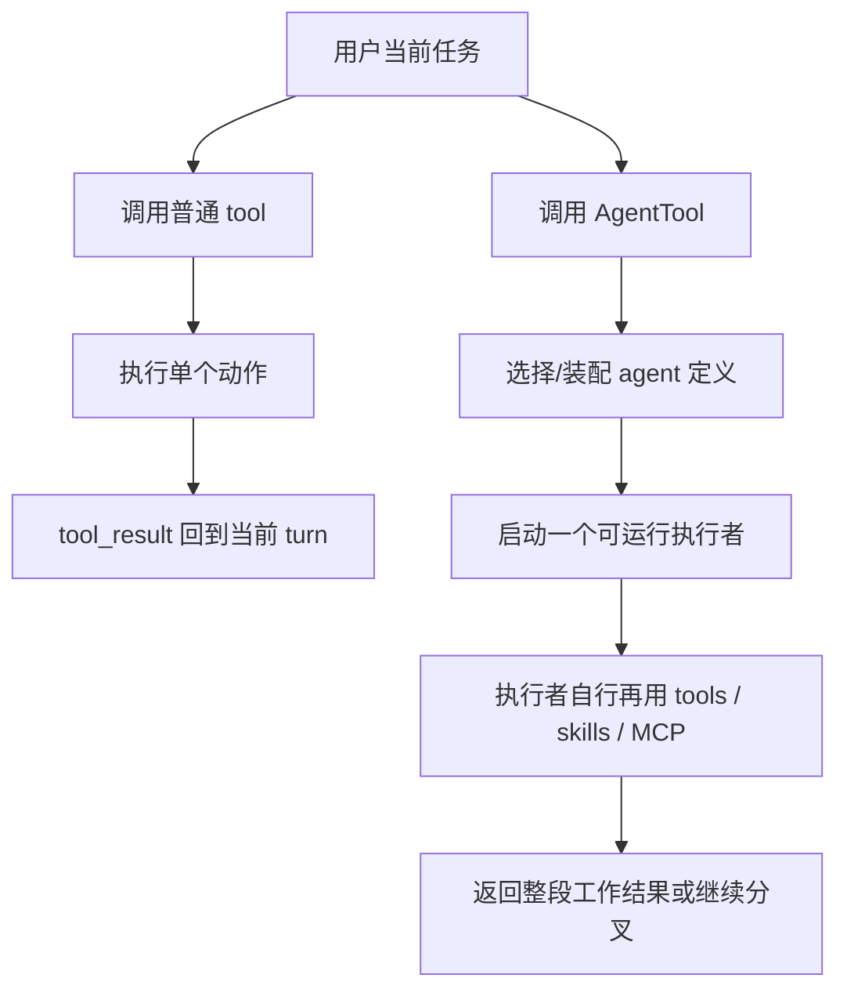

# 卷五 12｜为什么 agent 不是“另一个工具”

## 这篇要回答的问题

Agent 主轴真正的入口误解只有一个：**agent 看起来也会把事做下去，所以它是不是只是一个更高级的 tool？**

这篇先把这个误解打掉。否则后面的 `runAgent`、`forkSubagent`、worker 分叉、结果回流，都会被误写成“工具套工具”。

## 先给结论

- **tool 处理动作。** 它回答“现在执行什么动作、怎么收结果”。
- **agent 处理执行者。** 它回答“这段工作由谁承担、带着什么上下文和能力面去做、是否继续派工”。
- 所以 `AgentTool` 看起来叫 tool，但它触发的不是一次动作，而是**一个执行体**。

## 这篇不讲什么

- 不展开 `runAgent` 的装配细节，那是第 14 篇。
- 不展开 subagent / worker 的后半段，那是第 15-17 篇。
- 不越界去吃 hooks / plugins / 卷六。

## 旧文与源码锚点

### 旧文素材锚点
- `docs/guidebook/volume-1/10-agenttool.md`
- `docs/guidebook/volume-1/30-skill-vs-agent.md`

### 源码锚点
- `cc/src/tools/AgentTool/AgentTool.tsx`
- `cc/src/tools/AgentTool/loadAgentsDir.ts`

## 先看图：tool 和 agent 的执行对象不是一回事

图里最关键的区别是：**tool 的完成单位通常是动作；agent 的完成单位更像一段工作。**

## 证据先落到源码上

### 证据 1：`AgentTool` 的输入不是“一个动作”，而是一项委派任务

`AgentTool.tsx` 的基础输入 schema 里，最核心的是：

- `description`
- `prompt`
- `subagent_type`
- `model`
- `run_in_background`

这组字段的重心不是“调用哪个动作参数”，而是“把什么任务委派给哪个执行者，以什么方式运行”。如果它只是普通 tool，schema 的重心应当更像一次动作调用；但这里明显已经是**任务派发接口**。

### 证据 2：`AgentTool` 会先筛 agent，而不是直接做动作

`AgentTool.prompt(...)` 里会：

- 收集当前可见工具，尤其是 MCP tools
- 过滤 MCP requirements 不满足的 agents
- 再按 permission rules 过滤 agents
- 最后再给模型渲染 agent 选择提示

这说明 `AgentTool` 首先在处理的是：**当前有哪些执行者可被选择**。这和普通 tool 完全不同。普通 tool 直接暴露动作；`AgentTool` 暴露的是执行者入口。

### 证据 3：agent 在定义层里本来就是运行时对象，不是文案别名

`loadAgentsDir.ts` 里的 `AgentDefinition` 至少带这些字段：

- `tools`
- `disallowedTools`
- `skills`
- `mcpServers`
- `hooks`
- `model`
- `permissionMode`
- `maxTurns`
- `background`
- `isolation`

一个普通 tool 不需要这么多“执行体边界”字段；agent 需要，因为它不是单个动作，而是**带权限、能力面和生命周期的执行者对象**。

## 为什么 agent 不是“更大的 tool”

### 第一，tool 解决动作执行，agent 解决执行责任

普通 tool 更像动作原语：读文件、改文件、执行命令、发请求。

agent 不一样。它要回答的是：

- 谁接这段工作
- 这个执行者带什么上下文与工具池
- 是否还要继续拆给别的 worker

所以两者不是大小区别，而是层级区别。

### 第二，tool_result 回的是动作结果，agent 回的是一段工作结果

tool 跑完后，通常就是把这次动作结果回给当前 turn。

agent 跑完后，主线程拿到的往往不是“某个动作的返回值”，而是：

- 一段分析结果
- 一次子任务产物
- 一份可以继续整合的工作输出

也就是说，agent 更像“承接一段工作”的执行单元。

### 第三，agent 天然导向更多执行者结构

只要系统里已经有了 agent，后面就很自然会继续碰到：

- 为什么主 agent 还要派 subagent
- 为什么会有 fork worker
- 主 agent 和 worker 怎样回流

这条后续主线本身就是证据：**agent 从一开始就不是动作工具，而是执行者结构的入口。**

## 从卷五地图看，agent 补上的到底是什么

卷五前面已经有：

- **tool / skill** 这条线：动作与方法组织
- **MCP** 这条线：外部能力源接入

到了 agent，Claude Code 补上的不是一个新动作，而是另一种平台能力：

> **执行责任可以被正式外化给不同执行者。**

所以第 12 篇真正要立住的，不是“agent 更聪明”，而是：

> **Claude Code 开始不只组织能力，还组织承担工作的执行者。**

## 和后文的关系

- 第 13 篇接着回答：Claude Code 是怎样从单执行者长出更多执行者的。
- 第 14 篇再往下落：`runAgent` 怎样把执行者真正装成可运行体。
- 第 15-17 篇再解释：同一条执行者主线怎样走到 subagent / worker / 回流。

## 一句话收口

> `AgentTool` 虽然名字里有 tool，但它真正触发的不是一次动作，而是一个带上下文、工具池、权限和生命周期的执行者；所以 agent 不是“另一个工具”，而是 Claude Code 把执行责任正式做成运行时对象的开始。