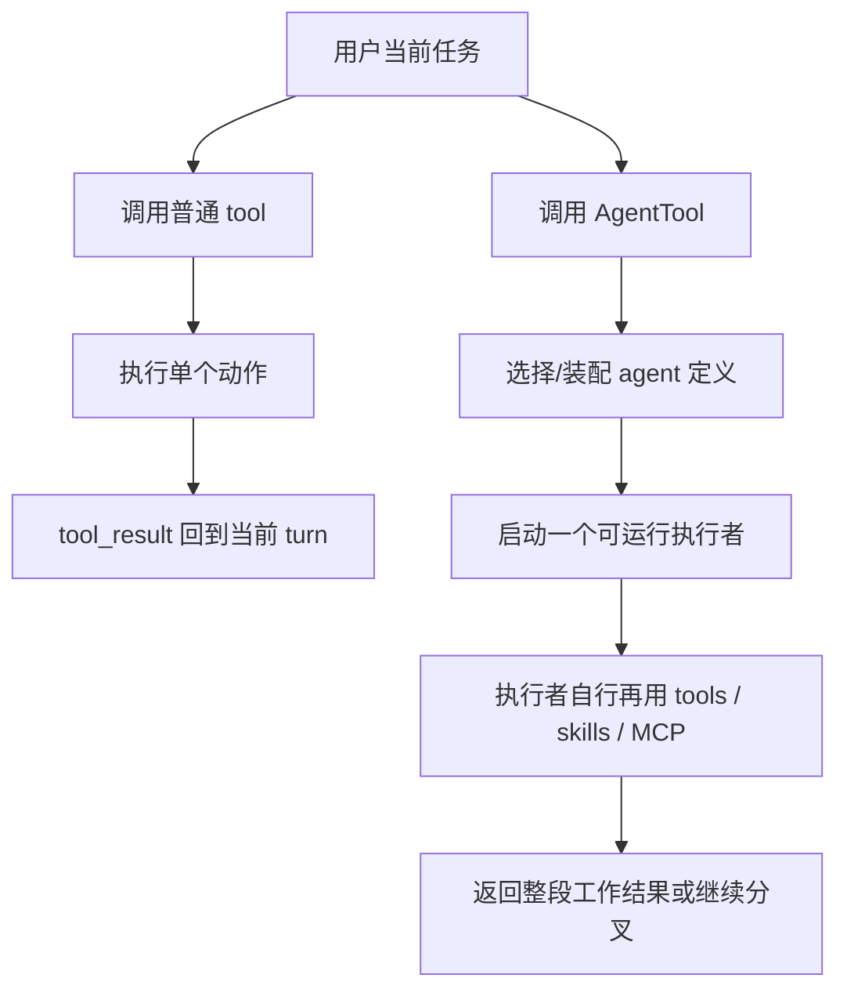

# 卷五 12｜Claude Code 里的 agent，跟 tool 不是一回事

## 导读

- **所属卷**：卷五：外部扩展与多代理能力
- **卷内位置**：12 / 25
- **上一篇**：[卷五 11｜MCP 和 skills / hooks / plugins 分别是什么关系](./11-how-mcp-relates-to-skills-hooks-and-plugins.md)
- **下一篇**：[卷五 13｜Claude Code 一开始就准备了一组 agent](./13-how-claude-code-grows-more-executors.md)

MCP 组收完之后，卷五接下来要正式进入 agent 主轴。

而这条主轴最容易踩进去的误解，其实只有一个：

> **agent 看起来也会把事情做下去，所以它是不是只是一个更高级的 tool？**

先用一个最短场景把这句话打透：

- **tool**：读几个文件、跑一次命令、改一段文本
- **agent**：把“检查这轮改动到底对不对，并总结风险”正式委派给一个独立执行者，再等它回交一段工作结果

这两者看起来都在“做事”，但层级完全不同。

> **tool 处理动作，agent 处理执行者。**

也就是说，第 12 篇不是在讲“一个更强的工具”，而是在讲：Claude Code 从这里开始，不只组织能力，还开始正式组织承担工作的执行者。

---

## 先把决策图压出来

先不要急着陷进定义，先看这张最短图：

这张图最关键的区别是：

> **tool 的完成单位通常是动作；agent 的完成单位更像一段工作。**

再压成一张最短对照表：

| 你现在在调什么 | 它真正交付的是什么 |
|---|---|
| tool | 一个动作结果 |
| agent | 一段工作结果 |

如果这张表读者记住了，第 12 篇就已经立住了一半。

---

## 第一层：tool 解决“现在做什么动作”，agent 解决“这段工作由谁承担”

tool 和 agent 最大的区别，不在于谁更强，而在于它们在系统里负责的层级不同。

tool 解决的是：

- 读文件
- 改文本
- 跑命令
- 调一个外部动作

也就是说，tool 真正在回答：

> **现在执行什么动作？**

而 agent 不一样。

agent 真正在回答的是：

- 这段工作由谁接手
- 这个执行者带什么工具池
- 它在什么上下文里工作
- 它是否还要继续分叉出别的执行者

也就是说，agent 回答的是：

> **这段工作由谁承担？**

这就是为什么第 12 篇必须先切一句最短裁决：

> **tool 负责动作，agent 负责执行责任。**

这不是大小区别，而是层级区别。

---

## 第二层：`AgentTool` 的输入一眼就说明它不是普通动作调用

如果一个东西只是普通 tool，它的输入 schema 往往会更像一次动作调用：

- 参数是什么
- 输入是什么
- 返回结果是什么

但 `AgentTool.tsx` 不是这样。

卷一 10 已经把它的核心输入收得很清楚：

- `description`
- `prompt`
- `subagent_type`
- `model`
- `run_in_background`
- `name`
- `team_name`
- `mode`
- `isolation`
- `cwd`

这组字段最值得注意的，不是数量多，而是重心变了。

它不再像是在说：

- 这次动作输入什么参数

而是在说：

- 这项任务叫什么
- 这项任务要做什么
- 交给什么类型的执行者
- 它在哪个环境里跑
- 它是同步承接，还是后台承接

所以 `AgentTool` 的基本单位根本不是“新开一个会话”，而是：

> **把一项任务正式委派给一个执行者。**

这也是为什么它从 schema 层开始就已经不像一个普通动作工具。

---

## 第三层：`AgentTool` 先筛执行者，而不是先做动作

这一点也特别能说明问题。

普通 tool 的典型路径往往是：

- 工具已确定
- 输入已给定
- 现在开始做动作

但 `AgentTool` 不是这样。

从卷一 10 那条线可以看出，它在真正执行之前，会先处理：

- 当前有哪些 agent 可被选择
- 哪些 agent 的 MCP requirements 其实不满足
- 哪些 agent 会被 permission rules 过滤掉
- 当前 team / teammate / background / isolation 条件是否允许这种委派方式

也就是说，`AgentTool` 首先在处理的不是动作，而是：

> **当前有哪些执行者有资格承接这段工作。**

这一步非常关键。

因为一旦系统要先筛选执行者，你就已经不在动作层了。你已经进入了执行者层。

所以 `AgentTool` 在 Claude Code 里的真实地位更像：

- 执行者入口
- 委派入口
- 子执行体选择入口

而不是一个高阶动作按钮。

---

## 第四层：agent 在定义层里本来就是运行时对象，不是文案别名

另一条很硬的证据来自 `loadAgentsDir.ts`。

卷一 30 那篇已经把这点讲得很清楚：agent 从定义层开始就不是 prompt 包装，也不是一个文案 alias。

一个 `AgentDefinition` 里至少会带：

- `tools`
- `disallowedTools`
- `skills`
- `mcpServers`
- `hooks`
- `model`
- `permissionMode`
- `maxTurns`
- `background`
- `isolation`

这类字段跟普通 tool 最大的区别就在于：

它们不是在描述“一次动作怎么做”，而是在描述：

- 一个执行者带什么能力面
- 它受什么权限边界约束
- 它要在什么生命周期里工作
- 它是不是可以独立跑回合

所以从定义层看，agent 的本质就已经非常明确了：

> **它是一个带工具池、权限、上下文和生命周期边界的执行体。**

而不是一个多带几个参数的“超级工具”。

---

## 第五层：tool_result 回的是动作结果，agent 回的是一段工作结果

再往下看，tool 和 agent 在结果这一侧也完全不是一回事。

### tool 的典型返回是什么

通常是：
- 某个动作的返回值
- 一次调用的结果
- 这一步操作的产物

也就是说，tool_result 的完成单位通常是：

> **一个动作完成。**

### agent 的典型返回是什么

而 agent 跑完后，主线程拿到的更常常是：

- 一段分析结果
- 一次子任务产物
- 一份可以继续整合的工作输出
- 或者一个还会继续分叉的工作状态

这说明 agent 的完成单位更像：

> **一段工作完成，或者一段工作被正式接住并推进。**

这也是为什么第 12 篇不能只说“agent 更复杂”。

更准确的说法应该是：

> **tool 返回动作结果，agent 返回工作结果。**

这句话一旦稳住，后面整条 agent 主轴都会顺很多。

---

## 第六层：agent 天然会继续长出更多执行者结构

还有一条很重要的证据，不在单个函数里，而在整条后续主线本身。

只要系统里已经有了 agent，后面就会很自然继续碰到这些问题：

- 为什么主 agent 还要派 subagent
- 为什么会有 fork worker
- 主 agent 和 worker 的信息怎样回流
- 为什么同一条执行者链会继续长出更多执行者

也就是说，agent 从一开始就不是“一个更强动作”，而是：

> **执行者结构的入口。**

如果它只是 tool 的加强版，后面根本不需要继续长出：

- subagent
- teammate
- background agent
- worktree isolation
- team context

这些结构。

所以第 12 篇还可以再压一句很硬的话：

> **agent 一旦成立，后面自然长出来的就不会只是更多动作，而是更多执行者。**

这件事本身就是它不是 tool 的最强证据之一。

---

## 从卷五地图看，agent 补上的到底是什么

卷五前面已经有两条线：

- tool / skill：动作与方法组织
- MCP：外部能力源接入

到了 agent，Claude Code 补上的不是一个新动作，也不是一种新方法，而是另一种平台能力：

> **执行责任可以被正式外化给不同执行者。**

这就是第 12 篇最该立住的系统位置。

也就是说，Claude Code 从这里开始不只是在组织：

- 该做什么动作
- 该按什么方法做
- 能接什么外部能力

它开始正式组织：

- **谁来承担这段工作。**

这才是 agent 这一层在卷五里的真正重量。

---

## 为什么第 12 篇不能提前吃掉后面的 runAgent / subagent 正文

第 12 篇最容易越界的地方，就是一旦说到 agent 很重，就忍不住提前把：

- `runAgent`
- subagent
- worker
- 回流

都讲掉。

但这篇其实不需要那样做。

因为它的职责不是展开整条执行者主线，而是先拆掉一个误解：

> **agent 不是另一个工具。**

后面的文章才继续讲：

- 第 13 篇：Claude Code 是怎样长出更多执行者的
- 第 14 篇：`runAgent` 怎样把执行者装成可运行体
- 第 15-17 篇：同一条执行者主线怎样走到 subagent / worker / 回流

所以第 12 篇最好的姿势不是把后文讲完，而是把地基打牢。

---

## 这篇真正要让读者带走什么

第 12 篇最后最该留下来的，不是函数名，而是三句话：

1. **tool 解决动作，agent 解决执行者**
2. **`AgentTool` 触发的不是一次动作，而是一项正式委派**
3. **agent 返回的不是单步动作结果，而是一段工作结果**

只要这三句站稳，第 12 篇就完成了自己的职责。

---

## 一句话收口

> **`AgentTool` 虽然名字里有 tool，但它真正触发的不是一次动作，而是一个带上下文、工具池、权限和生命周期的执行者；所以 agent 不是“另一个工具”，而是 Claude Code 把执行责任正式做成运行时对象的开始。**
