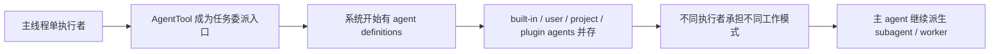

# 卷五 13｜Claude Code 一开始就准备了一组 agent

## 导读

- **所属卷**：卷五：外部扩展与多代理能力
- **卷内位置**：13 / 25
- **上一篇**：[卷五 12｜Claude Code 里的 agent，跟 tool 不是一回事](./12-why-agent-is-not-just-another-tool.md)
- **下一篇**：[卷五 14｜这组 agent 是怎么被拉进当前任务的](./14-why-runagent-feels-like-an-agent-runtime-assembly-line.md)

第 12 篇已经先回答了一个问题：

> **agent 是什么？——它是执行者，不是工具。**

那第 13 篇要继续回答的是另一件事：

> **Claude Code 里为什么不是只有一个 agent，而是一开始就准备了一组 agent？**

而第 14 篇才会再回答第三件事：

> **这组执行者在 runtime 里是怎样被真正拉进当前任务的？**

把这三问切开之后，第 13 篇的职责就很明确了：它不是再证明 agent 是什么，也不是提前展开 runAgent，更不是解释为什么主 agent 还要继续往下派工；它只负责把“执行者名册是怎么先成立的”这条主线立住。

---

## 先把执行者扩张图压出来

先看总图：

再压成一张最短判断表：

| 系统现在发生了什么 | 这意味着什么 |
|---|---|
| 不再只有主线程自己做完全部工作 | 执行责任开始外化 |
| 系统能识别多种 agent definition | 执行者成为正式 runtime 对象 |
| 不同 agent 带不同工具池、权限、背景模式 | 执行者开始分工 |
| 主执行者还能继续派生别的执行者 | 系统开始长出执行者结构，而不只是更多动作 |

这张表就是第 13 篇最该让读者先记住的骨架。

---

## 先用一个最短场景把“更多执行者”讲透

还是先不用急着看源码，先看一个真实场景。

### 场景：主线程要完成一项比较复杂的工程任务

这类任务往往同时要求：

- 查材料
- 规划结构
- 修改文件
- 验证结果
- 还要始终守住总体目标

如果整个过程都只由主线程自己做，会发生什么？

- 主线程要同时盯所有局部动作
- 上下文会越来越厚
- 局部探索和全局判断会互相打架
- 验证和执行也会混在一起

这时候问题往往已经不是“有没有工具”，而是：

> **要不要把某些工作正式交给别的承担者。**

这就是 Claude Code 开始需要“更多执行者”的起点。

也就是说，系统往上长出来的，不再只是：

- 更多 tool
- 更多 skill
- 更多外部能力

而是：

- **更多正式承接工作的执行者**

这就是第 13 篇最该先立住的系统压力。

---

## 主证据链一：`AgentTool` 让任务委派成为正式入口

从源码上看，执行者扩张主线的第一块地基仍然是 `AgentTool.tsx`。

卷一 10 已经讲得很清楚：`AgentTool` 的输入不是某个动作参数，而是一项要被委派出去的任务：

- `description`
- `prompt`
- `subagent_type`
- `model`
- `run_in_background`
- `isolation`
- `cwd`

这意味着 Claude Code 在这里第一次明确做了一件事：

> **把“把工作交给另一个执行者”做成了系统正式入口。**

所以执行者扩张不是从“很多 agent 文件”开始，而是从：

> **任务委派成为 runtime 一等能力**

开始。

---

## 主证据链二：`loadAgentsDir.ts` 让执行者集合成为正式对象

如果只有 `AgentTool`，系统仍然只是“能派任务”。

真正让“更多执行者”变成系统对象的，是 `loadAgentsDir.ts` 这一层。

Claude Code 不只是现场随便拉一个新会话，而是会先把 agent 定义加载进系统，正式处理：

- built-in agents
- plugin agents
- user / project / policy agents

然后得到当前可见、可用的一组执行者对象。

这一步的真正意义是：

> **执行者从“这次临时派出去的人”变成了“系统预先知道的一组可选承担者”。**

也就是说，多执行者成立的第二块地基不是“多开几个会话”，而是：

> **执行者集合先作为 runtime 对象成立。**

---

## 主证据链三：`builtInAgents.ts` 和 definition fields 让分工真正发生

第 13 篇最能让“更多执行者”变得具象的，不是抽象判断，而是 `builtInAgents.ts` 和 agent definition 本身。

Claude Code 官方并不是只给一个通用执行者，而是已经开始内建多种不同工作模式的执行者：

- `GENERAL_PURPOSE_AGENT`
- `EXPLORE_AGENT`
- `PLAN_AGENT`
- `VERIFICATION_AGENT`
- 以及其它内建角色

这里最关键的不是“名字多了”，而是：

> **系统已经把不同工作姿态，正式做成了不同执行者模板。**

如果再往下看 definition fields，会更清楚这一点。真正重的不是语气，而是边界：

- `tools`
- `disallowedTools`
- `skills`
- `mcpServers`
- `hooks`
- `model`
- `permissionMode`
- `maxTurns`
- `background`
- `isolation`

这些字段说明的不是“人设”，而是：

- 它带什么能力面
- 它受什么权限边界约束
- 它在哪种执行模式里工作
- 它的回合和成本边界在哪里

所以 agent definition 真正像的不是角色名录，而是：

> **执行体的工作模板。**

---

## 这篇只先把“执行者名册”立住

第 13 篇到这里就应该收住，不再继续往后讲运行时派工。

因为只要这篇已经立住三件事，就够了：

- 系统里不是只有一个抽象主脑
- agent definitions 是正式对象，不是口头约定
- built-in agents / loadAgentsDir 让一组执行者模板先成立

也就是说，这篇真正补上的不是“为什么后面一定会出现 subagent / worker”，而是：

> **Claude Code 在运行之前，就已经承认一组可被识别、可被加载、可被选择的执行者对象。**

至于这组对象怎样进入当前任务，为什么主 agent 还要继续拆活，那是第 14、15 篇才回答的问题。

---

## 从卷五地图看，13 真正补上的是什么

卷五前面已经有：

- skills：方法组织
- MCP：外部能力源接入
- 12：agent 不是工具

那 13 再往前走一步，真正补上的，不是某个具体执行机制，而是：

> **Claude Code 不再只有一个承担者，而开始拥有一组可分工、可扩张、可继续派生的执行者。**

也就是说，卷五在这里第一次把“谁来做这段工作”正式推成了系统主线。

这才是 13 的真正重量。

---

## 这篇不展开什么

- **不展开** `runAgent` 的装配细节——那是第 14 篇
- **不展开** subagent / worker 的后半段——那是第 15-17 篇
- **不把** subagent 再拆成另一组平级对象

第 13 篇只做一件事：

> **先把“更多执行者怎样成立”立成 Agent 主轴的锚点。**

---

## 一句话收口

> **Claude Code 长出的不只是更多能力，而是更多承担工作的执行者：`AgentTool` 让任务委派成为正式入口，`loadAgentsDir` 让执行者变成可加载的 runtime 对象，`builtInAgents` 则把不同工作模式做成不同执行者模板，于是 agent / subagent / worker 才能被写成同一条执行者主线，而不是几类平级名词。**
