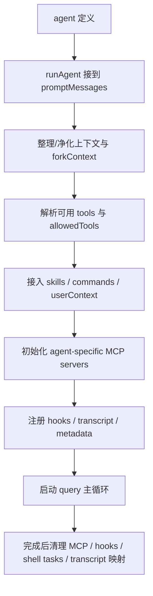

# 卷五 14｜这组 agent 是怎么被拉进当前任务的

## 导读

- **所属卷**：卷五：外部扩展与多代理能力
- **卷内位置**：14 / 24
- **上一篇**：[卷五 13｜Claude Code 一开始就准备了一组 agent](./13-how-claude-code-grows-more-executors.md)
- **下一篇**：[卷五 15｜为什么主 agent 还要继续把活拆出去](./15-why-the-main-agent-needs-to-spawn-subagents.md)

第 13 篇先把“系统里已经有一组可被识别、可被加载、可被选择的执行者”立住了。

第 14 篇往前推进的，不是“agent 存不存在”，而是：

> **这组已经存在的 agent，到底是怎么被拉进一次当前任务里的？**

也就是说，这篇只负责把 `runAgent` 写成一条正式装配主干：它怎样把 agent 定义、上下文、能力面和生命周期编成一个可运行执行体；至于为什么主 agent 还要继续拆活，那是第 15 篇的问题。

## 这篇要回答的问题

第 13 篇已经先立住了“系统里有一组 agent”这件事，但那还只是静态层。

第 14 篇接着要回答的是：

> **这组已经存在的 agent，到底是怎么被拉进一次当前任务里的？**

所以这篇的重点不是泛讲 agent，也不是提前讲为什么主 agent 还要继续拆活，而是盯住 `AgentTool.tsx` 和 `runAgent.ts` 这一段主线，看静态定义怎样真正进入运行中的当前任务。

## 旧文与源码锚点

### 旧文素材锚点
- `/Users/haha/.openclaw/workspace/claude-code-source-guide/docs/guidebook/volume-1/11-runagent-assembly-line.md`
- `/Users/haha/.openclaw/workspace/claude-code-source-guide/docs/guidebook/volume-1/19-runagent-skill-mainline.md`
- `/Users/haha/.openclaw/workspace/claude-code-source-guide/docs/guidebook/volume-1/13-loadagentsdir.md`

### 源码锚点
- `/Users/haha/.openclaw/workspace/cc/src/tools/AgentTool/runAgent.ts`
- `/Users/haha/.openclaw/workspace/cc/src/tools/AgentTool/agentToolUtils.ts`
- `/Users/haha/.openclaw/workspace/cc/src/tools/AgentTool/loadAgentsDir.ts`
- `/Users/haha/.openclaw/workspace/cc/src/tools/AgentTool/AgentTool.tsx`

## 主图：runAgent 装配主链

## 先给结论

- `runAgent` 不是薄薄一层“调用 agent”。
- 它做的是：**把 agent 定义、上下文、工具池、skills、MCP、hooks、权限和生命周期装成一个执行体。**
- 没有这条装配线，后面的 subagent / fork worker 都没有共同底座。

## 主证据链

agent 先以定义形式存在 → `AgentTool` 选中某个执行者后进入 `runAgent` → `runAgent` 组装上下文、工具面、skills、MCP、hooks 与 transcript → query 主循环才真正开始 → 因而 `runAgent` 不是调用包装，而是 agent runtime 的装配主干。

## 源码证据：`runAgent` 到底装了什么

### 证据 1：它先处理的是上下文，而不是立即开跑

`runAgent(...)` 的输入里就有：

- `promptMessages`
- `forkContextMessages`
- `contentReplacementState`
- `availableTools`
- `allowedTools`
- `worktreePath`
- `transcriptSubdir`

这组参数已经说明：进入 `runAgent` 的不是一句 prompt，而是一套待装配的执行环境。

### 证据 2：它专门初始化 agent 自己的 MCP servers

`runAgent.ts` 顶部的 `initializeAgentMcpServers(...)` 会：

- 读取 agent frontmatter 里的 `mcpServers`
- 连接 server
- 拉工具
- 在 agent 结束时清理 agent-specific clients

这意味着 `runAgent` 装的不只是本地 tool pool，还把**外部能力源**装进 agent。

### 证据 3：它显式处理 hooks、transcript 和 metadata

文件里直接 import 并调用了：

- `registerFrontmatterHooks`
- `executeSubagentStartHooks`
- `recordSidechainTranscript`
- `writeAgentMetadata`
- `setAgentTranscriptSubdir`

这些都不是“跑起来再说”的薄层逻辑，而是典型的 runtime 装配行为：

- 把执行轨迹挂上
- 把 hooks 接上
- 把 agent metadata 写好

### 证据 4：它还负责善后清理

`runAgent.ts` 里同时引入：

- `clearSessionHooks`
- `killShellTasksForAgent`
- `clearAgentTranscriptSubdir`
- MCP client cleanup
- perfetto tracing register / unregister

这说明 `runAgent` 不是只负责启动，还负责**生命周期闭环**。装配线不是“开机按钮”，而是从上件到下线都管。

## 为什么这更像装配线，而不是函数包装层

### 第一，它装的是执行体，不是动作

普通 tool 执行更像“把一个动作做掉”。

`runAgent` 处理的是：

- 这个执行者是谁
- 它带什么上下文
- 它能看到哪些能力
- 它要受哪些边界约束
- 它的运行轨迹怎么记录

这天然就是装配问题。

### 第二，它把卷五前几组对象重新接进 agent 主线

从卷五视角看，`runAgent` 至少会把这些层重新接进来：

- **tools**：具体动作能力
- **skills**：方法组织
- **MCP**：外部能力源
- **hooks**：运行时接缝

因此第 14 篇不能写成孤立 agent 文；它其实是卷五对象在执行者主线上重新汇合的一次装配。

### 第三，它是 15-17 的共同底座

后面的：

- subagent 派生
- fork worker
- 结果回流

都不是从空气里长出来的。它们成立的前提是：**系统已经有一条统一的 agent 装配主干。** 这条主干就是 `runAgent`。

## 这篇不展开什么

- 不把 `forkSubagent` 的继承细节提前讲完，那是第 16 篇。
- 不把主 agent / worker 的边界与回流提前讲完，那是第 17 篇。
- 不越界去吃 hooks 组正文，只在这里把 hooks 当装配件点到为止。

## 一句话收口

> `runAgent` 之所以像一条装配线，不是因为它名字像启动函数，而是因为它真的在做装配：它把 agent 定义、上下文、工具池、skills、MCP、hooks、transcript 和清理责任一起编进一个可运行执行体，后面的 worker 分叉都建立在这条主干上。