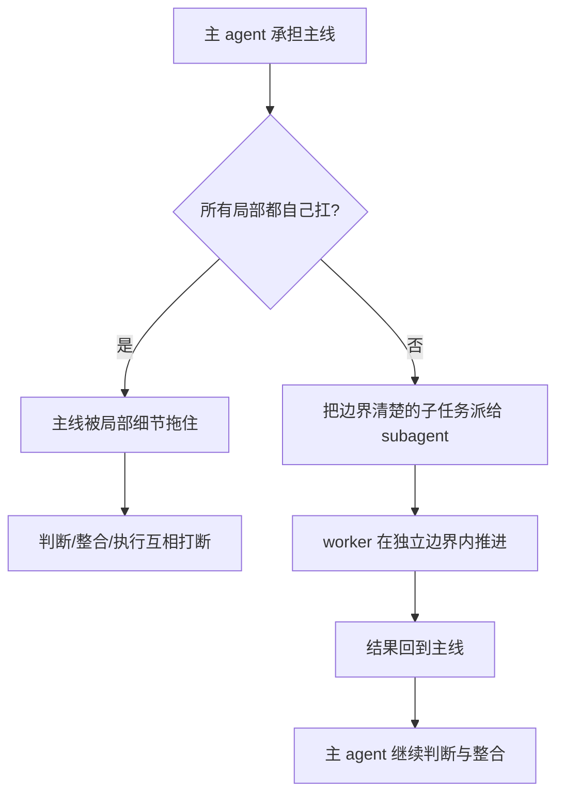

# 卷五 15｜为什么主 agent 还要继续把活拆出去

## 导读

- **所属卷**：卷五：外部扩展与多代理能力
- **卷内位置**：15 / 24
- **上一篇**：[卷五 14｜这组 agent 是怎么被拉进当前任务的](./14-why-runagent-feels-like-an-agent-runtime-assembly-line.md)
- **下一篇**：[卷五 16｜subagent 不是另起一个指挥部](./16-why-forksubagent-is-not-just-starting-another-agent.md)

第 14 篇已经把统一 agent runtime 装配主干立住了。

第 15 篇要继续回答的，不是“agent 怎么启动”，而是：

> **为什么主 agent 在真正执行时，还不能把所有局部都自己吞下，而要继续把活拆给 subagent / worker？**

这篇只负责把“为什么要继续分工”讲透；subagent 到底继承什么、不继承什么，要留给第 16 篇。

## 这篇要回答的问题

第 14 篇已经回答了：系统里准备好的一组 agent，是怎么被真正拉进当前任务的。

但这还不是后半段的终点，因为运行一旦开始，新的问题马上会冒出来：

> **既然系统已经有 agent 了，为什么主 agent 在执行时还不能自己做完，还要继续把活拆给 subagent / worker？**

这篇的重点不是再解释“系统里有一组 agent”，而是解释：为什么真实任务会把问题从“有哪些执行者”继续推进到“为什么还要继续拆活”。

## 旧文与源码锚点

### 旧文素材锚点
- `/Users/haha/.openclaw/workspace/claude-code-source-guide/docs/guidebook/volume-1/12-forksubagent.md`
- `/Users/haha/.openclaw/workspace/claude-code-source-guide/docs/guidebook/volume-1/18-forkedagent.md`
- `/Users/haha/.openclaw/workspace/claude-code-source-guide/docs/guidebook/volume-3/12-twenty-agent-design-takes.md`

### 源码锚点
- `/Users/haha/.openclaw/workspace/cc/src/tools/AgentTool/forkSubagent.ts`
- `/Users/haha/.openclaw/workspace/cc/src/tools/AgentTool/runAgent.ts`
- `/Users/haha/.openclaw/workspace/cc/src/tools/AgentTool/AgentTool.tsx`

## 主图：主 agent 为什么需要 worker 后半段

## 先给结论

- 有了 agent，不等于单个执行者就足够。
- subagent 的意义不是“数量 +1”，而是把主执行线**继续展开成受控协作结构**。
- `agent / subagent / worker` 依然是同一条执行者主线，不要拆成平级对象组。

## 主证据链

主 agent 先承担主线任务 → 复杂任务继续上升后，主线判断、局部处理、结果整合开始互相打断 → 系统需要把边界清楚的子任务切出去 → subagent 成为主线后半段的必要形态，而不是可选附件。

## 为什么“已有 agent”仍然不够

### 第一，主线判断和局部处理挤在一起，会让主线程变钝

复杂任务里，主 agent 往往同时要：

- 保总体目标
- 做下一步判断
- 盯边界
- 亲自搜、改、验

如果所有事都在同一条执行线上完成，主线程就会被局部细节拖住。

### 第二，有些子任务天然适合隔离执行

比如某段检索、验证、局部修改，本来就更适合：

- 在更窄上下文里处理
- 带着更清楚的任务边界推进
- 只把结果带回主线

这时 subagent 的价值，不是显得更高级，而是为了**把执行结构做稳**。

### 第三，主 agent 需要保住协调者位置

如果主 agent 什么都亲自做，它虽然名义上还是主 agent，结构上却又退化回单执行者硬扛。

subagent 的出现，就是为了让主 agent 保住：

- 主线判断
- 派工
- 结果整合
- 下一步推进

## 源码证据：系统已经把后半段预留出来了

### 证据 1：`AgentTool.tsx` 天生就是任务委派入口

`AgentTool` 的 schema 和调用路径都围绕：

- `description`
- `prompt`
- `subagent_type`
- `run_in_background`
- `isolation`

这说明 Claude Code 从入口处就在承认：**工作可以被委派给另一个执行者。**

### 证据 2：`forkSubagent.ts` 明说 fork child 是 worker process

`buildChildMessage(...)` 里直接写着：

- `You are a forked worker process.`
- `You are NOT the main agent.`
- `Do NOT spawn sub-agents; execute directly.`
- `Stay strictly within your directive's scope.`

这已经很直白：Claude Code 不是把后半段理解成“再来一个平级 agent”，而是**主线派出的 worker 分支**。

### 证据 3：`runAgent.ts` 给 subagent 留的是独立执行面，而不是独立宇宙

`runAgent` 同时接受：

- `forkContextMessages`
- `allowedTools`
- `worktreePath`
- `transcriptSubdir`

这些都说明子执行者不是完全另起炉灶，而是在受控边界中承接主线切出来的工作。

## 为什么 subagent 不能单列成另一组对象

因为卷五这里真正要解释的不是“系统又多了一个对象”，而是：

> **主执行者怎样从前半段走到后半段，继续把工作分叉出去。**

所以更稳的写法一定是：

- 前半段：更多执行者怎样成立
- 后半段：主执行者怎样继续派生 worker

而不是：

- 一组叫 agents
- 另一组叫 subagents

## 这篇收住什么

第 15 篇只把“为什么主线必须继续分工”讲透：复杂任务会把问题从单执行者能力，推进到受控协作结构。至于 subagent 到底继承什么、不继承什么，要留给第 16 篇单独切开。

## 一句话收口

> 主 agent 还要派生 subagent，不是因为一个 agent 不够强，而是因为复杂任务会把执行问题推进到分工问题：主线判断、局部处理和结果整合需要进入受控协作结构，而 subagent 正是这条执行者主线后半段的必要形态。