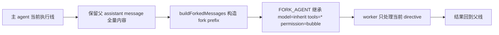

# 卷五 16｜subagent 不是另起一个指挥部

## 这篇要回答的问题

第 15 篇已经说明：主 agent 为什么还得继续把活拆出去。现在还要再往前走一步：

> **这个被拆出去的 subagent，到底为什么不是又起了一个平级总控？**

这篇的任务，就是把 fork 写成**执行支路**，而不是写成横向新增的第二个老板。

## 旧文与源码锚点

### 旧文素材锚点
- `/Users/haha/.openclaw/workspace/claude-code-source-guide/docs/guidebook/volume-1/12-forksubagent.md`
- `/Users/haha/.openclaw/workspace/claude-code-source-guide/docs/guidebook/volume-1/18-forkedagent.md`
- `/Users/haha/.openclaw/workspace/claude-code-source-guide/docs/guidebook/volume-1/11-runagent-assembly-line.md`

### 源码锚点
- `/Users/haha/.openclaw/workspace/cc/src/tools/AgentTool/forkSubagent.ts`
- `/Users/haha/.openclaw/workspace/cc/src/tools/AgentTool/runAgent.ts`
- `/Users/haha/.openclaw/workspace/cc/src/tools/AgentTool/AgentTool.tsx`

## 主图：forkSubagent 的继承与分叉

## 先给结论

- `forkSubagent` 的重点不是“新起一个执行者”，而是**从当前执行线上受控分叉出 worker**。
- 它的关键不是重新定义角色，而是**继承父线的重要运行语境**。
- 所以它不是“平级新对象”，而是执行者主线后半段的一种分叉方式。

## 主证据链

Claude Code 在 fork 路径上不要求重新选一个完整 agent 世界 → 而是把父 assistant message、tool uses、system prompt、tool pool 和上下文以 cache-friendly 方式继承下去 → 再给 child 一个严格受限的 worker 指令 → 这说明 fork 的本质是当前执行线内部的 worker 分叉。

## 源码证据：为什么它更像 worker 分叉

### 证据 1：`FORK_AGENT` 明确是“继承型”定义，不是普通 built-in agent

`forkSubagent.ts` 里定义的 `FORK_AGENT` 写得很直接：

- `tools: ['*']`
- `model: 'inherit'`
- `permissionMode: 'bubble'`
- `getSystemPrompt: () => ''`

注释还强调：fork path 会直接线程化父级已经渲染好的 system prompt bytes，以保持 prompt cache 稳定。也就是说，这条路径的核心不是“重新定义一个 agent”，而是**最大化继承父线**。

### 证据 2：`buildForkedMessages(...)` 保留父 assistant message 的全量内容

`buildForkedMessages` 做了两件非常关键的事：

1. 保留父 assistant message 的全部 content blocks
2. 为所有 `tool_use` 构造统一 placeholder 的 `tool_result`，再拼接 child directive

这里最重要的是：fork child 不是从空白开局，而是从**父线当前时刻**切出一条分支。

### 证据 3：child message 直接把它定性为 worker

`buildChildMessage(...)` 中最硬的几条规则是：

- `You are a forked worker process.`
- `You are NOT the main agent.`
- `Do NOT spawn sub-agents; execute directly.`
- `Stay strictly within your directive's scope.`
- `Your response MUST begin with "Scope:"`

这里连文字都不含糊：它不是自由 agent，而是**受控 worker**。

### 证据 4：系统还专门防递归 fork

`isInForkChild(messages)` 会检查历史里是否已有 `FORK_BOILERPLATE_TAG`，用来阻止 fork child 再 fork。

如果系统只是想“多开一个 agent”，就不需要这么强的防线。这里之所以加防线，正因为它把 fork 当作**当前执行线内部的一次受控分叉**，不能无限自我复制。

## 继承什么，不继承什么

### 继承的
- 父线当前任务语境
- 已渲染的 system prompt 字节级前缀
- 关键上下文消息与 tool_use 结构
- 父线可工作的工具面（通过 exact tools / inherited pool）
- 模型与权限人格的一部分连续性

### 不继承成“另一条独立主线”的
- 不继承主 agent 的主线职责
- 不继承无限派工权
- 不继承自由扩张任务边界
- 不允许把自己当主 agent 再开一组平级执行线

所以第 16 篇必须把话说满：**fork 继承的是运行条件，不继承主线地位。**

## 为什么 prompt cache 也在支持这个判断

`forkSubagent.ts` 的一大设计重心就是：让 fork children 的 API request prefixes 尽量 byte-identical，以获得 prompt cache 命中。

这件事本身就说明：fork child 不是脱离父线另起炉灶，而是尽量沿着父线既有上下文继续跑。cache 不是正文主角，但它反过来证明了 fork 的本质：**连续分叉，不是平行新建。**

## 和第 17 篇的关系

只有先把第 16 篇写成 worker 分叉，第 17 篇才讲得通：

- 主 agent 为什么仍然保主线
- worker 为什么只能带回局部结果
- 信息为什么必须回流

如果第 16 篇写成“再开一个 agent”，第 17 篇就会直接散掉。

## 一句话收口

> `forkSubagent` 不是“再开一个 agent”，而是沿着父执行线切出一个继承上下文、继承工具面、受 scope 严格约束的 worker 分支；它继承的是运行条件，不继承主线地位，所以本质上属于同一条执行者主线的后半段。