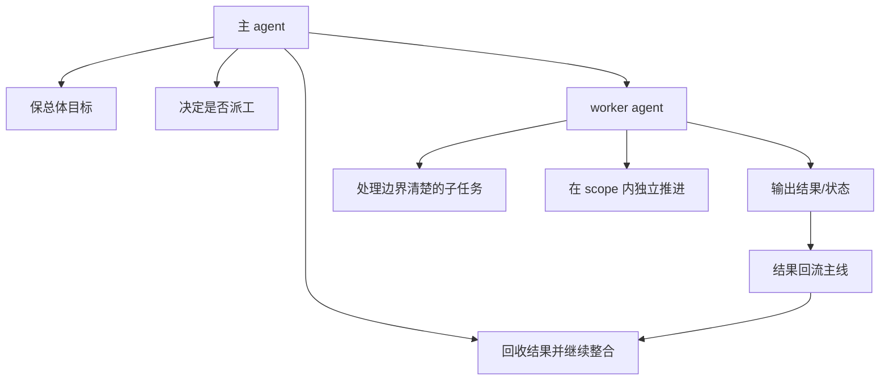

# 卷五 17｜主 agent / worker agent 的职责边界与信息回流

## 这篇要回答的问题

后半段主线走到这里，真正要收的不是“还能分叉多少 worker”，而是：

> **主 agent 和 worker agent 的职责边界怎么切，结果又怎样回流主线？**

如果边界切不住、回流收不回来，subagent 结构就会变成失控分叉。

## 旧文与源码锚点

### 旧文素材锚点
- `docs/guidebook/volume-1/18-forkedagent.md`
- `docs/guidebook/volume-3/12-twenty-agent-design-takes.md`

### 源码锚点
- `cc/src/tools/AgentTool/forkSubagent.ts`
- `cc/src/tools/AgentTool/runAgent.ts`
- `cc/src/tools/AgentTool/AgentTool.tsx`
- `cc/src/tasks/LocalAgentTask/LocalAgentTask.js`

## 主图：主线与 worker 的边界和回流

## 先给结论

- **主 agent 保主线。**
- **worker agent 保子任务。**
- **信息回流不是附加步骤，而是这套协作结构成立的收口机制。**

## 主证据链

主 agent 派工时仍保留总体目标与整合责任 → worker 只在明确 scope 内推进子任务 → worker 输出的是结果、状态或中间产物，而不是新的主线 → 这些结果回到主 agent 后，主线才能继续 → 所以“职责边界 + 信息回流”本身就是受控协作结构的核心。

## 为什么边界必须切开

### 主 agent 负责什么

主 agent 要守住：

- 当前总体目标
- 下一步推进方向
- 哪些问题值得拆出去
- 回收结果后的整合与判断

它不是“最强那个 worker”，而是**主线责任承担者**。

### worker agent 负责什么

worker 更适合承担：

- 一段边界清楚的局部工作
- 一次独立分析 / 搜索 / 修改 / 验证
- 一份可被主线吸收的产物

它的价值不在“替主线思考一切”，而在**替主线处理一段可回收的局部任务**。

## 源码证据：系统在强制 worker 守边界

### 证据 1：fork child 的提示词直接限制它的职责

`buildChildMessage(...)` 明写：

- `Stay strictly within your directive's scope.`
- `Do NOT converse, ask questions, or suggest next steps`
- `REPORT structured facts, then stop`

这几句很关键：worker 被要求交付**结果**，不是接管主线。

### 证据 2：worker 输出格式天然服务回流

同一个 child message 还规定输出格式：

- `Scope:`
- `Result:`
- `Key files:`
- `Files changed:`
- `Issues:`

这不是为了好看，而是为了让主 agent 更容易吸收子结果。格式化输出本身就在服务**信息回流**。

### 证据 3：`AgentTool.tsx` / `LocalAgentTask` 同时跟踪 progress、foreground/background 与完成状态

`AgentTool.tsx` 里直接接上：

- progress tracker
- foreground / async registration
- notification enqueue
- task completion / failure handling

这说明 subagent 结果并不是飘在系统外面，而是进入了可观察、可回收的任务生命周期。

### 证据 4：`runAgent.ts` 持续记录 transcript sidechain

`runAgent.ts` 会：

- `recordSidechainTranscript`
- `writeAgentMetadata`
- `setAgentTranscriptSubdir`

这意味着 worker 执行不是黑箱；主线并非只等一个神秘结果，而是有结构化轨迹可回看、可恢复、可继续整合。

## 为什么“回流”是收口点

### 第一，分叉的目的不是分裂，而是减轻主线负担后再把收益带回来

如果 worker 做完就各自散开，那主线根本吸收不到分叉收益。Claude Code 要的不是“多开几个小世界”，而是让主线更稳地继续推进。

### 第二，主 agent 只有拿回结果，才能继续承担整合责任

主 agent 要继续判断下一步，前提是：

- 子任务结果已经回来
- 结果足够清楚可吸收
- 子任务没有顺手把主线改掉

所以回流不是收尾动作，而是主线继续存在的条件。

### 第三，回流把 worker 放回受控协作结构

worker 如果只负责做，不负责回交，就更像外包出去的独立执行体。

但 Claude Code 这里要成立的不是外包关系，而是同一条执行者主线里的受控协作。所以回流本身就是控制机制。

## 这篇收住了什么

到第 17 篇为止，Agent 主轴后半段终于闭环：

- 第 15 篇：为什么要派生 subagent
- 第 16 篇：为什么 `forkSubagent` 更像 worker 分叉
- 第 17 篇：为什么这条后半段没有失控——因为边界和回流都被收住了

## 一句话收口

> 主 agent / worker agent 的区别不在谁更强，而在谁保主线、谁保子任务；worker 只有把结构化结果回流给主 agent，这条执行者主线才不会裂成并列小世界，而会重新收回同一条可继续推进的主线。