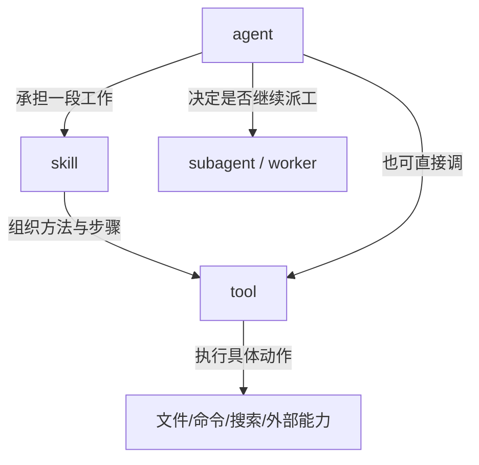

# 卷五 18｜agent、skill、tool 之间的边界和协作关系

## 这篇要回答的问题

Agent 主轴走完后，最后要把整条主线重新压回卷五总图：

> **agent、skill、tool 各处在哪个层级，它们怎样协作，又为什么不能互相替代？**

这篇不能只是复读第 08 篇，而要站在执行者主线已经成立之后，再切一次边界。

## 旧文与源码锚点

### 旧文素材锚点
- `docs/guidebook/volume-1/30-skill-vs-agent.md`
- `docs/guidebook/volume-1/10-agenttool.md`
- `docs/guidebook/volume-1/15-skilltool-bridge.md`

### 源码锚点
- `cc/src/tools/AgentTool/AgentTool.tsx`
- `cc/src/tools/AgentTool/runAgent.ts`
- `cc/src/tools/SkillTool/SkillTool.ts`
- `cc/src/tools/`

## 主图：agent / skill / tool 的协作边界

## 先给结论

- **tool 负责动作执行。**
- **skill 负责方法组织。**
- **agent 负责执行者结构。**
- 三者协作紧密，但层级不合并。

## 主证据链

tool 先把动作原语暴露给系统 → skill 把这些动作组织成稳定方法模块 → agent 承担一段工作的执行责任，并决定是否继续派生 worker → 因而三者构成 runtime 协作谱系，而不是三种差不多的“能力对象”。

## 先从执行者侧重切一次边界

### tool：把动作真正落地

tool 回答的是：

- 读什么
- 改什么
- 跑什么
- 查什么

它的完成单位通常是一次动作。没有 tool，系统没有落地点。

### skill：把动作组织成方法

skill 回答的是：

- 这类任务该按什么步骤做
- 什么时候该搜，什么时候该改，什么时候该验证
- 哪些约束和节奏要先立住

没有 skill，系统依然能做动作，但很难稳定复用方法。

### agent：把工作交给谁承担

agent 回答的是：

- 这段工作由谁接
- 这个执行者带什么上下文、工具面和权限去做
- 它要不要继续派工

没有 agent，系统仍有动作和方法，但缺少执行责任分层。

## 源码证据：三者在 runtime 里的位置并不一样

### 证据 1：`AgentTool` 暴露的是任务委派入口

`AgentTool.tsx` 的 schema 以 `description`、`prompt`、`subagent_type` 为核心，这说明它处理的是**把任务交给执行者**，而不是某个动作的参数表。

### 证据 2：`runAgent` 组装的是执行体，不是方法模块

`runAgent.ts` 负责：

- 上下文装配
- 工具池解析
- agent MCP servers 初始化
- hooks / transcript / metadata 挂接

这说明 agent 的位置就是**执行体层**。

### 证据 3：`SkillTool` 站在方法组织层，而不是执行者层

虽然这篇不重写 skills 组正文，但 `SkillTool` 的基本角色已经很明确：

- 它发现和匹配 skill
- 把 skill 正文 / 方法模块接入当前执行链
- 再由当前执行者继续使用 tools 落地

所以 skill 更像方法模块，而不是工作承担者。

## 为什么三者相关，却不能互相替代

### tool 不能替代 agent

即使 tool 很强，它也主要回答“能做哪些动作”。

它不会天然回答：

- 这段工作由谁承担
- 什么时候要继续派工
- 结果由谁整合

这些问题都属于 agent。

### skill 不能替代 agent

即使 skill 写得再完整，它也还是在组织方法：

- 先做什么
- 再做什么
- 用哪些工具
- 守哪些边界

它可以指导执行者，但它自己不是执行者。

### agent 也不能替代 skill 和 tool

agent 再重要，也不能脱离另外两层单独成立：

- 没有 tool，它没有动作落点
- 没有 skill，它缺少稳定的方法组织

所以 agent 不是凌驾一切的“万能对象”，而是执行者层。

## 这篇怎样区别于第 08 篇

第 08 篇站在 skills 组尾部收边界，重点是别把 skill 写成 tool 或 agent。

第 18 篇站在 Agent 主轴尾部再切一次，重点变成：

- agent 已经被证明是执行者结构
- subagent / worker 已经被证明是其后半段
- 因而现在要从执行者侧重新压一遍 skill / tool / agent 三层图

这就是第 18 篇存在的理由，而不是术语复读。

## 一句话收口

> 从执行者主线回看，tool 负责把动作做下去，skill 负责把动作组织成方法，agent 负责把一段工作交给谁承担并决定是否继续分叉；三者的协作非常紧，但正因为它们分别解决动作、方法、执行者三个不同问题，所以边界必须切开。