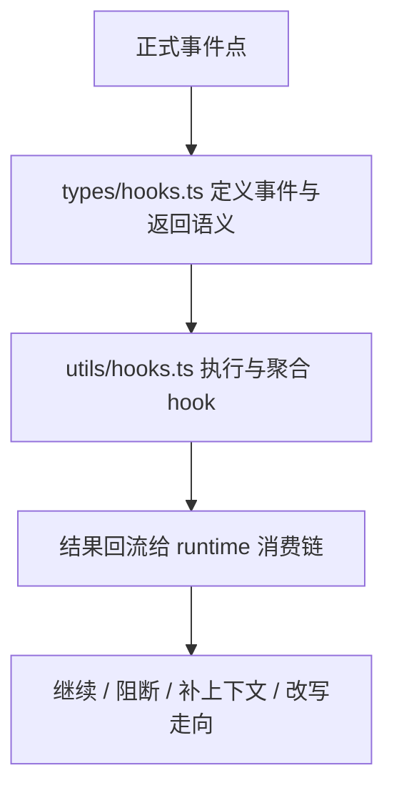

# 卷五 18｜Claude Code 的 hooks，为什么不是挂几个脚本这么简单

## 导读

- **所属卷**：卷五：外部扩展与多代理能力
- **卷内位置**：18 / 24
- **上一篇**：[卷五 17｜拆出去的活，最后怎么回到主线](./17-boundaries-and-information-flow-between-main-agent-and-worker-agent.md)
- **下一篇**：[卷五 19｜工具怎么跑，hooks 其实真的插得上手](./19-what-role-hooks-play-in-claude-code-runtime.md)

Agent 主轴收完之后，卷五接下来要处理的不是又一个“对象”，而是一种新的东西：

> **系统为什么要允许运行过程本身被正式插手。**

这就是 hooks 的位置。

如果只从表面看，hooks 很容易被误解成：

- 某些时机顺手跑几段脚本
- 给用户留几个自动化回调点
- 一套外围增强功能

但真顺着源码往下看，你会发现 Claude Code 对 hooks 的设计完全不是这个级别。

它不是“想挂就挂”的脚本区，而是一套被收得很紧的 runtime 机制：

- 哪些事件点允许被插入
- hook 能返回什么语义
- 这些语义怎样重新回到系统主线

所以第 19 篇要先立住一句最短判断：

> **hooks 不是附属脚本系统，而是受边界约束的运行时干预层。**

---

## 先把总图压出来

这张图最关键的一点是：

> **hook 的价值不在“能跑一段外部逻辑”，而在“跑完以后系统承认什么结果、又如何消费这个结果”。**

如果没有这条回流链，它顶多只是脚本调用。
但一旦事件、返回语义和消费路径都被正式收口，它就变成了 runtime 机制。

---

## 第一层：`types/hooks.ts` 先定义的不是类型细节，而是合法干预边界

如果只看名字，`types/hooks.ts` 好像只是在做类型定义。

但在 hooks 这条线上，它真正干的是更重的事：

> **先把哪些地方允许被插手，收成正式事件空间。**

旧文卷四 06 已经把这点压得很清楚了。这里真正值钱的不是“HookEvent 列了哪些名字”，而是系统在明确说：

- 会话开始是正式事件
- 用户输入进入主循环前是正式事件
- 工具执行前后是正式事件
- 权限请求是正式事件
- 一轮准备结束时仍然是正式事件

也就是说，Claude Code 不是把 runtime 当成一条不可触碰的黑箱主线，
而是先把黑箱拆成了若干**可以被正式干预的节点**。

这就是 hooks 成立的第一步。

---

## 第二层：它还把“干预结果长什么样”收成了正式语义

只定义事件点还不够。
如果系统允许 hook 返回任意文本，那它仍然容易退化成混沌脚本系统。

所以第二个关键点是：

> **hooks 的输出也不是随便吐点字符串，而是被事件语义收紧的。**

卷四 06 已经反复提到几个很关键的返回方向：

- `continue`
- `decision`
- `reason`
- `systemMessage`
- `additionalContext`
- `updatedInput`
- `updatedMCPToolOutput`
- `stopReason`
- `preventContinuation`

这些词连起来看，说明 Claude Code 让 hook 影响的不是“日志长什么样”，而是：

- 当前流程是否继续
- 当前输入是否重写
- 当前结果是否修整
- 当前上下文是否补充
- 当前这一轮是否先停下

这一步非常重要。
因为它把 hooks 从“能运行外部逻辑”提升成了：

> **能以正式语义影响系统走向。**

---

## 第三层：`utils/hooks.ts` 真正干的是把 hook 从配置变成 runtime 行为

如果说 `types/hooks.ts` 是边界定义层，
那 `utils/hooks.ts` 就是正式执行层。

它的价值不是“帮你运行一下 hook”，而是：

- 统一接住不同来源的 hooks
- 统一执行
- 统一处理返回值
- 再把结果送回系统主线

也就是说，`utils/hooks.ts` 干的不是脚本调度，而是：

> **把 hook 结果翻译成系统自己能理解、能继续处理的 runtime 语义。**

这也是为什么 hooks 在 Claude Code 里不是外围功能。
因为外围脚本通常停在“执行完了”。
而这里会继续追问：

- 它返回了什么
- 这些返回值属于哪一类语义
- 接下来该由谁消费

这已经是典型的 runtime 编排层思路。

---

## 为什么这一篇先不展开工具链和生命周期链

因为第 19 篇只做一件事：

> **先证明 hooks 是正式机制，不是脚本集合。**

这里如果提前把工具链和生命周期链讲满，就会把 20、21 吃掉。

所以这一篇只先收住三件事：

1. 哪些事件允许被插手
2. 这些插手结果有什么正式语义
3. 这些结果怎样回到 runtime 主线

等这三件事立住之后，后面两篇再分别去讲：

- 工具怎么被 hooks 插手
- 会话生命周期怎么被 hooks 插手

这样边界才会干净。

---

## 这篇真正立住的东西是什么

卷五前面已经有：

- skill：方法组织
- MCP：外部能力源
- agent：执行者结构

那 hooks 到这里真正补上的，不是又一个对象，
而是另一层能力：

> **系统允许在运行过程中被结构化地插手。**

这就是 hooks 跟前面几组对象最大的差别。

它不主要回答：

- 系统会什么
- 系统接了什么外部东西
- 这段工作由谁承担

它主要回答的是：

- **系统运行到某些节点时，允许怎样被干预**

这就是它的重量。

---

## 一句话收口

> Claude Code 的 hooks，不是挂几个脚本这么简单；它先把 runtime 的关键节点定义成正式事件，再把 hook 的返回结果收成正式语义，并通过统一执行与回流链送回系统主线，所以 hooks 在这里真正成立的是一层受边界约束的运行时干预机制。
