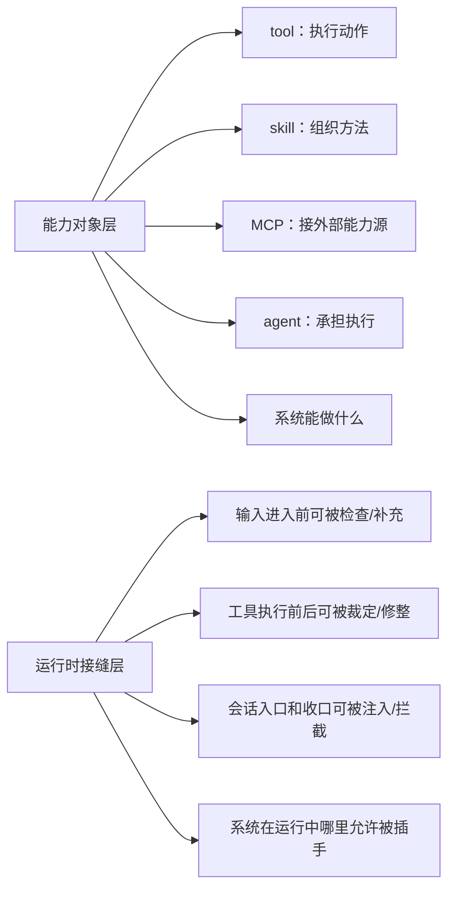

# 卷五 19｜为什么平台层不仅要有能力对象，还要有运行时接缝

## 这篇要回答的问题

到了卷五前半段，Claude Code 已经长出很多能力对象：

- tool
- skill
- MCP
- agent / subagent

这些对象都在回答同一类问题：

- 系统能做什么
- 方法怎样组织
- 外部能力怎样接进来
- 一段工作由谁承担

但平台继续往前长，就会撞上另一类问题：

- 运行过程本身能不能被观察
- 关键节点能不能被补上下文
- 决策前后能不能被裁一刀、修一手、拦一下

这就不是单靠能力对象能回答的了。

所以第 19 篇要回答的是：

> **为什么平台层不只要有能力对象，还必须有运行时接缝。**

## 旧文与源码锚点

### 旧文素材锚点
- `docs/guidebook/volume-4/06-hooks-runtime-entry.md`
- `docs/guidebook/volume-4/09-hooks-conclusion.md`

### 源码锚点
- `src/types/hooks.ts`
- `src/utils/hooks.ts`
- `src/query.ts`
- `src/query/stopHooks.ts`
- `src/services/tools/toolExecution.ts`

> 说明：当前仓库不直接携带 `cc/src/*` 源树，这里沿用卷四旧稿已经核对过的 hooks 相关源码链，作为本篇证据抓手。

## 主图：能力对象层 vs 运行时接缝层

## 先给结论

- **能力对象解决的是“系统有什么能力”。**
- **运行时接缝解决的是“系统运行到哪些节点时允许被正式插手”。**
- **没有接缝，平台会有很多能力，但运行过程仍然偏黑箱。**

## 主证据链

tool / skill / MCP / agent 这些对象分别扩展动作、方法、外部能力源和执行者结构 → 但 `toolExecution.ts`、`query.ts`、`stopHooks.ts` 暴露出的是真实 runtime 并不是“调用对象就结束”的短链，而是一条包含输入入口、工具前后、权限判断、turn 收口的运行过程 → `types/hooks.ts` 与 `utils/hooks.ts` 把这些关键节点协议化并开放成正式 hook 接缝 → 所以 Claude Code 平台层不仅长出了能力对象，还必须长出运行时接缝层。

## 先把边界切开：能力对象回答不了“过程中的关键节点”

tool、skill、MCP、agent 都重要，但它们回答的核心问题是不同的：

- tool：某个动作能不能做
- skill：这类任务的方法怎样组织
- MCP：系统外能力怎么进来
- agent：这段工作由谁执行

这些问题都偏“对象”。

可真实 runtime 里还有另一类问题：

- 这次输入进主循环前要不要先补语境
- 这次工具执行前要不要先做判断
- 权限 ask 之前要不要先接入额外裁定
- 这轮对话结束前要不要先再过一道 stop 检查

这些问题的主语不是对象，而是：

> **过程中的关键节点。**

所以平台只长对象，还不够。

## 第一层原因：对象再多，也不等于运行过程可控

一个系统完全可以拥有很多能力对象，却仍然让运行过程像黑箱。

比如它可以：

- 暴露很多工具
- 允许很多 skill
- 接很多外部 server
- 派很多 subagent

但如果调用过程仍然是：

- 输入进来
- 系统内部自己跑
- 最后吐结果

那么外部逻辑真正能插手的，仍然只有头尾两端。

中间那条最关键的运行主线——输入怎么被接住、工具前后怎样裁定、结束前怎样收口——还是封闭的。

这时系统更像“会的事很多”，还不像“运行秩序也被开放”。

## 第二层原因：真实工作需要在过程里插手，不只在开头和结尾发号施令

平台一复杂，很多控制都发生在运行途中，而不是只在起点和终点。

举几个最典型的问题：

- 用户输入刚提交时，要不要先加一层额外上下文
- 工具执行前，要不要先决定 allow / deny / ask
- 工具执行后，结果要不要先修整再回主线
- 这一轮准备结束时，要不要因为 stop hook 再停一下

这些都不是：

- “一开始交代清楚就行”
- “最后收尾补救一下就行”

它们是过程中的正式判断点。

只靠能力对象，系统能做很多事；但没有运行时接缝，系统很难在这些判断点上正式开放插手能力。

## 第三层原因：没有正式接缝，扩展需求就会被迫走旁路

如果 runtime 不开放正式接缝，很多扩展需求不会消失，只会绕路。

常见绕路方式大概就是：

- 把额外控制硬塞进 prompt
- 在 tool 外面自己再包一层脚本
- 在系统外部拼一段半正式工作流
- 用非结构化日志或环境变量去猜系统状态

这些方法短期能用，但结构上都不稳，因为它们没有被 runtime 正式承认。

Claude Code 的 hooks 值得单列，就在于它没有让这些需求一直漂在系统外面，而是把它们收回来，做成正式语义：

- 哪些节点允许插手
- 允许返回什么影响
- 这些影响怎样重新进入主线

这就是“接缝”的意义。

## 什么叫运行时接缝：不是随便哪里都能改，而是在关键节点有边界地开放

“接缝”不是混沌自由区。

它更像系统自己认出来的少数高杠杆位置：

- 会话入口
- 用户输入入口
- 工具执行前后
- 权限判断链
- turn 收口链

在这些地方，Claude Code 允许 hooks：

- 看见当前状态
- 补上下文
- 改输入或结果
- 决定是否继续

但这种开放不是无限制的。卷四旧稿强调过两个关键收口：

- `types/hooks.ts` 用 event-specific schema 收返回语义
- `utils/hooks.ts` 用统一执行器和 trust gate 管执行边界

所以接缝不是“到处都能插”，而是：

> **在少数关键节点上，按正式协议开放插手能力。**

## 从 hooks 这条证据链看，Claude Code 开放的不是对象，而是运行秩序

为什么说 hooks 会在卷五单独成组？

因为它暴露出的不是某个新对象，而是一个更高层次的事实：

> **Claude Code 已经开始把自己的运行秩序本身开放出来。**

卷四 hooks 旧稿里能直接看见这点。

### 证据 1：`src/types/hooks.ts` 先定义的是事件和返回语义

这说明系统先问的不是“让用户配什么脚本”，而是：

- 哪些事件点是正式的
- 在这些点上允许返回什么类型的影响

这已经是运行秩序层的问题。

### 证据 2：`src/services/tools/toolExecution.ts` 暴露的是工具链内部的接缝

这里不是“多一个工具”，而是让工具执行前后本身出现可插手节点：

- `updatedInput`
- `permissionDecision`
- `updatedMCPToolOutput`
- `preventContinuation`

这些语义说明系统开放的是“工具怎么跑”，不是“又多一个工具”。

### 证据 3：`src/query.ts` 与 `src/query/stopHooks.ts` 暴露的是 turn 收口的接缝

Claude Code 并不把“模型说完”直接等于“这轮结束”。

它还要再经过 stop hooks。

这说明系统连“何时算结束”都开放成正式节点了。

这已经不是能力扩展，而是运行秩序扩展。

## 为什么这层接缝不是 skills / MCP / plugins 能替代的

这点必须说清，不然 hooks 很容易被写成其它对象的附属品。

### skill 不能替代它

skill 解决的是方法组织。

它可以告诉系统“这类任务该怎么做”，但它不天然解决：

- 输入进入前在哪补上下文
- 工具执行前在哪裁权限
- 结束前在哪再拦一道

这些是 runtime 节点问题，不是方法问题。

### MCP 不能替代它

MCP 解决的是外部能力源接入。

它把系统外能力接进来，但不等于它自动决定：

- 这些能力在什么节点被额外检查
- 调用前后怎么被补上下文或修结果

那仍然是 hooks 的职责。

### plugin 也不能替代它

plugin 讲的是更完整的封装、安装、治理和分发单元。

它可以承载 hooks，但它自己不等于接缝。

接缝回答的是“runtime 哪里开放”；plugin 回答的是“这些东西怎样被打包和治理”。

## 所以平台层为什么一定会长出这层

因为 Claude Code 已经不只是“能做一些动作”的执行器，而是一个：

- 有持续会话
- 有多执行者
- 有外部能力源
- 有方法组织层
- 有复杂权限与收口逻辑

的运行系统。

系统一旦走到这个阶段，只开放对象而不开放过程，就会很别扭：

- 能力很多
- 结构很多
- 但关键运行节点完全封闭

这会让平台看上去很强，却不够深。

hooks 之所以出现，不是因为对象还不够多，而是因为平台成熟到一定阶段后，必须把：

> **“对象如何在运行中被观察、被协调、被裁定”**

也开放成正式结构。

## 这篇和第 20 篇怎么分工

第 20 篇要立的是：

- hooks 在 runtime 里到底扮演什么角色

第 19 篇则回到更靠前的问题：

- 为什么平台层必须需要这样一层东西

所以这篇不抢第 21 篇的类型细拆，也不去提前讲 plugin 封装层；它只做一件事：

> **把“为什么一定要有运行时接缝”说透。**

## 一句话收口

> 平台层不仅要有能力对象，还要有运行时接缝，因为对象回答的是“系统能做什么”，而接缝回答的是“系统运行到哪些关键节点时允许被正式观察、注入和干预”；没有这层接缝，Claude Code 可以拥有很多能力对象，却仍然更像功能集合，而不是一个真正可编排、可治理的运行系统。