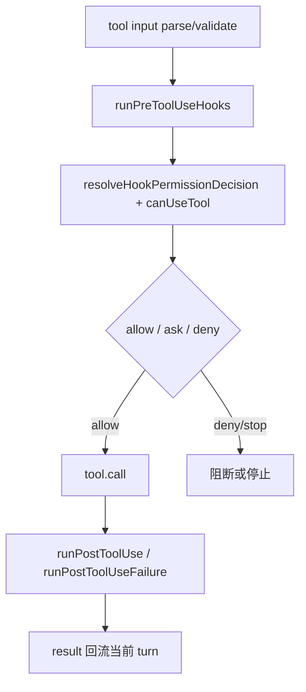

# 卷五 20｜工具怎么跑，hooks 其实真的插得上手

## 导读

- **所属卷**：卷五：外部扩展与多代理能力
- **卷内位置**：20 / 25
- **上一篇**：[卷五 19｜Claude Code 的 hooks，为什么不是挂几个脚本这么简单](./19-why-hooks-are-more-than-just-some-scripts.md)
- **下一篇**：[卷五 21｜一轮会话怎么起、怎么进、怎么收，hooks 其实都能插手](./21-what-different-hooks-intercept-connect-and-modify-in-claude-code.md)

第 19 篇已经先证明了一件事：hooks 在 Claude Code 里不是附属脚本系统，而是正式 runtime 机制。

那第 20 篇就不再重复证明 hooks 的地位，直接看它最硬的一条样本链：

> **工具执行这条主链，到底是怎么被 hooks 真正插进去的？**

如果这件事立不住，hooks 就还是像“执行前后通知一下”。
但顺着源码往下看，你会发现 Claude Code 给它的权限比“通知”重得多。

这篇要压清楚三件事：

- 谁能改输入
- 谁能参与 allow / deny / ask
- 谁能改结果回流

---

## 先把总图压出来

这张图最该让读者先记住的一句，就是：

> **hook 不是挂在工具链外面，而是插在工具链里面。**

工具不是简单地“过权限、跑一下、返回结果”。
在 Claude Code 里，它前后都留了正式切口。

---

## 第一层：`PreToolUse` 不是 before hook，而是调用前决策阶段

如果只看名字，`PreToolUse` 特别容易被低估。

但卷四 07 已经把这条线讲得很明白：
在真正 `tool.call(...)` 之前，系统会先跑 `runPreToolUseHooks(...)`。

这意味着它处理的不是“顺手通知”，而是：

> **这次调用该不该发生、要以什么输入发生。**

这条线里最硬的几个返回语义就是：

- `updatedInput`
- `additionalContext`
- `permissionDecision`
- `permissionDecisionReason`
- `preventContinuation`

这些名字本身就说明问题：

- 输入可以先被改写
- 额外上下文可以先接进来
- 权限判断可以先被 hook 裁一遍
- 当前调用甚至可以在 tool 还没跑之前就先停住

所以 `PreToolUse` 最准确的定位不是“工具执行前回调”，而是：

> **工具调用前的正式干预点。**

---

## 第二层：`PermissionRequest` 不是外围补丁，而是权限链里的共同决策者

这一层是工具 hooks 最重的地方之一。

因为 Claude Code 并没有把权限系统设计成：

- 先固定 ask
- 再让 hooks 在旁边看看

相反，卷四 07 已经点出一个很硬的判断：

> **`PermissionRequest` hook 会和真实权限提示并发竞争，谁先返回谁生效。**

这句话的重量很大。

它说明 hook 不是在权限系统旁边打补丁，
而是已经进入了统一权限决策链。

也就是说，工具要不要跑，并不只取决于一个单独的 permission prompt，
还取决于：

- hook 是否先给出了 allow / deny / ask
- hook 是否更新了权限规则
- 当前这轮是否应该继续往下走

所以这篇标题里说“hooks 其实真的插得上手”，不是夸张。
至少在权限链这一段，hooks 已经不只是 observer，
而是：

> **共同裁决者。**

---

## 第三层：`PostToolUse` / `PostToolUseFailure` 说明结果回流也能被改写

工具 hooks 最容易被忽略的一点，是很多人只盯调用前，
不盯调用后。

但如果只盯前面，hooks 还像“预处理系统”；
只有把后面也看清，才知道它已经进入完整的执行链。

卷四 07 已经点出几个特别关键的返回方向：

- `additionalContext`
- `updatedMCPToolOutput`
- failure 路径的补充语义

这意味着工具一旦跑完，hooks 还能继续影响：

- 当前结果以什么形式回到主线
- 某些输出要不要先被修整
- 错误路径要不要先补额外上下文

所以 `PostToolUse` / `PostToolUseFailure` 真正做的，不是“收尾通知”，而是：

> **在结果回流之前，再插一次正式干预。**

这一步一加，hooks 才真正覆盖了：

- 调用前
- 权限决策中
- 调用后结果回流

工具执行链从头到尾都有切口。

---

## 这篇最该保住的三句判断

### 1. 谁能改输入
答案：`PreToolUse`

它不只是看输入，而是能通过 `updatedInput` 先重写这次调用到底吃什么参数。

### 2. 谁能参与 allow / deny / ask
答案：`PreToolUse` + `PermissionRequest`

前者可以先给 permission decision，后者更是直接进入真实 ask 路径竞争。

### 3. 谁能改结果回流
答案：`PostToolUse` / `PostToolUseFailure`

结果不是 tool.call 完就原样回主线，中间还允许被 hook 补上下文、改输出语义、重塑失败路径。

如果这三句读者记住了，第 20 篇就立住了。

---

## 为什么这篇不再回头讲“hooks 为什么重要”

因为第 19 篇已经把 hooks 的性质讲完了。

第 20 篇只负责做一件事：

> **拿工具执行链这个最硬样本，证明 hooks 已经插进决策主链。**

所以这篇不再回头泛讲：

- hooks 是不是 runtime 机制
- hooks 和脚本系统有什么区别

那会和 19 重复。

这篇只守住工具执行链，就够了。

---

## 一句话收口

> 在 Claude Code 里，工具不是简单地“过权限、执行、返回结果”三步；`PreToolUse` 能改输入，`PermissionRequest` 能参与 allow / deny / ask，`PostToolUse / Failure` 又能改结果回流，所以 hooks 已经正式插进了工具执行决策链，而不是挂在外面的前后通知系统。
