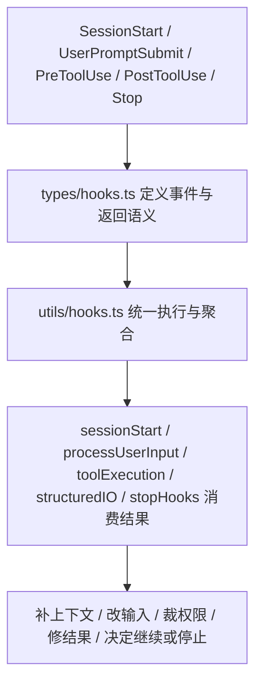

# 卷五 20｜Claude Code 的 hooks 在 runtime 里到底扮演什么角色

## 这篇要回答的问题

hooks 组最容易写轻。

一轻，就会把它写成两种东西之一：

- 用户可配置的一批自动化脚本
- 工具执行前后的几个回调点

这两种说法都不算错，但都不够。

卷五这里真正要立住的是：

> **Claude Code 的 hooks，不是在 runtime 外面补几段逻辑，而是在 runtime 里面留出一层正式的结构化接缝。**

它的职责不是提供新能力对象，而是把运行过程中的关键阶段——输入进入前、工具执行前后、会话进入时、这一轮准备结束时——做成可观察、可注入、可干预的节点。

## 旧文与源码锚点

### 旧文素材锚点
- `docs/guidebook/volume-4/06-hooks-runtime-entry.md`
- `docs/guidebook/volume-4/07-pretooluse-posttooluse-hooks.md`
- `docs/guidebook/volume-4/08-sessionstart-stop-hooks.md`

### 源码锚点
- `src/types/hooks.ts`
- `src/utils/hooks.ts`
- `src/utils/sessionStart.ts`
- `src/utils/processUserInput/processUserInput.ts`
- `src/services/tools/toolExecution.ts`
- `src/cli/structuredIO.ts`
- `src/query/stopHooks.ts`
- `src/query.ts`

> 说明：当前仓库不直接携带 `cc/src/*` 源树，这里沿用卷四旧稿已经核对过的源码锚点与文件链路，作为本篇证据抓手。

## 主图：hooks 在 runtime 里的位置

## 先给结论

- **hooks 不是新能力对象，而是 runtime 接缝层。**
- **它处理的不是“系统会什么”，而是“系统在运行到哪些节点时允许被插手”。**
- **它真正站的位置，在 tool、skill、agent、MCP 这些对象层之上，贴着 query runtime 的运行过程。**

## 主证据链

`types/hooks.ts` 先把 HookEvent、输入输出和 hook-specific 影响收成正式协议 → `utils/hooks.ts` 再把 settings / skill / plugin / session 派生出来的 hooks 统一执行、校验和聚合 → `sessionStart.ts`、`processUserInput.ts`、`toolExecution.ts`、`structuredIO.ts`、`stopHooks.ts` 把这些结果接回会话入口、用户输入入口、工具执行链、权限链和 turn 收口链 → 因而 hooks 在 Claude Code 里扮演的不是外围脚本角色，而是 runtime 的结构化接缝层。

## 先把一个误会打掉：hooks 不是挂在系统外面的“脚本区”

如果 hooks 只是“在某个时机跑个命令”，那它更像外围增强功能。

但卷四旧稿反复暴露出的证据不是这个方向。

最先该看的不是某个单独 hook，而是这条链：

- `src/types/hooks.ts`
- `src/utils/hooks.ts`
- `src/utils/sessionStart.ts`
- `src/utils/processUserInput/processUserInput.ts`
- `src/services/tools/toolExecution.ts`
- `src/cli/structuredIO.ts`
- `src/query/stopHooks.ts`

这条链说明的事情很直接：

1. 系统先定义哪些事件点可以挂 hook
2. 再定义 hook 合法返回什么影响
3. 再把 hook 统一执行和聚合
4. 最后把结果重新送回 runtime 主链

所以 hooks 的关键不是“能跑脚本”，而是：

> **运行时哪些地方被正式开放成接缝。**

## 第一层角色：hooks 是运行过程的观察点

先看最轻的一层。

当 `types/hooks.ts` 明确列出一批 HookEvent 时，它做的第一件事不是“方便配置”，而是把 runtime 的关键阶段显形出来。

从卷四旧稿能看到的事件类型至少包括：

- `SessionStart`
- `UserPromptSubmit`
- `PreToolUse`
- `PostToolUse`
- `PostToolUseFailure`
- `PermissionRequest`
- `Stop`
- `SubagentStop`

这意味着 Claude Code 在说：

- 会话开始，是一个正式事件
- 用户输入进入主循环前，是一个正式事件
- 工具执行前后，是正式事件
- 一轮准备收口时，仍然是正式事件

这一步的价值，是把运行时从黑箱改成了可观察结构。

## 第二层角色：hooks 是运行主线的注入点

如果 hooks 只能观察，那它还只是 instrumentation。

但旧稿里的源码锚点暴露得更重。无论是 `SessionStart`、`UserPromptSubmit`，还是 `PreToolUse`、`PostToolUse`，都不是只收日志。

它们还能正式注入：

- `additionalContext`
- `initialUserMessage`
- `watchPaths`
- `updatedInput`

这说明 hooks 干的不是旁听，而是把额外上下文和额外判断接进主线。

以 `src/utils/sessionStart.ts` 为例，卷四旧稿指出 `processSessionStartHooks(...)` 会把：

- 会话开始时补充的上下文
- 初始用户消息
- 监视路径

都作为会话入口的一部分接进去。

这就不是“会话开始时顺便跑个脚本”了，而是：

> **会话入口本身可以被 hooks 塑形。**

## 第三层角色：hooks 是正式干预点，不是被动通知点

这层最重。

在 `src/services/tools/toolExecution.ts` 这条链里，卷四旧稿已经把几个很硬的返回语义点出来了：

- `permissionDecision`
- `permissionDecisionReason`
- `updatedInput`
- `updatedMCPToolOutput`
- `preventContinuation`

这些名字本身就说明，hook 结果不是“供人参考的日志”，而是会实打实影响运行走向：

- 某个输入是否先改写再执行
- 某个工具是否允许继续跑
- 某次权限判断是否先被 hook 裁一道
- 某个工具结果是否需要修整后再回主线
- 当前这一轮是否应该先停在这里

所以 hooks 的角色不是 observer，而是：

> **runtime 在关键节点上的共同决策者。**

## 从源码链看，hooks 主要钉住了哪几段 runtime

### 1. 会话入口

证据链：

- `src/utils/sessionStart.ts`
- `processSessionStartHooks(...)`

这条线说明 hooks 可以在 startup / resume / clear / compact 这些入口点先行介入，补上下文、补初始消息、更新 watchPaths。

也就是说，hooks 可以影响“这条会话是怎么起的”。

### 2. 用户输入入口

证据链：

- `src/utils/processUserInput/processUserInput.ts`
- `executeUserPromptSubmitHooks(...)`

这里 hooks 可以在用户输入正式进入 query 之前先接一层。

这意味着 Claude Code 不把用户输入视为 parse 完就直接送模的东西，而是视为一个仍可被 runtime 检查、补充、阻断的事件。

### 3. 工具执行链

证据链：

- `src/services/tools/toolExecution.ts`
- `runPreToolUseHooks(...)`
- `runPostToolUseHooks(...)`
- `runPostToolUseFailureHooks(...)`

这是最容易感受到 hooks 重量的位置。

它们不只在工具前后“通知一下”，而是正式介入：

- 调用前输入要不要改
- 这次调用是否允许继续
- 调用后结果要不要修
- 错误路径要不要补上下文

### 4. 权限链

证据链：

- `src/cli/structuredIO.ts`
- `PermissionRequest` hooks

卷四旧稿里最硬的一条判断，是 `PermissionRequest` hooks 会和真实 permission prompt 并发竞争，谁先返回谁生效。

这说明 hooks 不是权限系统旁边的注释，而是：

> **正式进入权限决策链。**

### 5. turn 收口链

证据链：

- `src/query/stopHooks.ts`
- `src/query.ts`
- `executeStopHooks(...)`

Claude Code 并不把“模型说完了”直接当作“一轮结束了”。

它还会先经过 stop hooks，再决定：

- 这一轮能不能真的结束
- 要不要把某些 blocking error 回流到后续状态
- 子代理结束是不是要走 `SubagentStop`

所以 hooks 还卡住了 runtime 的收口处。

## 为什么说 hooks 是接缝层，而不是另一类能力对象

因为它的主语和前面几组都不同。

### 它不是 skill

skill 组织的是方法。

hooks 组织的不是“这件事该怎么做”，而是“运行到这个节点时允许发生什么额外判断”。

### 它不是 MCP

MCP 接的是系统外能力源。

hooks 接的是系统运行过程中的事件点。

### 它不是 agent

agent 解决的是这段工作由谁承担。

hooks 解决的是承担过程中哪些节点允许被观察、补充、裁定和拦截。

所以 hooks 不是对象层横向再多一类；它是在对象层之上，补出一层过程控制面。

## 为什么第 20 篇必须先立这个角色

因为如果不先把 hooks 的系统位置立住，第 21 篇一拆分类，就很容易退化成：

- PreToolUse 是什么
- PostToolUse 是什么
- SessionStart 是什么

最后读者只记住名字，记不住层级。

第 20 篇的任务，就是先把层级钉死：

> **hooks 不是名称列表，而是 runtime 接缝层。**

然后第 21 篇才适合继续拆：不同 hooks 分别在拦什么、接什么、改什么。

## 一句话收口

> Claude Code 的 hooks 在 runtime 里扮演的，不是附属脚本功能，而是一层正式的结构化接缝：`types/hooks.ts` 先把可插手的事件点和返回语义协议化，`utils/hooks.ts` 再统一执行和聚合，最后由 session 入口、输入入口、工具执行链、权限链和 stop 链把结果重新吸回主线，因此 hooks 真正提供的不是新对象，而是运行过程的观察权、注入权和干预权。