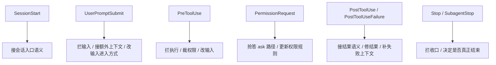

# 卷五 21｜Claude Code 里的各类 hooks 分别在拦什么、接什么、改什么

## 这篇要回答的问题

第 20 篇已经先把 hooks 立成 runtime 接缝层，第 19 篇又补出了原因：平台层为什么不仅要有能力对象，还要有运行时接缝。

到了第 21 篇，就不能再停在总论。

这篇要继续往下拆：

> **Claude Code 里的不同 hooks 类型，到底分别在拦什么、接什么、改什么？**

但这篇不能写成 API 手册，也不能退回配置索引。它要做的是：

- 把不同 hooks 放回 runtime 的不同接缝
- 说明它们各自的主要职责
- 让读者看完后知道 hooks 不是同一种回调在不同时间触发，而是一组分工不同的接缝

## 旧文与源码锚点

### 旧文素材锚点
- `docs/guidebook/volume-4/07-pretooluse-posttooluse-hooks.md`
- `docs/guidebook/volume-4/08-sessionstart-stop-hooks.md`
- `docs/guidebook/volume-4/09-hooks-conclusion.md`

### 源码锚点
- `src/types/hooks.ts`
- `src/utils/hooks.ts`
- `src/utils/sessionStart.ts`
- `src/utils/processUserInput/processUserInput.ts`
- `src/services/tools/toolExecution.ts`
- `src/cli/structuredIO.ts`
- `src/query/stopHooks.ts`

> 说明：当前仓库不直接携带 `cc/src/*` 源树，这里沿用卷四旧稿已经核对过的源码链路，作为本篇证据抓手。

## 主图：不同 hooks 落在不同接缝上

## 先给结论

- **不同 hooks 的差异，不在名字，而在它们卡住的是 runtime 的哪一段。**
- **有些 hooks 主要负责“拦”，有些主要负责“接”，有些主要负责“改”。**
- **Claude Code 的 hooks 不是一个统一回调桶，而是一组按接缝分工的 runtime 机制。**

## 主证据链

`types/hooks.ts` 不只枚举 HookEvent，还把不同事件允许返回的 hook-specific output 分开定义 → `sessionStart.ts`、`processUserInput.ts`、`toolExecution.ts`、`structuredIO.ts`、`stopHooks.ts` 分别在会话入口、输入入口、工具链、权限链和收口链消费这些不同语义 → 因而 SessionStart、UserPromptSubmit、PreToolUse、PermissionRequest、PostToolUse、Stop / SubagentStop 这些 hooks 的区别，不是配置名不同，而是它们分别在不同接缝上承担拦截、接入和改写的不同职责。

## 先给一个最短分类法：拦、接、改

为了避免写成清单，本篇先用三个动词收 hooks：

- **拦**：这一步能不能过，要不要先停一下
- **接**：额外上下文、额外判断、额外语义怎样接进主线
- **改**：输入、结果或后续走向能不能被正式改写

真实 hook 往往同时干两三件事，但这三个词足够抓住大差别。

## 第一类：SessionStart —— 主要在“接”

### 它拦在哪里

它卡住的是会话入口，而不是局部动作。

从卷四旧稿能看到，`src/utils/sessionStart.ts` 的 `processSessionStartHooks(...)` 覆盖的不是单一 startup，而是：

- `startup`
- `resume`
- `clear`
- `compact`

这说明 Claude Code 把“新的工作入口被建立”视为正式接缝。

### 它主要接什么

旧稿给出的几个关键信号很硬：

- `additionalContext`
- `initialUserMessage`
- `watchPaths`

这几个名字说明，SessionStart 不是欢迎语钩子，而是在会话一开始接入：

- 初始上下文
- 启动方向
- 需要观察的环境边界

### 它主要改什么

SessionStart 不一定直接改某段输入文本，但它会改：

- 这条会话带着什么上下文起步
- 第一轮 query 是从什么方向开始
- runtime 后面要观察哪些路径

所以 SessionStart 最准确的定位是：

> **在会话入口接运行语义。**

## 第二类：UserPromptSubmit —— 既“拦”，也“接”，还会“改”

### 它拦在哪里

它卡住的是：

- 用户输入已经提交
- 但还没有正式进入 query 主循环

证据链来自：

- `src/utils/processUserInput/processUserInput.ts`
- `executeUserPromptSubmitHooks(...)`

这说明 Claude Code 不把用户输入视为 parse 完就应立刻送模的东西，而是先经过一个可干预入口。

### 它主要接什么

旧稿里反复出现的是：

- `hook_additional_context`
- 额外上下文 attachment

也就是说，这类 hooks 很适合在输入进入主线前，把额外判断和额外环境接上去。

### 它主要改什么

更重要的是，它不只接信息，还会真正改走向。

卷四旧稿已经点出两个很硬的结果：

- `blockingError`
- `preventContinuation`

这说明 UserPromptSubmit hooks 可以：

- 让这轮输入先别进 query
- 在输入送模前直接把当前轮挡下来

如果再和 `updatedInput` 这类语义一起看，就能发现它实际上站在一个很重的位置：

> **输入进入主循环前的 gate。**

所以 UserPromptSubmit 最短可以记成：

> **先拦输入，再接语境，必要时改这轮进入方式。**

## 第三类：PreToolUse —— 主要在“拦”和“改”

### 它拦在哪里

它卡在工具真正执行之前。

证据链来自：

- `src/services/tools/toolExecution.ts`
- `runPreToolUseHooks(...)`

这不是轻回调，而是工具调用前的正式决策阶段。

### 它主要接什么

它会接入的不是泛化日志，而是和本次调用强相关的上下文：

- 当前工具输入
- 当前权限模式
- 当前会话 / agent 身份
- 额外上下文

因此它面对的是“这次调用到底该怎么发生”。

### 它主要改什么

这类 hooks 最典型的几种返回语义，卷四旧稿已经替我们点出来了：

- `updatedInput`
- `permissionDecision`
- `permissionDecisionReason`
- `preventContinuation`

这些词连在一起，含义很直接：

- 输入可以先被改
- 权限结论可以先被 hook 裁一遍
- 当前调用可以在 tool.call 之前就被截断

所以 PreToolUse 不是工具前“通知一下”，而是：

> **在工具执行前先审一遍、裁一遍、必要时直接拦住。**

## 第四类：PermissionRequest —— 主要在“拦”，而且是重拦

### 它拦在哪里

它卡住的不是普通调用前置，而是统一权限系统进入 ask 路径的时候。

证据链来自：

- `src/cli/structuredIO.ts`
- `PermissionRequest` hooks

### 它主要接什么

这一类 hooks 接进来的，是额外权限判断。

而且不是“等真实权限提示结束后再补一句意见”，而是卷四旧稿里那个很关键的判断：

- hook 和真实 permission prompt 会并发竞争
- 谁先返回谁生效

### 它主要改什么

它能改的，不只是本次 allow / deny。

旧稿还点出：

- `updatedPermissions`

这意味着 PermissionRequest hooks 不只是在这一次 ask 上抢答，还可能顺手更新未来的 permission rules。

所以它的角色必须单列：

> **它不是普通前置 hook，而是权限链上的共同裁决点。**

## 第五类：PostToolUse / PostToolUseFailure —— 主要在“接”和“改”

### 它们拦在哪里

它们卡住的是工具执行之后，而不是之前。

一个处理成功路径，一个处理失败路径。

证据链来自：

- `src/services/tools/toolExecution.ts`
- `runPostToolUseHooks(...)`
- `runPostToolUseFailureHooks(...)`

### 它们主要接什么

它们接的不是简单“执行完了”通知，而是结果语义本身。

卷四旧稿已经点出了一个特别值的字段：

- `updatedMCPToolOutput`

再加上 `additionalContext`，就能看清楚它们的站位：

- 成功后，结果可以先被解释、修整、补语境
- 失败后，错误路径也可以被补信息和编排

### 它们主要改什么

PostToolUse / Failure 最硬的地方，是它们不只做 side effect，而是会改：

- 结果如何被系统理解
- 工具输出以什么形式回到主线
- 失败时模型下一步看到的是什么

所以它们最准确的定位是：

> **工具做完以后，不是直接收工，而是先进入结果回流接缝。**

## 第六类：Stop / SubagentStop —— 主要在“拦收口”

### 它们拦在哪里

它们卡住的是 turn 准备结束的时候。

证据链来自：

- `src/query.ts`
- `src/query/stopHooks.ts`
- `executeStopHooks(...)`

Claude Code 并不把“assistant 当前没 follow-up 了”直接当作结束，而是还要再过 stop hooks。

### 它们主要接什么

这类 hooks 接进来的，更多是额外终止判断：

- 这一轮能不能现在结束
- 某些错误是否应先回流状态
- 子代理结束时是否需要专门收口

旧稿里还强调过：

- 有 `subagentId` 时会走 `SubagentStop`

说明这套收口逻辑不只服务主线程，也服务 worker runtime。

### 它们主要改什么

Stop hooks 最重的不是改文本，而是改控制流：

- 本来要停的地方，可能先别停
- 本来以为完成了，可能还要再过一轮
- blocking errors 可能被重新塞回 state

所以 Stop / SubagentStop 最短可以记成：

> **在收口点决定这一轮能不能真的收。**

## 把六类 hooks 再压成一张职责表

如果只保留卷五最该留下来的模型，可以这样记：

- **SessionStart**：接会话入口语义
- **UserPromptSubmit**：拦输入、接额外上下文、改进入方式
- **PreToolUse**：拦工具执行、裁权限、改输入
- **PermissionRequest**：在 ask 路径抢答并可能改未来权限规则
- **PostToolUse / Failure**：接结果语义、修结果、补错误路径上下文
- **Stop / SubagentStop**：拦收口，决定这一轮是否真正结束

## 为什么这篇不能退化成配置手册

因为卷五这里关心的不是：

- 每个 hook 有哪些字段
- JSON 长什么样
- 配置文件怎么填

而是：

> **不同 hooks 类型分别站在 runtime 的哪一段，因此承担什么不同职责。**

如果只写字段表，读者最多记住名称；但卷五需要保住的是层级模型。

## 为什么这里也不能越界写成 plugins 正文

第 21 篇虽然已经在细拆 hooks，但它拆的是接缝职责，不是封装治理。

这意味着它仍然只回答：

- 哪类 hooks 卡在哪里
- 各自主要负责拦什么、接什么、改什么

它不回答：

- hooks 怎样被统一打包
- 怎样安装、治理、启停和分发

那些是 plugins 组的事。

## 一句话收口

> Claude Code 里的不同 hooks 类型，差别不在名字，而在它们各自卡住 runtime 的哪一段：SessionStart 负责接会话入口语义，UserPromptSubmit 负责在输入进入前先拦、先接、必要时先改，PreToolUse 与 PermissionRequest 负责在工具链和权限链上先裁一刀，PostToolUse / Failure 负责在结果回流前先修一手，Stop / SubagentStop 则负责在收口点决定这一轮能不能真的结束；hooks 的价值，正是在这些不同接缝上承担不同的干预职责。