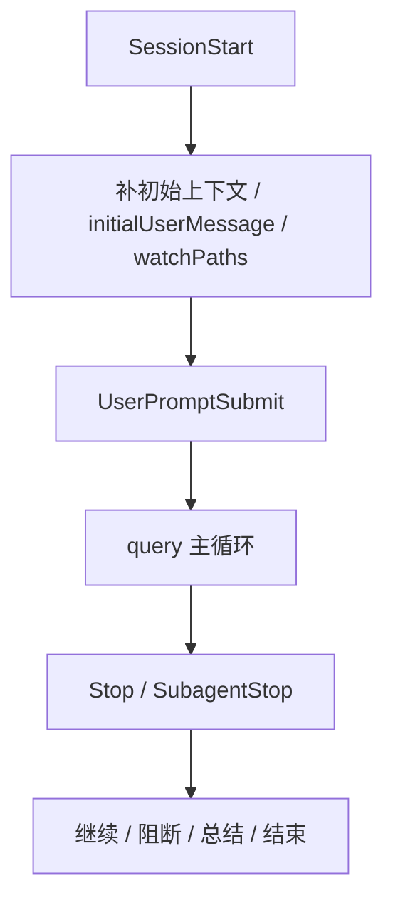

# 卷五 21｜一轮会话怎么起、怎么进、怎么收，hooks 其实都能插手

## 导读

- **所属卷**：卷五：外部扩展与多代理能力
- **卷内位置**：21 / 25
- **上一篇**：[卷五 20｜工具怎么跑，hooks 其实真的插得上手](./20-what-role-hooks-play-in-claude-code-runtime.md)
- **下一篇**：[卷五 22｜为什么有了 skills / MCP / hooks 之后，系统还需要 plugins](./22-why-plugins-are-still-needed-after-skills-mcp-and-hooks.md)

第 20 篇已经把 hooks 最硬的一条样本链讲清了：

> hooks 已经插进工具执行决策链。

但如果 hooks 只会插手 tool pipeline，它还只能算“工具回调系统”。

真正让它重量再上一个台阶的，是另一件事：

> **它连一轮会话怎么开始、怎么进入主循环、怎么准备收口，都能插手。**

所以第 21 篇不再讲工具，改讲另一条主线：

- `SessionStart`
- `UserPromptSubmit`
- `Stop / SubagentStop`

也就是：

> **起点—入口—收口**

---

## 先把总图压出来

这张图最重要的一点是：

> **hooks 不只卡工具，它已经覆盖了一轮会话的起点、入口和收口。**

一旦这件事成立，hooks 就不再只是局部执行增强，
而是开始进入整轮会话的生命周期编排。

---

## 第一段：`SessionStart` 说明 hooks 能塑造会话起点

很多系统的 start hook 很轻：

- 开始时跑一下
- 打点日志
- 输出欢迎语

但 Claude Code 明显不是这样。

卷四 08 已经把 `processSessionStartHooks(...)` 这条线压得很清楚：
它覆盖的不是单一 startup，而是更广义的入口：

- `startup`
- `resume`
- `clear`
- `compact`

这说明 Claude Code 看重的不是“是不是第一次打开界面”，
而是：

> **runtime 现在是不是正要进入一条新的工作入口。**

更关键的是，`SessionStart` hooks 能接进去的东西也很重：

- `additionalContext`
- `initialUserMessage`
- `watchPaths`

这些都不是外围信息。
它们会直接影响：

- 这条会话一开始带着什么上下文
- 第一轮从哪句话启动
- runtime 后面要观察哪些路径变化

所以 `SessionStart` 最短可以记成：

> **它不是欢迎语 hook，而是在塑造会话起点。**

---

## 第二段：`UserPromptSubmit` 说明 hooks 能卡住输入入口

接下来是第二个位置：

- 用户输入已经提交
- 但还没正式进入 query 主循环

这里的关键证据链来自：

- `src/utils/processUserInput/processUserInput.ts`
- `executeUserPromptSubmitHooks(...)`

这条线的价值在于，它证明 Claude Code 不把用户输入当成“parse 完就直接送模”的东西。

相反，它先承认：

> **用户输入进入主循环前，本身也是一个正式接缝。**

在这个阶段，hooks 能做的事也很重：

- 补 `additionalContext`
- 形成 `blockingError`
- `preventContinuation`
- 改变这轮输入最终如何进入 query

所以 `UserPromptSubmit` 最准确的定位不是“输入前 hook”，而是：

> **输入进入主循环前的 gate。**

这一步的意义非常大。
因为它说明 hooks 已经不只是观察系统做什么，
而是可以决定：

- 这轮是不是现在就该进去
- 进去之前要不要先补语境
- 甚至要不要先挡下来

---

## 第三段：`Stop / SubagentStop` 说明 hooks 能卡住收口边界

如果 hooks 只管开始和进入，还是不够重。
真正让它进入生命周期全链条的，是尾部这一下：

- query 准备结束时
- 系统还会再进 stop hooks

卷四 08 已经把这里讲得很清楚：

- `handleStopHooks(...)`
- `executeStopHooks(...)`
- 对子代理路径，Stop 还会自动转成 `SubagentStop`

这说明 Claude Code 连“这一轮到底该不该现在结束”，都没有完全写死在主循环里，
而是留了正式切口。

这一步的意义是：

- 某轮不是天然结束
- 某轮是否继续、是否阻断、是否先回流错误或总结，也能被 hooks 影响
- 子代理和主线程在 stop 位置上还有各自的生命周期语义

所以 `Stop / SubagentStop` 最短可以记成：

> **收口边界本身也是可被干预的。**

这就把 hooks 从“执行前后回调”彻底抬升成了生命周期机制。

---

## 为什么这篇一定要用“起点—入口—收口”三段来写

因为如果只挑一类 hook 单讲，读者会误以为 hooks 是若干零散功能。

但把这三段连起来之后，结构会一下子变清楚：

### 起点
- 会话怎么被建立
- 带着什么上下文起步

### 入口
- 用户输入怎么进入主循环
- 进之前要不要先补、先拦、先改

### 收口
- 这一轮什么时候算结束
- stop 判定是否还能被重写

这三段一压，读者自然会得出一个更大的判断：

> **hooks 已经覆盖了整轮会话的生命周期，不只是工具回调。**

---

## 这篇为什么不再回头讲工具链

因为第 20 篇已经把工具执行决策链讲完了。

第 21 篇如果再回头讲：

- `PreToolUse`
- `PermissionRequest`
- `PostToolUse`

那就会把 hooks 组重新写散。

所以这篇只守住另一条主线：

- `SessionStart`
- `UserPromptSubmit`
- `Stop / SubagentStop`

也就是生命周期主线。

这样 20 和 21 才不是同一篇的前后段，
而是两篇真正并列但不同的问题链。

---

## 一句话收口

> 在 Claude Code 里，hooks 不只会插手工具执行；`SessionStart` 能塑造会话起点，`UserPromptSubmit` 能卡住输入入口，`Stop / SubagentStop` 又能影响一轮怎样收口，所以 hooks 已经覆盖了整轮会话的起点、入口和收口，真正进入了生命周期编排层。
