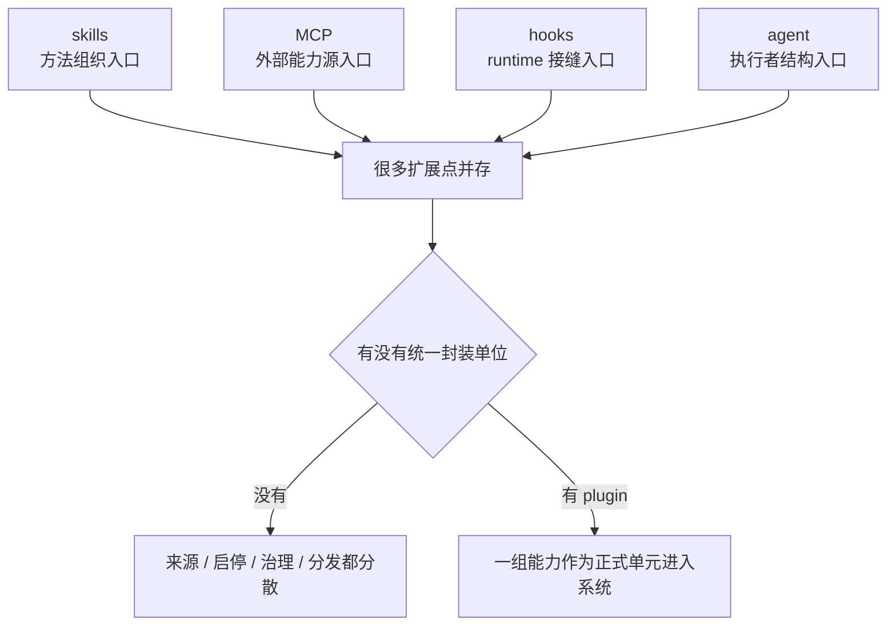

# 卷五 21｜为什么前面这些扩展点加起来，还是不够

## 导读

- **所属卷**：卷五：外部扩展与多代理能力
- **卷内位置**：21 / 24
- **上一篇**：[卷五 20｜一轮会话怎么起、怎么进、怎么收，hooks 其实都能插手](./20-what-different-hooks-intercept-connect-and-modify-in-claude-code.md)
- **下一篇**：[卷五 22｜plugin 到底是什么，它不是哪一种扩展点的壳](./22-what-layer-plugins-occupy-relative-to-other-extension-objects.md)

卷五前面已经把 methods、capabilities、executors、runtime seams 几条线分别立住了。

第 21 篇现在要先回答一个过渡问题：

> **既然已经有这么多扩展对象并存，Claude Code 为什么还会继续长出 plugins？**

这篇不主讲 plugin 的完整形态，只先证明一件事：前面这些对象分别解决了入口问题，但还没有把一整组扩展内容收成统一封装单位。

## 这篇要回答的问题

卷五前面已经把几条扩展主线分别立住了：

- **skills** 把用户的方法、流程和经验组织进系统
- **MCP** 把系统外部的能力源接进系统
- **hooks** 把 runtime 的关键接缝开放出来
- **agent / subagent** 把执行者结构和协作分叉带进系统

看到这里，读者很自然会问一句：

> **既然已经有这么多扩展对象并存，Claude Code 为什么还会继续长出 plugins？**

卷五第 21 篇要先把一个判断钉死：

> **前面已经有很多扩展点，不等于系统已经有了插件层。**

因为前面这些对象解决的是“能力分别从哪里进入系统”，但还没有解决“这一整组能力以什么单位被带进来、被启停、被归因、被治理、被分发”。

而 plugin，正是来回答这个缺口的。

## 旧文与源码锚点

### 旧文素材锚点
- `docs/guidebook/volume-4/10-plugin-capability-surface.md`
- `docs/guidebook/volume-4/15-plugin-conclusion.md`

### 源码锚点
- `/Users/haha/.openclaw/workspace/cc/src/types/plugin.ts`
- `/Users/haha/.openclaw/workspace/cc/src/plugins/`
- `/Users/haha/.openclaw/workspace/cc/src/plugin-loader/`

> 说明：本地仓库未必带着完整 `cc` 镜像，但卷五卡片要求的源码锚点已经足够说明本文的证据方向：plugin 不是再加一个单点能力，而是在已有多个扩展入口之上补一层统一封装单位。

## 主图：分散扩展点并存，为什么还会逼出 plugin

这张图的重点不是说 plugin 比前面“更强”，而是说：

> **很多扩展点并存，只能说明系统开放了很多入口；它还不能自动变成一个统一插件层。**

## 先给结论

- **skills、MCP、hooks、agent 都在解决自己的扩展问题，但它们首先是分面的入口，不是统一打包单位。**
- **没有统一封装单位，扩展世界就会在来源、启停、治理、分发四个地方开始散。**
- **plugin 的必要性，不在“多一种能力”，而在“把多种能力收成一个正式扩展单元”。**

## 主证据链

把卡片给出的源码锚点连起来，核心判断其实很直接：`plugin.ts` 这一层说明系统后面确实存在一个统一 plugin 对象；`plugins/` 与 `plugin-loader/` 这一层说明系统并没有把 skill、hook、MCP、agent 各自永远当成散装入口，而是要把它们收进统一装配流程；因此 plugin 解决的不是“再发明一种扩展内容”，而是把前面那些已经存在的扩展入口，提升成一个可以统一来源、统一启停、统一治理、统一分发的正式单位。

注意，这条证据链在第 21 篇里只需要承担一件事：

> **证明缺口确实存在，而且 Claude Code 确实在补这个缺口。**

至于 plugin 具体长什么样、第 22 篇再切；它如何继续长成平台边界、第 23 篇再讲。

## 先把误会打掉：扩展点很多，不等于插件层已经成立

这是第 21 篇最容易滑掉的地方。

如果只从表面看，Claude Code 的扩展世界已经很丰富：

- 你可以用 skill 组织方法
- 你可以用 MCP 接外部能力
- 你可以用 hook 卡 runtime 接缝
- 你可以用 agent 改写执行结构

这看起来像是“系统已经很可扩展”。

没错，它**确实已经很可扩展**。

但“可扩展”与“已经有插件层”不是同一件事。

前者回答的是：

> 系统允许哪些地方被扩展？

后者回答的是：

> 这些扩展内容，到底以什么正式单位被装进来？

如果这个单位不存在，系统就会出现一个很典型的局面：

- 每种扩展内容都能接进来
- 但每种内容都像各走各的侧门
- 你能看到很多入口
- 却看不到一个统一的“扩展包”边界

这就是第 21 篇要先立住的坡度：

> **扩展入口很多，和插件层成立，中间还差一个“统一封装单位”。**

## 前面几类对象分别解决了什么，为什么还是不够

为了看清 plugin 为什么还需要，最稳的方式不是先定义 plugin，而是先看前面对象到底已经把哪些问题解决掉了。

### 1. skills 解决的是“方法怎样进入系统”

skill 的主语一直是方法组织：

- 这类任务该怎么做
- 哪些步骤不能漏
- 哪些经验值得复用

所以它解决的是**工作方法的进入问题**。

但它不天然回答：

- 这个方法属于哪一个正式扩展包
- 它和哪些 hook、agent、MCP 配置是一组
- 这一组东西怎样被一起启用或停用

### 2. MCP 解决的是“外部能力源怎样进入系统”

MCP 把 Claude Code 的能力面延伸到系统外部：

- 外部工具
- 外部资源
- 外部 prompts / server

所以它解决的是**能力源接入问题**。

但它也不天然回答：

- 这批外部能力和哪些本地方法、hook、agent 配套
- 用户到底在管理一个 server，还是在管理一整组扩展能力
- 这些外部能力是一次性接入，还是属于某个可持续管理的单元

### 3. hooks 解决的是“runtime 哪些接缝允许被插手”

hook 的关键字是：

- 观察
- 拦截
- 注入
- 改写

所以它解决的是**运行时接缝开放问题**。

但它不天然回答：

- 这些 runtime 逻辑归属于哪个正式扩展来源
- 同一套 hook 和哪些 skill / command / MCP 配套
- 出问题时应该把责任归到哪一个统一对象上

### 4. agent 解决的是“执行者结构怎样扩出来”

agent / subagent 解决的是任务拆分和执行结构：

- 谁来做这段任务
- 是否要分叉 worker
- 如何形成协作结构

所以它解决的是**执行者组织问题**。

但它仍然不天然回答：

- 这些执行者定义与哪组 skill、hook、settings 属于同一个扩展单元
- 这套执行结构来自哪里
- 这整组能力如何被统一装配和管理

把这四条放在一起，你会发现一个清楚的事实：

> **前面的对象都在回答“某一类东西怎样进入系统”，但没有一个对象单独在回答“这一组东西怎样作为正式单位进入系统”。**

这就是“不够”的精确含义。

## 没有统一封装单位时，系统到底会散在哪里

卷五卡片要求这一篇必须把“散在哪里”说具体。这里不能只说一句“治理会分散”，而要把读者真正带到那个碎裂现场。

我会把它压成四个地方。

### 第一处：来源会散

没有统一封装单位时，系统看到的只是很多分面内容：

- 一个 skill 从某个目录来
- 一组 hooks 从另一处配置来
- 一个 MCP server 从另一份声明来
- 一个 agent 定义又从别的地方来

问题不是“它们不能工作”，而是：

- 它们是不是同一作者交付的一组能力？
- 它们是不是应该一起启用？
- 它们是不是属于同一个版本？
- 它们之间是不是本来就有协同关系？

如果没有统一打包单位，系统只能看到很多零件，看到不了“这是一整套东西”。

### 第二处：启停会散

没有统一封装单位时，启停动作很难自然落到“一组能力”上。

你只能面对这种局面：

- 这个 skill 要不要开
- 那个 hook 要不要关
- 那个 MCP server 还要不要接
- 这个 agent 定义还要不要保留

这时用户管理的是很多零碎开关，而不是一个明确的扩展对象。

但真实世界里，很多扩展内容本来就不是孤立存在的。它们常常是成组协作的：

- skill 负责方法
- hook 负责流程时机
- MCP 负责能力来源
- agent 负责执行结构

如果这些东西本来就是一套，却没有统一单位，那启停一定会变得碎。

### 第三处：治理会散

所谓治理，不只是“能不能加载”，还包括：

- 校验
- 归因
- 错误报告
- 依赖关系
- 策略控制

没有统一封装单位时，系统就很难自然回答：

- 这次失败到底是哪一组扩展导致的
- 这个风险配置到底该拦哪一组内容
- 这批能力缺少依赖时，应该对谁报错
- 某个来源不可信时，应该整体阻止什么

你当然可以对 skill、hook、MCP 各自做局部校验。

但局部校验不等于统一治理。

统一治理需要一个对象来承接这句话：

> **这一整组扩展内容，作为一个单元，需要被发现、校验、归因、启停和报错。**

### 第四处：分发会散

这也是最容易被忽略的一处。

如果没有统一封装单位，所谓“分享扩展能力”最后往往会退化成：

- 复制一个 skill 文件给别人
- 再让别人手动补 hooks
- 再告诉别人还要连哪个 MCP server
- 再补一句如果要多执行者协作，还得加 agent 定义

这不是正式分发，更像人工拼装说明书。

系统当然还是能扩展，但扩展的交付单位是碎的。

而 plugin 要解决的，正是把这些本来会分散交付的内容收成一个正式对象。

## 所以 plugin 真正在补什么

讲到这里，其实已经不必把 plugin 定义得太满了。第 21 篇只需要把它补上的那一层讲清楚。

更准确地说，plugin 在这里补的不是“更多能力”，而是一个**正式单元**。

这个正式单元至少要同时承接三件事：

- **把本来分散的内容看成同一组东西**，而不是若干偶然并列的零件
- **让装配、启停和归因有共同主语**，而不是每一类扩展内容各管各的
- **让共享与复用面对的是一个交付单位**，而不是一份人工拼装说明书

所以 plugin 的必要性，可以压成一句很稳的话：

> **前面的扩展对象解决了“内容怎样接进来”，plugin 解决的是“这些内容怎样作为一个正式单元被接进来”。**

## 为什么这里还不能把第 23、24 篇提前讲掉

第 21 篇的任务只到这里。

它要回答的是：

> 为什么前面已经有很多扩展点，系统还是会觉得不够？

所以这一篇只需要立住“缺的是统一封装单位”。

但它还不该把后面两篇偷吃掉：

### 这篇不主讲第 22 篇的问题
不在这里把 plugin 和 skill / MCP / hooks 的层级关系彻底切完。

### 这篇也不主讲第 23 篇的问题
不在这里把 install、marketplace、distribution、reuse 的成熟度闭环全部展开。

第 21 篇只先做最关键的一步：

> **先证明：很多扩展点并存，本身还不足以构成插件层。**

后面第 22 篇再去回答 plugin 到底处在什么层；第 23 篇再去回答为什么它会继续长成更完整的封装、分发和复用形态。

## 一句话收口

> Claude Code 在已有 skills、MCP、hooks、agent 这些扩展对象之后，仍然需要 plugin，不是因为前面的对象不重要，也不是因为系统还想再加一种重复能力；真正的问题在于，前面的对象分别解决的是方法组织、外部能力接入、运行时接缝和执行者结构，它们仍然是分面入口，而不是统一封装单位。没有这个统一单位，来源会散、启停会散、治理会散、分发也会散。plugin 出现，补的不是另一种能力，而是把这些本来分散进入系统的内容收成一个正式扩展单元。
