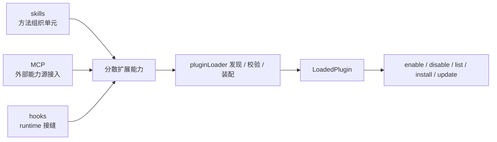

# 卷五 22｜为什么有了 skills / MCP / hooks 之后，系统还需要 plugins

## 这篇要回答的问题

走到 plugins 组，最自然的问题其实不是“plugin 能做什么”，而是：

> **前面已经有了 skills、MCP、hooks，Claude Code 为什么还要再长出 plugins？**

这个问题如果不先立住，后面两篇很容易直接跑偏：

- 把 plugin 写成所有扩展对象的统称
- 把 plugin 写成“把前面的东西装一起”的大口袋
- 把 plugin 写成生态愿景文，而不是源码导读文

卷五第 22 篇的职责，是先把一个更硬的判断钉住：

> **plugins 解决的不是“再补一种单点能力”，而是把前面分散的扩展对象收成一个更完整的封装单位。**

## 旧文与源码锚点

### 旧文素材锚点
- `docs/guidebook/volume-4/10-plugin-capability-surface.md`
- `docs/guidebook/volume-4/15-plugin-conclusion.md`

### 源码锚点
- `../cc/src/types/plugin.ts`
- `../cc/src/utils/plugins/pluginLoader.ts`
- `../cc/src/cli/handlers/plugins.ts`

> 说明：卷五卡片写的是 `cc/src/plugins/` 与 `cc/src/plugin-loader/`。当前仓库对应实现已落在 `../cc/src/types/plugin.ts`、`../cc/src/utils/plugins/pluginLoader.ts`、`../cc/src/cli/handlers/plugins.ts` 这条链上，本文按现行代码路径引用。

## 主图：从单点扩展到统一封装单位

## 先给结论

- **skills、MCP、hooks 都很重要，但它们首先是不同类型的扩展内容，不是统一扩展包。**
- **plugin 的必要性，不在于重复这些能力，而在于给这些能力补上一层统一封装、统一装配、统一治理的边界。**
- **Claude Code 需要 plugins，是因为平台不能只会“接能力”，还必须会“把一组能力作为正式单元接进来”。**

## 主证据链

`../cc/src/types/plugin.ts` 先把 `LoadedPlugin` 定义成同时可承载 `commands / agents / skills / hooks / outputStyles / mcpServers / lspServers / settings` 的统一运行时对象 → `../cc/src/utils/plugins/pluginLoader.ts` 再负责 discovery、validation、duplicate detection、enable/disable state、error collection，并把不同来源的扩展内容装成 `LoadedPlugin` → `../cc/src/cli/handlers/plugins.ts` 继续为 plugin 提供 `validate / list / install / uninstall / enable / disable / update / marketplace` 这组正式生命周期入口 → 所以前面已有 skills / MCP / hooks 仍然不够，系统还需要 plugin 这层“统一封装与治理单位”。

## 先打掉一个误会：前面对象已经很多，不等于已经有了统一扩展单元

前面几组已经分别把三个问题讲清楚了：

- **skills** 解决用户方法怎样进入系统
- **MCP** 解决外部能力源怎样接进系统
- **hooks** 解决 runtime 哪些接缝允许被插手

这些对象都是真对象，但它们回答的都是“某一类能力怎样进入 Claude Code”。

它们没有直接回答另一层问题：

- 这一组能力以什么单位被装进系统
- 这一组能力怎样统一启停
- 这一组能力怎样统一校验与归因
- 这一组能力怎样被安装、更新、列举和分发

而 plugin 正是在回答这组问题。

所以这里最关键的一刀是：

> **有扩展对象，不等于已经有扩展封装单位。**

## 第一条源码证据：`LoadedPlugin` 不是单一扩展点对象，而是多能力面的统一宿主

看 `../cc/src/types/plugin.ts`，最值钱的不是某个字段名，而是整个 `LoadedPlugin` 的结构。

它不是一个只描述 hooks 或 skills 的轻对象，而是直接同时挂出：

- `commandsPath / commandsPaths`
- `agentsPath / agentsPaths`
- `skillsPath / skillsPaths`
- `outputStylesPath / outputStylesPaths`
- `hooksConfig`
- `mcpServers`
- `lspServers`
- `settings`

这说明在 Claude Code 的运行时心智模型里，plugin 从一开始就不是“某一种扩展点的别名”，而是：

> **多种扩展内容的统一承载对象。**

这一步很关键。因为如果系统只需要 skills / MCP / hooks 各自独立存在，它完全可以让每一类对象各走各的 loader，各挂各的状态，不必再引入 `LoadedPlugin`。

但它没有这么做。

它先定义了一个统一对象，再让多种组件往这个对象上收。这已经说明：

- 平台需要的不是更多单点对象
- 平台需要的是一个更高一级的组织边界

## 第二条源码证据：`pluginLoader.ts` 干的不是“扫目录”，而是统一装配

`../cc/src/utils/plugins/pluginLoader.ts` 文件头直接写了它的职责：

- discovering
- loading
- validating
- duplicate detection
- enable/disable state management
- error collection and reporting

这几个词连起来看，就知道它绝不是“这里有个目录，我把它读一下”这么轻。

更重要的是，后面的实现明确说明 plugin loader 处理的是多来源输入：

- marketplace-based plugins
- session-only plugins
- builtin plugins

然后再把这些来源统一装配进 `createPluginFromPath(...)`、`finishLoadingPluginFromPath(...)`、`loadAllPlugins(...)` 这一整条装配链。

换句话说，plugin loader 回答的问题不是：

> 这个目录里有没有一个 skill 文件？

它回答的问题是：

> 这组来源不同、内容不同、状态不同的扩展能力，怎样被标准化成 Claude Code 内部可治理的统一对象？

这就是 plugin 存在的必要性之一：

> **单点扩展对象能提供内容，但 plugin 能提供统一装配。**

## 第三条源码证据：plugin 带来的不只是内容承载，还有统一状态和统一错误语义

如果 plugin 只是“把东西装一起”，那它还只是个打包壳。

但 `plugin.ts` 和 `pluginLoader.ts` 里更重的部分其实是状态与错误模型。

### 统一状态
`LoadedPlugin` 上除了能力内容，还有：

- `source`
- `repository`
- `enabled`
- `isBuiltin`
- `sha`

这意味着 plugin 不只是“带了哪些内容”，还带着：

- 它从哪来
- 它现在是不是启用
- 它是不是 builtin
- 它是否与某个版本 / commit 绑定

### 统一错误语义
`PluginError` 不是一个字符串，而是一整组类型化错误：

- `path-not-found`
- `manifest-parse-error`
- `manifest-validation-error`
- `hook-load-failed`
- `component-load-failed`
- `plugin-not-found`
- `marketplace-load-failed`
- `marketplace-blocked-by-policy`
- `dependency-unsatisfied`
- `plugin-cache-miss`
- `generic-error`

这说明 Claude Code 想治理的不是单个 hook 失败、单个 skill 丢失，而是：

> **某个 plugin 作为一个统一单元，在发现、校验、加载、依赖、来源策略、缓存上的整体状态。**

而这正是 skills / MCP / hooks 自身单独成立时很难天然提供的东西。

## 第四条源码证据：plugin 已经拥有自己的正式生命周期入口

再看 `../cc/src/cli/handlers/plugins.ts`，plugin 甚至不只活在 runtime 里，它还有一整套用户可见的生命周期接口：

- `plugin validate`
- `plugin list`
- `plugin install`
- `plugin uninstall`
- `plugin enable`
- `plugin disable`
- `plugin update`
- `marketplace add / list / remove / update`

这组命令说明的不是“plugin 很方便”，而是：

> **plugin 已经被当成一个正式产品对象，而不是若干扩展点在内部偷偷协作。**

也就是说，前面 skills / MCP / hooks 更多回答的是“能力怎样接进 runtime”；而 plugin 进一步回答的是：

- 这组能力怎样被列出来
- 怎样被装上去
- 怎样被停掉
- 怎样被更新
- 怎样被用户和项目显式管理

这就把扩展层往前推进了一大步。

## 为什么说 plugin 补上的不是重复功能，而是完整封装

卷五卡片要求这里必须说清一件事：

> **plugins 解决的不是重复功能，而是更完整封装。**

从上面的源码链看，这句话至少有三层意思。

### 1. 它统一的是来源边界
前面的 skill、MCP、hook 各自都能存在，但 plugin 能把“这一组能力从哪来”统一收口到 `source / repository / sha`。

### 2. 它统一的是装配边界
前面的对象可以分别被消费，但 plugin loader 会把它们先收成 `LoadedPlugin`，然后再进系统。

### 3. 它统一的是治理边界
启停、报错、依赖、缓存、marketplace、CLI 生命周期，都落在 plugin 这一层，而不是散在各对象自己身上。

所以 plugin 并不是“又提供一种跟 hook 类似的功能”，而是：

> **把一组本来会散开的扩展能力，收成一个统一管理单位。**

## 为什么第 22 篇必须先于 23 和 24

因为第 22 篇是 plugins 组的锚点篇。

它不先立住，后面就会很危险：

- 第 23 篇会变成对象百科比较文
- 第 24 篇会变成生态愿景文

第 22 篇要先钉死的，就是这个最基础的坡度：

> **Claude Code 已经有单点扩展能力，但系统之所以继续长出 plugins，是因为平台需要一层“统一封装与治理单位”。**

然后第 23 篇再去切层级：plugin 和 skill / MCP / hooks 不在同一层。

最后第 24 篇再去讲成熟度：为什么 plugin 代表更完整的封装、分发和复用形态。

## 这篇不展开什么

### 1. 不把 plugin 与其它对象的层级边界切完
那是第 23 篇的职责。

### 2. 不把分发 / marketplace / 复用成熟度全部讲完
那是第 24 篇的职责。

### 3. 不提前写卷尾的平台总收束
这里先立 plugin 为什么需要，不提前吞掉第 25 篇。

## 一句话收口

> Claude Code 在已有 skills、MCP、hooks 之后仍然需要 plugins，不是因为前面的对象不够强，而是因为它们首先只是方法组织、外部能力接入和 runtime 接缝这些单点扩展内容；`../cc/src/types/plugin.ts` 用 `LoadedPlugin` 把多种组件收成统一运行时对象，`../cc/src/utils/plugins/pluginLoader.ts` 再负责发现、校验、装配、启停和错误治理，`../cc/src/cli/handlers/plugins.ts` 继续补上安装、列举、启停、更新和 marketplace 生命周期，所以 plugin 真正补上的，是一层更完整的统一封装与治理边界。