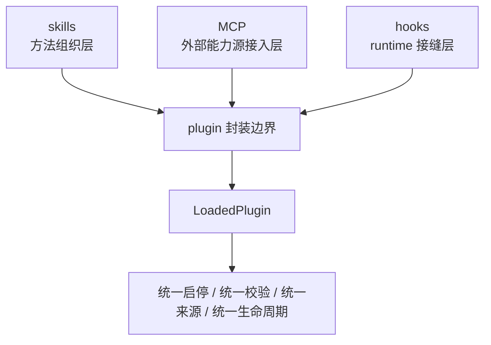

# 卷五 23｜plugins 和其它扩展对象分别处在什么层级

## 这篇要回答的问题

第 22 篇已经先把 plugins 组的锚点立住了：Claude Code 需要 plugin，不是为了重复 skills / MCP / hooks，而是为了补一层统一封装与治理边界。

接下来必须继续切一刀：

> **plugin 和 skills、MCP、hooks 到底处在什么层级？**

如果这一刀不切稳，plugin 会立刻滑回两个常见误解：

- 它是所有扩展对象的上位总称
- 它只是把其它对象名字换了一遍

而卷五第 23 篇的职责，正是把这个“大扩展桶”打碎。

## 旧文与源码锚点

### 旧文素材锚点
- `docs/guidebook/volume-4/10-plugin-capability-surface.md`
- `docs/guidebook/volume-4/12-plugin-attachment-points.md`
- `docs/guidebook/volume-4/15-plugin-conclusion.md`

### 源码锚点
- `../cc/src/types/plugin.ts`
- `../cc/src/utils/plugins/pluginLoader.ts`
- `../cc/src/services/mcp/types.ts`
- `../cc/src/skills/bundledSkills.ts`
- `../cc/src/utils/settings/types.ts`

> 说明：卷五卡片中的 `cc/src/plugins/`、`cc/src/hooks/`、`cc/src/mcp/`、`cc/src/skills/` 在当前仓库里分散落到了 `types/plugin.ts`、`utils/plugins/pluginLoader.ts`、`services/mcp/types.ts`、`skills/bundledSkills.ts`、`utils/settings/types.ts` 等实现文件中；本文按现行路径建立证据链。

## 主图：plugins 与其它扩展对象的层级关系

## 先给结论

- **skills、MCP、hooks 首先是不同语义的扩展内容；plugin 首先是收纳这些内容的统一封装边界。**
- **plugin 比它们高的地方，不在“抽象更大”，而在“它处理的是整体装配与治理问题”。**
- **plugin 统一的是边界，不统一的是语义。skill 还是 skill，hook 还是 hook，MCP 还是 MCP。**

## 主证据链

`../cc/src/types/plugin.ts` 中的 `LoadedPlugin` 同时容纳 `skills / hooks / mcpServers / commands / agents / settings` 等不同能力面 → `../cc/src/utils/plugins/pluginLoader.ts` 在 `createPluginFromPath(...)` 与 `finishLoadingPluginFromPath(...)` 里分别按各自语义加载这些内容，但最后都收进同一个 plugin 对象 → 这说明 Claude Code 没把 skills、hooks、MCP 抹平成一种对象，而是让它们保留原本职责，再进入 plugin 这个更高一级的封装边界 → 所以 plugin 与其它扩展对象不是并列同层，而是封装层与内容层的关系。

## 先把一件事说死：plugin 不是所有扩展对象的统称

从直觉上看，plugin 很容易被误解成“扩展对象的大总名”。因为它确实能承载很多东西：

- commands
- agents
- skills
- hooks
- MCP servers
- LSP servers
- settings
- output styles

但“能承载很多东西”不等于“它就是这些东西的本体总称”。

这和容器与内容的关系很像：

- 容器可以装很多种东西
- 但容器不是这些东西的语义上位词

放到 Claude Code 里也是一样：

- skill 还是在组织方法
- hook 还是在定义 runtime 接缝
- MCP server 还是在引入系统外能力源
- plugin 则是把这些内容收进统一边界

所以第 23 篇第一句话就该是：

> **plugin 不是兜底名词，而是统一封装边界。**

## 第一层：skills 处在方法组织层，plugin 处在方法的封装层之上

卷五前面已经反复证明过，skill 的主语不是“系统会什么”，而是：

- 用户经验怎样进入 Claude Code
- 某类工作流程怎样被组织成可调用方法单元

在当前代码里，这类内容会以 `skillsPath / skillsPaths` 的形式进入 plugin 对象；而 builtin plugin 也有 `skills?: BundledSkillDefinition[]` 这样的定义入口。

这说明两件事：

### 1. skill 本身不是 plugin
`LoadedPlugin` 里有 `skillsPath`，恰恰说明 skill 是 plugin 承载的一个组件面，而不是 plugin 的别名。

### 2. plugin 也不负责定义“什么是方法”
定义方法组织的仍然是 skill；plugin 负责的是：

- skill 属于哪个统一来源
- 它跟哪些 hooks / agents / commands 一起被装进来
- 它怎样被统一启停与治理

所以两者的关系更准确地说是：

- **skill：方法层内容**
- **plugin：方法内容所在的统一封装层**

## 第二层：hooks 处在 runtime 接缝层，plugin 处在接缝的封装层之上

第 20、21 篇已经把 hooks 的职责讲得很清楚：

- 它们卡在 SessionStart、UserPromptSubmit、PreToolUse、PostToolUse、Stop 这些 runtime 接缝上
- 它们的关键词是观察、注入、拦截、改写

而在 plugin 这条线里，hooks 进入系统的方式是 `hooksConfig?: HooksSettings`。

这件事本身就很说明问题。

### hook 是接缝内容
`HooksSettings` 描述的是运行时哪些点允许被挂钩、返回什么影响，它的主语是 runtime 阶段。

### plugin 是接缝内容所在的统一边界
plugin loader 负责：

- 找到 hooks 文件
- 合并 hooks
- 检测重复 hooks 文件
- 把 hooks 归到某个 plugin 名下
- 让它们带着同一来源、启停态、错误语义进入系统

这说明 plugin 不在回答“接缝是什么”，而是在回答：

> **这些接缝逻辑属于哪个正式扩展单元。**

所以两者不是一类对象：

- **hook：runtime 接缝层内容**
- **plugin：把接缝内容与其它内容一起收编的封装层**

## 第三层：MCP 处在外部能力源接入层，plugin 处在接入能力的封装层之上

MCP 在卷五的核心判断一直很稳定：

- 它不是“多一批远程工具”
- 它是外部能力源与资源系统进入 Claude Code 的接入层

在 plugin 代码里，这一层以 `mcpServers?: Record<string, McpServerConfig>` 的形式被纳入 `LoadedPlugin`。

这一步很关键，因为它直接说明：

- MCP server 可以成为 plugin 的一部分
- 但 plugin 不等于 MCP

### MCP 关心的是能力源如何接进来
`McpServerConfig` 关注的是外部 server 怎样被配置、怎样被接入。

### plugin 关心的是这类接入能力属于哪个统一扩展包
plugin 会继续给这类接入能力补上：

- 来源归属
- 启停状态
- marketplace / 安装生命周期
- 与其它组件的组合关系

所以更准确的关系应该是：

- **MCP：外部能力源接入层**
- **plugin：可把这种接入层内容收进去的更高一级封装层**

## 第四层：plugin 统一的是边界，不是语义

这是第 23 篇最重要的收口判断。

如果 Claude Code 真的把 plugin 设计成“大统一本体”，那它应该会做另一件事：

- 让 skill、hook、MCP 都变成某种同质化注册项
- 再用一个统一协议把它们抹平

但从 `pluginLoader.ts` 的实现看，系统并没有这么做。

它反而保留了明显分流：

- commands 有自己的路径与 metadata
- agents 有自己的路径
- skills 有自己的路径
- hooks 有自己的加载与 merge 逻辑
- MCP servers 作为专门配置被挂进来
- settings 还有允许名单过滤

这说明 plugin 做的不是“语义统一化”，而是：

> **边界统一化。**

统一的是什么？

- 来源边界
- 启停边界
- 装配边界
- 校验边界
- 生命周期边界

没有统一的是什么？

- 方法组织的语义
- runtime 接缝的语义
- 外部能力接入的语义

所以卷五这里必须把一句话讲透：

> **plugin 统一的是治理与封装边界，不是把所有扩展对象改造成同一种东西。**

## 为什么 plugin 比其它扩展对象“高一层”，但不能写成抽象空话

说 plugin 高一层，最容易滑成空洞说法：

- 更高级
- 更上位
- 更抽象

这些都不够硬。

真正硬的说法应该回到代码结构：

### 它高在统一运行时宿主
`LoadedPlugin` 是统一对象，而 skill / hook / MCP 都是其上内容面。

### 它高在统一装配线
`pluginLoader.ts` 负责 discovery、validation、load、merge、enable/disable、error collection。

### 它高在统一生命周期
`plugins.ts` 提供 validate、list、install、uninstall、enable、disable、update、marketplace 子命令。

所以 plugin 高一层，不是因为名字更宏大，而是因为：

> **它处理的已经不是某类能力怎样进入系统，而是这些能力怎样作为一个整体被系统接住、管理和分发。**

## 为什么这一篇不能越界吃掉第 24 篇

第 23 篇只负责切层级，不负责把成熟封装、分发、复用全部讲完。

这里能讲到的程度是：

- plugin 比其它对象高一层
- 高在统一封装与治理边界

但还不能把下面这些展开写完：

- 为什么它代表更完整的分发形态
- 为什么它代表更完整的复用形态
- 为什么 install / marketplace / schema / policy 构成成熟扩展系统

那些是第 24 篇的任务。

如果第 23 篇在这里提前把“成熟封装”全部说完，就会吃掉本组最后一篇的职责。

## 一句话收口

> plugins 不在与 skills、hooks、MCP 并列的同一层上：前者们分别是方法组织层、runtime 接缝层和外部能力源接入层的扩展内容，而 `../cc/src/types/plugin.ts` 中的 `LoadedPlugin` 与 `../cc/src/utils/plugins/pluginLoader.ts` 中的统一装配链，则把这些不同语义的内容收进同一个来源、启停、校验和生命周期边界里；因此 plugin 统一的是封装与治理边界，不是对象语义本身。