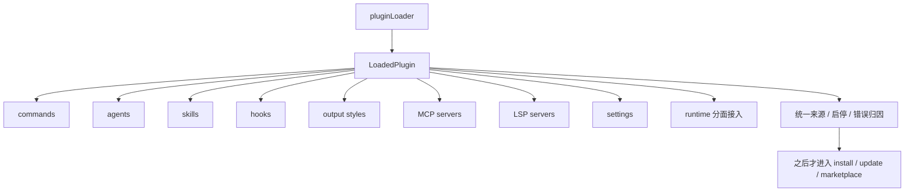

# 卷五 23｜plugin 到底是什么，它不是哪一种扩展点的壳

## 这篇要回答的问题

第 22 篇已经先回答了“为什么前面已经有 skills / MCP / hooks，系统还需要 plugin”。

接下来要补的不是“plugin 很重要”，而是更容易被误解的下一刀：

> **plugin 到底是什么？为什么它既不是 hooks 的壳，不是 marketplace 安装包，也不是某一种扩展点的同义词？**

如果这一步不回到运行时对象本身，文章就会很容易滑向三种轻飘的说法：

- plugin 就是扩展点总称
- plugin 就是 hooks 外面再包一层
- plugin 就是后来拿来 install / update / marketplace 的产品壳

这三种说法都抓到了一点边，但都没打中 Claude Code 里最硬的那个事实：

> **plugin 先是统一运行时对象，后面才轮到安装、治理和分发。**

## 旧文与源码锚点

### 旧文素材锚点
- `docs/guidebook/volume-4/10-plugin-capability-surface.md`
- `docs/guidebook/volume-4/12-plugin-attachment-points.md`
- `docs/guidebook/volume-4/15-plugin-conclusion.md`

### 源码锚点
- `/Users/haha/.openclaw.pre-migration/workspace/cc/src/types/plugin.ts`
- `/Users/haha/.openclaw.pre-migration/workspace/cc/src/utils/plugins/pluginLoader.ts`
- `/Users/haha/.openclaw.pre-migration/workspace/cc/src/utils/plugins/loadPluginHooks.ts`
- `/Users/haha/.openclaw.pre-migration/workspace/cc/src/utils/plugins/mcpPluginIntegration.ts`
- `/Users/haha/.openclaw.pre-migration/workspace/cc/src/cli/handlers/plugins.ts`

> 说明：写作卡片里给的是 `/Users/haha/.openclaw/workspace/cc/src/...`。当前本地可核对实现实际位于 `/Users/haha/.openclaw.pre-migration/workspace/cc/src/...`，本文按这套可读源码路径建立证据链。

## 主图：plugin 先是统一运行时对象

## 先给结论

- **在 Claude Code 里，plugin 首先不是抽象分类词，而是 `LoadedPlugin` 这种统一运行时对象。**
- **hooks、skills、MCP 只是 plugin 可以承载的组件面，不是 plugin 的全部身份。**
- **marketplace、install、update 当然也围着 plugin 转，但那是第二层：它们处理的是 plugin 的生命周期，不是 plugin 的第一定义。**

## 主证据链

`/Users/haha/.openclaw.pre-migration/workspace/cc/src/types/plugin.ts` 里，`LoadedPlugin` 从定义层就同时承载 `commands / agents / skills / output styles / hooks / MCP / LSP / settings` → `/Users/haha/.openclaw.pre-migration/workspace/cc/src/utils/plugins/pluginLoader.ts` 的 `createPluginFromPath(...)` 会先造出这个统一对象，再把不同能力面一项项挂进去 → `/Users/haha/.openclaw.pre-migration/workspace/cc/src/utils/plugins/loadPluginHooks.ts`、`.../mcpPluginIntegration.ts`、commands / agents / output styles 相关加载链又分别从同一个 plugin 对象里拿各自那一面接进 runtime → 所以 plugin 不是某一种扩展点的壳，而是**统一运行时宿主 / 统一能力承载对象**；安装、市场、启停这些只是围绕这个对象后来长出来的管理层。

## 第一部分：先把 plugin 定义对——它是统一运行时对象，不是抽象大类

这篇最该先抓住的，不是“plugin 比别的更高级”，而是最朴素的一件事：

Claude Code 里真的有一个叫 `LoadedPlugin` 的对象，而且它不是个薄薄的元数据壳。

`plugin.ts` 里的 `LoadedPlugin` 明确带着：

- `name`
- `manifest`
- `path`
- `source`
- `repository`
- `enabled`
- `commandsPath / commandsPaths`
- `agentsPath / agentsPaths`
- `skillsPath / skillsPaths`
- `outputStylesPath / outputStylesPaths`
- `hooksConfig`
- `mcpServers`
- `lspServers`
- `settings`

这串字段的意思非常直接：

> **系统不是把 hooks、skills、MCP 各自散放在外面，再在概念上叫它们“插件世界”；系统是先收出一个统一 plugin 对象，再让这些能力面寄宿在这个对象上。**

所以这篇如果要给一句最稳的定义，我会写成：

> **plugin 是 Claude Code 里统一承载多种扩展能力面的运行时对象。**

这里最关键的词不是“扩展”，而是：

- 统一
- 运行时对象
- 承载

因为这三个词刚好把常见误解挡掉了。

### 它不是抽象总称
如果它只是总称，就不需要 `LoadedPlugin` 这种具体结构。

### 它不是某一类能力本身
如果它就是 hooks 或 skills，本体字段就不会同时把这么多组件面并列挂出来。

### 它不是只给分发系统看的包名
如果它的第一身份只是安装包，它的核心类型就会先围着版本、来源、安装位置转，而不是先围着 runtime 能力组成转。

## 第二部分：为什么说 plugin 不是 hooks 的壳

这是最容易滑进去的误解。

因为 hooks 在前面几篇里已经讲得很重，而 plugin 又确实能带 hooks，所以直觉上很容易把 plugin 理解成：

- hooks 的打包壳
- hooks 的管理层
- hooks 的外包装

但源码其实明明白白在反对这个理解。

### 第一条证据：hooks 在 `LoadedPlugin` 里只是一个字段
`LoadedPlugin` 里是 `hooksConfig?: HooksSettings`。

这句话表面上很普通，真正重要的是它背后的主谓关系：

- 主语是 `LoadedPlugin`
- hooks 是它里面的一面配置

也就是说，Claude Code 不是先定义“hook plugin”，再围着 hook 加别的东西；而是先定义 plugin，再允许 plugin 其中一面是 hooks。

### 第二条证据：hook 真正进入 runtime 时，是从 plugin 对象里被抽出来注册
`loadPluginHooks.ts` 的逻辑很清楚：

- 先 `loadAllPluginsCacheOnly()` 拿到所有 enabled plugins
- 遍历每个 plugin 的 `hooksConfig`
- 把它转换成带 `pluginRoot / pluginName / pluginId` 的 matcher
- 再统一注册进 hooks runtime

这个流程说明两件事：

#### 1. hook 有自己的运行时语义
它是事件点上的 matcher 和 hook 列表，关心的是 `PreToolUse`、`PostToolUse`、`SessionStart`、`Stop` 这些 runtime 接缝。

#### 2. plugin 不是 hook 本身，而是 hook 的宿主与归属边界
因为注册前，系统总是先问：

- 这个 hook 属于哪个 plugin
- 这个 plugin 是否 enabled
- 它的根目录是什么
- 它的 pluginId 是什么

所以这里最准确的说法不是“plugin 是 hooks 的壳”，而是：

> **hook 是 plugin 能携带的一种 runtime 接缝能力；plugin 则是把这类能力连同其它能力一起收进系统的正式对象。**

换句话说：

- **hook 回答的是：在哪个运行时接缝上介入。**
- **plugin 回答的是：这些介入能力属于哪个统一扩展对象。**

这不是一回事。

## 第三部分：为什么说 plugin 不是 marketplace 安装包

第二个很常见的误解，是把 plugin 直接等同于安装和分发侧的对象。

这种误解也不是完全没来由。因为 `plugins.ts` 里确实已经有：

- `plugin list`
- `plugin install`
- `plugin uninstall`
- `plugin enable`
- `plugin disable`
- `plugin update`
- `plugin marketplace *`

但如果因此反过来把 plugin 定义成“安装包”，就把主次关系写反了。

### 为什么说主次关系反了
因为在实际代码顺序里，先出现的是统一运行时对象，后出现的是围绕它的管理动作。

更直一点说：

- 没有 `LoadedPlugin`，CLI 也就没有一个稳定对象可列举、启停、安装、卸载
- 正是因为系统先把 plugin 定义成正式对象，后面才值得长出 install / update / marketplace 这一整套生命周期

所以 marketplace 安装包只是 plugin 的**进入系统方式之一**，不是 plugin 的第一定义。

### `pluginLoader.ts` 也在帮我们纠偏
`pluginLoader.ts` 文件头会讲 discovery sources，会讲 marketplace-based plugins、session-only plugins、builtin plugins。

这其实恰好说明：

> **source 是 plugin 的来源维度，不是 plugin 的本体定义。**

同一个 plugin 对象可以来自：

- builtin
- marketplace
- inline / session-only

来源不同，不会让它突然从“plugin”变成别的东西；它进入系统后，仍然要落到同样的 `LoadedPlugin` 结构上。

所以这篇只需要轻轻点住一句：

> **plugin 可以被安装、被更新、被列举、被放进 marketplace，但这些都发生在“它已经是统一运行时对象”之后。**

更完整的分发、治理、平台边界，留给第 24 篇讲就够了。

## 第四部分：为什么说 plugin 也不是某一种扩展点的同义词

到这里还要再往前走半步。

即使读者不把 plugin 误会成 hooks 壳，也可能会退回到另一个宽一点的误解：

- plugin 就是一种扩展点
- 只是这种扩展点比较大
- 比 skills、MCP、hooks 都大一点

这个说法还是不够准。

因为它会让人误以为 plugin 和 skills / hooks / MCP 只是并列同类，只是粒度不同。

但 `LoadedPlugin` 的结构已经告诉我们不是这样。

### skills、hooks、MCP 是不同能力面
它们各自回答的问题不同：

- **skills** 更像方法组织与可调用经验单元
- **hooks** 更像 runtime 接缝上的观察、拦截、注入与改写
- **MCP** 更像外部能力源 / 外部 server 的接入面

### plugin 不是再来一种“第四扩展点”
plugin 做的不是再提供一条新接入面，而是把前面这些不同接入面收进同一个运行时对象里。

这点可以从 `createPluginFromPath(...)` 看得很清楚。

它的做法不是：

- 发现一个 hooks 扩展点
- 再发现一个 skills 扩展点
- 再发现一个 MCP 扩展点
- 大家彼此平行

它的做法是：

- 先创建一个 `plugin: LoadedPlugin`
- 然后为它补上 `commandsPath`
- 补上 `agentsPath`
- 补上 `skillsPath`
- 补上 `outputStylesPath`
- 继续补 `hooksConfig`
- 继续补 `mcpServers`
- 继续补 `lspServers`
- 继续补 `settings`

这就说明：

> **plugin 不是“其中一种扩展点”，而是扩展点们共同寄宿的统一宿主。**

所以第 23 篇真正要切开的层级关系，不是“谁更大”，而是：

- **skills / hooks / MCP 是能力面**
- **plugin 是统一运行时对象**

前者是内容面，后者是宿主面。

## 第五部分：plugin 统一的是对象边界，不是能力语义

这句是这篇最后必须收住的判断。

如果 Claude Code 真把 plugin 设计成“超级扩展点”，那最自然的做法应该是把所有东西抹平成一种注册项。

但实际代码不是这样走的。

它反而很刻意地保留了差异：

- hooks 通过 `loadPluginHooks.ts` 注册进 runtime hooks
- MCP 通过 `mcpPluginIntegration.ts` 读取和合并 server 配置
- commands / skills 走各自的发现与枚举链
- agents 走 agent definition 装载链
- output styles 走样式收集链

也就是说，Claude Code 没有把所有能力语义压成一种统一协议；它只是在更高一层把它们收进同一个 plugin 对象。

所以 plugin 统一的不是：

- 方法语义
- 接缝语义
- 外部能力源语义

plugin 统一的是：

- 来源归属
- 启停边界
- 运行时宿主
- 错误归因
- 组件并置关系

这句话最好记成：

> **plugin 统一的是对象边界，不是能力语义。**

也正因为如此，它才既不会把 hooks 吞掉，也不会把 skills、MCP 改名以后重讲一遍。

## 这篇的最终回答

现在可以把开头的问题压成一个读者真正能带走的版本：

> **plugin 在 Claude Code 里，首先是 `LoadedPlugin` 这种统一运行时对象：它能同时承载 commands、agents、skills、hooks、output styles、MCP、LSP 和 settings。hooks、skills、MCP 只是它承载的不同组件面，不是它的全部身份。也因此，plugin 不是 hooks 的壳，不是 marketplace 安装包，也不是某一种扩展点的同义词；它是系统用来接住多能力面的统一宿主与统一边界。**

如果再压缩成一句最值得记住的话，就是：

> **plugin 先是统一运行时对象，后面才轮到安装、治理和分发。**

这就是第 23 篇该做完的事。

第 24 篇再继续回答：为什么围绕这个统一对象，系统最后还会长出 loader、schema、policy、install、marketplace，直到 plugin 变成一层平台边界。
