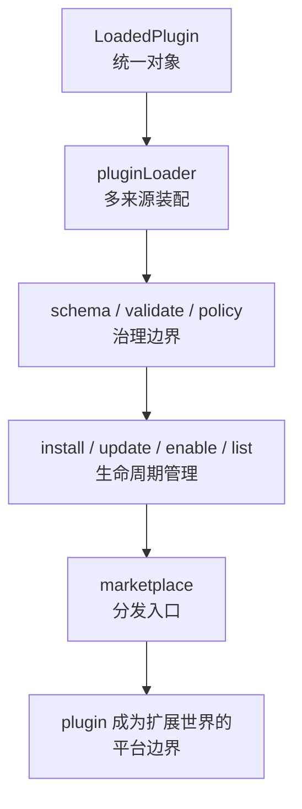

# 卷五 23｜为什么 plugins 最后会长成一层平台边界

## 导读

- **所属卷**：卷五：外部扩展与多代理能力
- **卷内位置**：23 / 24
- **上一篇**：[卷五 22｜plugin 到底是什么，它不是哪一种扩展点的壳](./22-what-layer-plugins-occupy-relative-to-other-extension-objects.md)
- **下一篇**：[卷五 24｜为什么这些扩展对象最终会收成一层平台能力](./24-why-these-extension-objects-converge-into-a-platform-layer.md)

第 22 篇已经把 plugin 立成统一运行时对象。

第 23 篇现在要再往前推一步：

> **为什么 plugin 不会停在“能力包”这一步，而是会继续长出 loader、schema、policy、install、marketplace，最后变成一层平台边界？**

这篇不提前把整卷卷尾写完，只收 plugin 这一条线：它怎样从统一对象，长成扩展世界默认围绕的边界对象。

## 这篇要回答的问题

第 22 篇已经回答了：为什么前面明明有 skills、MCP、hooks，系统还是需要 plugin。  
第 22 篇也已经回答了：plugin 和这些对象并不在同一层，plugin 更像统一封装边界。

到了第 23 篇，问题要再往前推一步：

> **为什么 plugin 不会停在“能力包”这一步，而是会继续长出 loader、schema、policy、install、marketplace，最后变成一层平台边界？**

这篇的重点不是重复证明 plugin 很重要，也不是提前把第 24 篇“整层平台如何收束”写完。

这篇只做一件事：

> **把 plugin 从统一对象，推进到平台边界。**

## 旧文与源码锚点

### 旧文素材锚点
- `docs/guidebook/volume-4/11-plugin-loader.md`
- `docs/guidebook/volume-4/13-plugin-validate-schema-policy.md`
- `docs/guidebook/volume-4/14-plugin-cli-install-marketplace.md`
- `docs/guidebook/volume-4/15-plugin-conclusion.md`

### 源码锚点
- `../cc/src/types/plugin.ts`
- `../cc/src/utils/plugins/pluginLoader.ts`
- `../cc/src/utils/plugins/validatePlugin.ts`
- `../cc/src/cli/handlers/plugins.ts`

> 说明：卷五写作卡片把源码锚点写成 `cc/src/plugin-loader/`、`cc/src/plugin-schema/`、`cc/src/plugin-marketplace/`、`cc/src/plugins/`。当前仓库能稳定回收的实现证据，主要落在 `types/plugin.ts`、`utils/plugins/pluginLoader.ts`、`utils/plugins/validatePlugin.ts`、`cli/handlers/plugins.ts` 这条链上，本文按现行代码路径建立论证。

## 主图：plugin 如何从统一对象长成平台边界

## 先给结论

- **plugin 先是统一能力对象，但系统不会停在那里。只要你真的想让这类对象长期存在，就一定会继续长出装配、治理、安装和分发。**
- **`LoadedPlugin` 让 plugin 成为统一宿主，`pluginLoader` 让它成为统一装配入口，schema / validate / policy 让它成为统一治理边界，install / marketplace 再让它成为统一分发入口。**
- **所以 plugin 最终代表的就不只是“一个能力包”，而是“扩展世界围绕哪个对象被平台化”。**

## 主证据链

`../cc/src/types/plugin.ts` 先定义 `LoadedPlugin`，把 commands / agents / skills / hooks / output styles / MCP / LSP / settings 等不同能力面收进同一个运行时对象 → `../cc/src/utils/plugins/pluginLoader.ts` 再把 builtin、marketplace、inline、session-only 等多来源插件统一装配成这个对象 → `../cc/src/utils/plugins/validatePlugin.ts` 与相关 schema / policy 链路继续回答“什么算合法插件、什么能被放行、什么该在作者侧或启动侧被拦住” → `../cc/src/cli/handlers/plugins.ts` 最后为 plugin 提供 install / uninstall / enable / disable / update / marketplace 等正式生命周期入口 → 围绕 plugin 运行的不再只是加载逻辑，而是一整套 contract、治理、安装、分发生态，因此 plugin 会从能力包长成平台边界。

## 先把标题里的那句话讲透：平台边界不是口号，而是“很多系统动作都围着同一个对象转”

什么叫平台边界？

不是名字更大，也不是生态词更响。

更硬的判断标准其实很简单：

- 加载时，系统是不是先把东西装配成同一个对象
- 校验和放行时，系统是不是先判断这个对象能不能进来
- 安装和更新时，用户操作的主语是不是这个对象
- 来源管理和分发时，系统维护的单位是不是这个对象

如果答案都是“是”，那这个对象就已经不只是内容容器，而是在承担一层平台边界。

plugin 在 Claude Code 里，正是这样长出来的。

## 第一部分：`LoadedPlugin` 先把扩展世界收成一个统一主语

第 23 篇已经把一个关键判断立住了：plugin 比 skills、hooks、MCP 更高一层，不是因为它更抽象，而是因为它先把这些内容收进了同一个边界。

这里要再往前推进一格。

看 `../cc/src/types/plugin.ts`，最重要的不是“plugin 可以装很多东西”，而是：

- 它有统一对象名：`LoadedPlugin`
- 它有统一来源字段
- 它有统一启停状态
- 它有统一错误归因空间
- 它能同时承载多种不同语义的组件面

这一步为什么关键？

因为平台边界首先需要一个稳定主语。

如果没有 `LoadedPlugin` 这种统一对象，Claude Code 完全可以让：

- skills 有 skills 自己的状态
- hooks 有 hooks 自己的状态
- MCP 有 MCP 自己的状态
- commands 有 commands 自己的状态

这样当然也能跑，但系统会立刻碎成几条互不对齐的管理链。

而一旦先有了 `LoadedPlugin`，很多后续动作就都自然会围上来：

- 来源要围着 plugin 记
- 启停要围着 plugin 记
- 错误要围着 plugin 归因
- 生命周期要围着 plugin 暴露
- 市场分发也要围着 plugin 建立

所以第一个硬结论是：

> **平台边界的第一步，不是 marketplace，而是先有一个统一对象，让系统知道“扩展世界到底以什么为单位被接住”。**

## 第二部分：`pluginLoader` 让这个统一对象变成“多来源装配总线”

只有统一对象，还不够构成平台边界。

因为如果 `LoadedPlugin` 只是个静态类型壳，那它最多只是一个比较好看的数据结构。

真正把它推进一层的，是 `../cc/src/utils/plugins/pluginLoader.ts`。

这个文件最值钱的地方，不是它会读目录，而是它说明 Claude Code 已经在认真处理一个平台问题：

> **不同来源的插件，怎样被装配成同一种系统对象。**

旧文和现有文章都已经给出过这条装配线的关键事实：

- loader 处理 builtin、marketplace、inline、session-only 等来源
- 它还要面对 cache、versioned cache、seed cache 这类现实分发问题
- 它会读 manifest，必要时补默认 manifest
- 它会收集 commands、agents、skills、hooks、output styles、settings 等组件面
- 它会统一记录 enabled / disabled / errors

这串动作合起来，已经不是“读取插件目录”，而是“统一装配总线”。

而一旦系统里存在统一装配总线，就说明 plugin 不再只是内容包，而开始承担一个更重的责任：

- 无论来源差异有多大，都得先进 plugin 装配链
- 无论组件形态有多不同，都得最后落成 `LoadedPlugin`
- 无论后面谁要消费这些能力，都先消费 plugin 这个统一对象

这一步为什么会把 plugin 往平台边界推？

因为平台边界的第二个特征，就是：

> **它不仅定义对象，还定义对象进入系统的标准方式。**

`LoadedPlugin` 解决的是“对象是谁”。  
`pluginLoader` 解决的是“对象怎么进来”。

两者一合，plugin 就开始从“统一能力包”长成“统一入口边界”。

## 第三部分：schema / validate / policy 说明 plugin 已经不只是装配边界，还是治理边界

如果到 loader 为止，这套系统仍然可以被理解成“高级打包器”。

真正让 plugin 明显越过“能力包”这条线的，是治理层。

从 `../cc/src/utils/plugins/validatePlugin.ts` 和卷四相关旧文回收下来的证据看，plugin 世界已经不只是“能不能 load”，而是在持续回答下面这些问题：

- 什么样的 manifest 才算合法
- 什么样的 marketplace 条目才算合法
- 哪些字段属于 plugin.json，哪些字段不该写进去
- 路径是否安全，是否存在 path traversal 风险
- skills / agents / commands / hooks 内容是否符合约束
- 即使结构合法，当前 policy 是否允许它被安装或启用
- 即使配置上能装，当前目录和启动状态是否值得 trust

这说明什么？

说明 Claude Code 已经不把 plugin 当成“发现了就加载”的目录机制，而是当成“需要治理的扩展对象”。

这里最好把三层分清：

### 1. schema 负责给 plugin 世界立 contract
它回答的是：plugin 世界里哪些数据结构算正式对象。

### 2. validate 负责给作者侧立质检
它回答的是：作者在交付前写错了什么，哪些是 error，哪些只是 warning。

### 3. policy 负责给系统侧立放行边界
它回答的是：即使插件写得合法，它现在能不能被接进系统。

这三层一叠上去，plugin 的角色就发生了变化。

它不再只是“把能力装在一起的包”，而变成了：

> **装配、校验、放行、信任都围着它转的治理边界。**

而“治理边界”恰恰是平台边界最重要的一半。

因为平台和工具集合的区别，很多时候不在于功能多少，而在于：

- 有没有正式 contract
- 有没有作者侧反馈
- 有没有系统侧闸门
- 有没有来源与信任边界

plugin 在这里已经明显是前者了。

## 第四部分：install / update / marketplace 让 plugin 从治理边界继续长成分发边界

再往前一步，就是 `../cc/src/cli/handlers/plugins.ts` 代表的那条产品链。

这条链最值得注意的不是命令多，而是命令的主语始终是 plugin：

- `plugin validate`
- `plugin list`
- `plugin install`
- `plugin uninstall`
- `plugin enable`
- `plugin disable`
- `plugin update`
- `marketplace add / list / remove / update`

这说明 Claude Code 已经不满足于“plugin 在 runtime 里能被接住”。

它还要继续回答：

- 用户怎么发现 plugin
- 用户怎么安装 plugin
- plugin 安装到哪里
- plugin 属于哪个 scope
- plugin 当前是不是已安装、已启用、可更新
- plugin 的来源市场怎么维护

注意，这里最关键的变化是：

> **plugin 从 runtime 对象，进一步变成了产品对象。**

而一旦一个对象开始拥有正式的：

- 安装语义
- 更新语义
- 作用域语义
- 账本语义
- 市场来源语义

它就已经不是普通封装包了。

它在承担什么？

它在承担整套扩展分发世界的统一单位。

也就是说，install / update / marketplace 并不是给 plugin “顺手补几个命令”，而是在把 plugin 推成：

> **扩展世界默认围绕哪个对象被发现、安装、更新和传播。**

这就是平台边界的另一半：分发边界。

## 第五部分：把四块证据压成一句话，才看得见 plugin 为什么会继续长大

卷五卡片要求这篇必须明确把四块拼起来：

- `LoadedPlugin`
- `pluginLoader`
- schema / policy
- install / marketplace

把这四块连起来，plugin 的生长方向就很清楚了。

### 第一步：`LoadedPlugin` 统一对象
系统先决定：扩展世界要以 plugin 为统一主语。

### 第二步：`pluginLoader` 统一装配
系统再决定：不同来源、不同组件面，都要先进入 plugin 装配链。

### 第三步：schema / policy 统一治理
系统继续决定：什么能进、什么不该进、什么该 warning、什么该被拦，都围着 plugin 定。

### 第四步：install / marketplace 统一分发
系统最后决定：安装、更新、来源管理、用户可见生命周期，也围着 plugin 定。

到这里，plugin 的位置已经完全变了。

它不再只是：

- 一个把能力收在一起的包
- 一个方便复用的目录
- 一个更大的扩展壳

它更像：

> **Claude Code 用来组织扩展世界的默认边界对象。**

这就是“平台边界”最准确的读法。

不是说 plugin 一夜之间变成整个 Claude Code 平台本身，
而是说：

> **在扩展这一侧，装配、治理、安装、分发都开始围绕 plugin 组织起来。**

## 第六部分：为什么这一篇不能写成“生态愿景文”，也不能偷吃第 24 篇

第 23 篇最容易跑偏成两种样子。

### 跑偏一：写成生态宣传文
一提 marketplace，就开始讲未来社区会多繁荣。

这不对。

这篇真正要立住的，不是未来愿景，而是当前结构判断：

- 已经有统一对象
- 已经有统一装配链
- 已经有正式治理层
- 已经有正式生命周期与分发入口

这些事实已经足够支持“plugin 正在长成平台边界”。

### 跑偏二：提前把第 24 篇写完
第 24 篇要收的是：skills、MCP、agents、hooks、plugins 为什么最终共同收成平台能力层。

而第 23 篇只收 plugin 这一条线。

所以这里能讲到的边界是：

- plugin 已经是扩展世界的一层平台边界

但还不要把整卷结论提前写成：

- Claude Code 的全部扩展对象怎样一起组成平台层

这里先收住 plugin 这一条线；整卷为什么会一起收成平台层，留给第 24 篇。

## 一句话收口

> plugin 之所以最后会长成一层平台边界，不是因为它只是更大的能力包，而是因为 Claude Code 已经把越来越多关键动作都压到了同一个主语上：加载时先装配成 plugin，校验时先判断 plugin 合不合法，放行时先判断 plugin 能不能进系统，安装和更新时用户操作的也还是 plugin。当装配、治理、安装、分发都开始围着同一个对象组织时，plugin 就已经不再只是能力包，而是扩展世界默认围绕的那层平台边界。
