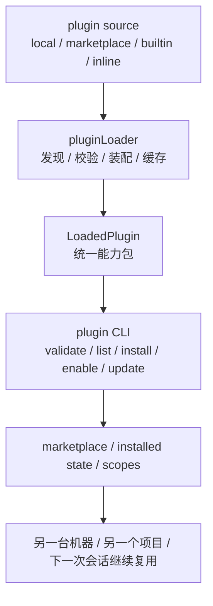

# 卷五 24｜plugins 为什么代表更完整的封装、分发和复用形态

## 这篇要回答的问题

第 22 篇已经立住了 plugin 为什么还需要，第 23 篇已经切清了 plugin 与 skills / MCP / hooks 不在同一层。

到了第 24 篇，plugins 组最后要收住的，不是“plugin 很重要”，而是更具体的一句：

> **为什么说 plugin 代表的是更完整的封装、分发和复用形态？**

这句话如果没有源码证据支撑，就很容易写成生态宣传文；但如果回到当前代码链，它其实是一个很硬的结构判断。

## 旧文与源码锚点

### 旧文素材锚点
- `docs/guidebook/volume-4/11-plugin-loader.md`
- `docs/guidebook/volume-4/13-plugin-validate-schema-policy.md`
- `docs/guidebook/volume-4/14-plugin-cli-install-marketplace.md`
- `docs/guidebook/volume-4/15-plugin-conclusion.md`

### 源码锚点
- `../cc/src/utils/plugins/pluginLoader.ts`
- `../cc/src/utils/plugins/validatePlugin.ts`
- `../cc/src/cli/handlers/plugins.ts`
- `../cc/src/types/plugin.ts`

## 主图：plugin 的封装 / 分发 / 复用闭环

## 先给结论

- **plugin 比 skill、hook、MCP 更完整，不是因为它名字更大，而是因为它同时把封装、分发、复用三件事做成了正式结构。**
- **`pluginLoader.ts` 说明 plugin 不只是内容目录，而是有发现、校验、装配、缓存、状态和错误模型的完整封装单元。**
- **`validatePlugin.ts` 与 `plugins.ts` 说明 plugin 不只是 runtime 对象，它还已经拥有作者侧校验、用户侧安装管理和 marketplace 分发入口。**

## 主证据链

`../cc/src/utils/plugins/pluginLoader.ts` 负责把不同来源的内容发现、校验、装配、缓存并产出 `LoadedPlugin` → `../cc/src/utils/plugins/validatePlugin.ts` 再把 `plugin.json`、`marketplace.json`、skills / agents / commands / hooks 内容做成正式验证链 → `../cc/src/cli/handlers/plugins.ts` 为 plugin 暴露 `validate / list / install / uninstall / enable / disable / update / marketplace *` 这一整套生命周期动作 → 所以 plugin 已经不只是“某类扩展内容”，而是具备封装、分发、复用闭环的成熟扩展单元。

## 第一部分：为什么说 plugin 的“封装”更完整

封装这个词最容易被讲轻。轻了以后，它就只剩一句“把文件放一起”。

但从当前代码看，plugin 的封装根本不是物理归档，而是运行时与治理意义上的统一边界。

### 证据一：它封装的是多种组件，不是单类文件
`LoadedPlugin` 里可以同时挂：

- commands
- agents
- skills
- hooks
- MCP servers
- LSP servers
- settings
- output styles

这说明 plugin 封装的不是“某个技能文件夹”，而是一整组彼此协同的扩展内容。

### 证据二：它封装的还有来源与状态
`source`、`repository`、`enabled`、`sha`、`isBuiltin` 这些字段都不属于内容本身，却属于 plugin 本体。

这意味着 plugin 封装的不只是“有哪些能力”，还包括：

- 它从哪来
- 它现在启没启
- 它处在什么来源和版本状态

### 证据三：它封装的还有失败方式
`PluginError` 里专门建模了：

- manifest 解析失败
- manifest 校验失败
- hooks 加载失败
- component 加载失败
- marketplace 被策略拦截
- 依赖不满足
- cache miss

这说明 plugin 的封装已经覆盖：

- 成功路径
- 失败路径
- 归因路径

所以 plugin 的“封装”之所以更完整，不是因为它大，而是因为：

> **它把内容、来源、状态、失败方式都收进了同一个正式对象。**

## 第二部分：为什么说 plugin 的“分发”更完整

只有封装，还不代表成熟扩展形态。因为很多内部机制也能把东西封在一起，但它们并不能被正式分发。

plugin 更进一步的地方，在于它已经有清晰的分发面。

## 证据一：`plugins.ts` 里已经有完整的安装生命周期
从 CLI handler 可以直接看到 plugin 的分发动作：

- `plugin install`
- `plugin uninstall`
- `plugin update`
- `plugin enable`
- `plugin disable`
- `plugin list`

一个对象如果值得有这整套命令，它就已经不是单纯的内部数据结构，而是用户可管理、可持续存在的产品对象。

## 证据二：还有 marketplace 这一层来源管理
同一个文件里还提供：

- `marketplace add`
- `marketplace list`
- `marketplace remove`
- `marketplace update`

这说明 plugin 的来源不是临时硬编码，而是被放进了一个正式的“可声明、可刷新、可维护”的分发体系里。

## 证据三：`pluginLoader.ts` 处理的就是多来源分发现实
loader 头部已经明确列出来源：

- marketplace-based plugins
- session-only plugins
- builtin plugins

再往下看，还有：

- local path
- npm
- github
- git url
- git-subdir
- cache / versioned cache / zip cache / seed cache

这不是“顺手支持几个输入方式”，而是在认真处理扩展对象进入系统时的真实分发问题：

- 从哪装
- 怎样缓存
- 怎样更新
- 怎样区分会话态和安装态

所以这里可以很稳地说：

> **plugin 不是会话内偶发对象，而是有正式来源和生命周期的分发对象。**

## 第三部分：为什么说 plugin 的“复用”更完整

复用不只是“下次再复制一份”。

如果只是复制 skill 文件，那当然也算复用；但那种复用复用的是单点内容，不是完整组织方式。

plugin 更完整的地方，在于它复用的是整组协同能力以及它们的组织关系。

### 1. 复用的不只是单个内容，而是一组协同组件
一个 plugin 里可能同时带着：

- skill
- hook
- command
- agent
- MCP server
- settings

所以下次复用时，被带走的不是“某个小片段”，而是整套配合关系。

### 2. 复用的不只是内容，还包括来源与治理边界
因为 plugin 自带：

- source
- enabled
- lifecycle
- validation
- marketplace entry

所以它复用的不只是文本，还复用：

- 这组能力如何进入系统
- 如何被启停
- 如何被校验
- 如何被归因和管理

### 3. 复用已经接近“可重复交付”
`plugin list`、安装账本、scope、marketplace source 这些机制说明，plugin 更像一个“下次还能正式再次部署”的对象，而不是一次性复制品。

所以更准确的说法是：

> **plugin 的复用单位，已经从单点内容升级成可重复交付的扩展包。**

## 第四部分：为什么 `validatePlugin.ts` 是成熟度证据，而不只是辅助工具

卷四卡片要求第 24 篇至少点出 loader、schema / policy、attachment、distribution 这些成熟度部件。当前仓库里最能补这条证据的，就是 `validatePlugin.ts`。

这个文件的重要性不在“有个 validate 命令”，而在它说明 plugin 已经有作者侧 contract。

### 它验证 plugin.json 与 marketplace.json
这意味着 plugin 不是“文件摆对就行”，而是需要满足正式清单约束。

### 它验证内容文件
它会继续检查：

- skills
- agents
- commands
- hooks.json

也就是说，plugin 的成熟度不只在壳层，还落到了内部组件内容上。

### 它还关心路径、frontmatter、字段归属等作者侧问题
比如：

- path traversal 检查
- marketplace-only 字段误写到 plugin.json 的提示
- frontmatter 解析与字段有效性
- hooks.json schema 验证

这说明 plugin 系统已经开始回答：

- 什么算一个合法插件
- 作者写错时怎么在交付前发现
- 哪些问题会在运行时变成真正的加载失败

所以 `validatePlugin.ts` 之所以重要，是因为它把 plugin 从“能跑就行”推进成了“有 contract 的扩展产品”。

## 第五部分：为什么说第 24 篇讲的是成熟度，不是生态愿景

这篇很容易写跑偏：一说 marketplace，就开始讲生态；一说分发，就开始畅想社区繁荣。

但卷五这里更重要的不是愿景，而是当前结构判断。

从代码上已经能证明的，是下面这些事实：

- 有统一运行时对象 `LoadedPlugin`
- 有统一 loader 负责发现、装配、缓存和状态
- 有正式 validation 链
- 有 install / enable / update / list 这些生命周期动作
- 有 marketplace 作为来源管理入口

这些事实已经足够说明：

> **plugin 在 Claude Code 里代表的是更成熟的扩展封装形态。**

不需要额外想象未来生态多大，这个结论已经成立。

## 第六部分：为什么这一篇刚好给卷尾留下最自然的台阶

卷五最后一篇要做的是整卷收束：为什么这些对象最终会收成一层平台能力。

而第 24 篇在 plugins 这里刚好把最后一块拼图补齐：

- 前面的对象解决能力怎样接进来
- plugin 进一步解决这些能力怎样作为正式扩展单元被封装、分发、复用

这意味着卷尾就可以更自然地往上收：

- skill 是方法层
- MCP 是外部能力层
- agent 是执行者层
- hooks 是接缝层
- plugin 是成熟封装层

这样第 25 篇就有了稳的落脚点，而不是凭空总论。

## 这篇不展开什么

### 1. 不重讲第 22 篇“为什么还需要 plugin”
这一篇默认那个锚点已经成立。

### 2. 不重复第 23 篇的层级切分
这里只讲它为什么更完整，不重切 skill / MCP / hooks 边界。

### 3. 不提前吃掉卷尾的平台总收束
这里只把 plugin 的成熟度立住，不把整卷结论提前写完。

## 一句话收口

> plugins 之所以代表更完整的封装、分发和复用形态，不是因为它只是更大的打包壳，而是因为 `../cc/src/utils/plugins/pluginLoader.ts` 已经把来源发现、校验、装配、缓存、状态与错误模型收成统一加载链，`../cc/src/utils/plugins/validatePlugin.ts` 又把 manifest、marketplace 与内部组件做成正式 contract，`../cc/src/cli/handlers/plugins.ts` 则继续补上 install、enable、update、list 与 marketplace 这一整套生命周期入口；因此 plugin 在 Claude Code 里已经不只是某类扩展内容，而是一个可装配、可分发、可重复交付的成熟扩展单元。