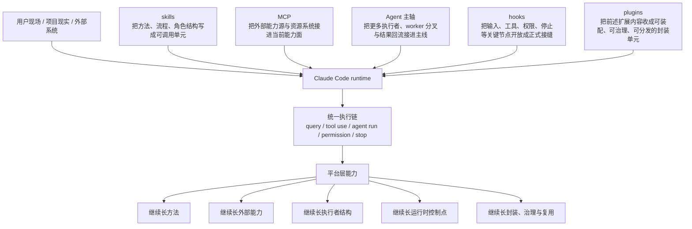

# 卷五 24｜为什么这些扩展对象最终会收成一层平台能力

## 导读

- **所属卷**：卷五：外部扩展与多代理能力
- **卷内位置**：24 / 24
- **上一篇**：[卷五 23｜为什么 plugins 最后会长成一层平台边界](./23-why-plugins-represent-a-more-complete-form-of-packaging-distribution-and-reuse.md)
- **下一篇**：卷六入口待接续

到第 24 篇，卷五前面的五条线都已经分别立住了：方法、外部能力源、执行者结构、runtime 接缝、统一封装。

卷尾真正要回答的，不是对象再复述一遍，而是：

> **为什么这些看上去分散、入口各异、职责不同的对象，最后会一起收成 Claude Code 的一层平台能力？**

也就是说，这篇只负责把前文证据重新压回同一条 runtime 因果链，把卷五从对象卷收成平台卷。

## 这篇要回答的问题

卷五前 23 篇已经把五组对象各自立住了：

- skills 不是长 prompt，而是方法组织单元
- MCP 不是多一批远程工具，而是外部能力源接入层
- Agent 主轴不是对象堆，而是一条执行者主线
- hooks 不是零散回调，而是 runtime 接缝层
- plugins 不是兜底大名词，而是更完整的封装与分发层

如果卷五停在这里，读者当然已经知道 Claude Code **有很多扩展对象**。

但这还不是卷五真正要留下来的判断。

卷五最后一篇要回答的是更高一级的问题：

> **为什么这些看上去分散、入口各异、职责不同的对象，最后会一起收成 Claude Code 的一层平台能力？**

这个问题不能靠一句“因为它开放”来回答，也不能把前文 24 篇再逐篇复述一遍。更稳的办法，是把前文已经看过的源码入口重新压回同一条 runtime 证据链。

## 旧文与源码锚点

### 旧文素材锚点
- `docs/guidebook/volume-1/27-skills-conclusion.md`
- `docs/guidebook/volume-4/09-hooks-conclusion.md`
- `docs/guidebook/volume-4/15-plugin-conclusion.md`
- `docs/guidebook/volume-3/12-twenty-agent-design-takes.md`

### 源码锚点
- `cc/src/tools/SkillTool/`
- `cc/src/tools/AgentTool/`
- `cc/src/mcp/`
- `cc/src/hooks/`
- `cc/src/plugins/`

> 说明：本仓库当前正文目录不直接携带 `cc/src/*` 源树快照；本篇沿用卷五前文已经核对过的源码入口与旧稿结论，把证据重新收束成卷尾判断。

## 主图：卷五平台层总收束图

这张图承担卷五总收束职责。它最重要的地方，不是把五组对象摆在一起，而是把它们重新压回同一个 runtime 判断：

> **它们分别接入的不是同一种东西，但它们最后共同解决的是同一件事——Claude Code 怎样继续长能力，而且能把新增能力留在系统里。**

## 先给结论

### 结论一：它们会收成平台层，不是因为名字都叫“扩展”，而是因为它们共同覆盖了 runtime 的五个关键面

前文一路写下来，实际上已经把五个面补齐了：

- **skills** 处理方法怎样进入系统
- **MCP** 处理系统外能力怎样进入系统
- **Agent 主轴** 处理更多执行者怎样进入系统
- **hooks** 处理运行中的关键节点怎样被正式插手
- **plugins** 处理这些扩展内容怎样被收成正式封装单元

只看单篇时，这五件事像五条线；压回 runtime 后，它们就是平台层的五个面。

### 结论二：平台层成立的标志，不是对象变多，而是“继续适应新场景”被做成了系统能力

功能列表只能回答“现在有什么”；平台层还要回答：

- 新方法怎么进来
- 新资源怎么进来
- 新执行者怎么进来
- 新控制点怎么进来
- 新封装单元怎么进入安装、治理和分发体系

卷五真正立住的，不是对象目录，而是这套持续增长机制。

### 结论三：第 24 篇的收束点，不是“Claude Code 很开放”，而是“Claude Code 已经把扩展写进了 runtime 结构里”

这句话要尽量保留源码证据感。

因为前文能反复看到的并不是抽象开放性，而是这些更硬的事实：

- `SkillTool` 说明方法单元会进入正式执行链
- `AgentTool / runAgent / forkSubagent` 说明执行者结构会进入正式装配链
- `cc/src/mcp/` 说明系统外能力源会进入正式接入链
- `cc/src/hooks/` 说明输入、工具、权限、停止等节点会被做成正式 hook 事件
- `cc/src/plugins/` 说明这些扩展内容还能进入统一封装、治理和分发链

当这些事实同时成立时，Claude Code 就已经不只是“有扩展点”，而是“长出平台层”。

## 主证据链

`cc/src/tools/SkillTool/` 把用户方法组织接进执行链 → `cc/src/mcp/` 把系统外能力源与资源系统接进当前能力面 → `cc/src/tools/AgentTool/` 把更多执行者、worker 分叉与回流接进主线 → `cc/src/hooks/` 把输入、工具、权限、停止等关键 runtime 节点开放成正式接缝 → `cc/src/plugins/` 再把这些扩展内容继续收成可装配、可治理、可分发的统一封装单元 → 因此卷五这些对象最后并不是几类平行功能，而是共同收束成 Claude Code 的平台能力层。

## 第一部分：为什么卷五最后必须从“对象”往上收成“平台层”

如果第 24 篇不往上收，而只是再说一遍五组对象各有什么价值，这一卷就会留下两个问题。

### 第一，读者会记住对象，却记不住系统判断

比如他可能记住：

- skill 能组织工作方法
- MCP 能接外部工具
- hook 很强
- plugin 很完整

但这些记忆还是散的。它们不能自动回答：

- 为什么这些东西必须一起看
- 为什么 Claude Code 不是只多了几组高级功能
- 为什么这些对象会在同一卷里连续出现

第 24 篇的职责，就是把这个散点状态收成一个系统判断。

### 第二，不往上收，卷五就会像对象百科，而不是源码导读式平台卷

卷五写到这里，最怕的不是“结论太少”，而是“对象太多”。

所以卷尾不能继续逐个夸对象，而要回答更硬的问题：

> **为什么这些对象刚好补齐了 Claude Code 从执行系统走向平台系统所缺的那一层。**

这也是为什么第 24 篇不能逐篇复述前文。它要做的是重新建立一条更高层的因果链。

## 第二部分：这五组对象共同补的是哪五个缺口

把卷五从头到尾串起来，会看到 Claude Code 面对的不是“再多几个功能”这种轻问题，而是五类结构缺口。

## 1. 只有 tool，不够；系统还需要方法组织层

卷一 `27` 篇已经把这条线收得很清楚：skill 不是 markdown 提示词，而是会被编译成结构化 prompt command、再由 `SkillTool` 正式纳入执行链的能力单元。

这条证据很重要，因为它说明 Claude Code 并不满足于：

- 只暴露动作原语
- 让用户自己每次临场拼 prompt

它还要让：

- 工作方法
- 步骤结构
- 角色约束
- 完成判据

也进入 runtime。

所以 **skills 补的是方法组织缺口**。没有这层，系统会很多动作，但不会稳定吸收用户自己的工作方式。

## 2. 只有本地能力，不够；系统还需要外部能力源接入层

MCP 组已经把这点切得很干净：MCP 不是“多几把远程工具”，而是把 server、resource、prompt、外部能力节点这些系统外能力源，翻译进当前 runtime 的能力面。

这意味着 Claude Code 不是只能吃自己本体里的能力池，而是可以把：

- 外部工具
- 外部资源系统
- 外部上下文来源

正式接进来。

所以 **MCP 补的是能力源缺口**。没有这层，系统的方法再好，也容易被封在本体边界里。

## 3. 只有一个主执行者，不够；系统还需要执行者结构层

卷三 `12` 篇和卷五 Agent 主轴共同立住了一件事：Claude Code 的 agent 不是 prompt 皮肤，而是带工具池、权限边界、上下文、生命周期和清理责任的运行对象。

而 `runAgent`、`forkSubagent` 这些链路又进一步说明，系统不只允许“多一个 agent 名称”，它还允许：

- 承担不同工作包的执行者出现
- 从主线切出受控 worker
- 让结果和状态重新回流主链

所以 **Agent 主轴补的是执行者结构缺口**。没有这层，复杂任务只能被一条主线硬扛，平台就很难把协作结构写进系统。

## 4. 只有能力对象，不够；系统还需要运行时接缝层

卷四 `09` 和卷五 hooks 组已经反复证明：hooks 的重要性不在“事件数量多”，而在它把 query runtime 中的关键节点——输入、工具执行前后、权限请求、停止收口——做成了正式、协议化、可回流的控制点。

这说明 Claude Code 不只在开放“系统能做什么”，也在开放“系统运行到哪里允许被正式插手”。

所以 **hooks 补的是控制点缺口**。没有这层，前面那些能力即便都接进来了，运行过程仍然偏黑箱。

## 5. 只有若干接入对象，还不够；系统还需要统一封装与治理层

卷四 `15` 和卷五 plugins 组收得很稳：plugin 不只是扩展点合集，而是通过统一 contract、loader、validation、policy、lifecycle、marketplace，把多种扩展内容组织成可装载、可管理、可分发的正式对象。

这意味着平台层不只要会长新能力，还要会回答：

- 什么算一个正式扩展单元
- 它从哪来
- 能不能启停、更新、校验、分发
- 失败时怎么归因

所以 **plugins 补的是封装治理缺口**。没有这层，前面的对象会越来越强，但仍然偏散装。

## 第三部分：为什么这五个缺口一旦一起被补上，就不再是“功能集合”，而是“平台层”

平台和功能集合的区别，不在于数量，而在于结构。

下面这条因果链很关键。

### 只有方法层，没有能力源层，系统会变成会教不会做

skills 可以把方法组织得很好，但如果系统外能力源进不来，它仍然会在资源和动作上受限。

### 只有能力源层，没有执行者层，系统会变成能力很多但主线过载

MCP 把外部能力接进来之后，任务复杂度不会下降，反而常常上升。没有 Agent 主轴，复杂工作还是只能让单一执行者吞下。

### 只有执行者层，没有接缝层，系统会变成多执行者但过程不可控

有了 agent / worker 之后，谁来做的问题解决了一部分；但运行中的判断点——输入前补什么、工具前后怎么裁、什么时候该停——仍然需要正式接缝。

### 只有接缝层，没有封装治理层，系统会变成很强但难以稳定复用

hooks 让过程开放了，但开放之后的扩展如果没有统一封装、校验、来源、启停和分发，平台能力很容易继续停在“高手才能用的内部机制”。

把这四个判断合起来，就能看到卷五最后的核心结论：

> **平台层不是某一个对象突然变大，而是方法、能力源、执行者、接缝、封装这五个面第一次在同一个 runtime 里闭合。**

## 第四部分：为什么说平台层成立的关键，不是“可扩展”，而是“可持续收编”

“可扩展”这个词很容易被说轻。很多系统也自称可扩展，但最后只是多几个插件口、多几条脚本入口。

Claude Code 在卷五更值得注意的地方，是它不只允许能力长出来，还在努力把新长出来的东西**收回系统自身**。

这种“收编”至少体现在四件事上。

## 1. 新方法不是散落 prompt，而是进入 SkillTool

也就是说，方法增长不是旁路增长，而是回到正式 tool runtime。

## 2. 新执行者不是自由复制，而是进入 AgentTool / runAgent / forkSubagent

也就是说，执行者增长不是乱开分支，而是回到正式装配、继承、回流与清理链。

## 3. 新控制逻辑不是脚本外挂，而是进入 hooks 协议和主链

也就是说，控制点增长不是到处补丁，而是回到正式事件、正式输出语义和统一执行器。

## 4. 新扩展内容不是文件堆积，而是进入 plugin loader、validation、policy 与 marketplace 体系

也就是说，封装增长不是目录增殖，而是回到正式来源、治理和分发链。

这四件事共同说明，Claude Code 卷五讲的不是“更多东西能挂进来”，而是：

> **挂进来的东西会被重新吸回 runtime 的正式结构里。**

而这正是平台层比“开放式功能堆”更高级的地方。

## 第五部分：卷五为什么刚好在这里收住，而不继续把卷六提前写掉

第 24 篇必须自然导向卷六，但不能越界展开卷六正文。

最自然的桥，不是直接去讲命令入口、控制面板、产品整合，而是先把卷五自己的职责收完：

- 这一卷已经回答了能力怎样继续长出来
- 也回答了这些能力怎样接进 runtime
- 还回答了为什么它们不会散掉，而会收成平台层

到这里，卷五的系统判断已经闭合。

于是下一卷最自然的问题就变成：

> **既然平台层已经成立，这层能力为什么最终会以今天这样的命令入口、交互方式、控制结构和产品形态呈现给用户？**

这正好是卷六该接的问题。

也就是说：

- **卷五讲能力怎样成立为平台**
- **卷六讲平台能力怎样被收成用户可操作的产品结构**

这样过渡最自然，也不会提前吃掉卷六正文。

## 这篇不展开什么

### 1. 不逐篇复述 01-24
本篇只回收卷五主证据链，不重写对象目录。

### 2. 不把五组对象重新拉平为平级百科条目
本篇只讨论它们怎样在同一 runtime 里闭合成平台层。

### 3. 不提前展开卷六的命令入口、产品整合与控制层问题
这里只把桥搭过去，不进入下一卷正文。

## 一句话收口

> **这些扩展对象最终会收成一层平台能力，不是因为 Claude Code“支持很多扩展”，而是因为 `cc/src/tools/SkillTool/`、`cc/src/mcp/`、`cc/src/tools/AgentTool/`、`cc/src/hooks/`、`cc/src/plugins/` 这几条线分别把方法组织、外部能力源、执行者结构、运行时接缝与统一封装层正式接进了同一套 runtime；当系统不仅能接入这些新能力，还能把它们重新收回执行链、控制链和治理链中时，Claude Code 就不再只是一个会执行任务的工具，而是长出了一层可以持续吸收新能力的平台层。**
