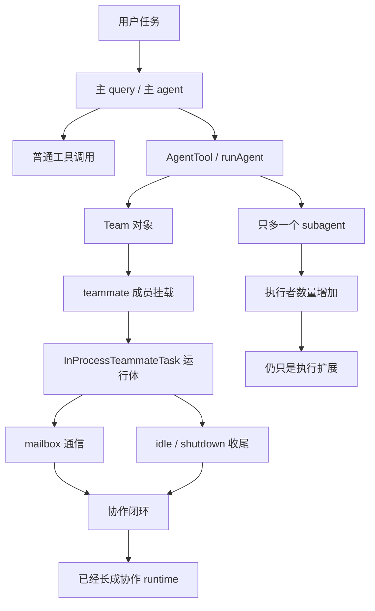

# 卷六 01｜为什么说 Claude Code 的多 agent 能力本质上是一层协作 runtime

## 这篇要回答的问题

卷五已经讲清楚：Claude Code 不只是会调用工具，也不只是能不断接入 skills、MCP、hooks、plugins 这些新能力。系统甚至已经能把 **新的执行者** 正式接进 runtime。

但卷五之后还会留下一个更硬的问题：

> **当系统已经能长出更多执行者时，为什么 Claude Code 的多 agent 能力不能只理解成“多开几个 agent”，而必须进一步理解成一层协作 runtime？**

这不是措辞升级，而是结构判断。

如果这里只是“多开几个 agent”，那卷六最多只需要写一篇高级功能说明。但如果这里已经长出的是一层协作 runtime，那么后面团队对象、成员运行体、mailbox 协议、idle / shutdown 收尾，以及最后的 swarm 收束，就都不是可有可无的细节，而是同一条结构主线上的不同部位。

## 旧文与源码锚点

### 旧文素材锚点
- `docs/guidebook/volume-6/README.md`
- `docs/guidebookv2/volume-5/25-why-these-extension-objects-converge-into-a-platform-layer.md`
- `docs/guidebook/volume-3/12-twenty-agent-design-takes.md`

### 源码锚点
- `cc/src/tools/task.tsx`
- `cc/src/tools/AgentTool/runAgent.ts`
- `cc/src/agent/team.ts`
- `cc/src/tasks/InProcessTeammateTask/InProcessTeammateTask.tsx`

> 说明：当前仓库中的源码快照位于 `docs/claude-code-vs-codex/cc/src/claude-code-1.0.91/package/src/`。本篇沿用卷内统一写法记录原始源码入口。

## 主图：从单执行者到协作 runtime

这张图要强调的不是“Claude Code 支持并行”，而是：一旦 system 内部不只存在多个执行者，还开始正式管理这些执行者的组织关系、运行方式、通信和收尾，多 agent 就已经从数量变化推进成结构变化。

## 先给结论

### 结论一：Claude Code 的多 agent 能力，首先当然包含“更多执行者”，但它并不停在这里

卷三和卷五都已经立住一个事实：Claude Code 不把 agent 当 prompt 皮肤，而把它当带上下文、权限、工具边界和生命周期的正式运行对象。`task.tsx` 里的 `AgentTool` 进一步把“再起一个执行者”暴露成正式工具入口，而 `runAgent.ts` 则把这次委派装配成真正会跑的任务。

这说明系统确实已经能长出更多执行者。

但只要读一下 `runAgent.ts` 里的分流逻辑，就会发现它不是只会启动 generic subagent。它会先根据 `taskType` 判断这次调用是走 `subagent` 还是走 `teammate`：

- 走 `subagent` 时，最终落到 `startSubagentTask(...)`
- 走 `teammate` 时，最终落到 `startInProcessTeammateTask(...)`

这一步很关键。因为它说明 Claude Code 不是只有“再起一个 agent”这一种扩张方式，系统内部还承认另一种更强的形态：**把执行者纳入 team 协作 runtime 中运行。**

### 结论二：一旦系统开始显式管理 team、teammate、mailbox、idle / shutdown，多 agent 就不再只是数量增加，而是运行时分层

从 `agent/team.ts` 往下看，Claude Code 已经不满足于让主 agent 临时记住“我现在手下有几个 worker”。它开始正式处理：

- `createTeam(teammates)`：协作组怎样被创建
- `team.id`：协作组怎样被标识
- `teammate.teamId`：成员怎样被挂进同一个组
- `cleanupTeam(...)`：协作组怎样被统一清理

再往 `InProcessTeammateTask.tsx` 看，会发现 teammate 也不是名字标签，而是一个正式 task：有 `id`、`status`、`mailbox`、`agentContext`、`leaderTask`、`shutdown()` 与 `run()`。

只要这些对象同时存在，系统要处理的就已经不是“一个 agent 把任务分给另一个 agent”这么简单，而是：

> **一组执行者怎样被组织、怎样被运行、怎样彼此通信、怎样判断空闲和退出。**

这就是协作 runtime 的问题域。

### 结论三：卷六后半要展开的四件硬事，不是配角，而是这层 runtime 成立的四根骨头

这一卷后面真正要展开的，至少有四件硬事：

1. **team 对象**：协作整体是不是被正式创建、注册、清理
2. **teammate 运行体**：成员是不是以正式 task 形态进入系统
3. **mailbox / idle / shutdown 协议**：协作过程是不是能通信、能判断 idle、能收尾
4. **swarm 收束**：这些对象、运行体和协议最后是不是闭成了一套 leader-led 的群体运行结构

所以卷六不能写成“多 agent 很强”的概念文。因为只要不把判断压回这四件硬事，所谓“协作 runtime”就会变成一句空口号。

## 第一部分：为什么“多开几个 agent”还不够说明问题

“多开几个 agent”这个说法的问题，不在于它完全错，而在于它把结构问题压扁成了数量问题。

如果系统只是支持：

- 主 agent 临时起一个 subagent
- subagent 做完返回一段结果
- 主 agent 再决定是否起下一个

那它更像是在已有 runtime 里补了一个更强的委派动作。也很重要，但还谈不上单独的一层协作 runtime。

协作 runtime 真正开始成立，要看系统是不是引入了新的一组 runtime 责任：

### 1. 执行者之间的关系责任

不是每个执行者都孤零零地跑。有人是 leader，有人是 teammate；有人负责发起，有人负责回流。只要这种关系要被系统正式承认，它就不能只靠 prompt 里的自然语言暗示。

### 2. 组织整体的管理责任

如果一组执行者要被看成协作整体，系统就得回答：这一组是谁、从哪开始、成员是谁、什么时候清理。`team.ts` 里的 `createTeam` / `cleanupTeam` 恰好就在回答这些问题。

### 3. 协作过程的协议责任

多个执行者不是摆在一起就算协作。结果怎么传、空闲怎么判断、什么时候收尾，这些都要有协议。`InProcessTeammateTask` 里的 `mailbox`、`maybeShutdown()`、`checkForCompletedTasks()` 都指向这个方向。

### 4. 任务承载体的分层责任

`runAgent.ts` 不是只有一种启动路径，而是在 `subagent` 和 `teammate` 之间分流。后面卷六还会继续切 Local / Remote / Teammate 边界。这说明系统已经不把所有执行者都混成一种 task 壳。

只要这四类责任同时出现，多 agent 就已经不再只是“多几个 worker”，而是系统内部长出了一整层协作结构。

## 第二部分：卷五为什么必须自然导到卷六

卷五最后那篇《为什么这些扩展对象最终会收成一层平台能力》其实已经埋下了卷六的入口。

卷五立住的关键判断是：Claude Code 不只是多了一批扩展对象，而是把“继续长能力”写进了 runtime 结构里。其中有一条很重要的线，就是 **Agent 主轴把更多执行者正式接进系统。**

但执行者长出来以后，问题不会停在“可以多叫几个人干活”。真正的下一步一定是：

- 这些执行者怎么组织
- 这些执行者是否共享某种协作容器
- 结果与消息如何回流
- 协作如何结束

换句话说，卷五解决的是：**执行者可以进入 runtime。**

卷六要解决的是：**多个执行者怎样进一步长成协作 runtime。**

这个过渡很重要。因为它把卷六从 feature list 提升成结构卷：不是列 team 能做什么，而是继续追问 runtime 为什么会在这里再分一层。

## 第三部分：源码里已经出现了哪些“协作 runtime 迹象”

严格说，卷六后面的文章才会分别细拆 team 对象、运行体、协议与边界。但仅从本篇需要的源码入口看，协作 runtime 的迹象已经足够明显。

## 1. AgentTool 不是只会叫 worker，它已经知道“teammate”这条路存在

`task.tsx` 里的 `AgentTool` 描述本身就写得很直白：如果任务适合并行、上下文会膨胀，就该主动使用 Agent tool；但如果相关 teammates 已经存在于 `AgentContext` 里，则优先通过 team runtime 分派，而不是再起一个无关的 generic agent。

这段提示很有分量，因为它不是概念性文案，而是运行时策略：

> **系统已经承认 generic subagent 与 teammate runtime 不是一回事。**

## 2. runAgent 已经把委派分成两条装配线

`runAgent.ts` 最关键的地方不是“它能启动 agent”，而是它在真正落地时会做一件结构性分流：

- 如果找到了 configured teammate，就走 `startInProcessTeammateTask(...)`
- 否则走 `startSubagentTask(...)`

这意味着 Claude Code 内部已经把“再起一个执行者”分成至少两类：

- 普通子 agent 委派
- 纳入 team 协作结构的 teammate 委派

只要装配线在这里分叉，runtime 的层次也就已经分叉了。

## 3. team 已经是正式对象，而不是文案标签

`team.ts` 非常短，但它的结构意义很重。因为它至少完成了三件事：

- 给 team 分配 `id`
- 把 teammates 写回 `teamId`
- 把 team 注册进全局列表，并提供 `getTeam` / `cleanupTeam`

这说明 team 在系统里不是一句“这些人是一组”，而是一个 **可创建、可查询、可清理** 的正式对象。

## 4. teammate 已经是运行体，而不是 team 下的配置项

`InProcessTeammateTask.tsx` 里，teammate 被创建成标准 task，带有：

- `status`
- `mailbox`
- `leaderTask`
- `agentContext`
- `shutdown`
- `run`

而且 `run()` 最终会调用 `query(...)`，说明它不是单独的概念壳，而是直接接入既有 query runtime。这一步非常关键：协作层不是另起一套黑箱系统，而是继续嵌在 Claude Code 原本的 runtime 身体里。

## 第四部分：为什么本篇不能把后面的细节提前讲完

本篇的职责是立卷级判断，不是把整个 team runtime 提前讲散。

所以这里必须克制三件事。

### 第一，不提前把 lifecycle 讲完

本篇只需要说明 team 已经是正式对象，但不能抢讲创建、注册、清理的细部链路。那是下一篇之后要正式展开的对象成立问题。

### 第二，不提前把 mailbox / shutdown 讲完

本篇只需指出这些协议的存在，说明协作 runtime 不是空概念；但具体消息怎样进入 mailbox、idle 怎样判断、shutdown 怎样发生，应该留到协议篇。

### 第三，不提前把边界和 swarm 收束讲完

本篇只需要先压出一个总判断：Claude Code 的多 agent 能力已经不是数量扩张，而是协作 runtime 的分层。至于它为什么最后更像 swarm，必须建立在前面几篇已经把对象、运行体、协议和边界钉住之后。

## 最后收一下

所以，为什么说 Claude Code 的多 agent 能力本质上是一层协作 runtime？

不是因为“它支持并行”，也不是因为“它能叫更多 agent 干活”，而是因为源码里已经开始同时出现下面这些事实：

- `AgentTool` / `runAgent` 不只会再起一个 generic worker，还会把任务分流到 teammate 路线
- `team.ts` 把协作整体做成了可创建、可查询、可清理的正式对象
- `InProcessTeammateTask` 把 teammate 做成带 mailbox、状态、leader 关系和 shutdown 行为的正式运行体
- 后续还会继续由 mailbox、idle、shutdown 与承载体边界把协作闭环补齐

所以卷六的开场问题根本不是“Claude Code 有没有 team 功能”，而是：

> **当系统已经能长出更多执行者之后，它是怎样把这些执行者进一步组织成一层正式协作 runtime 的？**

这也是下一篇要接手的问题：既然卷六已经立成协作 runtime 卷，那么 **team / teammate runtime 在整套 Claude Code 系统里，到底处在什么位置？**
