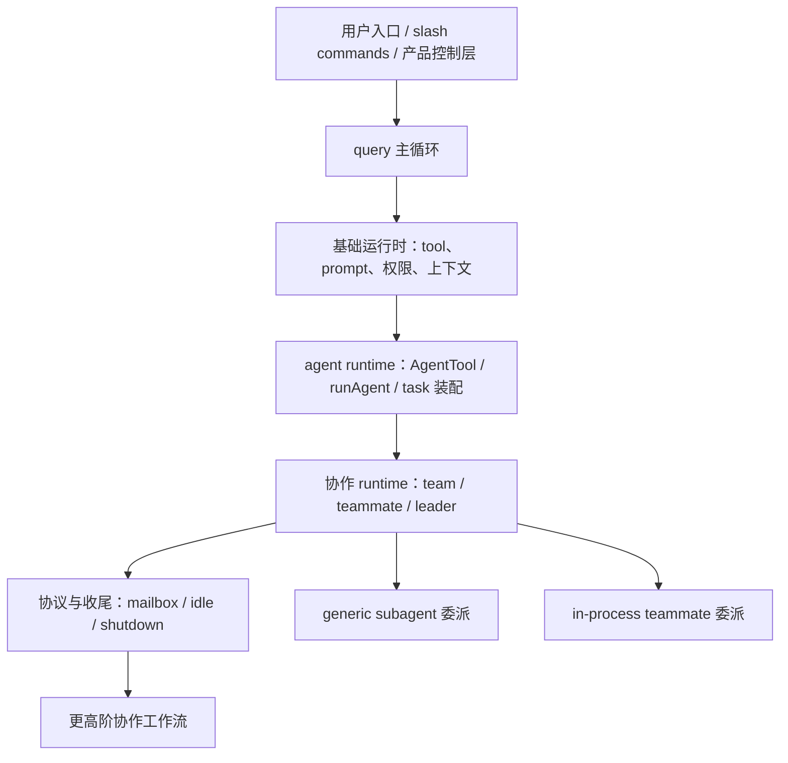

# 卷六 02｜Claude Code 的 team / teammate runtime 到底在系统里处在什么位置

## 导读

- **所属卷**：卷六：多 agent 协作运行时
- **卷内位置**：02 / 07
- **上一篇**：[卷六 01｜为什么说 Claude Code 的多 agent 能力本质上是一层协作 runtime](./01-why-claude-code-multi-agent-is-a-collaboration-runtime.md)
- **下一篇**：[卷六 03｜teams 是怎么被创建、注册与清理的](./03-how-teams-are-created-registered-and-cleaned-up.md)

第 01 篇已经先把卷六的总判断立住了：Claude Code 的多 agent 能力，不只是“多开几个 agent”，而是内部已经长出一层协作 runtime。

第 02 篇继续要回答的是：

> **team / teammate runtime 在整套 Claude Code 系统里，到底处在什么位置？**

这篇只负责把位置切清：它既不是最外层产品功能，也不是最底层执行壳，而是夹在 agent runtime 与更高层产品控制结构之间的一层正式协作结构。

## 这篇要回答的问题

上一篇已经先把卷六的总判断立住了：Claude Code 的多 agent 能力，不只是“多开几个 agent”，而是系统内部已经长出一层协作 runtime。

但只给这个判断还不够。因为只要一说“协作 runtime”，读者马上会有两个常见误解：

- 要么把它误解成 UI 或命令层暴露出来的 team 功能
- 要么把它误解成 agent runtime 的简单重复，只是多加几个 worker 而已

所以这篇要补上的问题是：

> **team / teammate runtime 在整套 Claude Code 系统里，到底处在什么位置？**

只有位置讲清楚，后面 lifecycle、InProcessTeammateTask、mailbox / idle / shutdown 才有稳定落点。不然这些篇章就容易变成一组并列机制说明。

## 旧文与源码锚点

### 旧文素材锚点
- `docs/guidebook/volume-6/01-team-runtime-position.md`
- `docs/guidebook/volume-6/README.md`
- `docs/guidebook/volume-1/10-agenttool.md`

### 源码锚点
- `cc/src/tools/task.tsx`
- `cc/src/tools/AgentTool/runAgent.ts`
- `cc/src/agent/AgentContext.tsx`
- `cc/src/agent/team.ts`
- `cc/src/tasks/InProcessTeammateTask/InProcessTeammateTask.tsx`

## 主图：Claude Code runtime 的分层位置图

这张图要表达的不是“team 在最顶层”，恰恰相反：team / teammate runtime 是夹在 **agent runtime 之上** 与 **产品控制层之下** 的一层协作结构。它向下依赖已有执行者装配与 query 主循环，向上为更复杂的协作工作流提供结构底座。

## 先给结论

### 结论一：team / teammate runtime 不在最外层产品入口，而在内部运行时层次里

如果只从产品表面看，很容易觉得 team 是一种被暴露给用户的功能：像是某个 slash command、某个任务模式，或者某种 workflow 面板。但源码并不支持这种理解。

`task.tsx` 里的 `AgentTool` 仍然是模型在 query 过程中调用的工具入口；`runAgent.ts` 则在这个入口之后完成实际装配。也就是说，team / teammate 不是独立飘在最外层的产品面，而是被嵌进已有执行链中的一段内部结构。

更具体地说：

- 用户入口和命令入口决定“要不要触发一次工作”
- query 主循环决定“这轮工作怎样推进”
- AgentTool / runAgent 决定“要不要拉起新的执行者”
- team / teammate runtime 则进一步决定“这些执行者是不是要进入同一套协作结构中运行”

所以它的位置不是 UI 层，而是运行时内层。

### 结论二：team / teammate runtime 也不在最底层，它建立在已经成立的 agent runtime 之上

另一种常见误读，是把 team / teammate runtime 看成 agent runtime 本体，只是多了几个人。

这也不对。因为从调用链可以看出，协作 runtime 本身并不直接生产最底层执行能力，它依赖的是前面几卷已经立住的那些基础：

- query 主循环
- tool 调用机制
- `AgentTool` 这样的运行时入口
- `runAgent` 这样的装配线
- `AgentContext` 这样的执行上下文壳
- task 作为正式异步运行壳

换句话说，Claude Code 不是先有 team，再有 agent；而是先有比较稳定的 agent runtime，再在其上继续长出 team / teammate 这一层协作结构。

### 结论三：这层 runtime 的独特位置，在于它把“谁来做”继续推进成“谁和谁一起做、以什么关系做”

卷一讲 `AgentTool` 时，重点是它把“再起一个执行者”正式接进 runtime；卷一讲 `runAgent` 时，重点是它把启动 agent 做成受控装配。

到了卷六，这条线要再往前走一步：

> **不只要决定有没有新的执行者，还要决定新的执行者是不是被纳入一个正式协作结构。**

从这个角度看，team / teammate runtime 的位置很清楚：

- 它不负责提供最底层动作原语
- 它不负责直接暴露产品入口
- 它负责把已有执行者组织成正式协作关系

这正是“协作 runtime”四个字最核心的位置含义。

## 第一部分：向下看，它承接的是已经成立的 agent runtime

要讲清位置，最稳的办法不是从抽象开始，而是先看它下面踩着什么。

## 1. 它踩着 query 与 tool 运行链

所有 team / teammate 的动作，都不是脱离 Claude Code 原有执行链单独飘着的。主入口仍在 query 里，模型仍通过 tool use 做决策，而 `AgentTool` 仍作为运行时入口被模型调用。

这说明 team runtime 不是额外外挂的一套并行系统，而是被接回已有 query / tool 链路里的。

## 2. 它踩着 agent 装配线

`runAgent.ts` 的重要性不只是能拉起 subagent，更在于它统一处理：

- 工作目录
- permission mode
- 当前上下文
- `AgentContext`
- task 启动方式

而 team / teammate runtime 正是插在这条装配线上：当 `taskType` 是 `teammate` 时，`runAgent` 会把当前委派转到 `startInProcessTeammateTask(...)`。这说明协作 runtime 不是从零造一条新链，而是借由已有 agent 装配线长出来的分支。

## 3. 它踩着 AgentContext 与 Task 壳

`AgentContext.tsx` 明确把 `team: Team | undefined` 纳入上下文结构，这一步非常关键。因为它说明 team 不是外部注释，而是 agent runtime 在运行时真的会携带的一部分上下文。

再看 `InProcessTeammateTask.tsx`，teammate 被做成标准 task：有 `id`、`status`、`abortController`、`run()`，最终还会走 `query(...)`。所以 teammate runtime 不是一套另起炉灶的消息机器人，而是实打实地立在 Claude Code 原有 task 壳之上。

只要这两点同时成立，就能看到它的下层依赖：**agent runtime 是地基，协作 runtime 是在这块地基上继续长出来的上层结构。**

## 第二部分：向上看，它又不是产品控制层

讲位置时，很多人容易把“能被用户感知”误当成“就在最外层”。team / teammate runtime 恰好需要和这种直觉分开。

## 1. 它不是 slash commands 本身

卷七才会详细展开命令入口、工作流与产品层整合。卷六这里必须守住边界：team / teammate runtime 可以被更高层命令或工作流调用，但它本身不是命令入口。

命令入口回答的是：

- 用户通过什么形式触发
- 产品如何组织暴露
- 控制层怎样把能力呈现出来

而 team / teammate runtime 回答的是：

- 多个执行者一旦要协作，系统内部用什么结构承接
- leader 和 teammate 怎样进入统一协作关系
- 协作过程怎样被管理而不是散掉

这两个问题层次不同。

## 2. 它不是工作流模板本身

你当然可以在更上层工作流里预设不同 teammate、不同分工方式、甚至不同协作节奏。但这些都属于“怎样使用这层 runtime”。team / teammate runtime 本身解决的是更底层的结构成立问题。

如果没有这层协作 runtime，工作流模板最多只能调用多个 generic agent；它很难获得稳定的 team 身份、成员挂载、mailbox 协议和 idle / shutdown 收尾。

所以位置关系可以说得更明确一点：

> **产品层负责暴露协作；team / teammate runtime 负责让协作在系统内部真的成立。**

## 第三部分：team、teammate、leader 为什么必须放在同一张位置图里

按写作卡片的要求，这篇不能只喊“协作 runtime 在中间”，还必须把 team / teammate / leader 放进同一张系统位置图里。因为不这样做，位置就还是抽象口号。

## 1. leader：协作不是自发涌现，而是有人发起、有人接回

即使当前这几份源码没有单独立一个 `LeaderTask.ts` 文件，`InProcessTeammateTask` 里已经出现了 `leaderTask` 字段。这说明协作关系并不是平地起风，而是存在一个发起与回流轴心。

这很重要。因为只要有 leaderTask，系统就已经承认：

- teammate 不是孤立 worker
- 它有一个明确的上游协作关系
- 它的 idle 判断、通信与回流都要考虑 leader 的存在

## 2. team：协作整体的容器

`team.ts` 中的 `Team = { id, teammates }` 虽然简洁，但正因为简洁，它更能说明这不是包装词，而是一个协作容器：

- 有自己的 `id`
- 有一组正式挂载的 teammates
- 可以被查询与清理

这说明 team 的位置，不在单个执行者内部，而在多个执行者之上的组织层。

## 3. teammate：协作层真正跑起来的成员体

如果只有 leader 和 team，没有 teammate runtime，那么 team 最多只是容器。真正让协作层开始跑起来的，是 teammate 被做成正式 task，并且在自己的 `agentContext` 中运行。

所以三者的位置关系可以压成一句话：

> **leader 负责发起与接回，team 负责组织容器，teammate 负责在容器中以正式运行体身份执行。**

这也是为什么这三者必须放在同一张系统位置图里，而不能拆成几句抽象定义。

## 第四部分：为什么说它处在 agent runtime 之上、卷七控制层之下

现在可以把前面零散判断正式压成一句卷内定位：

> **team / teammate runtime 处在 Claude Code 的 agent runtime 之上、卷七要展开的命令与产品控制层之下。**

这句话里每一半都很重要。

### “在 agent runtime 之上”是什么意思

意思是它不负责从零定义 agent、task、context、tool 或 query，而是建立在这些已经成立的运行时部件之上，继续长出协作结构。

### “在卷七控制层之下”是什么意思

意思是它也不直接回答用户入口、slash commands、产品控制台面如何组织，而是为这些更高层机制提供一个正式的协作底座。

正因为它夹在中间，这一层才格外关键：

- 再往下看，它比单个 agent 更高
- 再往上看，它比产品入口更内核

所以 team / teammate runtime 不该被写成功能总览页，而应该被写成 Claude Code 内部运行时的一层 **结构定位篇**。

## 最后收一下

这篇真正要留下来的，不是“team 很重要”，而是一张稳定的位置图：

- Claude Code 底下先有 query、tool、task、AgentContext、AgentTool、runAgent 这些 agent runtime 地基
- 在这块地基之上，系统继续长出 team / teammate / leader 这一层协作 runtime
- 再往上，命令入口、工作流模板与产品控制层才会决定如何把这层能力暴露给用户

所以，team / teammate runtime 到底处在什么位置？

最稳的回答就是：

> **它不是产品最外层，也不是最底层执行壳，而是夹在 agent runtime 与产品控制层之间的一层正式协作结构。**

下一篇就该把这张位置图继续压实：既然 team 已经被放在这样一个位置上，那么它就不能只是概念容器，而必须回答一个更硬的问题——**team 是怎么被创建、注册和清理的。**
