# 卷六 03｜team 是怎么被创建、注册和清理的

## 这篇要回答的问题

前两篇已经把卷六最上面的骨架钉住了：

- 第一篇说明 Claude Code 的多 agent 能力不是单纯数量扩张，而是长出了一层协作 runtime
- 第二篇说明这层 team / teammate runtime 处在 agent runtime 之上、产品控制层之下

接下来必须继续往下压一个更硬的问题：

> **如果 team 真是协作 runtime 里的正式对象，那它到底是怎么被创建、注册和清理的？**

这个问题看上去像生命周期细节，其实正好相反。对卷六来说，lifecycle 不是附录，而是 team 能不能被视为正式对象的源码证据。

如果 team 只是主 agent 心里记住的一组 worker，那么根本不需要 lifecycle；只有当它需要被正式建立、被系统记住、再被系统清理时，team 才真正从概念推进成对象。

## 旧文与源码锚点

### 旧文素材锚点
- `docs/guidebook/volume-6/02-team-lifecycle.md`
- `docs/guidebook/volume-6/README.md`

### 源码锚点
- `cc/src/agent/team.ts`
- `cc/src/tools/task.tsx`
- `cc/src/tools/AgentTool/runAgent.ts`
- `cc/src/tasks/InProcessTeammateTask/startInProcessTeammateTask.ts`

## 主图：team lifecycle 主图

```mermaid
flowchart LR
    A[teammate 列表] --> B[createTeam]
    B --> C[生成 team.id]
    C --> D[给每个 teammate 写入 teamId]
    D --> E[状态置为 Idle]
    E --> F[注册到 teams 全局集合]

    F --> G[runAgent 查找 teammate]
    G --> H[startInProcessTeammateTask]
    H --> I[协作运行中]

    I --> J[cleanupTeam]
    J --> K[teardownTeammateTask]
    K --> L[从 teams 集合移除]
```

这张图的重点不是“流程看起来完整”，而是它把 team 的结构意义压回一条链：**被创建 → 被写入成员关系 → 被注册 → 被运行链使用 → 被统一清理。** 只要这条链成立，team 就不是叙述标签，而是正式对象。

## 先给结论

### 结论一：team 在 Claude Code 里不是抽象协作概念，而是可创建的正式对象

`agent/team.ts` 里最值得注意的，不是代码量，而是动作类型。它没有把 team 写成一个随手拼出来的局部结构，而是给出了明确的对象入口：

- `createBlankTeam()`
- `createTeam(teammates)`
- `getTeam(id)`
- `cleanupTeam(teamOrId)`

这些动作本身就已经说明：team 不是主 agent 的临时记忆，而是运行时承认的一类正式对象。

因为只要系统会问“创建谁”“查询谁”“清理谁”，它处理的就已经不是抽象概念，而是有身份、有边界、有结束条件的实体。

### 结论二：生命周期真正重要的，不是开始和结束两个词，而是中间那层“成员注册”

很多人讲 lifecycle 时容易只看到开始和结束：create / delete。但对 team 来说，中间有一层更关键的动作——**成员被正式挂到这个 team 上。**

`createTeam(teammates)` 里做了几件很重的事：

1. 为 team 生成 `id`
2. 先把 teammate 的状态统一置为 `Idle`
3. 再把每个 teammate 改写成带 `teamId` 的成员
4. 最后把整个 team 推入全局 `teams` 集合

这说明 team 的成立，不是“有个 team 对象就行”，而是：

> **系统把一组 teammate 正式写进了同一个协作容器。**

### 结论三：cleanup 的意义不只是善后，而是反过来证明 team 是一个必须被收口的正式对象

`cleanupTeam(...)` 做的也不是简单 delete。它会：

- 先找到对应的 team
- 对 team 里的每个 teammate 调用 `teardownTeammateTask(teammate)`
- 然后把这个 team 从 `teams` 集合中移除

这条链表明，team 不是“协作结束后自然散掉”的东西，而是一个 **必须被显式收口** 的运行时对象。正因为它承接了成员关系和协作状态，系统才需要统一 teardown 和统一移除。

## 第一部分：创建——为什么说协作不是自然发生，而是被显式建立

从写作角度看，最容易把 createTeam 写成一句太轻的话：系统新建了一个 team。这样写不够。

更关键的是：**Claude Code 承认协作整体必须通过一个正式动作开始。**

## 1. createTeam 不是“方便起名”，而是在开一个协作容器

`createTeam(teammates)` 首先做的是生成 `id`。这件事很朴素，但结构意义非常明确：

- 没有 `id`，就没有稳定的对象身份
- 没有稳定身份，后面就谈不上 `getTeam`、`cleanupTeam`
- 没有稳定身份，协作组很容易退化成“当前上下文里临时有一堆 teammate”

也就是说，team 的创建一开始就不是修辞，而是对象身份建立。

## 2. createBlankTeam 说明 team 甚至可以先于具体成员存在

`createBlankTeam()` 直接调用 `createTeam([])`，这个细节也很有意思。它说明 team 的对象身份并不必然等同于“已经有一组正在跑的成员”。

换句话说，Claude Code 允许先有协作容器，再逐步把成员组织进去。这进一步说明 team 的重点不是统计已有成员，而是建立协作整体这个对象。

如果 team 只是“几个成员的集合名”，其实没有必要有 blank team 这种形态。

## 第二部分：注册——为什么 team 不只是被创建出来，还必须把成员关系写实

如果 lifecycle 只讲创建和清理，中间最关键的一步就会被写丢：成员注册。

## 1. teammate 被写回 teamId，说明成员关系不是旁注，而是运行时关系

`createTeam(teammates)` 里最关键的一段，是把每个 teammate 映射成：

- 保留原本内容
- 追加 `teamId: id`

这一笔非常重。因为它意味着 teammate 不是“某个 team 文案里提到的人”，而是成员身份被正式写回运行对象本身。

这会带来两个直接后果：

- 后续任何地方只要拿到这个 teammate，就能知道它属于哪个 team
- team 与 teammate 的关系不需要靠外层叙述维系，而是已经进入运行时数据结构

## 2. 状态被统一置为 Idle，说明成员不是散装挂入，而是按协作语义初始化

`createTeam` 在注册前还会先把每个 teammate 的状态置为 `TaskStatus.Idle`。这点很容易被忽略，但它说明系统不是简单把一堆 task 塞进 team，而是在按协作语义初始化成员。

也就是说，成员挂入 team 不是被动归档，而是进入了一个新的协作状态机起点。

## 3. 推入全局 teams 集合，说明 team 被注册进了系统可查询空间

最终 `teams.push(team)` 很像一句不起眼的收尾，但对对象成立来说非常关键：

- 这意味着 team 会被系统记住
- `getTeam(id)` 才有可查找对象
- `isTeammateTask(task)` 才能通过现有 team 集合判断成员关系

所以“注册”在这里不是比喻，而是字面意义上的 runtime registration：对象被放进系统可查询、可后续操作的空间里。

## 第三部分：运行链怎么接住这个对象

只证明 team 被创建和注册还不够，还得看运行链是不是会真的用到它。不然 team 仍然可能只是个静态对象。

## 1. runAgent 会根据 team 上下文分辨 teammate 路线

`runAgent.ts` 会先看当前调用是不是 teammate 类型，并且是否能在 `agentContext.team` 里找到对应 teammate：

- 找到，就走 teammate 路线
- 找不到，就回到普通 subagent 路线

这说明 team 已经不是旁置配置，而是会影响真正的运行时装配决策。

## 2. startInProcessTeammateTask 会把注册过的 teammate 再装配成真实运行体

`startInProcessTeammateTask(...)` 接收的不是一个随便写出来的 teammate，而是 `Pick<Team, "teammates">["teammates"][number]`。这个类型关系本身就说明：真正启动 teammate runtime 时，依赖的是 **已经挂在 team 里的正式成员**。

同时它还会把 `teammate.systemPrompt` 写回新的 `agentContext`，并保留 `teamId`。这表明 lifecycle 不是独立于运行之外的管理层，反而正是运行体能不能成立的前置条件。

所以本篇最该保住的一句判断是：

> **team lifecycle 不是协作结构外面的管理注脚，而是运行链能够认出并接住协作对象的前提。**

## 第四部分：清理——为什么 team 必须有统一收口

创建和注册能证明 team 是对象，清理则进一步证明它不是一次性概念。

## 1. cleanupTeam 说明 team 有明确结束边界

`cleanupTeam` 既支持传 `teamId`，也支持直接传 `Team`。这表明系统对“这个 team 结束了”有明确的销毁动作，而不是任其自然消失。

只要有统一 cleanup，协作组就有了结束边界；而有结束边界，才谈得上完整生命周期。

## 2. teardownTeammateTask 说明清理不是删引用，而是回收成员运行体

更重要的是，cleanup 不是只把 team 从数组里删掉。它会先对每个 teammate 调 `teardownTeammateTask`。这意味着 team 的清理，实质上还承担了成员运行体的统一回收责任。

也就是说，team 不是一个单独小盒子；它挂着一组真实运行体。正因为如此，cleanup 才必须先处理成员，再移除容器。

## 3. 从 teams 集合里移除，说明对象生命周期真正闭合

最后再把 team 从全局集合里剔除，这一步让 team 的对象生命周期真正闭合：

- 曾被创建
- 曾被注册
- 曾被系统查询与使用
- 最后被显式移除

这条链一旦完整，team 就完全够资格被称为 Claude Code 协作 runtime 里的正式对象。

## 第五部分：本篇不能越界到哪里

按卷六执行规则，这篇必须守住对象成立篇的边界。

### 1. 不能把 InProcessTeammateTask 的运行细节讲完

本篇只需要说明 lifecycle 如何为 teammate runtime 铺路，不能把 `query(...)`、mailbox、idle、shutdown 的运行链全部抢写掉。那是下一篇和后面的协议篇要接手的事。

### 2. 不能把 mailbox 协议提前吃掉

这里最多只能提一句 team 清理与成员状态会为后面协议篇提供挂载点，不能提前展开协作消息机制。

### 3. 不能把 team 写成 API 清单

我们要保住的是对象判断，而不是照着函数名念目录。`createTeam`、`getTeam`、`cleanupTeam` 的意义，都必须压回“正式对象如何成立”这条主线。

## 最后收一下

所以，team 是怎么被创建、注册和清理的？

最稳的回答不是“源码里有几个函数”，而是这条完整证据链：

- `createTeam(teammates)` 为协作组生成稳定 `id`
- 它把每个 teammate 的状态初始化，并把 `teamId` 正式写回成员
- 它把这个 team 注册进全局 `teams` 集合，使其成为系统可查询对象
- 运行链会通过 `agentContext.team` 和 team 里的正式成员继续装配 teammate runtime
- 协作结束后，`cleanupTeam(...)` 又会统一 teardown 成员并移除 team

因此，team 在 Claude Code 里不是一种“协作说法”，而是一类 **会被创建、会被注册、会被清理的正式运行时对象。**

下一篇就该接着回答另一个更硬的问题：team 作为对象已经成立了，但 **真正的 teammate runtime 又是怎么在同进程里跑起来的？**
