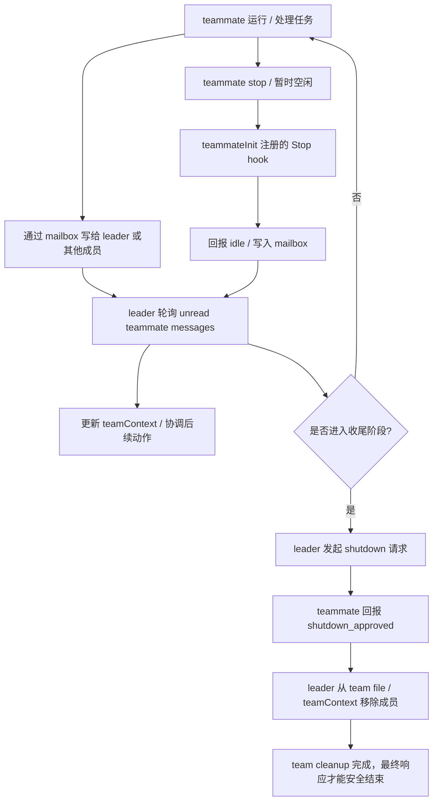

# 卷六 05｜mailbox + idle / shutdown 协议：teammate 之间是怎么通信和收尾的

## 这篇要回答的问题

前一篇已经把 `InProcessTeammateTask` 立成了正式运行体：teammate 不是一个名字，不是 worker wrapper，而是会真的被装进当前 runtime、接进 `query(...)`、持有自己的消息与状态的运行成员。

但只到这里，还只能证明“多人在跑”，还不能证明“多人在协作”。

因为协作 runtime 至少还得回答三件事：

1. 队友之间靠什么通道传递消息与状态；
2. leader 怎么知道谁暂时空了、谁还活着；
3. 一个 team 结束时，系统怎么把所有成员、状态和控制面一起收干净。

所以这篇真正要压住的问题是：

> **mailbox、idle、shutdown 为什么不是零碎机制，而是 teammate 协作闭环成立的三段协议。**

## 旧文与源码锚点

### 旧文素材锚点
- `docs/guidebook/volume-6/04-mailbox-idle-shutdown.md`
- `docs/guidebook/volume-6/README.md`

### 源码锚点
- `cc/src/team/teammateMailbox.ts`
- `cc/src/tasks/InProcessTeammateTask/teammateInit.ts`
- `cc/src/query/stopHooks.ts`
- `cc/src/cli/print.ts`
- `cc/src/tasks/InProcessTeammateTask/idleStatus.ts`

## 主图：mailbox + idle + shutdown 的协作闭环

这张图最关键的不是“有三种机制”，而是三种机制的先后关系：

- **mailbox** 负责把协作变成显式消息流；
- **idle** 负责把“这一轮跑完了”升级成“协作状态变化”；
- **shutdown** 负责让 team 的退出也走协议，而不是直接硬杀。

也就是说，Claude Code 在这里处理的不是并发，而是**协作闭环**。

## 先给结论

### 结论一：mailbox 不是聊天附件，而是 team runtime 的显式消息总线

`teammateMailbox.ts` 说明 Claude Code 没把 teammate 协作做成“共享调用栈里顺手传几个对象”，而是给 team 单独做了按 `team + agentName` 路由的 inbox 体系。每个 teammate 在每个 team 下都有自己的收件入口，这已经不是普通日志文件，而是正式的协作通道。

### 结论二：idle 也不是 UI 状态，而是协作协议里的一等事件

`teammateInit.ts` 会给非 leader 成员注册 Stop hook。teammate 停下来时，不只是本地状态从 running 变成 idle，还要把这个变化显式回报给 leader。于是“我这一轮结束了”不再只是执行细节，而成了 team 协作可消费的事件。

### 结论三：shutdown 不是 delete 前的礼貌提醒，而是 team 生命周期能闭合的最后一段协议

`cli/print.ts` 暴露了 leader 侧的轮询与收尾循环：它会持续消费 unread teammate messages，处理 `shutdown_approved`，在输入关闭但成员还活着时主动推进 shutdown，并最终在 team 清空后才允许整个交互真正结束。也就是说，team 的退出不是 rm 目录，而是协议化退场。

把三条线压在一起，就是这篇要留下来的判断：

> **mailbox 负责通信，idle 负责状态回报，shutdown 负责退场闭环；三者合在一起，teammate 才从“并行执行者”变成“受协议约束的协作成员”。**

## 第一部分：`teammateMailbox.ts` 先把“谁给谁发消息”做成了正式结构

这篇最该先看的，不是 shutdown，而是 mailbox。因为没有 mailbox，后面的 idle 和 shutdown 都只能是局部技巧，成不了稳定协议。

### 1. mailbox 按 team 和 agent 路由，而不是所有人共用一个队列

旧文里已经把这个结构点抓得很准：Claude Code 给 teammate 做的是 team 维度隔离、agentName 维度路由的 inbox。路径规则是类似：

- `.claude/teams/{team_name}/inboxes/{agent_name}.json`

这件事很有分量。它说明系统不是把“多 agent 协作”理解成一个共享消息池，而是理解成：

- 同一个 team 内有多个正式成员；
- 每个成员有自己独立的收件入口；
- leader 想读谁的状态，不是看某个全局脏列表，而是按 team / 成员维度去消费消息。

所以 mailbox 的角色不是“补充 UI 展示”，而是**给协作关系做地址化建模**。

### 2. `TeammateMessage` 本身就带着 runtime + UI 双重语义

旧文提到 `TeammateMessage` 至少包含：

- `from`
- `text`
- `timestamp`
- `read`
- `color`
- `summary`

这很关键。因为这说明 mailbox 里放的不是一个裸 payload，而是一种既能被 runtime 消费、又能被前台展示的正式消息结构：

- `from` 让 leader 知道是谁回的；
- `read` 让轮询逻辑有未读 / 已读分界；
- `summary`、`color` 又明显为视图层留了挂点。

这正是 Claude Code 一贯的风格：不是先做一套纯底层协议，再在 UI 层另抄一遍，而是直接做成**运行时与展示层共用的结构件**。

### 3. 写 inbox 时加锁，说明作者把“并发写 mailbox”当真问题处理

这一点尤其能防止文章写空。

`writeToMailbox(...)` 不是简单的：

- 读文件；
- append；
- 写回。

旧文锚点显示它会：

- 先确保 inbox 文件存在；
- 对 inbox file 加锁；
- 获取锁后再重新读取最新内容；
- append 新消息；
- 再写回。

这一步说明作者面对的不是抽象“通信”问题，而是非常具体的并发写入问题：

- 多个 teammate 同时给 leader 写消息；
- leader 轮询时同时也可能更新 read 状态；
- team cleanup 时还可能碰到收尾中的消息残留。

如果 mailbox 只是概念装饰，就不需要锁。要加锁，说明它已经被当成**真正可能出现竞争的协作基础设施**。

## 第二部分：`teammateInit.ts` 把 idle 从“停一下”抬成“协作事件”

有了 mailbox，下一步就不是问“能不能发消息”，而是问“什么状态变化值得发消息”。Claude Code 给出的答案之一，就是 idle。

### 1. 非 leader teammate 会在初始化时注册 Stop hook

前一篇已经提过 `teammateInit.ts` 的双重职责：

- 注入 team-wide allowed paths；
- 给非 leader 成员挂上 Stop hook。

这说明 teammate runtime 一启动，就不是孤立 agent，而是在被接入一套 team 行为协议。

### 2. Stop 在这里不只是结束，而是向 leader 报告“我现在空了”

普通 session 的 stop，很多时候只是这轮完成了。

但在 teammate 世界里，stop 的含义被改写了。旧文锚点已经很明确：当非 leader 成员 stop 时，系统会：

- 标记它 idle；
- 向 leader 发送 idle notification。

这意味着 idle 在这里不是“前台小绿点”的那种装饰状态，而是会改变 leader 后续判断的正式信号：

- 这个成员现在能不能继续接活；
- 当前 team 是不是还存在活跃工作；
- 后续要不要进入收尾阶段。

也就是说，**idle 是协作语义，不是显示语义。**

### 3. `idleStatus.ts` 进一步说明 idle 判断站在 team 关系里，而不是站在单任务里

写到这里还不能停，因为卡片要求“通信 + 收尾至少各讲一个关键结构点”。idle 这边最硬的结构点，其实在 `idleStatus.ts`。

前一篇已经点过：idle 判断不只是看当前 task 自己是不是停了，还会结合：

- 当前 `agentContext` 是否处于 `AgentStatus.Idle`；
- 当前 mailbox 里是否还有未读消息；
- team 里其他活跃成员是否还有未读 mailbox 消息。

这很重要。因为它说明 Claude Code 不是把 idle 理解成“当前函数结束”，而是理解成：

> **当前成员在当前 team 协作关系里，是否已经处于可暂时静默、可等待下一轮消息、甚至可进入 shutdown 判断的状态。**

也因此，idle 天然站在 mailbox 与 shutdown 之间：

- 没 mailbox，leader 看不见 idle 回报；
- 没 idle，shutdown 不知道该不该启动；
- 没 shutdown，idle 也只能停在半路，不形成闭环。

## 第三部分：`stopHooks.ts` 说明 teammate 的 stop / idle 已经进入正式 runtime 收尾链

这篇如果只写 mailbox 和 `teammateInit.ts`，还是容易被读成“几个配套小技巧”。真正把整条线压实的，是 `stopHooks.ts`。

### 1. teammate 相关事件没有被放在外围，而是接进了 query 的 stop 主链

旧文给出的源码判断是：当当前 session 是 teammate 时，Stop hooks 跑完之后，系统还会继续执行：

- `TaskCompleted`
- `TeammateIdle`

而且如果这些 hook 阻止 continuation，还会形成正式的 stop reason / blocking error。

这件事的分量很大。因为这等于在说：

- teammate 完成任务，不只是业务层回调；
- teammate idle，不只是 UI 要刷新一下；
- 它们都已经进入 query runtime 的主收尾路径。

### 2. 一旦进入 stop 主链，idle / completed 就从“消息”升级成“运行时事件”

这也是为什么我觉得这篇不能写成“mailbox 原理介绍”。真正值得留下来的，是地位变化：

- mailbox 让状态变化可以被传递；
- `stopHooks.ts` 让这些状态变化可以影响 runtime 是否继续、如何停止。

于是 teammate 协作就不再只是“大家彼此发点消息”，而变成：

> **这些消息所代表的状态，会反过来影响 Claude Code 运行时自己的停机与继续判定。**

这正是“协议”与“通知”的区别。

通知只是告诉你一件事发生了；协议则意味着系统承认这件事具有结构效力。

## 第四部分：`cli/print.ts` 暴露了 leader 真正的协调循环

如果前面三层解决的是“消息如何产生”，那 `cli/print.ts` 解决的就是“谁来消费、谁来收尾”。答案很清楚：leader。

### 1. leader 会轮询 unread teammate messages，而不是坐等同步回调

旧文锚点里对这块总结得很到位：如果当前是 team lead，`cli/print.ts` 会持续轮询 unread teammate messages。

这说明 leader 在系统里的角色不是被动收件人，而是主动协调者。它不是“等队友都 return 再统一汇总”，而是：

- 持续观察队友状态；
- 持续消费 mailbox 消息；
- 根据 idle、shutdown 等事件更新 team 世界。

这让 leader 更像一个 orchestration loop，而不是普通执行者。

### 2. `shutdown_approved` 的消费发生在 leader 侧，这决定了谁来完成 team 退场

旧文指出：leader 在 `cli/print.ts` 里会处理 `shutdown_approved`，收到后把对应 teammate 从 team file 和 teamContext 中移除。

这个结构点非常硬，因为它说明 shutdown 并不是成员自杀式退出，而是：

- leader 发起请求；
- 成员按协议确认；
- leader 统一完成移除与状态清理。

于是 team 的退场依然是 leader-centered 的，而不是对等 mesh 式的各自消失。这和前面卷六已经立住的 `leadAgentId`、`teamContext.isLeader`、team lifecycle 设计完全一致。

### 3. 输入关闭时 leader 还会主动推进 shutdown，说明收尾不是可选善后，而是必须完成的最后责任

这一点尤其能说明闭环感。

旧文锚点提到：如果输入已经关闭，但队友还活着，leader 会主动注入 shutdown prompt。并且最终要确保 team 清掉，用户才能收到最后响应。

这说明什么？说明系统默认承认一个事实：

> **只要 team 还没真正退场，当前交互就还没干净结束。**

也因此，shutdown 在这里不是“有空再做”的礼貌流程，而是最终响应能不能安全收束的必要条件。

## 第五部分：为什么说 mailbox、idle、shutdown 三者共同构成协作闭环

讲到这里，才可以回答本篇真正的主问题。

### 1. 只有 mailbox，没有 idle / shutdown，协作就只是“能传话”

如果系统只有 mailbox，那 teammate 顶多只是：

- 能互相留言；
- leader 能看见若干状态更新。

但 leader 仍然不知道：

- 哪个成员只是本轮停一下；
- 哪个成员已经进入可收尾状态；
- 什么时候可以安全把 team 整体关掉。

这时 mailbox 只是通道，不是闭环。

### 2. 只有 mailbox + idle，没有 shutdown，协作还是缺最后一段退场协议

加上 idle 之后，leader 确实能知道谁空了，协作也从“传话”升级成“状态感知”。

但如果没有 shutdown，这个世界依旧会停在半空：

- 成员可以空闲；
- leader 可以观察；
- 但 team 结束时谁来发最后命令、谁来确认、谁来移除成员、谁来清理控制面，仍然不明确。

这会导致 team delete、UI 状态、磁盘上的 team file、内存里的 teamContext 很容易不同步。

### 3. 只有把三者串成一条链，team 才能从运行走到可闭合退场

Claude Code 现在做成的是这样一条链：

- **mailbox**：把协作做成显式消息流；
- **idle**：把“这一轮结束”做成 leader 可消费的状态变化；
- **shutdown**：把“整个 team 结束”做成有确认、有移除、有 cleanup 的正式退场协议。

所以所谓“闭环”，不是一句空话，而是指这三段链路把协作生命周期补齐了：

- 运行中能通信；
- 运行中能感知空闲；
- 结束时能一致性退场。

换句话说：

> **mailbox 解决协作的入口，idle 解决协作过程里的状态回报，shutdown 解决协作的出口。**

这就是闭环成立的最稳定义。

## 第六部分：这篇不能越界到哪里

### 1. 不能把 06 的承载体边界顺手写完

这里可以顺手提醒：teammate 的 stop / idle / shutdown 语义，明显比普通 background task 更重。但不能在本篇里把 `LocalAgentTask`、`RemoteAgentTask` 和 teammate runtime 的系统边界完整切掉，那是下一篇的职责。

### 2. 不能提前把 07 的 swarm 判断收完

本篇可以说“协议是 runtime 感最强的一层证据”，但还不能直接把卷六收束成完整的 swarm 判断。因为 swarm 还需要：

- 对象层；
- 运行体层；
- 承载体边界层；
- 最终统一收口。

协议只是其中一层关键证据，不是最后收束本身。

## 最后收一下

所以，mailbox、idle、shutdown 为什么会构成 teammate 协作闭环？

最稳的回答是这条链：

- `teammateMailbox.ts` 先把队友之间的通信做成按 team / agent 路由的文件式 inbox，并认真处理并发写入；
- `teammateInit.ts` 再把非 leader 成员的 Stop hook 接成 idle 协议出口，让“这一轮停下来了”变成可回报给 leader 的协作事件；
- `idleStatus.ts` 进一步说明 idle 判断站在 team 关系里，而不是站在单任务里；
- `stopHooks.ts` 又把 `TaskCompleted`、`TeammateIdle` 抬进正式 runtime 收尾链，使这些状态变化具有结构效力；
- `cli/print.ts` 最后在 leader 侧持续轮询 unread messages、处理 `shutdown_approved`、在必要时推进 shutdown，并在 team 真正清空后才允许整个交互结束。

因此，Claude Code 的 teammate 协作不是“几个 agent 同时跑起来”这么简单，而是：

> **它用 mailbox 管通信，用 idle 管状态回报，用 shutdown 管退场一致性，把多 agent 协作压成了一套可运行、可观察、可收尾的正式协议。**

到这里，卷六就从对象层、运行体层继续推进到了协议层：team 已经不只是“有人在一起工作”，而是已经具备了真正 runtime 才会认真处理的东西——**消息路由、状态回报和一致性退场**。

下一篇再继续把边界拉开：为什么 `LocalAgentTask`、`RemoteAgentTask` 和 teammate runtime 不能混成同一种“agent task”。
