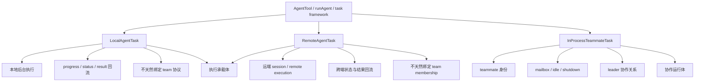
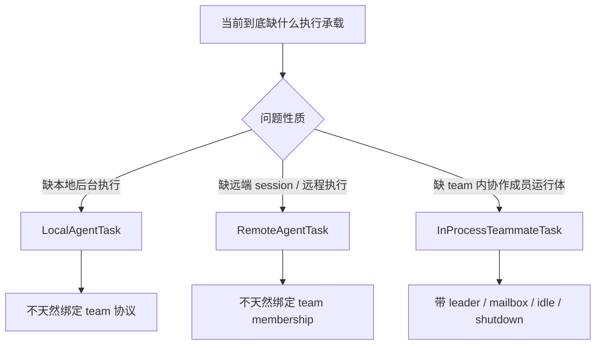

# 卷六 06｜LocalAgentTask、RemoteAgentTask 和 teammate runtime 的边界是什么

## 导读

- **所属卷**：卷六：多 agent 协作运行时
- **卷内位置**：06 / 07
- **上一篇**：[卷六 05｜mailbox / idle / shutdown 怎么把闭环合上](./05-how-mailbox-idle-and-shutdown-close-the-loop.md)
- **下一篇**：[卷六 07｜为什么 Claude Code team 本质上是一种 swarm](./07-why-claude-code-team-is-a-swarm.md)

前五篇已经把对象、运行体和协议三层压住了。

第 06 篇要解决的，是卷六最后一个容易混桶的问题：

> **既然已经有 teammate runtime，为什么源码里还会同时出现 `LocalAgentTask` 和 `RemoteAgentTask`？**

也就是说，这篇只负责切清三类承载体各自服务什么问题：本地执行、远程执行、协作执行，避免把它们混写成一种“agent task 类型”。

## 这篇要回答的问题

前四篇已经把卷六的骨架立起来了：

- 卷六不是 team 功能目录，而是协作 runtime 卷
- team 不是口头分工，而是正式对象
- teammate 不是抽象角色，而是通过 `InProcessTeammateTask` 落成的正式运行体
- mailbox、idle、shutdown 这些机制也不是边角料，而是协作闭环的一部分

走到这里，读者很容易冒出一个新混乱：

> **既然 Claude Code 里已经有 teammate runtime，为什么源码里还会同时出现 `LocalAgentTask` 和 `RemoteAgentTask`？**

如果这个边界不切开，卷六前面几篇就很容易被误读成：Claude Code 里凡是后台跑 agent 的东西，本质都差不多，只是名字不同。

但源码给出的恰恰不是这个结论。

这篇真正要回答的是：

> **`LocalAgentTask`、`RemoteAgentTask`、`InProcessTeammateTask` 虽然都挂在 task 世界里，但它们各自承接的是不同问题：本地执行、远程执行、协作执行。也正因为三者服务的不是同一层责任，所以不能被混写成一种“agent task 类型”。**

## 旧文与源码锚点

### 旧文素材锚点
- `docs/guidebook/volume-6/05-local-remote-teammate-boundaries.md`
- `docs/guidebook/volume-6/README.md`
- `docs/guidebookv2/volume-5/17-boundaries-and-information-flow-between-main-agent-and-worker-agent.md`

### 源码锚点
- `cc/src/tasks/LocalAgentTask/LocalAgentTask.js`
- `cc/src/tasks/RemoteAgentTask/RemoteAgentTask.tsx`
- `cc/src/tasks/InProcessTeammateTask/InProcessTeammateTask.tsx`
- `cc/src/tools/AgentTool/runAgent.ts`
- `cc/src/agent/AgentContext.tsx`

> 说明：当前仓库里的源码正文主要以卷内既有锚点与前文已确认路径为准；本篇沿用卷六统一写法记录原始源码入口，把判断尽量压回这些文件所体现的职责差异与运行差异。

## 主图：三类 task 的职责边界图

这张图最重要的意思不是“有三种 task”，而是：

- `LocalAgentTask` 解决的是**本地怎么跑**
- `RemoteAgentTask` 解决的是**远端怎么接回**
- `InProcessTeammateTask` 解决的是**协作成员怎么在 team runtime 里存在**

所以它们虽然共用 task 外形，但并不处在同一职责层。

## 补图：三类承载体选择图

这张补图最直接的作用，是把卷六这一篇从“任务类型对照表”推进成“承载体选择器”：三者虽然都挂在 task 世界里，但服务的是完全不同的结构问题。

## 先给结论

### 结论一：真正的分界线，不是它们都叫不叫 agent，而是它们各自承接哪一种运行责任

如果只看文件名，很容易把这三者理解成并列的任务实现：

- 一个 local
- 一个 remote
- 一个 teammate

但这种看法太平了。因为 `LocalAgentTask` 与 `RemoteAgentTask` 首先回答的是**执行承载问题**，而 `InProcessTeammateTask` 首先回答的是**协作成员问题**。

也就是说，这里最有解释力的切法不是“三种 agent 口味”，而是三种不同责任：

- **LocalAgentTask：本地执行承载体**
- **RemoteAgentTask：远程执行承载体**
- **InProcessTeammateTask：team 协作运行体**

### 结论二：`InProcessTeammateTask` 与 Local / Remote 的最大差异，不在本地还是远程，而在它有没有被吸进 team runtime

前一篇已经看到，teammate runtime 带着一整套 Local / Remote 没有被硬绑定的结构：

- `teamId`
- `leaderTask`
- `mailbox`
- `shutdown()`
- `pendingUserMessages`
- idle / shutdown 相关状态

这些都说明：`InProcessTeammateTask` 的设计中心不是“再起一个 agent 去干活”，而是“让一个成员在 team 协作关系里持续存在并可被管理”。

所以和它相比：

- `LocalAgentTask` 主要是**本地执行被纳入任务框架**
- `RemoteAgentTask` 主要是**远端执行被纳入任务框架**
- 只有 `InProcessTeammateTask` 是**协作成员被纳入任务框架**

### 结论三：Claude Code 故意没有把它们揉成一个万能 AgentTask，是因为三者真正复杂的差异不在启动方式，而在状态模型、回流方式和协作语义

如果只是“启动一个 agent 去做事”，当然可以想象用一个统一壳加几个 mode 字段来处理。

但 Claude Code 没这么做，背后的判断很清楚：

- 本地执行要处理的是 task 生命周期、状态显示、结果回流
- 远程执行要处理的是远端 session、跨端适配、结果同步
- teammate 运行体要处理的是成员身份、mailbox、idle / shutdown、leader 协作关系

这三类复杂度不在一个维度上。强行揉成一个万能壳，最后只会把不同问题混进同一套状态分支里。

所以卷六这篇必须留下来的判断不是“有三种任务”，而是：

> **Claude Code 在这里已经把“执行承载体”和“协作运行体”主动分层了。**

## 第一部分：为什么这篇不能写成任务类型速查表

写这篇时，最容易犯的错，就是把它写成一张对照表：

- local 是本地
- remote 是远程
- teammate 是 teammate

这当然不完全错，但几乎没有解释力。

因为卷六这里要切的不是名词释义，而是结构边界。真正的问题是：

- 它们分别为哪种运行问题负责？
- 结果怎样回流？
- 有没有 team 身份？
- 有没有协作协议负担？

只有把问题压回这些责任，边界才会立住。

所以这篇的主证据链必须是：

> **不同 task 承载体分别服务本地执行、远程执行、协作执行 → 它们的职责与运行差异都不同 → 因而不能被混成一种“agent task 类型”。**

## 第二部分：`LocalAgentTask` 先回答的是“本地 agent 怎么作为任务被系统承接”

卷五第 17 篇其实已经给了一个很好的入口：当 Claude Code 派生 worker 时，系统并不满足于“后台跑着就行”，它会持续跟踪：

- progress
- foreground / background 状态
- 完成或失败
- transcript sidechain
- 结果回流主线

这正是 `LocalAgentTask` 的气质。

### 1. 它的核心语义是本地后台执行，而不是成员协作

从卷内既有源码锚点看，`LocalAgentTask` 更像是把一个**本地运行的 agent 工作单元**正式放进任务体系。这里最重要的不是 team 关系，而是：

- 这个 agent 在本地跑
- 它的状态能被系统持续看见
- 它的结果能被主线吸收
- 它能作为一项后台任务被管理

也就是说，`LocalAgentTask` 回答的问题是：

> **本地跑出来的 agent，怎样被系统当成一个正式 task 来观察、协调和回收？**

### 2. 它和 teammate 最大的区别，是没有天然 team 语义包袱

把 `LocalAgentTask` 和 `InProcessTeammateTask` 放一起看，最该看的不是“都能 run”，而是有什么东西只有 teammate 才有。

前文已经压出过：`InProcessTeammateTask` 天然带着：

- `teamId`
- `leaderTask`
- `mailbox`
- `pendingUserMessages`
- `shutdown()`
- idle / shutdown 协作判断

而这些并不是 Local 的默认负担。

这意味着：

- Local 可以是后台 agent
- Local 可以有状态
- Local 可以回流结果
- 但 Local **不因此自动成为 team 成员**

这条边界很关键。否则一看到“后台 agent”，就会误把本地执行体和 teammate 运行体混成一类。

### 3. 它更接近卷五的 worker agent 线，而不是卷六的 team member 线

更准确地说，`LocalAgentTask` 更贴近卷五已经讲过的那条执行承载主线：

- 主 agent 派出 worker
- worker 在清晰 scope 内推进
- worker 结果回流主线

这是一条**执行承载线**。

而卷六里的 teammate runtime 是另一条线：

- leader / teammate 关系被正式承认
- team 容器持续存在
- mailbox / idle / shutdown 构成协作协议

这是一条**协作运行线**。

两条线看起来都会“拉起 agent 去工作”，但系统要解决的根本不是同一件事。

## 第三部分：`RemoteAgentTask` 先回答的是“远端执行怎么接回当前 runtime”

如果说 Local 关注本地后台执行，那么 `RemoteAgentTask` 关注的就是另一个方向：

> **一个不在当前本地执行体里的 agent 工作，怎样被当前系统视作正式 task，并把状态与结果接回来？**

### 1. 它的中心词不是 teammate，而是 remote execution

旧文已经点到，`RemoteAgentTask` 相关场景更接近：

- remote session
- ultraplan
- ultrareview
- 远程代理执行

这类场景最难的部分，不是 team membership，而是：

- 远端怎么跑
- 当前端怎么看见它
- 结果怎样同步
- 任务视图怎样承接这种跨端状态

所以 `RemoteAgentTask` 的关键词不是“队友”，而是“远端执行适配”。

### 2. 它与 Local 的差异，在执行位置；它与 teammate 的差异，在协作语义

`RemoteAgentTask` 和 `LocalAgentTask` 有相似处：

- 两者都更像执行承载体
- 两者都要把 agent 工作纳入 task 框架
- 两者都要处理状态与结果回流

但它们的区别是：

- Local 处理的是本地执行
- Remote 处理的是远端执行

而 `RemoteAgentTask` 和 `InProcessTeammateTask` 之间的差异则更根本：

- Remote 重点在跨端执行如何被承接
- teammate 重点在 team 协作关系如何被维持

这说明 Remote 和 teammate 虽然都不是“普通同步调用”，但仍不是一类问题。

### 3. 它不天然需要 mailbox / idle / shutdown 这一整套 team 协议

卷六前文已经把 mailbox、idle、shutdown 钉成协作协议。这里要顺着看：谁真正离不开这套协议？

答案不是 Local，也不是 Remote，而是 teammate。

因为只有 teammate 是被 leader 视作**持续存在的 team 成员**。它要处理的是：

- 成员之间消息怎么传
- 何时可判定 idle
- 何时允许安全退场
- 如何向 leader 回报收尾

Remote 虽然也要处理状态与结果，但它解决的不是这一类 team-protocol 问题。

所以只要看到这一点，边界就会清楚很多：

> **Remote 是远端执行被 task 化；teammate 是协作成员被 runtime 化。**

## 第四部分：`InProcessTeammateTask` 真正特别的地方，是它不是“执行位置”分类，而是“协作关系”分类

这是整篇最该压出来的一层。

很多人第一次看这三个名字，会下意识做这种分类：

- Local = 本地
- Remote = 远程
- Teammate = 也是本地，因为 in-process

这当然有一部分事实，但解释力不够，因为它把 `teammate` 误当成执行位置维度里的一个选项。

更稳的切法应该是：

- Local / Remote：首先是**执行位置或执行承载方式**
- Teammate：首先是**协作关系与运行身份**

也就是说，`InProcessTeammateTask` 最值得注意的地方不是它也在本机、也在 task 框架里，而是它携带了一组完全不同的系统责任：

- 以 teammate 身份存在
- 带着 team 上下文运行
- 与 leader 保持协作关系
- 通过 mailbox 接受协作输入
- 通过 idle / shutdown 进入可闭合的收尾协议

这就是为什么卷四、卷五里我们能把 worker agent 当作执行者来看，但卷六必须把 teammate 当成**协作运行体**来看。

## 第五部分：真正该记住的不是 local / remote / teammate，而是执行承载体与协作运行体的分层

到这里，其实可以把三者重新压成两层：

## 1. 执行承载体：Local / Remote

这两类 task 虽然一在本地、一在远端，但都首先在解决：

- agent 工作怎样被承接
- 状态怎样被表示
- 结果怎样回到当前主线或当前 runtime

所以它们更像**执行承载体**。

## 2. 协作运行体：InProcessTeammateTask

而 teammate runtime 解决的是：

- 成员怎样在协作容器里持续存在
- leader / teammate 的关系怎样成立
- 协作输入怎样进入成员体
- 协作中的 idle / shutdown 怎样闭环

所以它更像**协作运行体**。

这样一压缩，就能明白为什么 Claude Code 不想把三者写成一个大一统壳：

- 执行承载体与协作运行体看起来都在“跑 agent”
- 但前者重点是承载执行，后者重点是维持协作关系
- 两者虽然共享 task 外壳，却不共享同一组核心责任

## 第六部分：这篇收住了什么，又不能提前收什么

这篇的职责是边界收口，不是卷尾总收束，所以边界也要守住。

### 1. 这篇真正收住了什么

它收住的是一个很具体的判断：

> **Claude Code 并不是只有一种 agent task，再根据本地、远程、团队去打标签；它实际上把“本地执行”“远程执行”“team 成员协作”拆成了三种不同承载体。**

这句话把前面的运行体篇、协议篇和卷五的 worker 线拉开了。

### 2. 这篇不能提前做什么

它不能提前做两件事：

- 不能把 `InProcessTeammateTask` 的内部运行细节重讲一遍，那已经是第 04 篇的职责
- 不能把“为什么这整套系统本质上是 swarm”提前讲完，那是第 07 篇的工作

这篇只负责把边界切清，让卷尾收束时不至于把所有 task 都粗暴混成一个概念云。

## 最后收一下

所以，`LocalAgentTask`、`RemoteAgentTask` 和 teammate runtime 的边界到底是什么？

最稳的回答不是列一张名词对照表，而是压回三条不同责任：

- `LocalAgentTask`：把**本地 agent 执行**接进任务体系，重点是本地后台执行、状态可见与结果回流
- `RemoteAgentTask`：把**远程 agent 执行**接进任务体系，重点是远端运行、跨端状态承接与结果同步
- `InProcessTeammateTask`：把**team 成员协作**接进当前 runtime，重点是 teammate 身份、leader 关系、mailbox 以及 idle / shutdown 协议

因此，这三者虽然都长得像 task，但真正的切口并不是“都是 agent task”，而是：

> **前两者主要是执行承载体，后一者是协作运行体。**

也正因为这个边界被切开了，卷六最后一篇才能继续把前面的对象、运行体、协议和边界重新压回一个更大的判断：Claude Code 的 team 系统，为什么不是几种功能拼装，而更像一套带 leader、mailbox 和 task runtime 的 swarm。