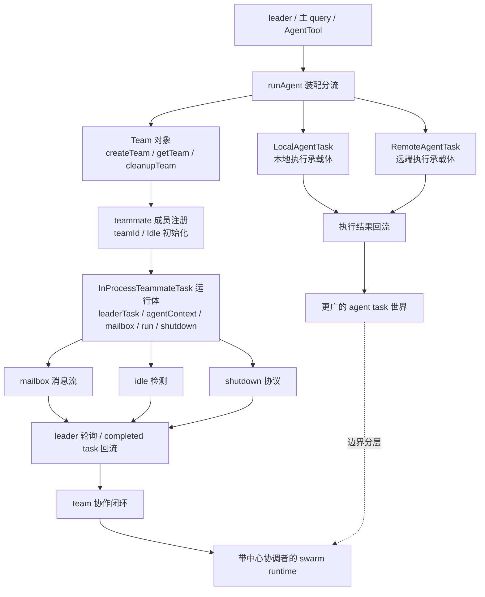

# 卷六 07｜为什么说 Claude Code 的 team 系统本质上是一个 swarm

## 导读

- **所属卷**：卷六：多 agent 协作运行时
- **卷内位置**：07 / 07
- **上一篇**：[卷六 06｜local、remote、teammate task 的边界](./06-boundaries-between-local-remote-and-teammate-tasks.md)
- **下一篇**：卷七入口待接续

到第 07 篇，卷六前面的对象、运行体、协议和边界四层都已经分别立住了。

卷尾真正要回答的，不再是某一个机制怎么实现，而是：

> **为什么这些对象、运行体、协议和边界一旦被重新压回同一张图，Claude Code 的 team 系统就不该再被叫成“team 功能”，而更像一个 swarm？**

这篇只负责把卷六前文重新压回同一条协作 runtime 因果链，把整卷从 team 机制卷收成 swarm runtime 卷。

## 这篇要回答的问题

到这里，卷六前六篇已经把四条线分别钉住了：

- `team.ts` 让 team 不再只是协作说法，而是可创建、可查询、可清理的正式对象；
- `runAgent.ts` + `startInProcessTeammateTask(...)` + `InProcessTeammateTask.tsx` 让 teammate 不再只是成员名，而是正式运行体；
- `mailbox`、`idle`、`shutdown` 让协作过程不再只是并行执行，而是有消息、有状态回报、有退场闭环的协议；
- `LocalAgentTask`、`RemoteAgentTask`、`InProcessTeammateTask` 的差异又说明，Claude Code 没有把一切都揉成一个万能 agent task，而是主动把执行承载体和协作运行体分开。

所以卷六最后真正要回答的问题，不再是某一个机制怎么实现，而是：

> **为什么这些对象、运行体、协议和边界一旦被重新压回同一张图，Claude Code 的 team 系统就不该再被叫成“team 功能”，而更像一个 swarm？**

这里的 **swarm** 不是营销词，也不是“多 agent 很强”的口号。它在本篇里的意思很窄，也很具体：

> **系统里已经存在一个以 leader 为中心、以 team 为容器、以 teammate task 为成员运行体、以 mailbox / idle / shutdown 为协作协议、并且与其他任务承载体保持明确边界的多执行者协作结构。**

只要这几个条件同时成立，team 就不再只是 feature list，而更像一层 swarm runtime。

## 旧文与源码锚点

### 旧文素材锚点
- `docs/guidebook/volume-6/06-team-runtime-conclusion.md`
- `docs/guidebook/volume-6/README.md`
- `docs/guidebookv2/volume-5/25-why-these-extension-objects-converge-into-a-platform-layer.md`

### 源码锚点
- `cc/src/agent/team.ts`
- `cc/src/tools/AgentTool/runAgent.ts`
- `cc/src/tasks/InProcessTeammateTask/InProcessTeammateTask.tsx`
- `cc/src/tasks/InProcessTeammateTask/checkForCompletedTasks.ts`
- `cc/src/tasks/InProcessTeammateTask/idleStatus.ts`
- `cc/src/tasks/LocalAgentTask/LocalAgentTask.js`
- `cc/src/tasks/RemoteAgentTask/RemoteAgentTask.tsx`

## 主图：卷六 swarm runtime 总图

这张图承担的不是“复习前文”的职责，而是把卷六前六篇重新压回一个更高层的判断。

最关键的是三件事：

1. **team 对象、teammate 运行体、mailbox / idle / shutdown 协议，已经在同一条运行链上闭合；**
2. **leader 不是旁观者，而是发起、轮询、协调、收尾的中心位；**
3. **这套协作结构并没有吞并 Local / Remote 等其他任务承载体，而是在更大的 task 世界里占据了一个专门的协作分支。**

也正因为这样，它更像 swarm，而不是一组分散 feature。

## 先给结论

### 结论一：Claude Code 的 team 系统不是“几个 teammate 功能堆在一起”，而是一个有中心位的协作结构

如果只是 feature 堆叠，源码里通常会出现这样的气味：

- 某个 TeamCreateTool 负责开一下功能；
- 某个成员配置负责记住有哪些队友；
- 某个后台任务负责跑一跑；
- 某个 UI 小机制负责显示状态；
- 最后结束时一把删掉。

但卷六一路看下来，Claude Code 走的不是这条路。它做的是：

- 在 `team.ts` 里正式创建 team，并把成员关系写实；
- 在 `runAgent.ts` 里显式区分 `subagent` 与 `teammate`；
- 在 `InProcessTeammateTask.tsx` 里把 teammate 做成带 `leaderTask`、`mailbox`、`shutdown()` 的正式 task；
- 在 `checkForCompletedTasks.ts`、`idleStatus.ts` 等地方继续把协作状态回流给 leader；
- 在和 Local / Remote 的边界上，又明确把这条线保留为专门的 team 协作分支。

这已经不是“功能比较多”，而是系统承认：

> **多个执行者可以被组织进一个以 leader 为轴心的正式协作世界。**

### 结论二：Claude Code 的 team 之所以像 swarm，不是因为 agent 变多了，而是因为成员、协议、收尾都被系统认真建模了

“多 agent”只能说明数量变化，不能自动说明结构变化。

真正让它接近 swarm 的，是下面这组更硬的事实：

- 成员不是匿名 worker，而是带 `teamId` 的正式 teammate；
- leader 不是普通成员，而是带 `leaderTask` 回流轴线的中心协调位；
- 协作不是隐式回调，而是通过 mailbox、completed task 汇总、idle 判断变成显式协议；
- 退出不是粗暴 kill，而是 shutdown 驱动的一致性收尾；
- 这整套协作结构还被放进 task runtime 里长期管理，而不是一次性脚本流程。

所以这里的 swarm 不是“很像蜂群”那种比喻，而是一个更实在的判断：

> **Claude Code 已经把多执行者协作做成了一个可创建、可运行、可通信、可回流、可退场的正式运行时分支。**

### 结论三：这套 swarm 还是“带 leader 的 swarm”，而不是人人对等的 mesh

这一点必须说清，否则 “swarm” 两个字很容易把读者带偏。

Claude Code 当前这套 team 系统，并不是纯去中心化的多 agent mesh。卷六一路看到的证据更支持另一种说法：

- team 由一个 leader 所在链路发起；
- teammate runtime 带着 `leaderTask` 进入协作关系；
- mailbox / completed task / idle / shutdown 的很多关键消费都回到 leader 这一侧；
- 协作闭环最终也是 leader 视角上的闭环。

所以本篇更愿意留下一个更精确的定义：

> **Claude Code 的 team 系统，本质上是一个带中心协调者的 swarm runtime。**

不是因为这样说更响亮，而是因为源码里真正稳定的结构就是这个样子。

## 第一部分：先把“为什么不是 feature list”说死

卷六最后这篇，第一件事不是赞叹它多复杂，而是把一个常见误读彻底压住：为什么它不能只被理解成 team feature？

### 1. feature 往往只暴露能力；swarm runtime 则必须承担持续协作责任

一个普通功能点，通常只要回答：

- 怎么触发；
- 做了什么；
- 返回什么。

但 team 系统在 Claude Code 里要回答的问题明显更多：

- 协作整体是谁；
- 成员关系怎样被正式记住；
- 成员怎样作为运行体被接进系统；
- 协作期间消息怎么流；
- 空闲怎么判断；
- 退出怎样闭合；
- 这套结构和其他任务承载体是什么边界。

只要问题域已经扩到这里，它就不再是 feature list 的写法能承住的东西了。

### 2. 前六篇真正立住的，是四层结构，不是六篇功能目录

如果逐篇看标题，确实像：位置、生命周期、运行体、协议、边界、收束。

但如果按结构看，卷六前面其实只是在把同一套东西拆成四层：

1. **对象层**：team 被正式创建、注册、清理；
2. **运行体层**：teammate 被正式做成 task；
3. **协议层**：mailbox / idle / shutdown 把协作变成可闭合过程；
4. **边界层**：这条协作分支和其他执行承载体分开。

这四层拼起来，才是本篇要说的 swarm 结构。也正因为前文已经把这四层各自钉住，第 07 篇才有资格收成一个更大的判断。

## 第二部分：team 对象让 swarm 先有“群体身份”，而不只是多几个 worker

一个系统想长出 swarm，第一步通常不是消息，而是得先回答：**谁和谁算同一群体？**

Claude Code 在这件事上的答案，已经在 `team.ts` 里给得很明确。

### 1. `createTeam(teammates)` 说明协作整体需要显式建模

如果系统只想多拉几个 worker 干活，完全可以不引入正式 team 对象。谁要工作就启动谁，做完就回流结果，也能跑。

但 `createTeam(teammates)` 的存在说明作者要处理的是更重的问题：

- 这一组执行者要有自己的 `id`；
- 成员要被改写成带 `teamId` 的正式挂载关系；
- 状态要从协作语义上初始化为 `Idle`；
- 整个 team 要进入可查询、可后续 cleanup 的空间。

这等于是在说：

> **Claude Code 不是简单地“同时有几个人干活”，而是系统内部真的存在一个群体对象。**

### 2. `cleanupTeam(...)` 反过来证明 team 不是口头分工

口头分工不需要 cleanup；正式对象才需要。

`cleanupTeam(...)` 不只是删一个数组项，而是要先对成员做 teardown，再把整个 team 从系统可查询空间中移除。这个动作的存在，本身就是证据：

- team 不是一个说法；
- team 有明确的生命周期边界；
- team 的开始与结束都要被运行时认真对待。

而这恰恰是 swarm 结构成立的第一块地基：**群体身份不是隐含的，而是被系统显式维护的。**

## 第三部分：teammate 运行体让 swarm 不只“有成员”，而是“有正式成员体”

只有群体对象还不够。一个 swarm 真正成立，不在于名单里写了多少成员，而在于这些成员是不是正式运行体。

Claude Code 这一点压得也很扎实。

### 1. `runAgent.ts` 的分流，说明 teammate 不是 generic subagent 的别名

卷六第 01 篇和第 04 篇最关键的证据，其实都指向同一个地方：

- `taskType` 不同，装配线会分叉；
- generic subagent 走 `startSubagentTask(...)`；
- team 内成员走 `startInProcessTeammateTask(...)`。

只要装配线在这里分叉，系统就已经在承认：

> **“普通委派”与“team 成员协作”不是一回事。**

这比任何概念性判断都更硬。

### 2. `InProcessTeammateTask.tsx` 给了 teammate 一个正式的运行时身体

前面那篇已经把字段拆过，这里不需要重讲细节，只要把结构意义收回来：

- `teamId` 说明它属于哪个群体；
- `leaderTask` 说明它不是独立浮游 agent，而是处在明确的协作上游关系里；
- `mailbox` 说明它有正式协作输入面；
- `run()` 说明它真的进入当前 query runtime；
- `shutdown()` 说明它带着正式收尾能力。

这几样东西一旦同时存在，teammate 就不只是“被 team 管理的名字”，而是一个 **在 team 语义下持续存在的正式成员体**。

而 swarm 最重要的一点，恰恰就是成员不是匿名调用，而是运行中的协作单位。

## 第四部分：mailbox / idle / shutdown 让 swarm 不是一堆成员并排跑，而是有协议地活着

到这里才轮到最容易被喊成口号的部分。

很多人一看到 “swarm”，就会先想到并行、分工、多人同时推进。但卷六第 05 篇真正钉住的，不是“同时推进”，而是：**这些成员之间如何以协议方式共存。**

### 1. mailbox 让协作关系从隐式耦合变成显式消息流

只要 `mailbox` 被认真做成成员运行体的一部分，系统就已经不是“对象直接互相调方法”这么简单了。

这一层的结构意义是：

- 协作输入有明确入口；
- leader 可以消费成员消息；
- 成员之间的状态变化可以被系统化追踪；
- 完成摘要、未读状态、后续协调都能站在显式消息流之上。

这很像 swarm 的神经系统：不是因为它很炫，而是因为没有消息流，协作就只能停留在隐式耦合。

### 2. idle 让“我这轮停下来了”变成协作事件

`idleStatus.ts` 的意义，前一篇已经讲过：它不是 UI 小状态，而是 leader 判断 team 当前是不是还能继续推进、是不是能进入下一阶段的结构信号。

只要 idle 被正式纳入判断，系统就开始真的关心：

- 当前成员是不是暂时静默；
- team 内是否还残留未处理消息；
- 整个群体是否已经逼近可收尾状态。

这说明协作不再只是“有没有新结果”，还包括“当前群体处在什么状态”。

### 3. shutdown 让群体退场也走协议，而不是一刀切

如果系统只是并发工具，最省事的办法永远是 kill all。

但卷六看到的不是这个世界。shutdown 的存在说明 Claude Code 在乎的是：

- 成员退场要被感知；
- leader 侧要完成最后协调；
- team 的控制面、成员面、状态面要一起收干净。

只有这样，swarm 才不是“做事时在一起，收尾时一哄而散”，而是一个有进入、有运行、有退出的真正协作系统。

## 第五部分：Local / Remote / Teammate 的边界，反而进一步证明 team 这一支就是 swarm 分支

本篇如果只讲 team 内部，很容易又把 “swarm” 写成一句太大的总论。第 06 篇之所以重要，恰恰是因为它给了第 07 篇一个反证：

> **Claude Code 并没有把所有 agent task 都叫做 team，也没有把所有执行承载体都解释成 swarm。**

这反而让本篇的判断更扎实。

### 1. Local / Remote 更像执行承载体

无论是本地执行还是远端执行，`LocalAgentTask` 和 `RemoteAgentTask` 主要关心的都是：

- 任务在哪跑；
- 状态怎样被承接；
- 结果怎样回到主线。

这两者当然也复杂，但它们的复杂度更接近 **执行承载**。

### 2. Teammate 更像协作运行体

而 `InProcessTeammateTask` 身上的复杂度明显不同：

- 它带 team 语义；
- 它带 leader 关系；
- 它带 mailbox；
- 它带 idle / shutdown；
- 它的 completed task 还要被重新并回协作链。

这不是简单的“在哪跑”，而是“如何作为一个被组织起来的协作成员存在”。

### 3. 正因为边界被切清，team 这一支才更像 swarm，而不是大而化之的 agent 世界

如果 Claude Code 把一切都揉成一个万能 AgentTask，那么第 07 篇很难有资格说 swarm。因为那样的系统更像一个大一统执行框架，team 只是其中几个 mode。

但当前结构不是这样。当前结构更像：

- 广义上有一个 agent task 世界；
- 其中 Local / Remote 解决执行承载；
- team / teammate 这一支额外承担协作关系与协作协议。

所以本篇的判断不是“Claude Code 整个 runtime 都是 swarm”，而是更精确的：

> **Claude Code 在更大的 agent task 世界里，已经长出了一条真正具有 swarm 结构特征的 team runtime 分支。**

这句话比直接喊“Claude Code 就是 swarm”稳得多，也更符合源码证据。

## 第六部分：为什么这套结构最适合被叫成“带 leader 的 swarm”

现在可以把前面四层东西压成一句完整判断了。

### 1. 它有群体对象

`team.ts` 让群体身份正式存在。

### 2. 它有成员运行体

`InProcessTeammateTask.tsx` 让成员不是标签，而是 task。

### 3. 它有显式协作协议

mailbox / idle / shutdown 让协作过程和收尾过程都有正式结构。

### 4. 它有中心协调位

leader 不只是第一个 agent，而是整条协作链的发起、轮询、回流、收尾轴心。

### 5. 它还和其他任务承载体保持清晰边界

这说明它不是概念泛化，而是一个在系统里有清楚责任范围的专门分支。

把这五点叠起来，再叫它 “team feature” 就偏轻了；叫它 “swarm” 才能把卷六真正想立住的结构含义说出来。

但为了避免误读，最好把限定词一并带上：

> **Claude Code 的 team 系统，本质上是一个带 leader、mailbox 和 task runtime 的 swarm。**

这句话不是修辞高潮，而是卷六前六篇共同支持出来的最稳收口。

## 第七部分：这篇为什么不能顺手展开卷七

按卷六控制文件，这里必须自然导向卷七，但不能提前吃掉卷七正文。这个边界其实很容易理解。

卷六到这里已经回答的是：

- 协作层为什么成立；
- 协作对象、运行体、协议和边界怎样闭合；
- 为什么最终应该收成 swarm runtime 判断。

但卷七要接的不是这些，而是另一个层次的问题：

- 这套 runtime 怎样被命令、工作流、产品控制层组织出来；
- 用户看到的入口、控制面和组合方式为什么会是今天这个样子。

也就是说，卷六最后停在这里正好：

> **我们已经知道 Claude Code 内部为什么长出了一条 swarm 式协作运行时分支；下一卷才该解释，这条运行时分支是怎样被更高一层的命令、工作流与产品结构接住的。**

这就是自然导向，而不是提前抢跑。

## 最后收一下

所以，为什么说 Claude Code 的 team 系统本质上是一个 swarm？

不是因为它会同时跑多个 agent，也不是因为它有一个叫 team 的功能入口，而是因为卷六一路看到的源码事实已经同时成立：

- `team.ts` 把协作整体做成了正式对象，而不是临时分组；
- `runAgent.ts` 明确把普通 subagent 委派和 teammate 委派分开；
- `InProcessTeammateTask.tsx` 把 teammate 做成带 `teamId`、`leaderTask`、`mailbox`、`run()`、`shutdown()` 的正式运行体；
- `checkForCompletedTasks.ts`、`idleStatus.ts` 等结构又把消息回流、状态判断和退场闭环继续压回 leader 这条协作轴；
- `LocalAgentTask`、`RemoteAgentTask` 与 teammate runtime 的边界进一步说明，这不是大而化之的 agent 世界，而是一条专门负责协作关系的运行时分支。

因此，Claude Code 的 team 系统最稳的判断不是“多 agent 功能”，而是：

> **它已经长成了一套带 leader、mailbox 和 task runtime 的 swarm runtime。**

卷六到这里就该收住了。

因为协作层为什么成立、怎样成立、为什么最后要收成 swarm，我们已经讲完。接下来真正该问的，不再是协作层内部怎样闭合，而是：

> **这层已经成立的协作 runtime，接下来是怎样被命令、工作流和产品控制层组织成用户真正看见的 Claude Code。**
