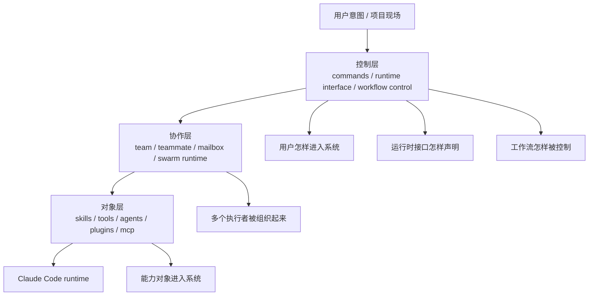

# 卷七 01｜为什么 Claude Code 最终一定会长出一层控制层

## 导读

- **所属卷**：卷七：命令、工作流与产品层整合
- **卷内位置**：01 / 08
- **上一篇**：无
- **下一篇**：[卷七 02｜为什么 slash / prompt commands 不只是快捷方式](./02-why-slash-and-prompt-commands-are-not-just-shortcuts.md)

卷五已经把对象层收成平台层，卷六又把多执行者协作收成 swarm runtime。

卷七继续要解决的，不再是对象和协作本身，而是控制层判断：

> **当对象层已经成立、协作层已经成立之后，用户到底怎样进入这套系统，系统又怎样把入口、接口和工作流动作组织成一套稳定可用的控制面？**

这篇只负责立卷七总判断：为什么 Claude Code 在平台层和协作层之后，还必须继续长出一层控制层。

## 这篇要回答的问题

卷五已经把对象层收成平台层，卷六又把多执行者协作收成 swarm runtime。到这里，Claude Code 当然已经不是一个只会单步执行的小工具。

但卷七不能就此结束前两卷的复述。真正还没被解释清楚的问题是：

> **当对象层已经成立、协作层已经成立之后，用户到底怎样进入这套系统，系统又怎样把入口、接口和工作流动作组织成一套稳定可用的控制面？**

也就是说，卷七第一篇不是功能预告，而是要先立住一个判断：

> **Claude Code 在平台层和协作层之后，还必须继续长出一层控制层。**

这层控制层不是附属 UI，也不是“产品体验润色”。它是 runtime 继续长大之后，不得不补出来的一层结构责任。

## 这篇不展开什么

这篇只做卷七总起，不提前吃掉相邻篇职责：

- 不展开 slash command / prompt command 的完整正文；
- 不展开命令怎样一步步接进 runtime 主链；
- 不展开 frontmatter / interface 字段细节；
- 不展开 verify / debug / plan 的 workflow 正文。

这篇只回答一件事：**为什么控制层在卷六之后一定会出现。**

## 旧文与源码锚点

### 旧文素材锚点
- `docs/guidebookv2/volume-5/25-why-these-extension-objects-converge-into-a-platform-layer.md`
- `docs/guidebookv2/volume-6/07-why-claude-code-team-is-a-swarm.md`

### 源码锚点
- `cc/src/commands/`
- `cc/src/prompt/`
- `cc/src/query.ts`

### 主证据链
对象层已经成立 → 协作层已经成立 → 但用户入口、运行时接口、工作流控制动作还没有被统一解释 → 因此 Claude Code 还必须继续长出一层控制层，把“怎样进入、怎样声明、怎样推进、怎样收尾”收成一个正式结构。

## mermaid 主图：对象层 / 协作层 / 控制层分层图

这张图最重要的不是“三层很好看”，而是三层责任并不相同：

- **对象层**回答的是：系统里有哪些正式对象、它们怎么进入 runtime；
- **协作层**回答的是：多个执行者怎样被组织成持续协作结构；
- **控制层**回答的是：用户怎样可靠进入这套系统、系统怎样用接口与控制动作把运行过程收住。

卷七之所以必须存在，就是因为前两层虽然已经成立，但第三层还没被立成单独问题。

## 先给结论

### 结论一：平台层和协作层成立之后，Claude Code 还缺一层“怎么被用户稳定驱动”的解释

卷五、卷六已经说明 Claude Code 能持续长能力，也能把多个执行者组织起来。

但这还没有回答三个更接近用户现场的问题：

- 用户怎样把意图稳定送进系统；
- runtime 怎样知道某个声明字段不只是说明文字，而要进入运行语义；
- 在复杂任务里，哪些动作属于执行，哪些动作属于控制、检查、修正与推进。

如果这三件事不被收成同一层，Claude Code 就会留下一个很大的结构空白：

> 系统已经很强，但“怎样被进入、怎样被组织、怎样被推进”仍然像散装习惯，而不像正式层。

控制层就是为了解决这个空白而出现的。

### 结论二：控制层不是 UI 贴皮，而是 runtime 对自身复杂度的组织回应

很多系统也有命令、配置、工作流按钮，但那不自动等于“控制层”。

Claude Code 这里更特别的地方在于：

- 它不是只有若干功能点；
- 它也不是只有若干执行对象；
- 它已经是一个会长对象、会长协作、会长外部能力、会长多执行者分工的 runtime。

runtime 一旦长到这个程度，系统就必须进一步回答：

- 用户入口怎么保持可控；
- 声明接口怎么保持可解释；
- 工作流动作怎么不散成零碎技巧。

这不是界面层的修辞需要，而是 runtime 本身的组织需要。

### 结论三：控制层比对象层和协作层多出来的责任，是“把进入、声明、推进、收尾组织成一个正式面”

这是本篇最关键的硬货。

前两卷已经各自承担了自己的责任：

- 对象层负责让方法、工具、执行者、插件这些东西正式进入系统；
- 协作层负责让 leader、teammate、mailbox、idle、shutdown 这些协作关系正式闭合。

而控制层新多出来的责任，是下面四件事：

1. **定义用户入口**：用户到底通过什么正式入口把意图送进系统；
2. **定义运行时接口**：哪些 frontmatter / command interface 字段会真实进入运行语义；
3. **定义工作流控制动作**：哪些动作不是“做事”，而是“检查、校正、推进、验收”；
4. **定义边界收口**：command、tool、skill、agent 这些对象怎样在同一控制视角下重新被切清。

如果少了这层，前两层越强，系统反而越容易在用户面前显得“能力很多，但组织解释不够统一”。

## 第一部分：卷五和卷六为什么还不足以让全系统闭合

### 1. 卷五回答了“能力怎样继续长”，但没有回答“用户怎样稳定进入”

卷五最后一篇已经收得很清楚：skills、MCP、Agent、hooks、plugins 会一起收成平台能力层。

也就是说，Claude Code 已经不是一个封闭工具，而是一个可以持续吸收新方法、新能力源、新执行者和新接缝的系统。

但平台层的成立，只说明系统会长能力，不说明用户怎样稳定使用这些能力。

换句话说：

- 平台层回答的是 **能长什么**；
- 控制层要回答的是 **怎样进入、怎样约束、怎样组织这些能力的使用**。

### 2. 卷六回答了“多个执行者怎样成立协作 runtime”，但没有回答“协作怎样被用户控制”

卷六最后已经把 team 系统压成带 leader 的 swarm runtime。这非常重要，因为它说明 Claude Code 不只是单执行者系统。

但这仍然没有自动回答：

- 用户通过什么入口发起这样的协作；
- 某些命令和声明字段怎样改变当前 runtime 走向；
- verify / debug / plan 这样的动作为什么不只是操作建议，而是控制动作。

也就是说，协作层解释了“系统内部怎样组织多人运行”，但控制层要解释“用户怎样从外部可靠地触发、导引和修正这套运行”。

### 3. 所以卷七不是回头重写卷五和卷六，而是要把它们之上的控制问题立出来

卷七最大的边界，就是不能回头重写：

- 对象怎么成立；
- 协作怎么成立。

卷七接的是更高一层的问题：

> **既然对象层与协作层都已经成立，那么系统怎样把用户入口、运行时接口和工作流控制动作再压成一个正式控制层？**

这就是卷七的起点。

## 第二部分：为什么一旦出现 commands、prompt、query，这个问题就不再能被跳过

本篇虽然不展开相邻篇正文，但还是必须保留源码证据感。

从卷一、卷二旧稿能回收到一个很清楚的事实：

- `cc/src/commands/` 不是命令说明页，而是正式入口组织处；
- `cc/src/prompt/` 不是文案附件，而是在组织模型如何理解和使用运行对象；
- `cc/src/query.ts` 不是最后拼一下请求，而是在真正把规则、背景、消息历史装配成一次运行。

这三类入口一旦同时出现，系统就已经在做三件控制层的事：

1. 规定入口；
2. 规定接口；
3. 规定主链装配。

这说明控制层不是后来的包装，而是已经开始出现在源码骨架里，只是前面几卷还没有把它单独立成一个卷的问题。

## 第三部分：控制层到底比前两层多解决了什么

### 1. 它解决“进入问题”

对象层会告诉你有什么能力；协作层会告诉你多人怎样协作。

但控制层要回答的第一件事是：

> **用户怎样把当前意图正式送进 runtime。**

这里的关键不只是“有没有输入框”，而是系统会不会把某种输入承认为正式入口，并给它稳定的解释路径。

这就是为什么命令入口在卷七里必须被单独立起来。

### 2. 它解决“声明问题”

前面看 skill frontmatter 时，已经知道 `context`、`allowed-tools`、`hooks`、`paths` 这些字段会真实改变运行行为。

这说明 Claude Code 里已经存在一类东西：

> **声明本身就是 runtime interface。**

控制层要做的，就是把这种“声明为什么不只是说明”重新压回整卷主线，而不是让它散落在各个对象专题里。

### 3. 它解决“推进问题”

系统一旦开始支持 verify、debug、plan、orchestration 这类动作，就不能只把它们当成功能目录。

因为这些动作和普通执行动作的差异在于：

- 它们不是直接完成目标；
- 它们是在控制目标怎样被推进、检查、回退、修正和验收。

也就是说，控制层负责把“做事”与“控制做事的过程”分开。

### 4. 它解决“边界问题”

前几卷分别从对象视角讲过 tool、skill、agent。

但到卷七，系统已经复杂到必须站在控制视角重新切边界：

- command 更像入口；
- tool 更像执行原语；
- skill 更像方法组织单元；
- agent 更像执行者与协作承载体。

这种重新切边界，本身就是控制层工作，而不是对象层工作。

## 第四部分：为什么说控制层不是“额外一层”，而是系统成熟后的必然补层

有些人会误以为：

- 先有功能；
- 再有协作；
- 最后为了产品更好用，加一点命令和工作流包装。

但 Claude Code 的证据方向不是这样。

更准确的说法是：

> **当一个 runtime 已经会长对象、会长协作、会长外部能力和执行者结构时，控制层不是“锦上添花”，而是系统为了继续可用、可解释、可治理而必须补出的结构层。**

不然会出现三个问题：

- 用户能触到很多东西，但不知道入口层次；
- 声明字段越来越多，但不清楚哪些属于运行时接口；
- 工作流动作越来越重，却仍像经验技巧而不像正式控制动作。

控制层就是为了解决这三种成熟系统才会暴露出来的问题。

## 第五部分：这篇怎样为后三篇入口 / interface 正文铺路

卷七第一篇的任务不是把后面都写完，而是把后面为什么存在讲清楚。

所以到这里，下一组文章的关系其实已经很自然：

- 如果控制层必须存在，那么首先要回答 **命令为什么是正式入口**；
- 然后要回答 **入口怎样接进 runtime 主链**；
- 接着要回答 **frontmatter / command interface 为什么是运行时接口**。

也就是说，01 不是命令预告，而是把 02、03、04 所属的共同问题立稳。

## 最后收一下

为什么 Claude Code 最终一定会长出一层控制层？

不是因为它开始变成一个更完整的产品，也不是因为功能足够多之后需要做一点入口整理，而是因为前两卷已经立住的事实会继续逼出一个更高层的问题：

- 对象层已经成立，系统会持续长能力；
- 协作层已经成立，系统会组织多个执行者；
- 但用户怎样进入、接口怎样声明、工作流怎样被控制，还没有被统一解释。

而 `cc/src/commands/`、`cc/src/prompt/`、`cc/src/query.ts` 这几条源码入口又说明，这些问题并不是产品文案层的问题，而是已经深入到了 runtime 结构里。

因此，卷七第一篇最稳的判断就是：

> **Claude Code 在平台层和协作层之后，还必须继续长出一层控制层；这层控制层比前两层多出来的责任，不是增加能力对象，而是把用户入口、运行时接口、工作流推进与边界收口组织成一套正式的系统控制面。**

这就是卷七的起点。