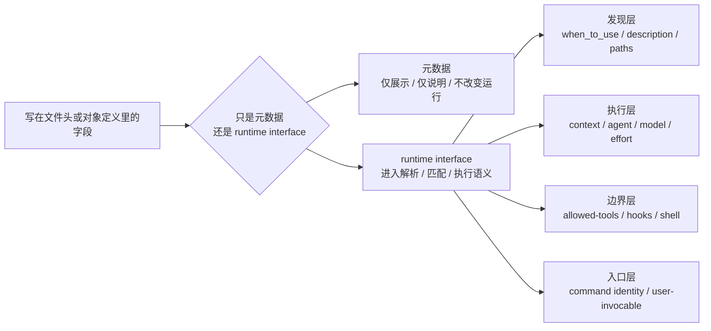

# 卷七 04｜为什么 skill frontmatter / command interface 是运行时接口，不只是元数据

## 这篇要回答的问题

前两篇已经把卷七前半段推进到这里：

- command 是正式用户入口；
- 命令入口会继续接进 runtime 主链。

但如果卷七只讲“入口”，还不够。Claude Code 里还有另一类非常关键的东西：

- skill 顶部的 frontmatter；
- command 暴露出来的 interface 字段；
- `allowed-tools`、`context`、`agent`、`paths`、`model`、`hooks` 这类声明。

这些东西表面上很像 metadata，很容易被误看成：

- 只是说明文字；
- 只是给 UI 展示；
- 只是作者写给人看的附加信息。

但旧稿已经给出了相反证据。

所以这一篇要回答的是：

> **为什么 skill frontmatter / command interface 在 Claude Code 里属于 runtime interface，而不是附属元数据。**

## 这篇不展开什么

按卡片约束，本篇要守住边界：

- 不写成字段手册；
- 不提前展开 workflow control layer；
- 不把 05/06 的职责偷写进来。

这篇只抓一件事：**声明式字段为什么会真实进入运行语义。**

## 旧文与源码锚点

### 旧文素材锚点
- `docs/guidebook/volume-1/21-skill-frontmatter-fields.md`
- `docs/guidebook/volume-1/22-frontmatter-runtime-interface.md`
- `docs/guidebookv2/volume-5/07-what-makes-a-good-runtime-skill.md`

### 源码锚点
- `cc/src/skills/`
- `cc/src/commands/`

### 主证据链
frontmatter / command interface 字段并不是停在说明层 → 它们会进入解析、发现、匹配、执行分流、权限边界和运行说明 → 因而它们属于 runtime interface，而不只是 metadata。

## mermaid 主图：元数据 vs runtime interface 对比图

这张图的重点不是分类本身，而是强调：

> **一旦字段会进入发现、执行、权限或分流语义，它就已经不是普通元数据。**

## 先给结论

### 结论一：Claude Code 里的 frontmatter / interface 不是“附在对象外面”，而是“对象怎样进入 runtime 的声明面”

普通元数据通常承担的是：

- 展示标题；
- 给 UI 一个说明；
- 让人类作者自己记住用途；
- 最多给搜索或筛选做一点辅助。

也就是说，元数据可以重要，但它不直接定义运行行为。

Claude Code 里的情况不是这样。

从卷一第 22 篇能回收到一条很完整的链：

- `parseFrontmatter(...)` 负责把 YAML 头读出来并做容错；
- `parseSkillFrontmatterFields(...)` 把这些字段编译成标准运行字段；
- `createSkillCommand(...)` 再把这些运行字段写进正式 `Command` 对象；
- 后续的发现、匹配、执行分流、权限说明再继续消费这些字段。

只要一段 frontmatter 会沿着这条链一路进入 command 对象和 runtime，它就不是“附在对象外面”，而是对象的**运行时声明面**。

### 结论二：判断它是不是 runtime interface，不看“写法像不像配置”，而看“会不会改运行语义”

这是本篇最该保住的判断。

有些字段写在 YAML 或对象头部，看起来很像配置或 metadata，但关键不在长相，而在作用。

只要一个字段会改变下面这些事情，它就已经是 runtime interface：

- 它会不会被发现；
- 它会不会被当前模型看见；
- 它会不会被用户直接调用；
- 它会走 inline 还是 fork；
- 它能使用哪些工具；
- 它会不会注册 hooks；
- 它会用什么模型或 effort；
- 它会在哪些路径条件下激活。

换句话说：

> **runtime interface 的判准不是“它写在头部”，而是“它会不会进入运行决定”。**

### 结论三：frontmatter / command interface 最关键的价值，是把声明直接接进发现、匹配和执行主链

Claude Code 不是把 skill 文件正文和字段说明分开：正文才进 runtime，字段只留给人看。

相反，它会把字段本身也接进系统：

- `description` / `when_to_use` 会影响可发现性；
- `user-invocable` 会影响入口暴露边界；
- `context` / `agent` 会影响执行分流；
- `allowed-tools` / `hooks` / `shell` 会影响能力边界；
- `paths` 会影响条件激活；
- `model` / `effort` 会影响运行配置。

所以这类字段并不是“顺手写的注释”。它们本身就是系统理解这个对象的重要接口。

## 第一部分：为什么“把 frontmatter 当元数据”会看轻 Claude Code 的设计

### 1. 元数据心智会让人误以为正文才是 skill，本体之外都是注释

如果沿用一般 markdown 文档的心智，很容易觉得：

- 正文才是真正的内容；
- frontmatter 只是标题、标签、摘要；
- 最多给前端页面渲染用。

但 Claude Code 里的 skill 不是普通文章。

skill 是会进入 runtime 的方法组织单元。那么它顶部那段声明，自然也不是“排版头”，而是：

- 这个单元叫什么；
- 谁能调它；
- 什么时候激活；
- 走什么执行路径；
- 拥有什么能力边界。

也就是说，frontmatter 在这里承担的是接口责任，不是装饰责任。

### 2. 卷一第 21 篇之所以只是“字段速查”，正因为真正重要的是下一篇的运行意义

第 21 篇列字段时，其实已经能隐约看出不对劲：

- `allowed-tools`
- `user-invocable`
- `context`
- `agent`
- `paths`
- `hooks`
- `shell`

这些字段几乎没有一个像纯展示字段。

它们更像是在回答：

- 这玩意怎么进 runtime；
- 运行时有哪些边界；
- 发现和执行走哪条路。

所以第 21 篇列字段只是表层，真正的判断必须到第 22 篇才说清：**这些字段不是注释，而是 runtime contract。**

## 第二部分：至少有一条字段进入运行语义的链，必须被压出来

写作卡片要求，本篇必须明确讲出至少一条“字段进入运行语义”的链。

最稳的一条就是 skill frontmatter 这条：

1. skill 文件顶部写出 frontmatter；
2. `parseFrontmatter(...)` 先做 YAML 读取与容错；
3. `parseSkillFrontmatterFields(...)` 把字段编译成运行字段；
4. `createSkillCommand(...)` 把这些字段写入正式 `Command` 对象；
5. 发现层、匹配层、执行层继续读取这些字段；
6. 它们因此改变 skill 的可见性、调用方式、执行路径与权限边界。

这条链足够说明：

- frontmatter 不停在“文档头信息”；
- 它一路进入对象建模；
- 它再继续影响系统如何发现和执行这个对象。

这就是 runtime interface 的典型特征。

## 第三部分：哪些字段最能证明它不是 metadata

### 1. `paths` 最能证明它进入了发现语义

如果一个字段会决定“这个 skill 当前是否应该出现”，那它显然不是说明文字。

`paths` 的作用就是：

- 把 skill 变成条件激活对象；
- 让某些 skill 只在特定项目路径或文件模式下进入可见集合。

这种字段不只是“描述这份 skill 适用于什么场景”，而是在**控制发现结果**。

### 2. `context` / `agent` 最能证明它进入了执行分流语义

卷一旧稿已经把这点说得很准：

- `context: fork` 不是写作标签；
- 它是在声明这次 skill 不应 inline，而要走独立子 agent 路径；
- `agent` 则进一步指定 fork 出去的是什么执行者类型。

只要一个字段能把执行路径改到这里，它就已经是运行时接口，不可能只是 metadata。

### 3. `allowed-tools` / `hooks` / `shell` 最能证明它进入了能力边界语义

这些字段更硬，因为它们直接触到“能做什么”。

- `allowed-tools` 会影响技能运行时允许动哪些工具；
- `hooks` 会影响 session 是否注册额外钩子；
- `shell` 会影响 `!` 命令块怎样执行。

只要字段开始决定权限和执行环境，它就已经越过“说明信息”边界，进入 runtime contract 范围了。

### 4. `user-invocable` 最能证明它进入了入口边界语义

一个 skill 或 command 能不能被用户直接调用，不是展示偏好，而是入口边界。

也就是说，这类字段在决定：

- 这个对象是公开入口，还是系统内部对象；
- 用户有没有资格直接通过命令层触到它。

这类作用显然也属于控制层接口。

## 第四部分：为什么这一篇不该写成字段手册

本篇很容易滑回“字段说明文档”，但那样会把卷七真正的判断写丢。

因为卷七关心的不是：

- frontmatter 有多少字段；
- 每个字段怎么填；
- 最佳实践 checklist 是什么。

卷七关心的是：

> **为什么命令入口之外，声明式字段本身也属于控制层的一部分。**

更准确地说：

- 第 02、03 篇解释显式入口怎样成立；
- 第 04 篇解释声明接口怎样成立。

这两者一旦并起来，控制层就不再只是“用户从哪儿进”，还包括“系统凭什么按某种声明理解对象”。

所以本篇必须从 interface 角度写，而不是从字段手册角度写。

## 第五部分：这篇怎样为卷七中段铺路

到这里，卷七前半段已经立起了三块：

- command 是正式入口；
- command 会正式接进 runtime；
- frontmatter / command interface 也是 runtime interface。

那下一步最自然的问题就是：

> **当入口和接口都已经成立之后，verify / debug / plan 这些东西为什么不再只是功能，而会一起构成 workflow control layer？**

这正是第 05 篇要回答的问题。

## 最后收一下

为什么 skill frontmatter / command interface 是运行时接口，而不只是元数据？

因为在 Claude Code 里，这些字段不会停在说明层。

它们会：

- 进入解析与容错；
- 被编译成标准运行字段；
- 被装进正式 command / skill 对象；
- 再继续影响发现、匹配、执行分流、权限边界、激活条件和入口暴露。

尤其像 `paths`、`context`、`agent`、`allowed-tools`、`hooks`、`shell`、`user-invocable` 这些字段，更直接证明了：它们不是“告诉你这是什么”，而是在“告诉 runtime 该怎么对待它”。

所以本篇最稳的结论是：

> **Claude Code 里的 frontmatter / command interface，不是贴在对象外面的 metadata，而是对象暴露给 runtime 的声明式接口；它们之所以属于控制层，是因为这些声明会真实进入发现、执行和边界语义。**