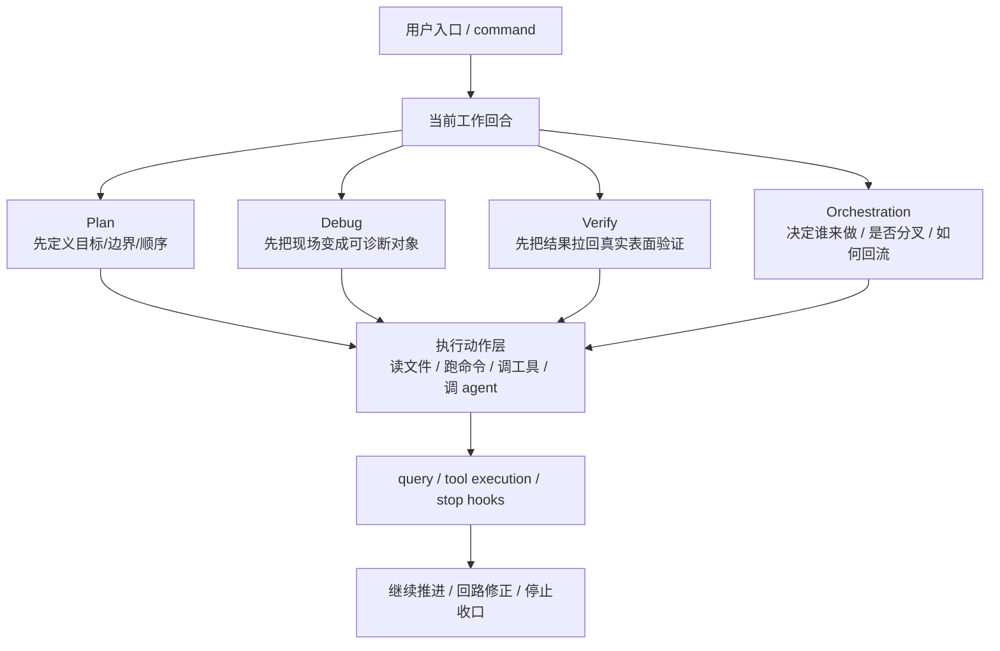
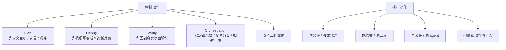

# 卷七 05｜工作流控制层是怎样在 Claude Code 里成立的

## 导读

- **所属卷**：卷七：命令、工作流与产品层整合
- **卷内位置**：05 / 08
- **上一篇**：[卷七 04｜为什么 frontmatter 与 command interface 是运行时接口](./04-why-frontmatter-and-command-interface-are-runtime-interfaces.md)
- **下一篇**：[卷七 06｜为什么 command、tool、skill、agent 的边界要在卷七收口](./06-why-command-tool-skill-and-agent-boundaries-close-in-volume-7.md)

前四篇已经把入口与接口两层立住了。

第 05 篇现在要继续回答：

> **Claude Code 的工作流控制层，是怎样在 runtime 里成立的？**

也就是说，这篇只负责把 verify / debug / plan / orchestration 从散功能压成控制动作，并说明它们怎样改变执行回路。

## 这篇要回答的问题

卷七前四篇已经把两件事立住了：

- command 是正式用户入口；
- frontmatter / command interface 不是注释，而是 runtime interface。

但到这里，系统还只是回答了：

- 用户从哪儿进；
- runtime 怎样识别这些入口与声明。

还没有回答另一件更关键的事：

- 用户一旦开始工作，Claude Code 怎样把“先看、再查、再证、再修、再继续”的节奏收成正式结构？

如果这个问题答不出来，`/verify`、`/debug`、`/plan`、orchestration 这些东西就会看起来像一堆并列功能：

- 多几个命令；
- 多几份 prompt；
- 多几个方便工作的习惯动作。

但写作卡片要求这一篇必须给出更强的判断：

> **verify / debug / plan / orchestration 在 Claude Code 里不是散功能，而是 workflow control layer 的几种控制动作。**

所以本篇真正要回答的是：

> **Claude Code 的工作流控制层，是怎样在 runtime 里成立的？**

## 这篇不展开什么

按卷七卡片，这一篇只立 workflow control layer，不提前把第 06 篇的边界总收口讲完。

因此本篇不展开：

- command / tool / skill / agent 的总边界重切；
- 产品形态为什么会收成今天这样；
- 07 / 08 的产品层判断。

本篇只抓一件事：**控制动作和执行动作到底怎样分开，以及这些控制动作怎样在 Claude Code 里收成一层。**

## 旧文与源码锚点

### 旧文素材锚点
- `docs/guidebook/volume-1/25-verify.md`
- `docs/guidebook/volume-1/26-debug.md`
- `docs/guidebook/volume-1/31-prompt-as-instruction-layer.md`

### 补充素材锚点
- `docs/guidebook/volume-1/20-processpromptslashcommand.md`
- `docs/guidebookv2/volume-5/19-why-platform-layer-needs-runtime-seams-not-just-capability-objects.md`
- `docs/guidebookv2/volume-5/20-what-role-hooks-play-in-claude-code-runtime.md`
- `docs/guidebookv2/volume-5/21-what-different-hooks-intercept-connect-and-modify-in-claude-code.md`

### 源码锚点
- `cc/src/commands/`
- `cc/src/tools/`
- `cc/src/query.ts`

> 说明：当前仓库不直接携带 `cc/src/*` 源树，本篇沿用卷一、卷五旧稿已经核对过的源码链与函数抓手，作为证据入口。

### 主证据链
`/verify`、`/debug`、`/plan` 这些动作表面上是命令或 skill → 但它们真正处理的不是某次文件读写或命令执行，而是“当前工作该怎样继续推进、怎样检查、怎样纠偏、怎样决定是否结束” → 再加上 `query.ts`、tool execution、hooks / stop hooks 暴露出的输入入口、工具前后、权限链、turn 收口这些正式控制节点 → Claude Code 里就不只是有执行层和对象层，还成立了一层 workflow control layer。

## mermaid 主图：workflow control layer 结构图

这张图要表达的重点是：

> **control layer 不直接替代执行动作，它站在执行动作之上，负责定义推进顺序、诊断方式、验证标准、分工与收口。**

## 补图：控制动作 vs 执行动作

这张补图最重要的不是再画一遍工作流，而是把控制动作和执行动作彻底切开：前者处理**工作怎样推进**，后者处理**具体把什么事做掉**。

## 先给结论

### 结论一：工作流控制层成立，不是因为命令变多了，而是因为系统开始正式区分“怎么做事”和“怎么控制做事”

Claude Code 早就有很多执行能力：

- 读写文件；
- 搜索代码；
- 跑命令；
- 调远程能力；
- 派子 agent。

这些能力回答的是：

- 现在能做什么动作；
- 当前 turn 能把什么事情落下去。

但 `verify`、`debug`、`plan` 这些东西回答的不是这个问题。

它们更像是在回答：

- 这次工作先不要急着做，先立边界；
- 这次出错了，不要先乱改，先把现场变成可诊断对象；
- 这次改完了，不要先宣布成功，先到真实 surface 看行为；
- 这段工作太大时，谁来承担，是否继续分叉，结果怎样回流。

也就是说，这些动作的主语已经不是“做一件事”，而是“控制一段工作怎样进行”。

这就是 workflow control layer 的起点。

### 结论二：控制动作和执行动作的差异，不在抽象程度，而在它们控制的是“局部动作”还是“工作回路”

这篇最该压住的硬货，就是卡片要求的这条：**控制动作和执行动作不一样。**

最短可以这样切：

- **执行动作**：直接把某个局部动作做下去。
- **控制动作**：决定这段工作接下来该按什么节奏推进、检查、修正或收口。

比如：

- `Read` 文件，是执行动作；
- `Bash` 跑命令，是执行动作；
- `Edit` 改内容，是执行动作；
- `AgentTool` 派工，本身仍然是某种执行入口。

而：

- `plan` 决定先做什么后做什么，是控制动作；
- `debug` 决定先看什么现场再下判断，是控制动作；
- `verify` 决定什么才算通过，是控制动作；
- orchestration 决定任务如何拆给谁、如何回流，是控制动作。

所以它们并不是“更高级的工具”，而是对工作回路施加秩序的动作。

### 结论三：Claude Code 的 workflow control layer，不是外挂流程，而是贴着 query runtime 长出来的

这一点尤其重要。

如果 `verify`、`debug`、`plan` 只是几篇方法论文档，那它们最多算工作建议；如果它们只是命令索引里的几个名字，那它们最多算用户便利层。

Claude Code 之所以会真的长出 control layer，是因为这些控制动作不是飘在 runtime 外面，而是会贴着主链发生作用：

- 在输入进入前先改写工作进入方式；
- 在工具执行前后先做判断、修整或拦截；
- 在回合准备结束时，再过一次 stop 收口；
- 在复杂任务里，再决定要不要派 worker、如何 brief、如何回收结果。

也就是说，控制不是额外讲点道理，而是已经进入运行结构。

## 第一部分：为什么 `verify`、`debug`、`plan` 不能再被看成并列功能

### 1. `verify` 控制的不是某次动作，而是“什么时候有资格说工作已经成立”

卷一第 25 篇已经把 `verify` 的核心判断说得很硬：

> **Verification is runtime observation.**

这句话的重量，不在它要求多做一次测试，而在它重定义了“完成”到底怎么算。

`verify` 真正在控制的是：

- 证据必须来自真实 surface；
- 读代码、跑 CI、手调内部函数，都不能替代真实验证；
- PASS / FAIL / BLOCKED / SKIP 的语义要被写死。

这说明 `verify` 并不是某种动作工具，而是在给整个工作回路定义：

- 最后怎样算过；
- 什么证据才够；
- 哪些动作不能冒充完成。

它控制的是**收口标准**。

### 2. `debug` 控制的不是某次修复，而是“怎么进入诊断模式”

卷一第 26 篇里，`debug` 的关键不是解释错误，而是先：

- `enableDebugLogging()`；
- 找到 `debugLogPath`；
- tail 最近日志；
- grep `[ERROR]` / `[WARN]`；
- 再让模型解释现象、给下一步建议。

这说明 `debug` 的主语不是“帮你修”，而是：

> **把当前 session 先变成可诊断现场。**

所以它控制的是：

- 先观察什么；
- 先建立什么可观测性；
- 诊断顺序怎样走。

它控制的是**回路修正前的观察方式**。

### 3. `plan` 控制的是“这段工作按什么秩序展开”

虽然本篇不重写 `plan` 的单独旧稿，但从卷七前几篇已经足够看出，它和 `verify` / `debug` 在一组里，不是因为它们都叫命令，而是因为它们都在控制工作推进方式。

`plan` 不是替你做动作，而是先把：

- 目标；
- 先后顺序；
- 风险边界；
- 分阶段推进方式；

压出来。

它控制的是**启动阶段的推进秩序**。

### 4. orchestration 控制的是“谁来做、怎么拆、怎么回”

卷一第 31 篇与卷五 agent 组把另一类控制动作也暴露得很清楚：

- 什么时候该调用 AgentTool；
- 什么时候别用；
- 怎么给 subagent 写 prompt；
- 什么时候 fork；
- 结果怎样回流；
- 为什么不要把理解外包给子 agent。

这些动作也不是局部执行动作。

它们控制的是：

- 执行责任怎么分层；
- 多执行者协作怎样维持秩序；
- 主线程怎样继续掌握回路。

它控制的是**执行责任与工作拆分**。

## 第二部分：为什么说 control layer 贴着 runtime，而不是飘在 prompt 外面

如果只从命令名字看，control layer 很容易被误看成“更聪明的提示词层”。

但卷五第 19、20、21 篇把另一条更硬的证据链补出来了：

- `query.ts` 暴露出的不是一句话处理，而是一条回合主链；
- `toolExecution.ts` 暴露出工具前后、权限判断、结果回流这些关键节点；
- `stopHooks.ts` 暴露出“这一轮是否真正结束”的收口点；
- hooks 系统把会话入口、输入入口、工具链、权限链、收口链做成正式接缝。

这意味着 Claude Code 里已经存在一批天然适合控制的节点：

- **入口节点**：用户输入怎样进；
- **执行节点**：工具调用前后怎样裁；
- **权限节点**：是否 allow / deny / ask；
- **收口节点**：这轮是否真的算结束。

只要这些节点已经存在，`verify`、`debug`、`plan`、orchestration 这些动作就不是空中楼阁，而是在对这些节点施加秩序。

## 第三部分：workflow control layer 到底控制哪四类事情

为了避免本篇写散，最稳的办法是把控制层压成四类职责。

### 1. 控制工作怎样开始：`plan`

开始不是“接到任务就做”。

控制层首先要回答：

- 目标是什么；
- 先后顺序怎么排；
- 哪些边界不能越；
- 哪些阶段必须先立模型再动手。

这类动作把工作从“立即执行”改成“有序进入”。

### 2. 控制问题怎样被看见：`debug`

工作一旦卡住，最危险的不是不会修，而是：

- 没把现场看清就开始改；
- 只听用户口述，不看日志；
- 只看日志，不看上下文与设置源。

`debug` 控制的，是问题首先怎样被观察。

### 3. 控制结果怎样被承认：`verify`

Claude Code 不满足于“看起来改对了”。

`verify` 把结果承认标准压回：

- 真实 surface；
- 真实运行；
- 真实证据；
- 真实 verdict 语义。

这就把“完成”从主观判断改成正式控制动作。

### 4. 控制责任怎样分配：orchestration

当一段工作超出单线程局部执行，控制层还必须决定：

- 这段工作由主线程继续做，还是交给 worker；
- 什么时候该并发，什么时候别并发；
- 子 agent 带哪些上下文和工具面；
- 结果如何回流，而不是在分叉后失控。

这就是多执行者时代的控制动作。

## 第四部分：为什么控制层在卷七才真正成立

卷三讲执行层，卷五讲对象层，卷六讲协作运行时，但到卷七之前，这三卷都还没有把“控制”单独收出来。

- 卷三主要在回答动作如何被正式执行；
- 卷五主要在回答新对象怎样接进 runtime；
- 卷六主要在回答多执行者怎样协作。

而卷七这里才第一次可以把它们压成一个新判断：

> **当系统已经同时拥有用户入口、运行时接口、执行对象、协作执行者和运行时接缝时，`verify` / `debug` / `plan` / orchestration 这些动作就不再是附加功能，而会自然收成 workflow control layer。**

换句话说，卷七的“控制层”不是额外多发明的一层，而是前面几卷都成熟之后，被重新看见的一层。

## 第五部分：这篇怎样为第 06 篇铺路

到这里，第 05 篇已经把中段最关键的一件事立住了：

- Claude Code 不只会执行；
- 不只会接更多对象；
- 不只会长出更多执行者；
- 它还会对工作回路本身施加秩序。

那下一步最自然的问题就是：

> **既然控制层已经成立，command、tool、skill、agent 这些对象的边界，是否还该继续按旧卷的切法来理解？**

答案显然是否定的。

因为只要站到控制层视角再看：

- command 不再只是入口便利层；
- tool 不再只是动作列表；
- skill 不再只是方法模板；
- agent 不再只是“另一个执行者”。

它们都会被重新放回“谁负责入口、谁负责动作、谁负责方法、谁负责承担工作”这张控制层总图里。

这就是第 06 篇要做的边界收口。

## 最后收一下

为什么说 Claude Code 里已经成立了一层 workflow control layer？

因为 `verify`、`debug`、`plan`、orchestration 这些动作，处理的已经不是单个执行动作，而是：

- 工作怎样开始；
- 问题怎样被观察；
- 结果怎样被承认；
- 责任怎样被分配；
- 回合怎样继续或结束。

再加上 `query.ts`、tool execution、hooks、stop hooks 暴露出的那些正式运行节点，控制就不再只是 prompt 里的方法建议，而是已经贴着 runtime 成为正式结构。

所以本篇最稳的结论是：

> **Claude Code 的 workflow control layer，并不是由几条“好用命令”拼出来的，而是当 plan、debug、verify、orchestration 这些控制动作开始正式决定工作回路的启动、观察、验证、分工与收口，并且这些决定又贴着 query runtime 的关键节点发生时，系统才真正长出的一层控制结构。**
